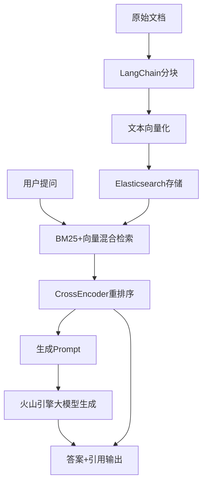

# 技术流程说明

## 一、系统架构概述

本项目基于RAG（Retrieval-Augmented Generation，检索增强生成）范式，结合文档分块、向量化、混合检索、重排序和大模型生成，实现了高效、可追溯的智能问答系统。系统核心流程如下：

1. **文档加载与分块**  
2. **文本向量化**  
3. **向量存储与检索（Elasticsearch）**  
4. **混合检索（BM25+向量）**  
5. **重排序（CrossEncoder）**  
6. **生成（火山引擎Ark大模型）**  
7. **答案溯源与引用输出**

---

## 二、详细技术流程

### 1. 文档加载与分块

- 支持多种文档格式（PDF、Word、TXT等）。
- 使用`langchain`的`PyPDFLoader`、`Docx2txtLoader`、`TextLoader`等工具加载原始文档。
- 采用`RecursiveCharacterTextSplitter`对文档进行智能分块，保证每个块长度适中且语义完整。
- 每个分块保留原文档的元数据（如文件名、页码、chunk_id等），便于后续溯源。

### 2. 文本向量化

- 使用`sentence-transformers`模型（如all-MiniLM-L6-v2）将每个文本块转为高维向量（如384维）。
- 支持批量向量化和GPU加速。
- 向量维度与Elasticsearch索引配置严格一致。

### 3. 向量存储与检索（Elasticsearch）

- 每个文本块及其向量、元数据存入Elasticsearch，作为知识库底座。
- 索引结构包含文本内容（content）、向量（embedding）、元数据（metadata）。
- 支持高效的向量检索和BM25文本检索。

### 4. 混合检索（BM25+向量）

- 用户提问时，系统先用BM25算法对文本内容进行全文检索，召回相关文本块。
- 同时用问题向量与存储向量做相似度检索，召回语义相关文本块。
- 两种检索结果加权融合，提升召回的相关性和多样性。

### 5. 重排序（CrossEncoder）

- 用`sentence-transformers`的CrossEncoder模型，对召回的文本块与问题两两打分。
- 选出最相关的Top-K文本块，作为生成的知识支撑。

### 6. 生成（火山引擎Ark大模型）

- 将Top-K文本块与用户问题拼接成Prompt。
- 调用火山引擎Ark大模型API（通过openai库兼容接口）生成最终答案。
- 支持API Key、模型ID等参数灵活配置。

### 7. 答案溯源与引用输出

- 生成模块在输出答案时，自动附加所有参考片段的引用信息（如文件名、页码、chunk_id等）。
- 用户可清晰追溯答案所依据的原始数据源，提升系统可信度。

---

## 三、主要技术框架与依赖

- **LangChain**：文档加载、分块与预处理
- **sentence-transformers**：文本向量化与CrossEncoder重排序
- **Elasticsearch**：向量与文本混合检索、知识库底座
- **openai**（火山引擎Ark API兼容）：大模型生成
- **PyPDF、python-docx**：文档格式解析
- **pandas、numpy**：数据处理与批量操作

---

## 四、流程示意图

---

## 五、优势与特色

- 支持多格式文档的自动分块与元数据溯源
- 检索与生成解耦，兼顾相关性与创新性
- 检索结果可追溯，答案可信度高
- 架构灵活，便于扩展多种大模型和检索后端 