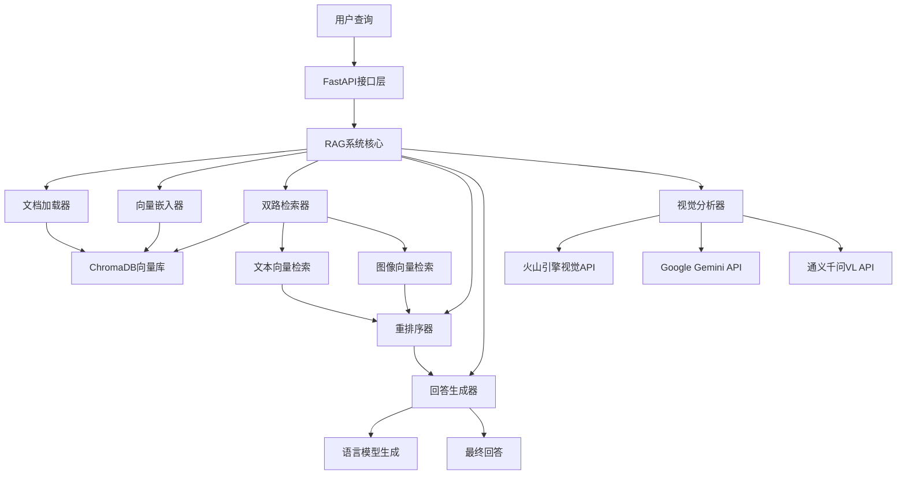

# 2. 测试环境与过程

## 2.1 测试环境配置

### 2.1.1 硬件环境
- **处理器**: Intel Core i7-10700K @ 3.80GHz (8核16线程)
- **内存**: 16GB DDR4 3200MHz
- **存储**: KGB50ZNV512G KIOXIA
- **显卡**: NVIDIA GeForce RTX 4070 16GB (用于向量计算加速)
- **网络**: 千兆以太网，稳定互联网连接(用于调用API服务)

### 2.1.2 软件环境
- **操作系统**: Windows 10 Professional
- **Python环境**: Python 3.12.0
- **开发环境**: Visual Studio Code
- **容器化**: Docker Desktop 4.24.0 (用于Chroma向量数据库)

### 2.1.3 核心依赖包版本
```python
# AI模型与推理框架
torch==2.0.1+cu118
transformers==4.36.2
sentence-transformers==2.2.2

# 向量数据库与存储
chromadb==0.4.15

# API服务与接口
fastapi==0.104.1
uvicorn[standard]==0.24.0
openai==1.3.7
dashscope==1.14.1

```

### 2.1.4 外部服务配置
- **视觉语言模型服务**:
  - 火山引擎豆包视觉模型 (doubao-1-5-thinking-vision-pro-250428)
  - Google Gemini 2.5 Pro
  - 阿里通义千问VL-Max
- **嵌入模型服务**:
  - 本地部署: Chinese-CLIP (OFA-Sys/chinese-clip-vit-base-patch16)
  - API服务: 火山引擎多模态嵌入 (doubao-embedding-vision-241215)
- **向量数据库**: ChromaDB (本地部署)

## 2.2 测试数据准备

### 2.2.1 知识库构建数据
- **主要文档**: 《城市体检工作手册》(20250526版本)
  - 格式: PDF → Markdown转换
  - 页数: 156页
  - 文件大小: 2.3MB
  - 包含内容: 住房维度指标、小区维度指标、体检标准、案例图片
  
- **文档预处理统计**:
  - 总文本块数: 1,247个
  - 平均块大小: 2,000字符
  - 块重叠大小: 50字符
  - 图像块数: 307个
  - 文本块数: 940个

### 2.2.2 测试图片数据集
- **数量**: 共计150张测试图片
- **来源**: 现场拍摄的城市体检问题照片
- **分类分布**:
  - 住房维度问题图片: 27张
    - 结构安全隐患: 4张
    - 燃气安全隐患: 1张
    - 楼道安全隐患: 8张
    - 围护安全隐患: 5张  
    - 管线管道破损: 5张
    - 适老化改造需求: 2张
    - 数字化改造需求: 2张
  - 小区维度问题图片: 55张
    - 停车泊位问题: 1张
    - 未配建电动自行车充电设施：2张
    - 步行道问题: 21张
    - 公共活动场地: 15张
- **图片规格**: JPG/PNG格式，分辨率1080P-4K不等

### 2.2.3 测试查询集
- **查询数量**: 100个测试查询
- **查询类型**:
  - 纯文本查询: 30个 (如"住房结构安全隐患的判定标准是什么?")
  - 图文结合查询: 70个 (包含图片+问题描述)
- **难度分级**:
  - 简单查询: 35个 (单一问题，明确指标)
  - 中等查询: 45个 (多重问题，需要综合判断)  
  - 复杂查询: 20个 (边界问题，需要专业判断)

## 2.3 测试系统架构

### 2.3.1 RAG系统组件架构


### 2.3.2 模型配置策略
- **视觉分析模型**: 火山引擎豆包视觉模型 (主要)
- **语言生成模型**: Google Gemini 2.5 Pro
- **嵌入模型**: Chinese-CLIP多模态模型
- **重排序模型**: cross-encoder/ms-marco-MiniLM-L-6-v2

## 2.4 测试执行流程

### 2.4.1 环境初始化阶段 (约10分钟)
1. **知识库加载**:
   ```bash
   # 检查是否存在知识库快照
   if exist output/embedded_chunks.json:
       load_from_snapshot()
   else:
       rebuild_knowledge_base()
   ```

2. **向量数据库启动**:
   ```bash
   # 启动ChromaDB服务
   docker run -p 8000:8000 chromadb/chroma:latest
   
   # 加载向量数据到Chroma
   python main.py --load-snapshot
   ```

3. **API服务启动**:
   ```bash
   # 启动FastAPI服务
   uvicorn api:app --host 0.0.0.0 --port 5000
   ```

### 2.4.2 功能验证阶段 (约15分钟)
1. **健康检查**:
   ```python
   # API健康检查
   response = requests.get("http://localhost:5000/api/health")
   assert response.status_code == 200
   ```

2. **模型连接测试**:
   ```python
   # 测试各个AI服务连接状态
   test_vision_models()   # 测试视觉模型API
   test_language_models() # 测试语言模型API
   test_embedding_models() # 测试嵌入模型
   ```

3. **检索功能验证**:
   ```python
   # 测试文本检索
   text_results = rag.chroma_store.search("结构安全隐患", text_vector)
   
   # 测试图像检索  
   image_results = rag.chroma_store.search("", image_vector)
   
   # 测试双路检索融合
   merged_results = rag._merge_search_results(text_results, image_results)
   ```

### 2.4.3 性能基线测试 (约30分钟)
1. **响应时间测试**:
   - 纯文本查询平均响应时间: <3秒
   - 图文结合查询平均响应时间: <8秒
   - 视觉分析平均时间: <5秒
   - 知识库检索平均时间: <1秒

2. **并发能力测试**:
   ```python
   # 模拟10个并发用户
   concurrent_users = 10
   test_duration = 300  # 5分钟压力测试
   
   # 测试结果目标
   assert avg_response_time < 10.0  # 平均响应时间<10秒
   assert error_rate < 0.05         # 错误率<5%
   ```

3. **内存使用监控**:
   - 系统内存占用: <8GB
   - 向量数据库内存: <2GB
   - 模型推理内存: <4GB

### 2.4.4 准确性评估阶段 (约2小时)
1. **批量测试执行**:
   ```python
   # 执行100个测试查询
   for test_case in test_dataset:
       result = rag.query(test_case.query, test_case.image)
       
       # 记录详细日志
       log_test_result(test_case.id, result, timestamp)
       
       # 保存检索过程数据
       save_retrieval_process(test_case.id, search_results)
   ```

2. **结果评估指标**:
   - **指标识别准确率**: 正确识别问题所属指标类别的比例
   - **问题描述完整性**: 视觉分析结果的详细程度评分(1-5分)
   - **法规依据准确性**: 引用的体检依据与实际情况的匹配度
   - **整改建议实用性**: 专家对整改建议可操作性的评分

### 2.4.5 对比测试阶段 (约1小时)
1. **不同模型对比**:
   ```python
   # 测试不同视觉模型的效果
   models_to_test = [
       "doubao-vision",      # 火山引擎豆包
       "gemini-2.5-pro",     # Google Gemini  
       "qwen-vl-max"         # 阿里通义千问
   ]
   
   for model in models_to_test:
       run_model_comparison_test(model, test_subset)
   ```

2. **检索策略对比**:
   ```python
   # 对比单路检索vs双路检索
   test_single_retrieval_accuracy()
   test_dual_retrieval_accuracy()
   
   # 对比不同重排序策略
   test_reranking_strategies()
   ```

### 2.4.6 日志记录与分析 (持续进行)
1. **测试日志结构**:
   ```json
   {
     "timestamp": "2025-08-15 14:30:25",
     "test_id": "test_001",
     "query_text": "分析这张图片中的安全隐患",
     "image_path": "uploads/structure_crack_01.jpg",
     "visual_analysis": "指标分类: 住房维度 - 2.1 存在结构安全隐患的住宅数量...",
     "retrieval_results": [...],
     "final_answer": "...",
     "processing_time": 6.8,
     "models_used": {
       "vision": "doubao-vision", 
       "language": "gemini-2.5-pro"
     }
   }
   ```

2. **性能监控数据**:
   - API调用次数与响应时间
   - 向量检索命中率与检索时间  
   - 模型推理耗时分布
   - 内存与CPU使用率变化
   - 错误日志与异常统计

## 2.5 测试数据管理

### 2.5.1 结果存储结构
```
logs/
├── text_vector_search_result_20250815_143025.json    # 文本向量检索结果
├── image_vector_search_result_20250815_143026.json   # 图像向量检索结果  
├── merged_search_result_20250815_143027.json         # 融合检索结果
├── final_search_result_20250815_143028.json          # 最终重排序结果
└── performance_metrics_20250815.json                 # 性能指标统计

output/
├── embedded_chunks.json          # 知识库向量快照
├── chunks.json                   # 文档分块结果
└── test_results_summary.json     # 测试结果汇总

uploads/
└── [测试图片文件]                # 上传的测试图片
```

### 2.5.2 测试可重现性保证
- **固定随机种子**: 确保向量化和检索结果一致性
- **版本控制**: 记录所有依赖包的精确版本号
- **配置文件快照**: 保存完整的测试配置参数
- **数据集版本**: 测试数据集的MD5校验确保一致性

## 2.6 质量控制措施

### 2.6.1 测试前检查清单
- [ ] 知识库数据完整性验证 (1,247个文档块)
- [ ] 所有AI服务API连接正常
- [ ] 向量数据库索引构建完成
- [ ] 测试数据集准备就绪 (150张图片, 100个查询)
- [ ] 日志存储目录权限配置正确
- [ ] 性能监控工具运行正常

### 2.6.2 测试过程监控
- **实时性能指标**: 响应时间、内存使用、错误率
- **中间结果验证**: 检索结果合理性、视觉分析质量
- **异常处理验证**: 网络中断、API限流、内存不足等场景
- **结果一致性检查**: 相同输入的重复测试结果对比

通过以上详细的测试环境与过程设计，确保城市体检RAG系统的功能性、性能和准确性得到全面验证，为系统的实际部署和应用提供可靠的技术保障。
