《危险性较大的分部分项工程安全管理规定》  

第一章 总 则  

第一条 为加强对房屋建筑和市政基础设施工程中危险性较大的分部分项工程安全管理，有效防范生产安全事故，依据《中华人民共和国建筑法》、《中华人民共和国安全生产法》、《建设工程安全生产管理条例》等法律法规，制定本规定。  

第二条 本规定适用于房屋建筑和市政基础设施工程中危险性较大的分部分项工程安全管理。  

第三条 本规定所称危险性较大的分部分项工程（以下简称“危大工程”），是指房屋建筑和市政基础设施工程在施工过程中，容易导致人员群死群伤或者造成重大经济损失的分部分项工程。  

危大工程及超过一定规模的危大工程范围由国务院住房城乡建设主管部门制定。  

省级住房城乡建设主管部门可以结合本地区实际情况，补充本地区危大工程范围。  

第四条 国务院住房城乡建设主管部门负责全国危大工程安全管理的指导监督。  

县级以上地方人民政府住房城乡建设主管部门负责本行政区域内危大工程的安全监督管理。  

第二章 前期保障  

第五条 建设单位应当依法提供真实、准确、完整的工程地质、水文地质和工程周边环境等资料。  

第六条 勘察单位应当根据工程实际及工程周边环境资料，在勘察文件中说明地质条件可能造成的工程风险。  

设计单位应当在设计文件中注明涉及危大工程的重点部位和环节，提出保障工程周边环境安全和工程施工安全的意见，必要时进行专项设计。  

第七条 建设单位应当组织勘察、设计等单位在施工招标文件中列出危大工程清单，要求施工单位在投标时补充完善危大工程清单并明确相应的安全管理措施。  

第八条 建设单位应当按照施工合同约定及时支付危大工程施工技术措施费以及相应的安全防护文明施工措施费，保障危大工程施工安全。  

第九条 建设单位在申请办理安全监督手续时，应当提交危大工程清单及其安全管理措施等资料。  

第三章 专项施工方案  

第十条 施工单位应当在危大工程施工前组织工程技术人员编制专项施工方案。  

实行施工总承包的，专项施工方案应当由施工总承包单位组织编制。危大工程实行分包的，专项施工方案可以由相关专业分包单位组织编制。  

第十一条 专项施工方案应当由施工单位技术负责人审核签字、加盖单位公章，并由总监理工程师审查签字、加盖执业印章后方可实施。  

危大工程实行分包并由分包单位编制专项施工方案的，专项施工方案应当由总承包单位技术负责人及分包单位技术负责人共同审核签字并加盖单位公章。  

第十二条 对于超过一定规模的危大工程，施工单位应当组织召开专家论证会对专项施工方案进行论证。实行施工总承包的，由施工总承包单位组织召开专家论证会。专家论证前专项施工方案应当通过施工单位审核和总监理工程师审查。  

专家应当从地方人民政府住房城乡建设主管部门建立的专家库中选取，符合专业要求且人数不得少于 5 名。与本工程有利害关系的人员不得以专家身份参加专家论证会。  

第十三条 专家论证会后，应当形成论证报告，对专项施工方案提出通过、修改后通过或者不通过的一致意见。专家对论证报告负责并签字确认。  

专项施工方案经论证需修改后通过的，施工单位应当根据论证报告修改完善后，重新履行本规定第十一条的程序。  

专项施工方案经论证不通过的，施工单位修改后应当按照本规定的要求重新组织专家论证。  

第四章 现场安全管理  

第十四条 施工单位应当在施工现场显著位置公告危大工程名称、施工时间和具体责任人员，并在危险区域设置安全警示标志。  

第十五条 专项施工方案实施前，编制人员或者项目技术负责人应当向施工现场管理人员进行方案交底。  

施工现场管理人员应当向作业人员进行安全技术交底，并由双方和项目专职安全生产管理人员共同签字确认。  

第十六条 施工单位应当严格按照专项施工方案组织施工，不得擅自修改专项施工方案。  

因规划调整、设计变更等原因确需调整的，修改后的专项施工方案应当按照本规定重新审核和论证。涉及资金或者工期调整的，建设单位应当按照约定予以调整。  

第十七条 施工单位应当对危大工程施工作业人员进行登记，项目负责人应当在施工现场履职。  

项目专职安全生产管理人员应当对专项施工方案实施情况进行现场监督，对未按照专项施工方案施工的，应当要求立即整改，并及时报告项目负责人，项目负责人应当及时组织限期整改。  

施工单位应当按照规定对危大工程进行施工监测和安全巡视，发现危及人身安全的紧急情况，应当立即组织作业人员撤离危险区域。  

第十八条 监理单位应当结合危大工程专项施工方案编制监理实施细则，并对危大工程施工实施专项巡视检查。  

第十九条 监理单位发现施工单位未按照专项施工方案施工的，应当要求其进行整改；情节严重的，应当要求其暂停施工，并及时报告建设单位。施工单位拒不整改或者不停止施工的，监理单位应当及时报告建设单位和工程所在地住房城乡建设主管部门。  

第二十条 对于按照规定需要进行第三方监测的危大工程，建设单位应当委托具有相应勘察资质的单位进行监测。  

监测单位应当编制监测方案。监测方案由监测单位技术负责人审核签字并加盖单位公章，报送监理单位后方可实施。  

监测单位应当按照监测方案开展监测，及时向建设单位报送监测成果，并对监测成果负责；发现异常时，及时向建设、设计、施工、监理单位报告，建设单位应当立即组织相关单位采取处置措施。  

第二十一条 对于按照规定需要验收的危大工程，施工单位、监理单位应当组织相关人员进行验收。验收合格的，经施工单位项目技术负责人及总监理工程师签字确认后，方可进入下  

一道工序。  

危大工程验收合格后，施工单位应当在施工现场明显位置设置验收标识牌，公示验收时间及责任人员。  

第二十二条 危大工程发生险情或者事故时，施工单位应当立即采取应急处置措施，并报告工程所在地住房城乡建设主管部门。建设、勘察、设计、监理等单位应当配合施工单位开展应急抢险工作。  

第二十三条 危大工程应急抢险结束后，建设单位应当组织勘察、设计、施工、监理等单位制定工程恢复方案，并对应急抢险工作进行后评估。  

第二十四条 施工、监理单位应当建立危大工程安全管理档案。  

施工单位应当将专项施工方案及审核、专家论证、交底、现场检查、验收及整改等相关资料纳入档案管理。  

监理单位应当将监理实施细则、专项施工方案审查、专项巡视检查、验收及整改等相关资料纳入档案管理。  

第五章 监督管理  

第二十五条 设区的市级以上地方人民政府住房城乡建设主管部门应当建立专家库，制定专家库管理制度，建立专家诚信档案，并向社会公布，接受社会监督。  

第二十六条 县级以上地方人民政府住房城乡建设主管部门或者所属施工安全监督机构，应当根据监督工作计划对危大工程进行抽查。  

县级以上地方人民政府住房城乡建设主管部门或者所属施工安全监督机构，可以通过政府购买技术服务方式，聘请具有专业技术能力的单位和人员对危大工程进行检查，所需费用向本级财政申请予以保障。  

第二十七条 县级以上地方人民政府住房城乡建设主管部门或者所属施工安全监督机构，在监督抽查中发现危大工程存在安全隐患的，应当责令施工单位整改；重大安全事故隐患排除前或者排除过程中无法保证安全的，责令从危险区域内撤出作业人员或者暂时停止施工；对依法应当给予行政处罚的行为，应当依法作出行政处罚决定。  

第二十八条 县级以上地方人民政府住房城乡建设主管部门应当将单位和个人的处罚信息纳入建筑施工安全生产不良信用记录。  

第六章 法律责任  

第二十九条 建设单位有下列行为之一的，责令限期改正，并处 1 万元以上 3 万元以下的罚款；对直接负责的主管人员和其他直接责任人员处 1000 元以上 5000 元以下的罚款：  

（一）未按照本规定提供工程周边环境等资料的；  

（二）未按照本规定在招标文件中列出危大工程清单的；  

（三）未按照施工合同约定及时支付危大工程施工技术措施费或者相应的安全防护文明施工措施费的；  

（四）未按照本规定委托具有相应勘察资质的单位进行第三方监测的；  

（五）未对第三方监测单位报告的异常情况组织采取处置措施的。  

第三十条 勘察单位未在勘察文件中说明地质条件可能造成的工程风险的，责令限期改正，依照《建设工程安全生产管理条例》对单位进行处罚；对直接负责的主管人员和其他直接责任人员处 1000 元以上 5000 元以下的罚款。  

第三十一条 设计单位未在设计文件中注明涉及危大工程的重点部位和环节，未提出保障工程周边环境安全和工程施工安全的意见的，责令限期改正，并处 1 万元以上 3 万元以下的罚款；对直接负责的主管人员和其他直接责任人员处 1000 元以上 5000 元以下的罚款。  

第三十二条 施工单位未按照本规定编制并审核危大工程专项施工方案的，依照《建设工程安全生产管理条例》对单位进行处罚，并暂扣安全生产许可证 30 日；对直接负责的主管人员和其他直接责任人员处 1000 元以上 5000 元以下的罚款。  

第三十三条 施工单位有下列行为之一的，依照《中华人民共和国安全生产法》、《建设工程安全生产管理条例》对单位和相关责任人员进行处罚：  

（一）未向施工现场管理人员和作业人员进行方案交底和安全技术交底的；  
（二）未在施工现场显著位置公告危大工程，并在危险区域设置安全警示标志的；  
（三）项目专职安全生产管理人员未对专项施工方案实施情况进行现场监督的。  

第三十四条 施工单位有下列行为之一的，责令限期改正，处 1 万元以上 3 万元以下的罚款，并暂扣安全生产许可证 30 日；对直接负责的主管人员和其他直接责任人员处 1000 元以上5000 元以下的罚款：  

（一）未对超过一定规模的危大工程专项施工方案进行专家论证的；（二）未根据专家论证报告对超过一定规模的危大工程专项施工方案进行修改，或者未按照本规定重新组织专家论证的；（三）未严格按照专项施工方案组织施工，或者擅自修改专项施工方案的。  

第三十五条 施工单位有下列行为之一的，责令限期改正，并处 1 万元以上 3 万元以下的罚款；对直接负责的主管人员和其他直接责任人员处 1000 元以上 5000 元以下的罚款：  

（一）项目负责人未按照本规定现场履职或者组织限期整改的；  
（二）施工单位未按照本规定进行施工监测和安全巡视的；  
（三）未按照本规定组织危大工程验收的；  
（四）发生险情或者事故时，未采取应急处置措施的；  
（五）未按照本规定建立危大工程安全管理档案的。  

第三十六条 监理单位有下列行为之一的，依照《中华人民共和国安全生产法》、《建设工程安全生产管理条例》对单位进行处罚；对直接负责的主管人员和其他直接责任人员处 1000元以上 5000 元以下的罚款：  

（一）总监理工程师未按照本规定审查危大工程专项施工方案的；（二）发现施工单位未按照专项施工方案实施，未要求其整改或者停工的；（三）施工单位拒不整改或者不停止施工时，未向建设单位和工程所在地住房城乡建设主管部门报告的。  

第三十七条 监理单位有下列行为之一的，责令限期改正，并处 1 万元以上 3 万元以下的罚款；对直接负责的主管人员和其他直接责任人员处 1000 元以上 5000 元以下的罚款：  

（一）未按照本规定编制监理实施细则的；  
（二）未对危大工程施工实施专项巡视检查的；  
（三）未按照本规定参与组织危大工程验收的；  
（四）未按照本规定建立危大工程安全管理档案的。  

第三十八条 监测单位有下列行为之一的，责令限期改正，并处 1 万元以上 3 万元以下的罚款；对直接负责的主管人员和其他直接责任人员处 1000 元以上 5000 元以下的罚款：  

（一）未取得相应勘察资质从事第三方监测的；  
（二）未按照本规定编制监测方案的；  
（三）未按照监测方案开展监测的；  
（四）发现异常未及时报告的。  

第三十九条 县级以上地方人民政府住房城乡建设主管部门或者所属施工安全监督机构的工作人员，未依法履行危大工程安全监督管理职责的，依照有关规定给予处分。  

第七章 附 则  

第四十条 本规定自 2018 年 6 月 1 日起施行。  

危大工程的定义及范围详解  

A、危大工程的定义  
危险性较大的分部分项工程，简称危大工程，是指在房屋建筑和市政基础设施工程施工过程中，那些可能造成群体伤亡或重大经济损失的分部分项工程。  

# B、危大工程的范围划分  

# 一、基坑工程  

（一）开挖深度超过 3m（含 $3 m$ ）的基坑（槽）的土方开挖、支护、降水工程。（二）开挖深度虽未超过 $3 m$ ，但地质条件、周围环境和地下管线复杂，或影响毗邻建、构筑物安全的基坑（槽）的土方开挖、支护、降水工程。  

# 二、模板工程及支撑体系  

（一）各类工具式模板工程：包括滑模、爬模、飞模、隧道模等工程。  

（二）混凝土模板支撑工程：搭设高度 5m 及以上，或搭设跨度 $1 0 \mathsf { m }$ 及以上，或施工总荷载（荷载效应基本组合的设计值，以下简称设计值） $1 0 1 \mathrm { k N } / \mathsf { m } 2$ 及以上，或集中线荷载（设计值） $1 5 k N / \mathsf { m }$ 及以上，或高度大于支撑水平投影宽度且相对独立无联系构件的混凝土模板支撑工程。  

（三）承重支撑体系：用于钢结构安装等满堂支撑体系。  

三、起重吊装及起重机械安装拆卸工程  

（一）采用非常规起重设备、方法，且单件起吊重量在 10kN 及以上的起重吊装工程。  
（二）采用起重机械进行安装的工程。  
（三）起重机械安装和拆卸工程。  

# 四、脚手架工程  

（一）搭设高度 $2 4 \mathsf { m }$ 及以上的落地式钢管脚手架工程（包括采光井、电梯井脚手架）。（二）附着式升降脚手架工程。（三）悬挑式脚手架工程。（四）高处作业吊篮。（五）卸料平台、操作平台工程。  
（六）异型脚手架工程。  
五、拆除工程  
可能影响行人、交通、电力设施、通讯设施或其它建、构筑物安全的拆除工程。  
六、暗挖工程  
采用矿山法、盾构法、顶管法施工的隧道、洞室工程。  

七、其它  

（一）建筑幕墙安装工程。  
（二）钢结构、网架和索膜结构安装工程。  
（三）人工挖孔桩工程。  
（四）水下作业工程。  
（五）装配式建筑混凝土预制构件安装工程。  
（六）采用新技术、新工艺、新材料、新设备可能影响工程施工安全，尚无国家、行业及地方技术标准的分部分项工程。  

# 危大工程专项施工方案的主要内容  

（一）工程概况：危大工程概况和特点、施工平面布置、施工要求和技术保证条件；（二）编制依据：相关法律、法规、规范性文件、标准、规范及施工图设计文件、施工组织  
设计等；（三）施工计划：包括施工进度计划、材料与设备计划；（四）施工工艺技术：技术参数、工艺流程、施工方法、操作要求、检查要求等；（五）施工安全保证措施：组织保障措施、技术措施、监测监控措施等；（六）施工管理及作业人员配备和分工：施工管理人员、专职安全生产管理人员、特种作业  
人员、其他作业人员等；  
（七）验收要求：验收标准、验收程序、验收内容、验收人员等；（八）应急处置措施；（九）计算书及相关施工图纸。  

危大工程安全管控措施及应急处理措施  

# 一、基坑支护  

管控措施  

1、必须认真贯彻建设部《建筑工程预防坍塌事故若干规定》和各项安全技术措施，在项目实施前，必须针对工程特点编制施工组织设计，制定安全措施，并报监理单位，经审核批准后实施。  

2、基坑开挖，必须单独编制专项的施工方案，制定安全防护措施，防止土方坍塌，尤其是制定防止毗邻建筑物坍塌的安全技术措施，并严格做到：  

(1)根据土质特性进行放坡  

较浅的基坑，应根据土质的特性，进行计算后可采用放坡的措施，控制开挖坡度不得陡于规定值；对较浅的基坑，应考虑采取护壁桩、锚杆机其它支护等技术措施。  

(2)严格控制基坑周边弃土的安全距离，严禁在基坑周边堆放建筑材料。  

(3)在基坑开挖过程中，要加强监控，发现异常情况，及时报告。  

应急处置主要措施  

1、当施工现场的人员发现土方或建筑物有裂纹或发出异常声音时，应立即报告给现场应急救援领导小组组长，通知现场立即停止作业，并组织施工人员快速撤离到安全地点。  

2、当土方或建筑物发生坍塌后，应急救援领导小组全员上岗，立即组织人员进行抢救受伤人员，及时逐级上报事故情况，做好现场保护，采取有效措施，防止事态扩大。  

3、当少部分土方坍塌时，现场派救护人员应及时挖掘土体，采取措施避免伤及被埋人员；当建筑物整体倒塌，造成特大事故时，应及时联系当地政府组织社会救助力量，对被埋人员进行抢救，需要采用吊车、挖掘机进行抢救时，现场要有指挥并监护，防止机械伤及被埋或被压人员。各有关部门应在现场应急指挥小组的统一领导和指挥下协调作战，保证抢险工作有条不紊的进行。  

4、被抢救出来的伤员，经现场医疗室医生紧急处置后，立即送往医院进行治疗。  

# 二、模板工程  

管控措施  

1、模板堆放高度不能超过 $1 . 8 \mathsf { m }$ ，大模板存放必须有防倾倒措施。  

2、模板工程方案必须进行审查、论证、审批、实施和监督管理。  

3、模板支架应由专业人员搭设和拆除；特殊的模板支撑架子应由架子工操作，并持证上岗。  

4、模板支架应用钢管和扣件搭设成支撑系统，严禁钢木混搭。  

5、模板支撑系统的基础应具有足够的承载力，模板的每根立柱底部均应设置木垫板、钢底座。当模板立柱支撑在砼楼板时，应对其楼板的承载力进行验算。  

6、模板支撑系统应按要求设置立柱和纵横向扫地杆，模板立柱间距不应大于 $1 . 2 \mathsf { m }$ ；应按规定增设纵横向大横杆，步距应由计算决定，但最大步距不得超过 $1 . 5 \mathsf { m }$ ；锁口大横杆与立杆高度不得大于 $0 . 5 \mathsf { m }$ 。  

7、高度 $4 \mathsf { m }$ 以下的满堂模板支架要按规定设置纵向剪刀撑，高度大于 $4 \mathsf { m }$ 的满堂模板支架要按照规定设置纵向及水平剪刀撑。  

8、模板工程浇筑砼前，施工、监理单位应对模板支撑系统进行联合检查验收并签字确认。浇注砼时，项目部应派专人对模板支撑系统进行监控，严禁施工人员随意进入模板支架区域内；模板拆除前，项目总监、项目经理应核查混凝土强度报告，达到拆模强度时方可拆除，并履行拆模签字手续。  

应急处置主要措施  

# 三、脚手架工程  

管控措施  

1、脚手架基础应该做到表面夯实平整，无积水，垫板无晃动，底座不滑动不沉降，垫板应采用长度不少于 2 跨，厚度不少于 5cm 的木垫板，也可用槽钢。每根立底部应设置钢底座或垫板。  

2、脚手架必须设纵横扫地杆，纵向距底座上皮不大于 $2 0 \mathsf { c m }$ 处的立杆上，横置在纵向下方的立杆上。  

3、脚手架搭设立杆纵向间距不得大于 1.5—1.8m，立杆横向间距不得小于 $1 . 0 5 \mathsf { m }$ ，常用敞开 式脚手架的大横杆步距不得大于 $1 . 8 \mathsf { m }$ ，底层步距不应大于 $2 m$ 。  

4、本工程采用悬挑式双排脚手架按规范搭设；  

5、脚手架应为独立的结构系统，禁止与卸料平台、模板支撑体系以及施工升降机等相连结。  

6、脚手架搭设应超出操作层 $1 . 5 \mathsf { m }$ ，外侧应按规定设置密目安全网，密目网应设在外排立杆内面。  

7、脚手架操作层应按要求设置两道防护栏杆和挡脚板。栏杆均布高度为 0.5—0.6m，挡脚板高度为 $0 . 1 8 \mathsf { m }$ 。  

8、操作层脚手板应铺满、铺稳，离结构主体立面 $1 2 0 { - } 1 5 0 \mathrm { m m }$ ，脚手板对接铺设时伸长度应为 $1 3 0 { - } 1 5 0 \mathrm { m m }$ ，搭接时长度应大于 $2 0 0 \mathsf { m m }$ ，其伸出横向水平杆的长度不应小于 $1 0 0 \mathsf { m m }$ 。当使用竹笆脚手板时，应按其主竹筋垂直于纵向水平杆方向铺设，采用对接平铺，四个角应用直径 $1 . 2 \mathsf { m m }$ 的镀锌钢丝固定在纵向水平杆上。  

9、连墙杆：自脚手架第一步大横杆开始，一般按照水平不大于 $6 \mathsf { m }$ （三跨），垂直不大于 $4 \mathsf { m }$ （二步）进行设置，在架体断开处每步一设（或不大于层高， $4 \mathsf { m }$ ）；每个连墙杆应设在距离主节点不大于 30cm 处，且应用不小于 50cm 的短管夹住砌体（或砼柱），一般不采用软性拉结。  

10、操作层脚手板与墙体的距离不得大于 15cm，大于时应加设脚手板进行有效防护。  

11、脚手架操作层下方四步架内，必须按照操作层的要求，层层加设防护栏杆、挡脚板，满铺脚手板，脚手板内侧与墙体距离应满足规范要求。  

12、脚手架内距地面以上 $3 . 2 \mathsf { m }$ 处应设置首层安全平网，每隔不大于 10m 再设层间安全平网。  
安全平网内侧距墙体不得大于 $1 5 c m$ ，大于时应加设安全平网进行有效防护。  

13、卸料平台的搭设要求：卸料平台应采用定型化、工具化产品，并为独立的受力系统。卸料平台悬挑梁应采用 16 号以上工字钢或槽钢，悬挑梁尾端应设两处以上采用不小于 $\Phi \ L 1 6$ 以上钢筋固定在现浇楼板结构上，悬挑梁前端应采用 2 道 $\Phi 1 4$ 以上的钢丝绳进行吊拉卸荷。卸料平台四周围护高度为 $1 . 5 \mathsf { m }$ ，其周边按规定设置两道防护栏杆，设高度为 $0 . 1 8 \mathsf { m }$ 的挡脚板或用竹胶板进行硬防护。卸料平台的施工荷载必须经过计算，一般不得超过 8KN；卸料平台明显位置应设置限定载荷标志牌。  

14、脚手架搭设完毕后，应由项目负责人、项目总监、工程技术人员、安全管理人员及搭设人员进行联合验收，并履行验收签字手续。脚手架在下列阶段必须进行检查验收：  

⑴脚手架基础完工后、架体搭设前；  

⑵每搭设完 10—13m 高度后；  

⑶作业层上施加荷载前；  

⑷达到设计高度后；  

⑸遇有六级风、雨雪天气后；  

⑹停用超过 1 个月。  

15、拆除脚手架时，周围应设围栏或警戒标志，并设专人监护，无关人员禁止入内。拆除应按顺序由上而下，一步一清，不准提前拆除连墙件，不准上下同时作业。拆除脚手架大横杆、剪刀撑，应先拆中间卡扣，再拆两头卡扣，由中间人往下传递杆件。拆除的钢管、扣件、脚手板、钢丝绳等材料，应向下传递或用绳吊下，禁止抛投。  

16、脚手架验收制度：基础设置完，验收一次，以上每个搭设阶段验收一次，经搭设负责人、项目安全负责人、项目技术负责人、项目负责人、监理工程师验收合格后方可使用  

应急处置主要措施  

1、施工现场发生脚手架坍塌事件，应立即对受伤人员进行急救，并设立危险警戒区域，严禁与应急抢险无关的人员进入。  

2、迅速确定事故发生的准确位置、可能波及的范围、脚手架损坏的程度、人员伤亡情况等，以根据不同情况进行应急处置。  

3、按着救人优先的原则，且在保障人身安全的情况下尽可能地抢救重要资料和财产，并注意做好应急人员的自身安全。  

4、组织人员尽快解除重物压迫，减少伤员挤压综合症发生，并将其转移至安全地方。  

5、对未坍塌部位进行抢修加固或者拆除，封锁周围危险区域，防止进一步坍塌。  

6、如发生大型脚手架坍塌事故，必须立即划出事故特定区域，非救援人员未经允许不得进入特定区域。迅速核实脚手架上作业人数，如有人员被坍塌的脚手架压在下面，要立即采取可靠措施加固四周，然后拆除或切割压住伤者的杆件，将伤员移出。如脚手架太重可用吊车将架体缓缓抬起，以便救人。  

7、现场急救条件不能满足需求时，必须立即上报当地政府有关部门，并请求必要的支持和帮助。拨打 120 急救电话时，应详细说明事故地点和人员伤害情况，并派人到路口进行接应。  

8、在没有人员受伤的情况下，应根据实际情况对脚手架进行加固或拆除，在确保人员生命安全的前提下，组织恢复正常施工秩序。  

四、施工现场临时用电  

管控措施  

1、施工现场临时用电设备在 5 台及以上和设备总容量在 50kW 以上者，应编制临时用电组织设计。临时用电组织设计及变更时，必须履行“编制、审核、批准”程序，由电气工程技术人员组织编制。公司对项目部进行交底，并组织实施。施工现场临时用电根据《临时用电平面布置图》布置就位后由公司安全部进行首次验收，验收合格后方可施工，公司对现场临时用电每月进行安全检查，由电工负责对临时用电进行日常维护。  

2、施工现场临时用电设备在 5 台以下和设备总容量在 50kW 以下者，应制定安全用电和电气防火措施。  

3、对配电箱、开关箱以及配电线路进行检查、维修维修时，必须将其前一级相应的电源隔离开关分闸断电，并应悬挂“禁止合闸、有人工作”警示标志牌，严禁带电作业。停送电必须由专业人员负责。  

4、施工用电必须执行 TN-S 系统，采用三级配电二级漏电保护。使用三相四线制配电的电缆线路必须采用五芯电缆。淡蓝色芯线必须用作 N 线；绿／黄双色芯线必须用作 PE 线，严禁混用。  

5、外电防护：在建工程（含脚手架）的周边与外电架空线路的边线之间必须保证最小安全操作距离（小于 1kV 时为 $4 \mathsf { m }$ ；1—10kV 时为 6m；35—10kV 时为 $\cdot 8 \mathsf { m }$ ； $2 2 0 \mathsf { k V }$ 时为 $1 0 \mathsf { m }$ ；330—550kV 时为 $1 5 m$ ；），凡小于最小安全操作距离的要用木脚手架 $^ +$ 防护板 $^ +$ 密目网的形式防护，必要时应与供电公司联系协商移走电缆电线，并设置警示装置。  

6、保护接零：专用保护零线一般在工作零线进入漏电保护器前设置重复接地引出；每台设备及配电箱都应做好保护接零；保护接零的干线应采用不小于 $\mathsf { 1 0 m m 2 }$ 的绝缘铜线；与设备连接的保护零线截面积应不小于 $2 . 5 \mathsf { m m } 2$ 且应为绿／黄双色线。  

7、重复接地：施工现场的总电箱和分配电箱、开关箱及大型设备应做重复接地；绿/黄双色线作为接地线，严禁混用或代用；与电器设备相连接的 PE 线应为截面不小于 $2 . 5 \mathsf { m m }$ 绝缘多股铜线，手持式电动工具的 PE 线应采用截面不小于 $1 . 5 \mathsf { m m }$ 的绝缘多股铜线；接地体宜采用角钢、钢管或光面圆钢，不得采用罗纹钢；总箱处接地电阻不大于 $4 \Omega$ ，重复接地不大于 10$\Omega$ ，防雷接地不大于 $3 0 \Omega$ ；连线必须用适当的接线鼻子；每一接地装置的接地线应采用二根以上导体，在不同点与接地体做电气连接。两根接地体之间间距不小于 $3 m$ ，埋地深度不小于 $2 . 5 m$ （接地体应露出地面 $1 5 0 \mathsf { m m }$ ，以备检测时用）。  

8、配电箱及开关箱：a 所有配电箱必须采用省安监站推荐的登记备案合格产品；b 总配电箱应设在靠近电源的地方，分配电箱应装设在用电设备或负荷相对集中的区域；c 分配电箱与开关箱的距离不得超过 $3 0 \mathsf { m }$ ，开关箱与其控制的用电设备的水平距离不应超过 3m；d 总配电箱的电器应具备电源隔离，正常接通与分断电路，以及短路、过载、漏电保护功能；e 分配电箱应装设总隔离开关、分路隔离开关以及总断路器、分断路器，其设置和选择应与总配电箱的配置相匹配；f 开关箱必须装设隔离开关、断路器，以及漏电保护器（漏电保护器必须是同时具有短路、过载、漏电保护功能）；g 固定式配电箱、开关箱的安装高度为箱体中心点与地面的垂直距离为 1.4—1.6m,移动式配电箱和开关箱应装设在坚固、稳定的支架上，其中心点与地面的垂直距离为 0.8—1.6m，并设置锁具和防护棚；h 开关箱内各部件要完整无损、动作灵敏、绝缘良好，分路标示正确、清晰；i 开关箱与用电设备之间应实行“一机、一闸、一漏、一箱”制，严禁“一闸多机”；严禁非电工拆装电气设备，严禁乱拉乱接电线。  

9、漏电保护器必须使用省推荐的产品且参数正确，灵敏可靠，开关箱内的漏电保护器额定漏电动作电流应不大于 $3 0 \mathsf { m A }$ （潮湿或有腐蚀介质场所应采用防溅型产品,其额定漏电动作电流不应大于 $1 5 \mathsf { m A }$ ）,额定漏电动作时间应不大于 0.1s，一号箱内漏电保护器额定漏电动作时间应为不大于 0.2s。漏电保护器测试每日不少于一次，各类电器的绝缘、接地电阻测试每月不少于一次，雨雪天气后必须进行测试，并做好测试、检查维修纪录。  

10、电缆线路：a 电缆应选用备案合格产品，不得使用破皮、损坏、老化的电缆电线；b 电缆应架空或埋设，严禁沿地面明设；架设应按照规范进行，不得搭设在钢管等铁件上；埋地深度不应小于 70cm，电缆上下应铺以厚度不得小于 5cm 的细砂，并应盖砖或混凝土板等硬质保护层；过路电缆线应加防护套管保护、埋地或架空；d 严禁使用花线等非标准线。  

11、现场照明一般 220V 灯具室外安装高度不低于 $3 m$ ，室内不低于 $2 . 5 m$ 。移动式碘钨灯的金属支架应有可靠接地(零)，灯具距地高度不得低于 $2 . 5 \mathsf { m }$ 。对易燃易爆物的防护距离：普通灯具不宜小于 $3 m$ ;碘钨灯等高热灯具不宜小于 $5 \mathsf { m }$ ,且不得直接照射易燃物。  

12、施工现场必须配备专职电工，持证上岗；电工每天须填写电工巡视记录，且每月应对接地电阻及绝缘电阻进行测试并做好记录。  

应急处置主要措施  

1、当发生触电事故时，现场救护人员应当迅速将触电者脱离电源，可使用现场的干燥物体或专用电工绝缘材料使触电人员脱离带电体，关键是要“快”。在未切断电源之前，救护人员切不可用手直接去接触触电者，也不得用金属或潮湿的物体去挑、拉电线和触电者。  

2、对于低压触电事故，可采用下列方法使触电者脱离电源:  

(1)如果触电地点附近有电源开关或插销，可立即拉开电源开关或拔下电源插头，以切断电源。  

(2)可用有绝缘手柄的电工钳、干燥木柄的斧头、干燥木把的铁锨等切断电源线。也可用干燥木板等插入触电者身下，以隔离电源。  

(3)当电线搭在触电者身上或被压在身下时，也可采用干燥的衣服、手套、绳索、木板、木棒等绝缘物为工具，拉开提高或挑开电线，使触电者脱离电源。  

(4)如果是在潮湿的地方，必须切断电源后方可实施急救。  

3、对于高压触电事故，可采用下列方法使触电者脱离电源:  

(1)立即通知有关部门停电。  

(2)带上绝缘手套，穿上绝缘鞋，用相应电压等级的绝缘工具按顺序拉开开关。  

(3)用高压绝缘杆挑开触电者身上的电线。  

4、触电者如果在高空作业时触电，断开电源时，要防止触电者摔下来造成二次伤害。  

5、如果触电者伤势不重，神志清醒，但有些心慌，四肢麻木，全身无力或者触电者曾一度昏迷，但已清醒过来，应使触电者安静休息，不要走动，并对其严密观察。  

6、如果触电者伤势较重，已失去知觉，但心脏跳动和呼吸还存在，应将触电者抬至空气畅通处，解开衣服，让触电者平直仰卧，并用软衣服垫在身下，使其头部比肩稍低，以免妨碍呼吸，如天气寒冷要注意保温，并迅速送往医院。如果发现触电者呼吸论难，发生痉挛，应立即准备对心脏停止跳动或呼吸停止后的抢救。  

7、如果触电者伤势较重，呼吸停止或心脏跳动停止或二者都已停止，应立即进行口对口人工呼吸及胸外心脏挤压法进行抢救，并送往医院的途中，不应停止抢救，许多触电者就是在送往医院途中死亡的。  

8、人触电后出现神经麻痹、呼吸中断、心脏停止跳动、呈现昏迷不醒状态，通常都是假死，万万不可当作“死人”草率从事。9、对于触电者，特别高空坠落的触电者，要特别注意搬运问题，很多触电者，除电伤外还有摔伤，搬运不当，如折断的肋骨扎入心脏等，可造成伤亡  

10、脱离电源后，立即将触电者仰卧在平地上，立即进行“人工呼吸”或同时进行“体外心脏按压”法来救护。心肺复苏抢救措施要坚持不断的进行（包括送往医院的途中）不能随便放弃救护。  

# 五、三宝四口及临边防护  

管控措施  

1、进入施工现场必须正确佩戴安全帽，系好下颚带。  

2、建筑物内必须采用合格的密目式安全网进行封闭，架体内按规定设置安全平网。  

3、高处作业必须系好安全带，高挂低用。  

4、安全帽、安全网、安全带必须使用备案产品。  

5、楼梯必须设防护栏，牢固稳定。  

6、通道口必须搭设工具化防护棚，高层建筑应设双层防砸。通道口两侧设防护栏，挂立网。  

7、边长在 $1 . 5 \mathsf { m }$ 以下的的洞口，应采用坚实的盖板固定、盖严；边长在 $1 . 5 \mathsf { m }$ 及以上的的洞口除应在洞口采用安全网或盖板封严外，还应在洞口四周设置防护栏杆，并设挡脚板；  

8、临边防护栏应设置上下两道，上杆距地高度为 1— $1 . 2 \mathsf { m }$ ，下杆距地高度为 $0 . 5 \mathrm { - } 0 . 6 \mathrm { m }$ ，立杆间距不大于 $2 m$ ，并设置挡脚板或立网。防护栏杆宜使用钢管，牢固可靠，并涂红白相间警示色。  

应急处置主要措施  

现场应急救援指挥小组在指挥现场处置时必须把人的生命放在首位，重点抢救休克、骨折和出血人员。  

1、事故发生后，现场应急指挥小组人员应采取措施对伤员进行救护。  

（1）迅速将伤者移至安全地方，让伤者安静、保暖、平卧、少动。  

（2）立即拨打 120 与当地急救中心取得联系（医院在附近的直接送往医院），应详细说明事故地点、严重程度、本部门的联系电话，并派人到路口接应。  

（3）在急救中心专业人员未到达之前，应根据事故现场的整体情况、位置和伤者的伤情、部位，在排除人为加重伤者伤情的情况下，立即组织人员进行抢救。  

（4）伤者发生休克，应进行人工呼吸，或者根据部位的受伤情况做胸外心脏挤压法（但必须注意骨折的部位）.  

（5）若伤员有断肢情况发生应尽早用干净的干布（灭菌敷料）包裹装入塑料袋内，随伤员一起转送。  

（6）遇有凹陷骨折、严重的颅底骨折及严重的脑损伤症状出现，创伤处用消毒的纱布或清洁布覆盖，用绷带或布包扎；  

（7）发现脊椎受伤者，创伤处用消毒的纱布或清洁布覆盖，用绷带或布包扎；搬运时，将伤者平卧放在帆布担架上或硬板上，以免受伤的脊椎移位、断裂造成截瘫，导致死亡；抢救脊椎受伤者的搬运过程中严禁只抬伤者的两肩与两腿或单肩背运；  

（8）发现伤者手足骨折或其他部位骨折的，不要盲目搬动伤者，应在骨折部位用夹板临时固定，使断端不再移位或刺伤肌肉、神经或血管；  

（9）遇有创伤性出血的伤员，应迅速包扎止血，使伤员保持在头低脚高的卧位，并注意保暖；  

（10）在施救的同时应尽快送往就近医院；伤者送往医院抢救时，途中尽量减少颠簸，同时，密切注意伤者的呼吸、脉搏、血压及伤口的情况。  

2、现场应急指挥小组在抢救伤员的同事，应安排人员维护现场秩序，保护事故现场。  

3、现场指挥应根据事态，迅速调动人员、设备进行现场救援，并做好现场警戒工作，以防事态扩大，同时向上级汇报。  

4、当现场救援力量控制不了现场事态的发展，应立即启动上一级应急响应，并根据实际情况借助于社会救援力量。现场应急救援指挥人员应充分听取专家和专业救援人员的意见，做好救援人员、设备、物资、器材的统一调配。  

5、做好事故现场的清理和恢复工作，防止次生或滋生的事故。  

6、配合上级部门和政府部门开展事故调查，做好伤员及家属善后工作。  

# 六、现场防火  

管控措施  

1、施工现场必须制定消防管理制度、编制防火应急预案，建立健全消防安全责任制，落实各项消防安全管理措施，严格履行电气焊等机具动火审批手续并重点监控；施工现场必须设置消防器材集中点，设置消防通道，配备消防水源；生活区、仓库、配电室（箱）、木制作区等易燃易爆场所必须配置足够有效的消防器材或灭火设施；消防器材应定期检查，确保齐全、完好、有效。  

2、严禁在施工现场内明火取暖和焚烧建筑垃圾。  

3、施工现场应制定易燃易爆及有毒物品管理制度，对采购、运输、保管、发放、使用、退回等环节严格管理，建立台帐，由专人负责；必须分类存放，做到防雨、防晒。  

4、建筑外墙保温分项工程施工过程防火要点：  

⑴保温材料进场后，应远离火源；露天存放时，应采用不燃材料完全覆盖；应急处置主要措施  

1、项目应根据建筑施工现场消防要求，在所施工的范围内，按规定布置充足的灭火器材和设施。  

2、当现场发生小型火苗时，在条件允许的情况下，施工人员应立即就近使用灭火器进行灭火，控制火情的蔓延。  

3、当现场火势较强，且无法用灭火器进行控制时，遇险人员应及时选择相对就近的其他安全楼梯通道有秩序进行撤离。  

4、因施工用电引发火灾时，施工人员应尽快设法切断电源，然后扑救。如条件无法切断电源的情况下，可使用干粉灭火器或 CO2 灭火剂扑救。同时，用不导电的物品（木棒或竹器等）拨开电源，并扑灭着火衣物。  

5、当发生失火情况时，其他楼层施工人员或巡视管理人员应及时将失火情况通过电话或派人到现场办公室进行通报。项目立即采取紧急措施组织施工人员撤离。  

6、保护现场，当火灾发生时和扑救完毕后，指挥小组要派人保护好现场，维护好现场秩序，等待对事故原因及责任人的调查。同时应立即采取善后工作，及时清理，将火灾造成的垃圾分类处理并采取有效措施，从而将火灾事故对环境造成的污染降低到最低限度。  

# 七、塔吊  

管控措施  

1、四周有建筑物时要有防碰撞措施，在水平和垂直两个方向上都要保证不少于 $2 m$ 的安全距离；塔机自带配电箱要上锁，防雨措施可靠，确保电器元件不被雨淋；  

2、基础应设置排水沟或者使用排水设备，及时、有效，不得积水。基础和标准节的连接螺栓、螺母、垫圈等数量齐全、连结牢固；斜撑杆要使用连接销轴和开口销固定，开口销严禁使用铁丝等代替；  

3、力矩限位、超高限位、变幅限位、回转限位、吊钩保险、钢丝绳卷桶及小车断绳等保险装置、附墙装置、连接紧固件螺栓销轴、及主要受力构件要确保完好与灵敏可靠，防雷接地、保护接零装置应符合要求；  

4、塔吊指挥必须持证上岗，作业时应与操作人员密切配合。操作人员也必须持证上岗，作业时应严格执行指挥人员的信号，不得酒后作业，不得带病或疲劳作业，严格按照塔吊机械操作规程和塔吊“十不准、十不吊”进行操作，不得违章作业、野蛮操作，有权拒绝违章指挥，夜间作业要有足够的照明；  

5、不得使用国家明确公布的淘汰的 QTG20、QTG25、QTG30 等型号的塔式起重机；  

应急处置主要措施  

1、塔吊基础下沉、倾斜： $\textcircled{1}$ 应立即停止作业，并将回转机构锁住，限制其转动。 $\textcircled{2}$ 根据情况设置地锚，控制塔吊的倾斜。  

2、塔吊平衡臂、起重臂折臂： $\textcircled{1}$ 塔吊不能做任何动作。 $\textcircled{2}$ 按照抢险方案，根据情况采用焊接等手段，将塔吊结构加固，或用连接方法将塔吊结构与其它物体联接，防止塔吊倾翻和在拆除过程中发生意外。 $\textcircled{3}$ 用 2—3 台适量吨位起重机，一台锁起重臂，一台锁平衡臂。其中一台在拆臂时起平衡力矩作用，防止因力的突然变化而造成倾翻。 $\textcircled{4}$ 按抢险方案规定的顺序，将起重臂或平衡臂连接件中变形的连接件取下，用气焊割开，用起重机将臂杆取下； $\textcircled{5}$ 按正常的拆塔程序将塔吊拆除，遇变形结构用汽焊割开。  

3、塔吊倾翻： $\textcircled{1}$ 采取焊接、连接方法，在不破坏失稳受力情况下增加平衡力矩，控制险情发展。 $\textcircled{2}$ 选用适量吨位起重机按照抢险方案将塔吊拆除，变形部件用气焊割开或调整。  

4、锚固系统险情： $\textcircled{1}$ 将塔式平衡臂对应到建筑物，转臂过程要平稳并锁住。 $\textcircled{2}$ 将塔吊锚固系统加固。 $\textcircled{3}$ 如需更换锚固系统部件，先将塔机降至规定高度后，再行更换部件。  

5、塔身结构变形、断裂、开焊： $\textcircled{1}$ 将塔式平衡臂对应到变形部位，转臂过程要平稳并锁住。  
$\textcircled{2}$ 根据情况采用焊接等手段，将塔吊结构变形或断裂、开焊部位加固。 $\textcircled{3}$ 落塔更换损坏结构。  

八、施工升降机管控措施  

1、施工升降机的产权单位每年必须到具备相应资质检验检测机构对防坠安全器进行检测，或由原生产厂家对防坠安全器进行质量合格验证，确保施工升降机安全防坠器灵敏、可靠；  

2、施工升降机司机必须持证上岗、人证相符，并将证件原证按有关要求放置于司机驾驶室明显位置；  

3、严格落实限载规定，施工升降机必须分别在轿厢内外设置严禁超员和限乘人员的警告标志，并做好司机的安全技术交底工作；  

4、极限限位、上下限位开关、超载限位、配重双绳、断绳保险、防坠器等保险装置、附墙装置、连接紧固件螺栓销轴（绳卡）及主要受力构件无变形开裂、焊接部位无脱焊、钢丝绳无断丝断股现象；  

5、进出料口防护门设置符合要求，及时关闭。  

应急处置主要措施  

紧急情况发生后，现场要做好警戒和疏散工作，保护现场，及时抢救伤员和财产，并由在现场的项目部最高级别负责人指挥，在 3 分钟内电话通报到值班人员，主要说明紧急情况性质、地点、发生时间、有无伤亡、是否需要派救护车、消防车或警力支援到现场实施抢救，如需可直接拨打 120、119 等求救电话。2、值班人员在接到紧急情况报告后必须在 2 分钟内将情况报告到紧急情况领导小组组长和副组长。小组组长组织讨论后在最短的时间内发出如何进行现场处置的指令。分派人员车辆等到现场进行抢救、警戒、疏散和保护现场等。由项目部安质部在 30 分钟内以小组名义打电话向上一级有关部门报告。3、遇到紧急情况，全体人员应特事特办、急事急办，主动积极地投身到紧急情况的处理中去。各种设备、车辆、器材、物资等应统一调遣，各类人员必须坚决无条件服从组长或副组长的命令和安排，不得拖延、推诿、阻碍紧急情况的处。  

九、各种中小型施工机具  

管控措施  

1、混凝土输送泵：输送泵应设置工具化防护棚；管道接头和垂直段的附墙装置必须牢固可靠，螺栓应紧固；应经常检查螺栓松紧情况，以防止松脱造成事故。  

2、搅拌机：应设置工具化防护棚；机体安装坚实平稳，离合器、制动器、钢丝绳、防护罩必须完全可靠有效；上料斗应有保险挂钩，操作手柄应有锁死装置，开关箱应设置在与搅拌机距离不得超过 $3 m$ 且便于操作的位置。  

3、木工平刨：外露传动部位必须有防护装置；平刨刀刃处必须设护手防护装置；开关箱与平刨不得超过 $3 m$ ；设置重复接地。  

4、木工圆盘锯：传动部位必须有可靠的防护罩和安全防护挡板及护手罩；圆盘锯要设分料器，操作必须使用按钮式开关，有良好的接地保护。  

5、电焊机：电焊机一次线长度应小于 5m，二次线长度应小于 $3 0 \mathsf { m }$ ，一、二次侧防护罩齐全；接地（接零）应良好，应配备二次侧漏电保护器；电焊机露天放置应有防雨装置。  

6、气瓶：各类气瓶应有明显色标，应配备防爆安全帽和防震橡胶圈，不得露天暴晒；乙炔气瓶与氧气瓶距离应大于 5m，距离明火大于 $1 0 \mathsf { m }$ ；乙炔气瓶在使用时不得平放，乙炔发生器必须安装回火器，橡胶管用夹头紧固。  

7、钢筋加工机械：机械的安装必须坚实牢固，保持水平位置；固定式机械应有可靠的基础，设置工具化防护棚；机械传动部分应有防护罩；开关箱与机械不得超过 3m。  

8、中小型施工设备使用前必须由公司安全科会同项目部进行检测、验收，验收合格方可投入使用，并填写机械设备验收记录。  

应急处置主要措施  

1、到达现场后立即与受伤或知情人员取得联系，明确情况，一般采取相应的施救工作，采取有效的施救方案；  

2、保卫疏导组立即控制事故现场，疏导人群，并注意现场保护；  

3、后勤组与保障组确保应急物资第一时间到位；  

4、医疗组进入现场后立即实施急救处理，并配合 120 等部门开展救援工作。  

# 建筑施工现场7 大安全防护设施  

随着工程项目不断增多，施工行业从业人员也越来越多、流动性大、施工工期长、工种复杂等行业特点，导致施工现场的安全管理具有较大难度。  

若施工现场安全防护设施不到位，安全防护管理措施不完善等，容易导致安全事，造成人员伤亡及经济损失，严重威胁建筑工程的生产安全。  

因此，做好安全防护工作，对于保障现场施工人员生命安全有着至关重要的意义。  

施工现场安全防护包括临边防护、洞口防护、井道防护、安全通道及防护棚、外脚手架、避雷和外电防护、悬挑式钢平台等7 大建筑施工工地现场常见的防护。  

施工现场临边、洞口、危险区域那么多，到底怎样做才能做好安全防护工作呢？  

# 01 临边防护  

1、施工现场内的作业区、作业平台、人行通道、施工通道、运输接料平台等施工活动场所，坠落高度基准面2m 及以上进行临边作业时，应在临空一侧设置防护栏杆，并应采用密目式安全立网或工具式栏板封闭。  

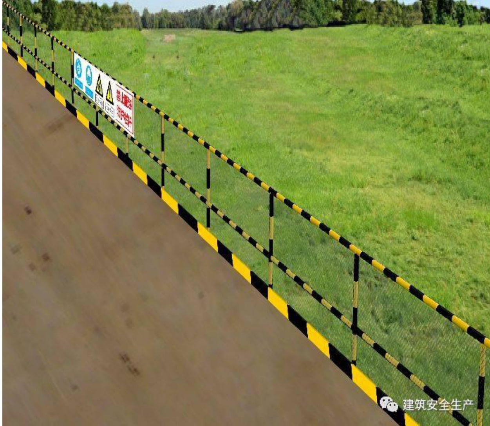  

2、防护栏杆整体构造应使防护栏杆任何处，能经受任何方向的1KN 的外力而不发生明显变形或断裂。当栏杆所处位置有发生人群拥挤、车辆冲击或物体撞击等可能时，应加大横杆截面，加密柱距。  

3、 防护栏杆由上下两道横杆及栏杆立柱及高度不低于 $1 8 0 \mathsf { m m }$ 硬质挡脚板组成，上杆离防护面高度不低于 $1 . 2 \mathsf { m }$ ，下杆离防护面高度不低于 $0 . 6 \mathsf { m }$ ，横杆长度大于 $2 m$ 时，应加设栏杆柱。  

# 02 洞口防护  

1、在地面、楼面、屋面和墙面等有可能使人和物料坠落，其坠落高度大于或等于 $2 m$ 的洞口处的高处作业需要做好洞口防护。  

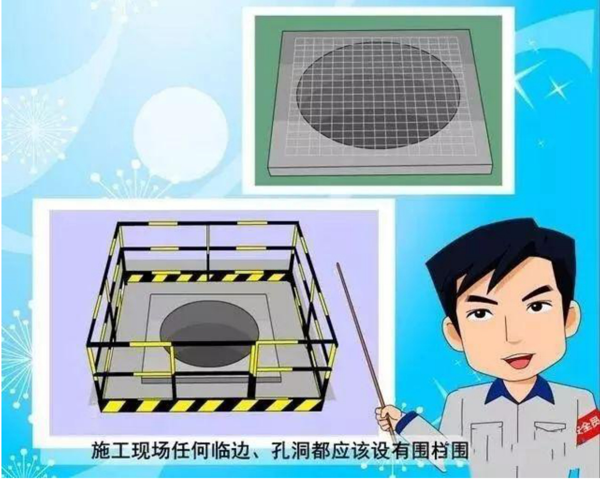  

2、当垂直洞口短边边长小于 $5 0 0 \mathsf { m m }$ 时，应采取封堵措施。  

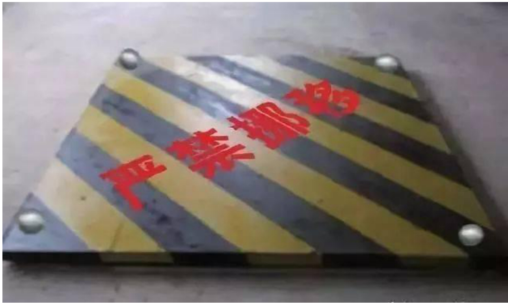  

3、当垂直洞口短边边长大于或等于 $5 0 0 \mathsf { m m }$ 时，应在临空一侧设置高度不小于 1.2 米的防护栏杆，并应采用密目式安全立网或工具式栏板封闭，设置挡脚板。  

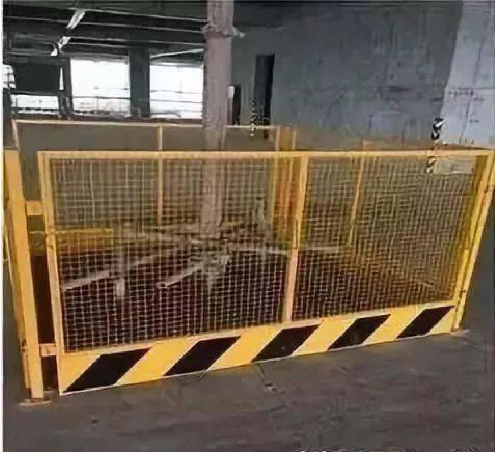  

4、当非垂直洞口短边边长大于或等于 $1 5 0 0 \mathsf { m m }$ 时，应在洞口作业侧设置高度不小于 $1 . 2 \mathsf { m }$ 的防护栏杆，下设 $1 8 0 \mathsf { m m }$ 高的踢脚板，防护栏杆距离洞口不得小于 $2 0 0 \mathsf { m m }$ ，并应采用密目式安全立网或工具式栏板封闭，栏杆表面刷黄黑相间警示漆，洞口应采用安全平网封闭。  

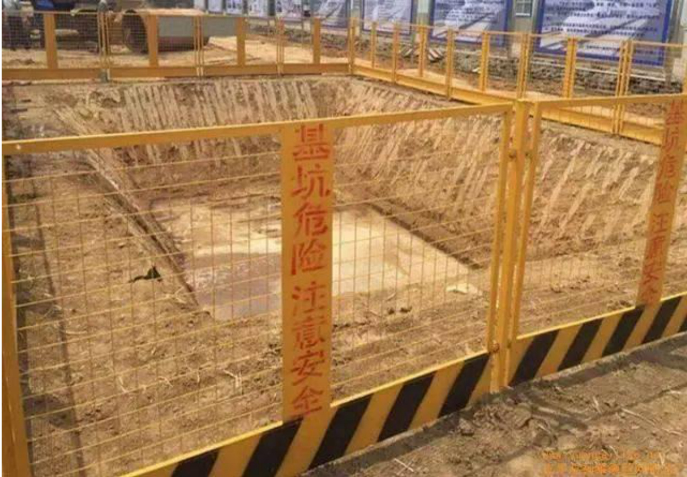  

5、边长大于 $1 5 0 0 \mathsf { m m }$ 小于5000mm 的洞口，应设置以扣件扣接钢管而成的 $1 0 0 0 { \times } 1 0 0 0 \mathrm { m m }$ 网格，并在其上满铺盖板或安全平网。  

6、边长大于 $5 0 0 0 \mathrm { { m m } }$ 的洞口，直接在洞口周边 $2 0 0 \mathsf { m m }$ 处搭设防护栏杆，设置 $1 8 0 \mathsf { m m }$ 高的踢脚板。  

# 03 井道防护  

1、电梯井、管井必须设置防止人员坠落和落物伤人的防护设施，并加设明显标志警示。电梯井洞口、宽度超过 $4 0 0 \mathsf { m m }$ 管井洞口等竖向落地洞口，必须设置防护门。  

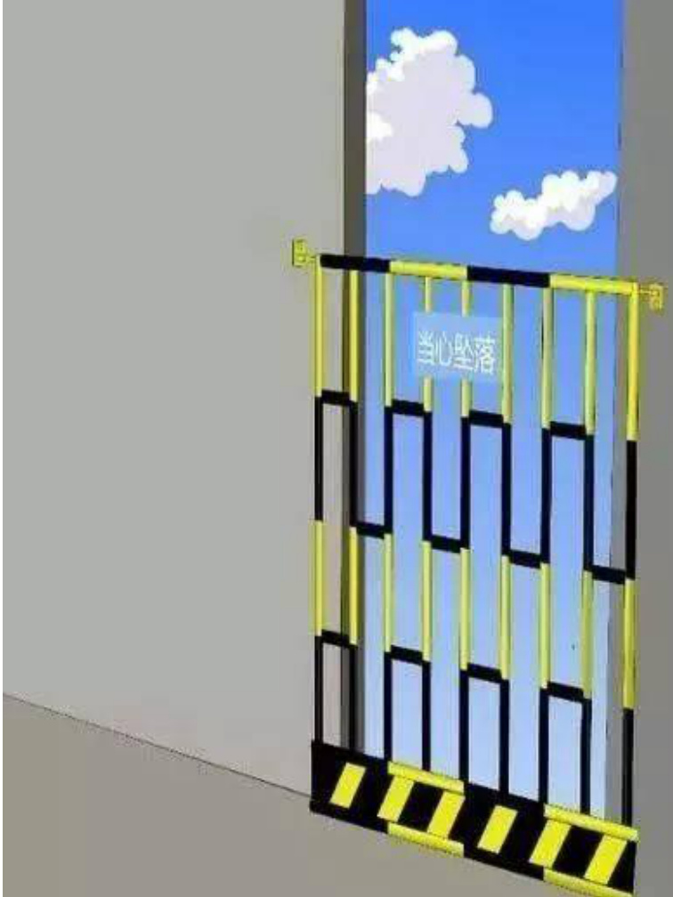  

2、井道内应每隔两层且不超过10m 应搭设一道硬质隔断，每两层水平硬质隔断之间应增设一道安全平网。  

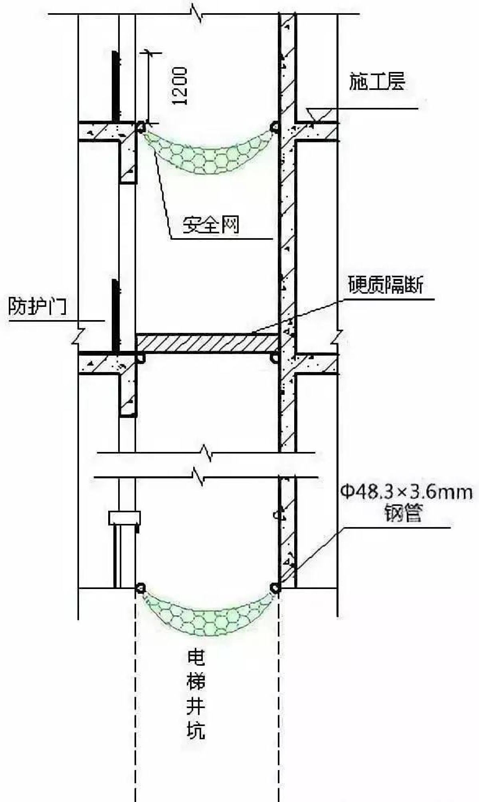  

3、电梯井三角架支撑型操作平台采用不小于[10 槽钢（或 $8 0 \mathrm { m m } \times 8 0 \mathrm { m m }$ 方钢，用于主梁）、[8 槽钢（或 $6 0 \mathrm { m m } \times 6 0 \mathrm { m m }$ 方钢用于次梁）、3mm 厚钢板、 $\Phi 4 8$ 钢管及其他辅助材料焊接而成，加工时，槽钢之间接触部位应全部满焊或者可靠机械连接，不得漏焊。  

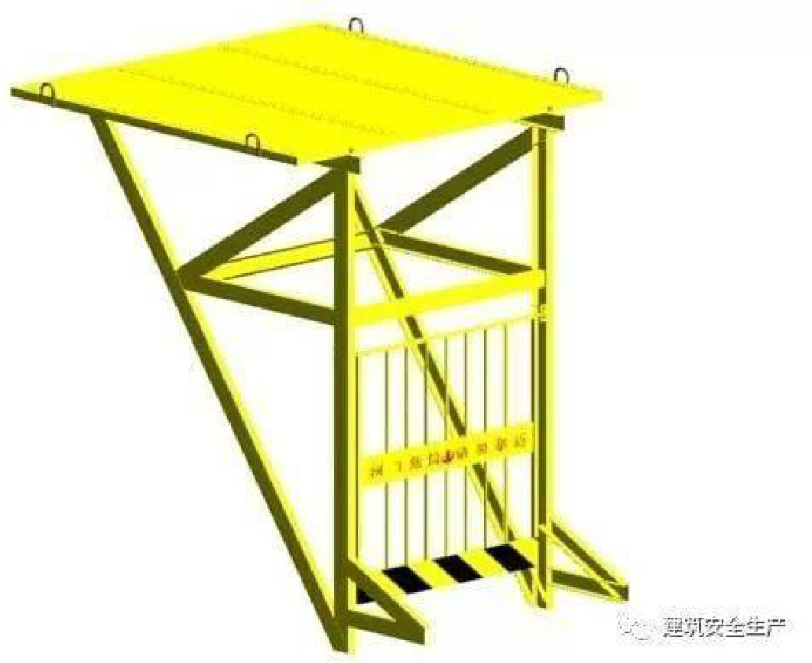  

# 04 安全通道及防护棚  

1、当临街通道、场内通道、出入建筑物通道、施工电梯及物料提升机地面进料口作业通道处于坠落半径内或处于起重机起重臂回转范围内时，必须设置防护棚和防护通道，以避免发生物体打击事故。  

2、安全通道及防护棚的顶部严密铺设双层正交竹串片脚手板或双层正交 $1 8 \mathsf { m m }$ 厚木模板的水平硬质防护，及封闭的防护栏或挡板，整体应能承受 10KPa 的均布静荷载。  

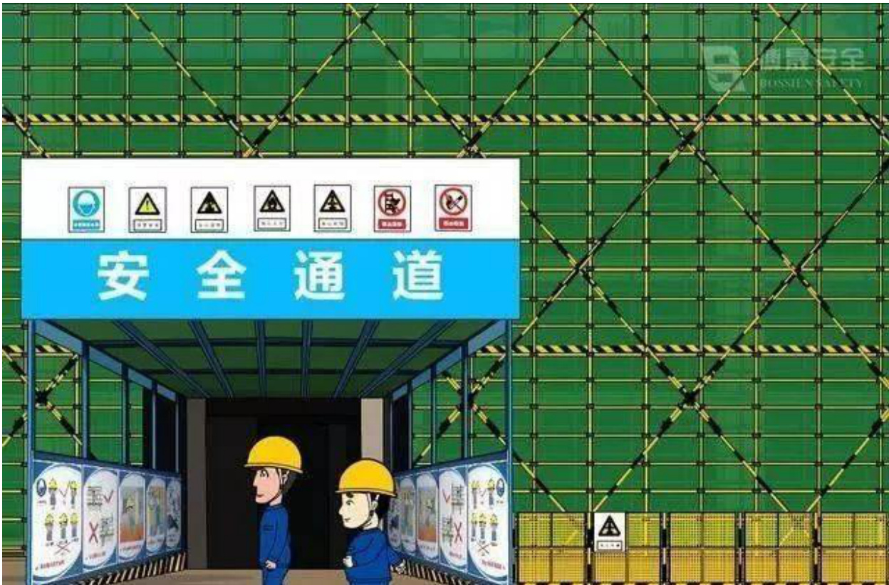  

3、当采用钢质板或与其等强度的其他材料搭设时，可采用单层硬质防护搭设，钢板厚度不应小于 $3 \mathsf { m m }$ ，当采用单层硬质防护搭设时，上部 $7 0 0 \mathsf { m m }$ 处应设置水平兜网。  

4、安全通道侧边应设置隔离栏杆，引导行人从安全通道内通过，必要时满挂密目网封闭。处于施工人货电梯、物料提升机坠落半径内的地面进料口和安全通道顶部应采用双层防护，空间较大的应设计格构柱支撑，需要夜间施工的，应设置照明装置。  

# 05 外脚手架防护  

1、悬挑脚手架悬挑梁应根据悬挑架荷载及悬挑长度等情况具体确定。施工用悬挑脚手架宜采用16 号以上工字钢作为主悬挑梁，外挑段不宜超过 $1 . 5 0 \mathsf { m }$ ，锚固段不小于外挑段的1.25 倍。严禁采用脚手架钢管作为主挑梁。采用槽钢作为主挑梁时应有防侧弯措施。  

2、附着升降式脚手架外立面必须满挂密目安全网，并在其内侧加挂孔径不大于25mm 钢板网，单片式架体和中间断开部位的端头，也应满挂密目安全网和钢板网。架体底部应采用硬质封闭，并用密目网及水平安全网兜底。  

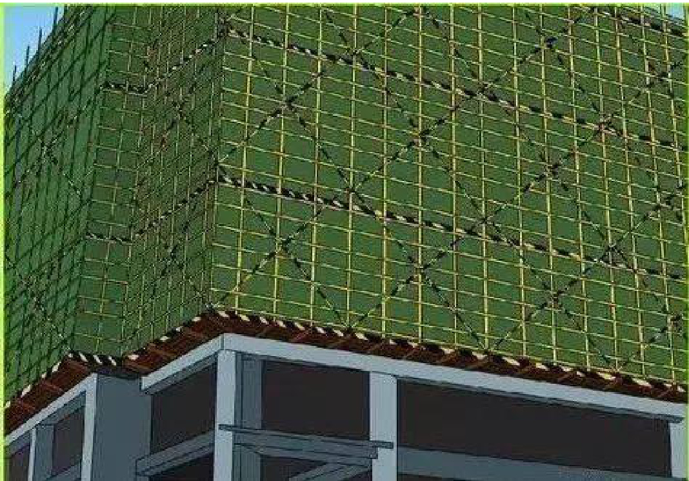  

3、连墙件应靠近主接点位置，偏离主节点的距离不得大于 $3 0 0 \mathsf { m m }$ 。一字型、开口型脚手架的两端必须设置刚性连墙件，连墙件的垂直间距不得大于建筑物的层高，且不得大于 $4 \mathsf { m }$ 。开口型双排脚手架的两端均须设置横向斜撑。  

# 06 避雷和外电防护  

1、施工现场内的起重机械、井字架及龙门架等机械设备，若在相邻建筑物、构筑物的防雷装置的保护范围以外，则应按照下表规定安装防雷装置：  

<html><body><table><tr><td colspan="5">安装防雷装置的施工设施高度</td></tr><tr><td>地区年平均雷暴日（d）</td><td>≤15</td><td>>15,<40</td><td>≥40，<90</td><td>≥90</td></tr><tr><td>施工设施高度（m）</td><td>≥50</td><td>≥32</td><td>≥20</td><td>≥12</td></tr><tr><td colspan="5">注：地区年平均雷暴日数按气象主管部门公布的当地年平均雷暴日数 华盛天成工程</td></tr></table></body></html>  

2、避雷装置应包括接闪器、引下线和接地装置。  

3、 在建工程（含脚手架具）的外侧边缘与外电架空线路的边线之间的小安全操作距离应满足下图所示要求：  

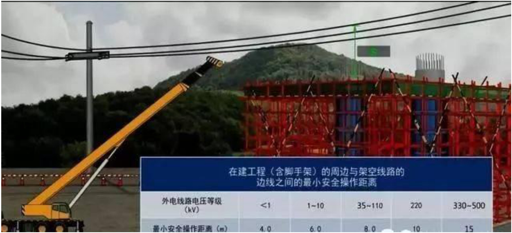  

4、施工现场的机动车道与架空线路交叉时的最小垂直距离应满足下图所示要求：  

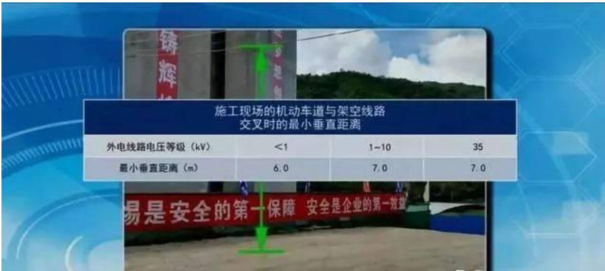  

# 07 悬挑式钢平台  

1、使用塔吊等机械向建筑楼层转运材料，不能直接吊运至建筑结构楼层内时，必须采用定型制作的悬挑式钢平台。  

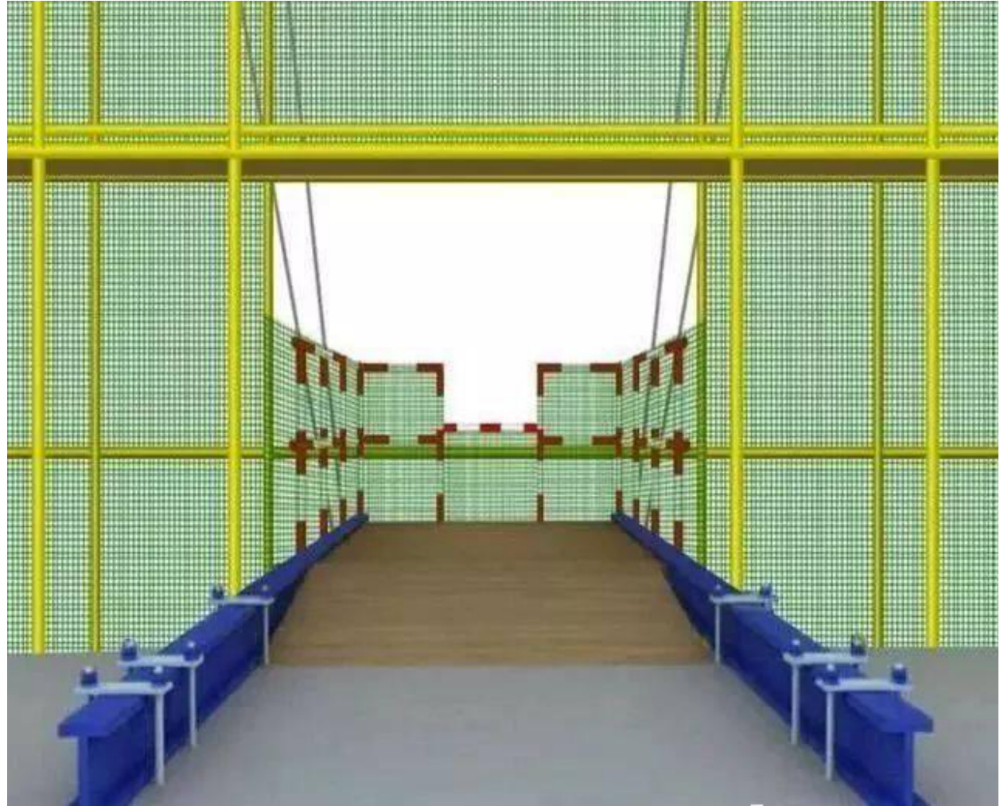  

2、平台应以工字钢或槽钢作主、次梁，满铺脚手板，以螺栓与钢梁固定，或满铺 $4 \mathsf { m m }$ 厚钢板，与钢梁焊接固定。平台的搁置点和锚固点，必须牢固固定于稳定的主体结构上，且应可靠连接。  

3、平台两边各设前后两道斜拉钢丝绳，靠内一道为保护绳，每一道钢丝绳应能承载该侧所有荷载。钢丝绳应采用专用的钢丝绳夹连接，钢丝绳卡的规格与数量应与钢丝绳直径相匹配，且不得小于4 个。建筑物锐角利口围系钢丝绳处应加衬软垫物。  

  

4、平台上应设置四个拉环，以固定斜拉钢丝绳。另设置四个吊环便于安装时塔吊吊运。吊运平台时应使用卡环，不得使用吊钩直接钩挂吊环。拉环及吊环应用 HPB235 圆钢制作，与主梁搭接焊，焊接长度不小于 $1 5 0 \mathsf { m m }$ ，焊缝高度不小于6mm。  

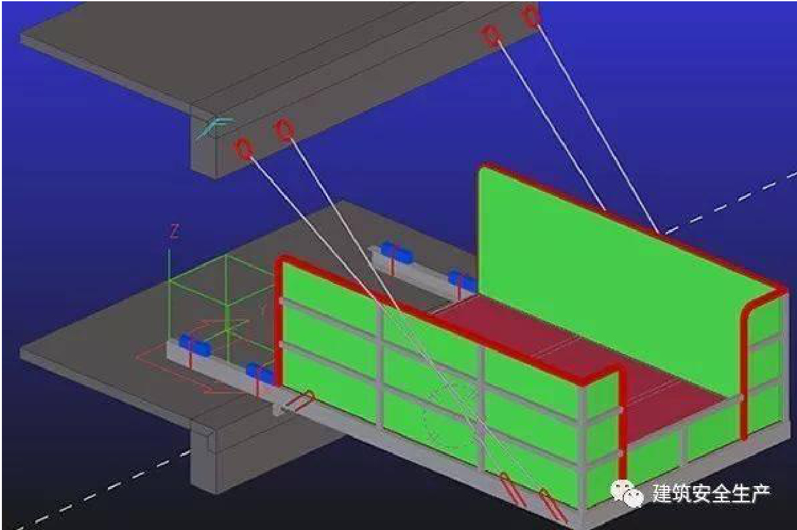  

5、悬挑式操作平台的外侧应略高于内侧，平台左右两侧必须装设固定的不低于 $1 . 2 \mathsf { m }$ 的防护栏杆，满设钢板网或模板硬质防护，下口设置 $2 0 0 \mathsf { m m }$ 高钢制踢脚板，封闭严密。端部装设内开式活动格栅门，加装薄钢板封闭，吊运长料时打开。  

# 无障碍设计规范（GB 50763-2012）  

中华人民共和国住房和城乡建设部公告关于发布国家标准《无障碍设计规范》的公告  

现批准《无障碍设计规范》为国家标准，编号为GB 50763-2012 ，自 2012 年 9 月 1 日起实施。其中，第 3.7.3(3 、5) 、4.4.5 、6.2.4(5) 、6.2.7(4) 、8. 1. 4 条(款)为强制性条文，必须严格执行。原《城市道路和建筑物无障碍设计规范)) JGJ 50-2001 同时废止。  

本规范由我部标准定额研究所组织中国建筑工业出版社出版发行。  

# 中华人民共和国住房和城乡建设部2012 年 3 月 30 日  

# 前言  

# 1 总则  

# 2 术语  

# 3 无障碍设施的设计要求  

3.1 缘石坡道  
3.2 盲道  
3.3 无障碍出入口  
3.4 轮椅坡道  
3.5 无障碍通道、门  
3.6 无障碍楼梯、台阶  
3.7 无障碍电梯、升降平台  
3.8 扶手  
3.9 公共厕所、无障碍厕所  
3.10 公共浴室  
3.11 无障碍客房  
3.12 无障碍住房及宿舍  
3.13 轮椅席位  
3.14 无障碍机动车停车位  
3.15 低位服务设施  
3.16 无障碍标识系统、信息  

# 4 城市道路  

4.1 实施范围  
4.2 人行道  
4.3 人行横道  
4.4 人行天桥及地道  
4.5 公交车站  
4.6 无障碍标识系统  

# 5 城市广场  

5.1 实施范围  
5.2 实施部位和设计要求  

# 6 城市绿地  

6.1 实施范围  
6.2 公园绿地  
6.3 附属绿地  
6.4 其他绿地  

# 7 居住区、居住建筑  

7.1 道路  
7.2 居住绿地  
7.3 配套公共设施  
7.4 居住建筑  

# 8 公共建筑  

8.1 一般规定  
8.2 办公、科研、司法建筑  
8.3 教育建筑  
8.4 医疗康复建筑  
8.5 福利及特殊服务建筑  
8.6 体育建筑  
8.7 文化建筑  
8.8 商业服务建筑  
8.9 汽车客运站  
8.10 公共停车场（库）  
8.11 汽车加油加气站  
8.12 高速公路服务区建筑  
8.13 城市公共厕所  

# 9 历史文物保护建筑无障碍建设与改造  

9.1 实施范围  
9.2 无障碍游览路线  
9.3 出入口  
9.4 院落  
9.5 服务设施  
9.6 信息与标识  
附录 A 无障碍标志  
附录 B 无障碍设施标志牌  
附录 C 用于指示方向的无障碍设施标志牌  

# 本规范用词说明  

# 1 总则  

1.0.1 为建设城市的无障碍环境，提高人民的社会生活质量，确保有需求的人能够安全地、方便地使用各种设施，制定本规范。  

1.0.2 本规范适用于全国城市新建、改建和扩建的城市道路、城市广场、城市绿地、居住区、居住建筑、公共建筑及历史文物保护建筑等。本规范未涉及的城市道路、城市广场、城市绿地、建筑类型或有无障碍需求的设计，宜按本规范中相似类型的要求执行。农村道路及公共服务设施宜按本规范执行。  

1.0.3 铁路、航空、城市轨道交通以及水运交通相关设施的无障碍设计，除应符合本规范的要求外，尚应符合相关行业的有关无障碍设计的规定。  

1.0.4 城市无障碍设计在执行本规范时尚应遵循国家的有关方针政策，符合城市的总体发展要求，应做到安全适用、技术先进、经济合理。  

1.0.5 城市无障碍设计除应符合本规范外，尚应符合国家现行有关标准的规定。  

# 2 术语  

# 2.0.1 缘石坡道 curb ramp  

位于人行道口或人行横道两端，为了避免人行道路缘石带来的通行障碍，方便行人进入人行道的一种坡道。  

2.0.2 盲道 tactile ground surface indicator在人行道上或其他场所铺设的一种固定形态的地面砖，使视觉障碍者产生盲杖触觉及脚感，引导视觉障碍者向前行走和辨别方向以到达目的地的通道。  

2.0.3 行进盲道 directional indicator  
表面呈条状形、使视觉障碍者通过盲丈触党和脚惑，指引视觉障碍者可直接向正前方继续行走的盲道。  

2.0.4 提示盲道 warning indicator表面呈圆点形，用在盲道的起点处、拐弯处、终点处和表示服务设施的位置以及提示视觉障碍者前方将有不安全或危险状态等，具有提醒注意作用的盲道。  

2.0.5 无障碍出入口 accessible entrance  
在坡度、宽度、高度上以及地面材质、扶手形式等方面方便行动障碍者通行的出入口。  

2.0.6 平坡出入口 ramp entrance地面坡度不大于 1 : 20 且不设扶手的出入口。  

2.0.7 轮椅回转空间 wheelchair turning space为方便乘轮椅者旋转以改变方向而设置的空间。  

2.0.8 轮椅坡道 wheelchair ramp在坡度、宽度、高度、地面材质、扶手形式等方面方便乘轮  

椅者通行的坡道。  

2.0.9 无障碍通道 accessible route  
在坡度、宽度、高度、地面材质、扶手形式等方面方便行动障碍者通行的通道。  
2.0.10 轮椅通道 wheelchair accessible path/lane  
在检票口或结算口等处为方便乘轮椅者设置的通道。  
2.0.11 无障碍楼梯 accessible stairway  
在楼梯形式、宽度、踏步、地面材质、扶手形式等方面方便行动及视觉障碍者使用的楼梯。  
2.0.12 无障碍电梯 wheelchair accessible elevator造合行动障碍者和视觉障碍者进出和使用的电梯。  
2.0.13 升降平台 wheelchair platform lift and stair lift方便乘轮椅者进行垂直或斜向通行的设施。  
2.0.14 安全抓杆 grab bar  
在无障碍厕位、厕所、浴间内，方便行动障碍者安全移动和支撑的一种设施。  
2.0.15 无 障 碍 厕 位 water closet compartment forwheelchair users  
公共厕所内设置的带坐便器及安全抓杆且方便行动障碍者进出和使用的带隔间的厕位。  
2.0.16 无障碍厕所 individual washroom for wheelchairusers出入口、室内空间及地面材质等方面方便行动障碍者使用且无障碍设施齐全的小型无性别厕所。  
2.0.17 无障碍洗手盆 accessible wash basin  
方便行动障碍者使用的带安全抓杆的洗手盆。  
2.0.18 无障碍小便器 accessible urinal  
方便行动障碍者使用的带安全抓杆的小便器。  
2.0.19 无障碍盆浴间 accessible bathtub  
无障碍设施齐全的盆浴间。  
2.0.20 无障碍淋浴间 accessible shower stall  
无障碍设施齐全的淋浴间。  
2.0.21 浴间坐台 shower seat  
洗浴时使用的固定坐台或活动坐板。  
2.0.22 无障碍客房 accessible guest room  
出入口、通道、通信、家具和卫生间等均设有无障碍设施，房间的空间尺度方便行动障碍者安全活动的客房。  
2.0.23 无障碍住房 accessible housing  
出入口、通道、通信、家具、厨房和卫生间等均设有无障碍设施，房间的空间尺度方便行动障碍者安全活动的住房。2.0.24 轮椅席位 wheelchair accessible seat  
在观众厅、报告厅、阅览室及教室等设有固定席位的场所内，供乘轮椅者使用的位置。  
2.0.25 陪护席位 seats for accompanying persons  

设置于轮椅席位附近，方便陪伴者照顾乘轮椅者使用的席位。  

1  
2.0.26 安全阻挡措施 edge protection  
控制轮椅小轮和拐杖不会侧向滑出坡道、踏步以及平台边界的设施。  
2.0.27 无障碍机动车停车位 accessible vehicle parkinglot  
方便行动障碍者使用的机动车停车位。  
2.0.28 盲文地图 braille map  
供视觉障碍者用于触摸的有立体感的位置图或平面图及盲文说明。  
2.0.29 盲文站牌 bus-stop braille board  
采用盲文标识，告知视觉障碍者公交候车站的站名、公交车线路和终点站名等的车站站牌。  
2.0.30 盲文铭牌 braille signboard  
安装在无障碍设施上或设施附近固定部位上，采用盲文标识以告知信息的铭牌。  
2.0.31 过街音响提示装置 audible pedestrian signals forstreet crossing  
通过语音提示系统引导视觉障碍者安全通行的音响装置。2.0.32 语音提示站台 bus station with intelligent voice  

prompts  

设有为视觉障碍者提供乘坐或换乘公共交通相关信息的语音提示系统的站台。  
2.0.33 信息无障碍 information accessibility  
通过相关技术的运用，确保人们在不同条件下都能够平等地、方便地获取和利用信息。  
2.0.34 低位服务设施 low height service facilities为方便行动障碍者使用而设置的高度适当的服务设施。2.0.35 母婴室 mother and baby room  
设有婴儿打理台、水池、座椅等设施，为母亲提供的给婴儿换尿布、喂奶或临时体息使用的房间。  
2.0.36 安全警示线 safety warning line  
用于界定和划分危险区域，向人们传递某种注意或警告的信息，以避免人身伤害的提示线。  

# 3 无障碍设施的设计要求  

# 3.1 缘石坡道  

3.1.1 缘石坡道应符合下列规定：  

1 缘石坡道的坡面应平整、防滑；  

2 缘石坡道的坡口与车行道之间宜没有高差；当有高差时，高出车行道的地面不应大于 10mm；  

3 宜优先选用全宽式单面坡缘石坡道。  

# 条文说明  

为了方便行动不便的人特别是乘轮椅者通过路口，人行道的路口需要设置缘石坡道，在缘石坡道的类型中，单面坡缘石坡道是一种通行最为便利的缘石坡道，丁字路口的缘石坡道同样适合布置单面坡的缘石坡道。实践表明，当缘石坡道顺着人行道路的方向布置时，采用全宽式单面坡缘石坡道(图 3-1)最为方便。其他类型的缘石坡道，如三面坡缘石坡道(图 3-2) 等可根据具体情况有选择性地采用。  

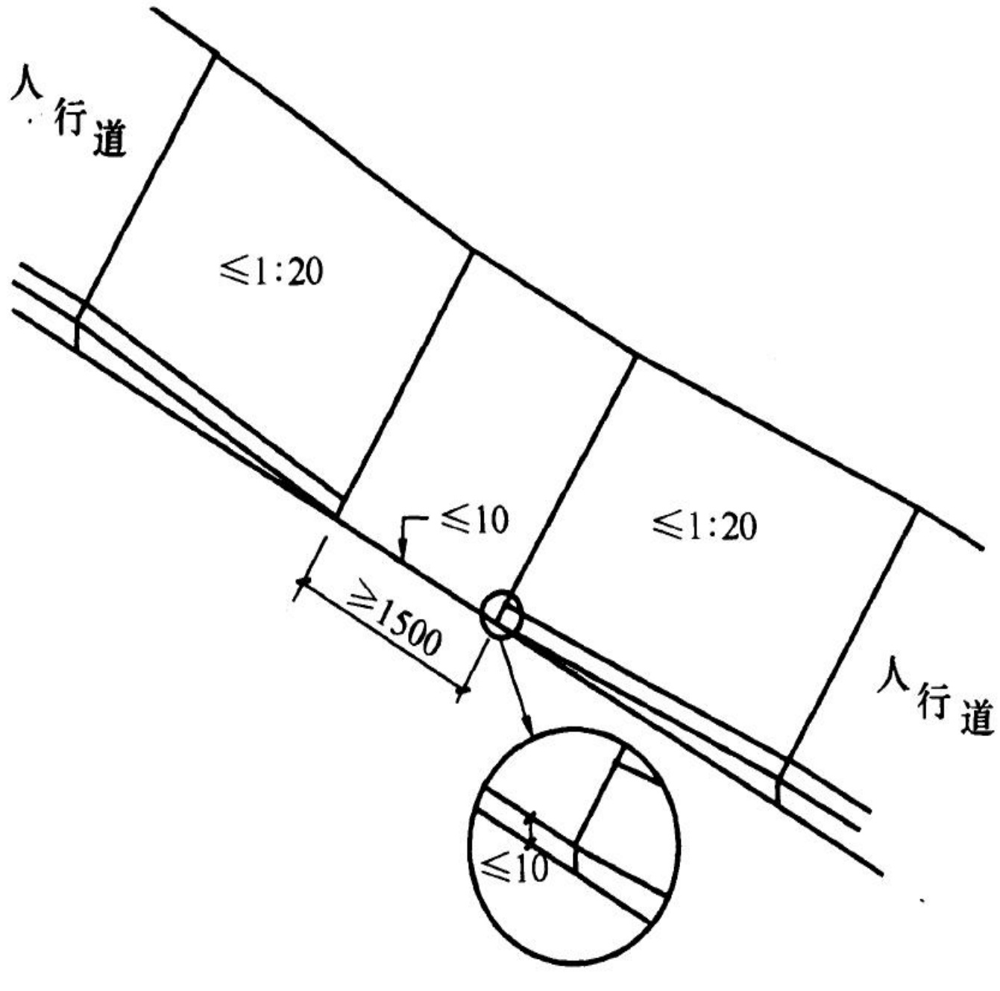  
图 3-1 全宽式单面坡缘石坡道  

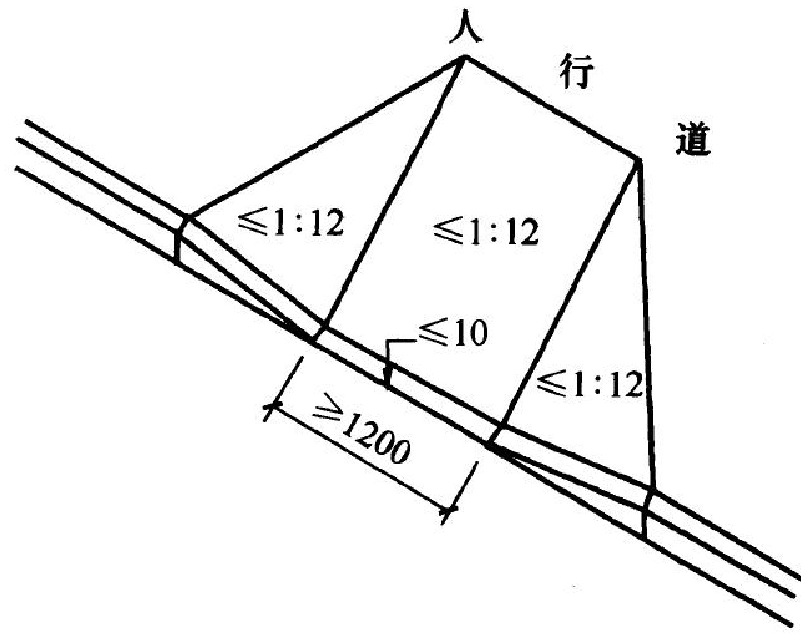  
图3-2 三面坡缘石坡道  

3.1.2 缘石坡道的坡度应符合下列规定：  

1 全宽式单面坡缘石坡道的坡度不应大于 1 : 20；  
2 三面坡缘石坡道正面及侧面的坡度不应大于 $\mathbf { \xi } _ { 1 } : \mathbf { \xi } _ { 1 2 }$ ；  
3 其他形式的缘石坡道的坡度均不应大于 1 : 12 。  

3.1.3 缘石坡道的宽度应符合下列规定：  

1 全宽式单面坡缘石坡道的宽度应与人行道宽度相同；  
2 三面坡缘石坡道的正面坡道宽度不应小于1.20m；  
3 其他形式的缘石坡道的坡口宽度均不应小于 1.50m 。  

# 3.2 盲道  

3.2.1 盲道应符合下列规定:  

1 盲道按其使用功能可分为行进盲道和提示盲道;  
2 盲道的纹路应凸出路面 4mm 高;  
3 盲道铺设应连续，应避开树木(穴)、电线杆、拉线等障碍物，其他设施不得占用盲道;  
4 盲道的颜色宜与相邻的人行道铺面的颜色形成对比，并与周围景观相协调，宜采用中黄色;  
5 盲道型材表面应防滑。  

# 条文说明  

第1 款 盲道有两种类型，一种是行进盲道(图 3-3) ,行进盲道应能指引视觉障碍者安全行走和顺利到达无障碍设施的位置，呈条状;另一种是在行进盲道的起点、终点及拐弯处设置的提示盲道(图 3-4) ，提示盲道能告知视觉障碍者前方路线的空间环境将发生变化，呈圆点形。目前以250mm\* 250mm 的成品盲道构件居多。  

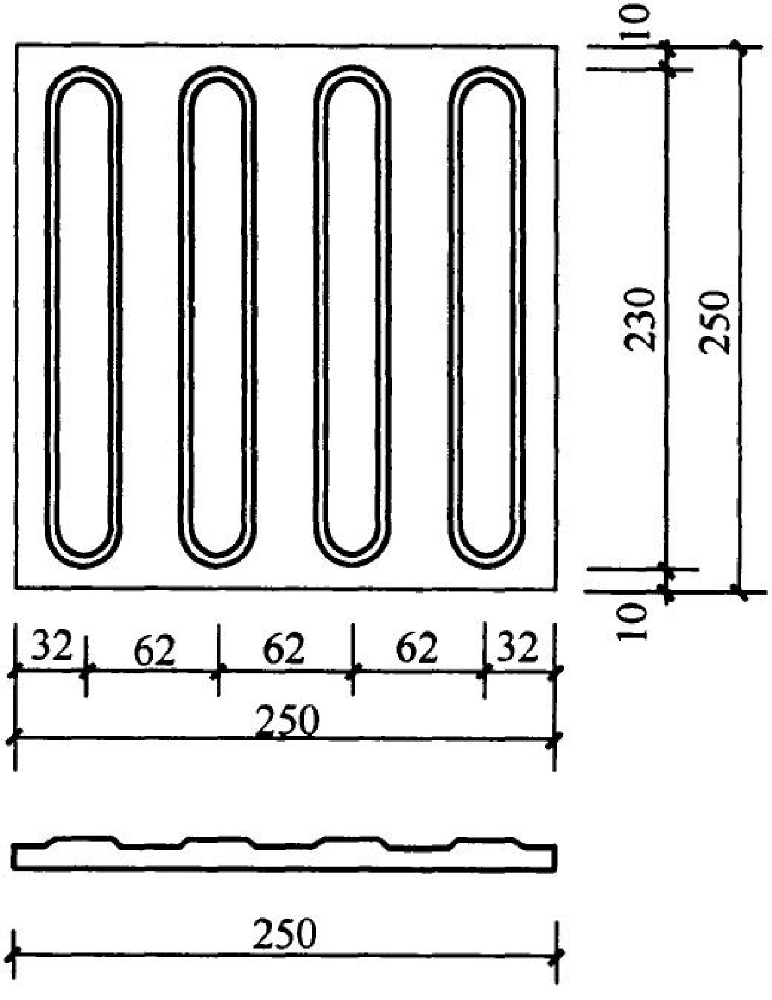  
图3-3 行进盲道  

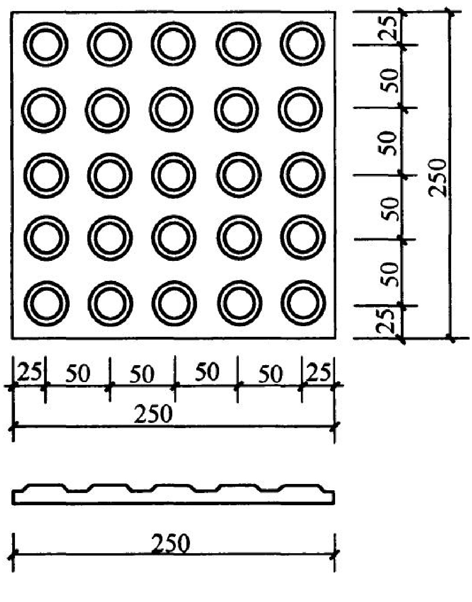  
图3-4 提示盲道  

目前使用较多的盲道材料可分成 5 类:预制混凝土盲道砖、花岗石盲道板、大理石盲道板、陶瓷类盲道板、橡胶塑料类盲道板、其他材料(不锈钢、聚氯乙烯等)盲道型材。  

第 3 款 盲道不仅引导视觉障碍者行走，还能保护他们的行进安全，因此盲道在人行道的定位很重要，应避开树木(穴〉、电线杆、拉线等障碍物，其他设施也不得占用盲道。  

第 4 款 盲道的颜色应与相邻的人行道铺面的颜色形成反差，并与周围景观相协调，宜采用中黄色，因为中黄色比较明亮，更易被发现。  

3.2.2 行进盲道应符合下列规定:  

1 行进盲道应与人行道的走向一致;  

2 行进盲道的宽度宜为 $2 5 0 \mathrm { m m } { - } 5 0 0 \mathrm { m m } ;$ ;  

3 行进盲道宜在距围墙、花台、绿化带 $2 5 0 \mathrm { m m } - 5 0 0 \mathrm { m m }$ 处设置;  

4 行进盲道宜在距树池边缘 $2 5 0 \mathrm { m m } - 5 0 0 \mathrm { m m }$ 处设置；如无树池，行进盲道与路缘石上沿在同一水平面时，距路缘石不应小于500mm ，行进盲道比路缘石上沿低时，距路缘石不应小于 250mm; 盲道应避开非机动车停放的位置;  

5 行进盲道的触感条规格应符合表 3.2.2 的规定。  

表 3.2.2 行进盲道的触感条规格  

<html><body><table><tr><td>部位</td><td>尺寸要求(mm)</td></tr><tr><td>面宽</td><td>25</td></tr><tr><td>底宽</td><td>35</td></tr><tr><td>高度</td><td>4</td></tr><tr><td>中心距</td><td>62-75</td></tr></table></body></html>  

3.2.3 提示盲道应符合下列规定:  

1 行进盲道在起点、终点、转弯处及其他有需要处应设提示盲道，当盲道的宽度不大于300mm 时，提示盲道的宽度应大于行进盲道的宽度;  

2 提示盲道的触感圆点规格应符合表3.2.3 的规定。  

表3.2.3 提示盲遭的触感圆点规格  

<html><body><table><tr><td>部位</td><td>尺寸要求 (mm)</td></tr><tr><td>表面直径</td><td>25</td></tr><tr><td>底部直径</td><td>35</td></tr><tr><td>圆点高度</td><td>4</td></tr><tr><td>圆点中心距</td><td>50</td></tr></table></body></html>  

# 3.3 无障碍出入口  

3.3.1 无障碍出入口包括以下几种类别:  

1 平坡出入口;  
2 同时设置台阶和轮椅坡道的出入口;  

3 同时设置台阶和升降平台的出入口。  

# 条文说明  

第 1 款 平坡出入口，是人们在通行中最为便捷的无障碍出入口，该出入口不仅方便了各种行动不便的人群，同时也给其他人带来了便利，应该在工程中，特别是大型公共建筑中优先选用。  

第 3 款 主要适用以下情况:在建筑出入口进行无障碍改造时，因为场地条件有限而无法修建坡道，可以采用占地面积小的升降平台取代轮椅坡道。一般的新建建筑不提倡此种做法。  

3.3.2 无障碍出入口应符合下列规定:  

1 出入口的地面应平整、防滑;  

2 室外地面滤水算子的孔洞宽度不应大于 15mm;  

3 同时设置台阶和升降平台的出入口宜只应用于受场地限制无法改造坡道的工程，并应符合本规范第 3.7.3 条的有关规定;  

4 除平坡出入口外，在门完全开启的状态下，建筑物无障碍出入口的平台的净深度不应小于 1.50m;  

5 建筑物无障碍出入口的门厅、过厅如设置两道门，门扇同时开启时两道门的间距不应小于 1.50m;  

6 建筑物无障碍出入口的上方应设置雨棚。  

# 条文说明  

第1 款 出入口的地面应做防滑处理，为人们进出时提供便利，特别是雨雪天气尤为需要。  

第2 款 一般设计中不提倡将室外地面滤水算子设置在常用的人行通路上，对其孔宽的限定是为了防止卡住轮椅的轮子、盲杖等，对正常行走的人也提供了便利。  

第4 款 建筑入口的平台是人流通行的集散地带，特别是公共建筑显得更为突出，既要方便乘轮椅者的通行和回转，还应给其他人的通行和停留带来便利和安全。如果入口平台的深度做得很小，就会造成推开门扇就下台阶，稍不留意就有跌倒的危险，因此限定建筑入口平台的最小深度非常必要。  

第5 款 入口门厅、过厅设两道门时，当乘轮椅者在期间通行时，避免在门扇同时开启后碰撞轮椅，因此对开启门扇后的最小间距作出限定。  

3.3.3 无障碍出入口的轮椅坡道及平坡出入口的坡度应符合下列规定:  

1 平坡出入口的地面坡度不应大于 1 : 20，当场地条件比较好时，不宜大于1 : 30;  

2 同时设置台阶和轮椅坡道的出入口，轮椅坡道的坡度应符合本规范第 3.4 节的有关规定。  

# 条文说明  

调查表明，坡面越平缓，人们越容易自主地使用坡道。  

《民用建筑设计通则)) GB 50352 - 2005 规定基地步行道的纵坡不应小于 $0 . 2 \%$ ，平坡入口的地面坡度还应满足此要求，并且需要结合室内外高差、建筑所在地的具体情况等综合选定适宜坡度。  

# 3.4 轮椅坡道  

3.4.1 轮椅坡道宜设计成直线形、直角形或折返形。  

# 条文说明  

坡道形式的设计，应根据周边情况综合考虑，为了避免乘轮椅者在坡面上重心产生倾斜而发生摔倒的危险，坡道不宜设计成圆形或弧形。3.4.2 轮椅坡道的净宽度不应小于1.00m ，无障碍出入口的轮椅坡道净宽度不应小于 1.20m 。  

# 条文说明  

坡道宽度应首先满足疏散的要求，当坡道的宽度不小于1.00m 时，能保证一辆轮椅通行；坡道宽度不小于 1.20m 时，能保证一辆轮椅和一个人侧身通行；坡道宽度不小于 1.50m时，能保证一辆轮椅和一个人正面相对通行；坡道宽度不小于 1.80m 时，能保证两辆轮椅正面相对通行。3.4.3 轮椅坡道的高度超过 300mm 且坡度大于 1 : 20 时，应在两侧设置扶手，坡道与休息平台的扶手应保持连贯，扶手应符合本规范第 3.8 节的相关规定。  

# 条文说明  

当轮椅坡道的高度在300mm 及以内时，或者是坡度小于或等于 1:20 时，乘轮椅者及其他行动不便的人基本上可以不使用扶手；但当高度超过300mm 且坡度大于 1:20 时，则行动上需要借助扶手才更为安全，因此这种情况坡道的两侧都需要设置扶手。  

3.4.4 轮椅坡道的最大高度和水平长度应符合表3.4.4 的规定。  

表 3.4.4 轮椅坡道的最大高度和水平长度  

<html><body><table><tr><td>坡度</td><td>1:20</td><td>1:16</td><td>1:12</td><td>1:10</td><td>1:8</td></tr><tr><td>最大高度(m)</td><td>1.20</td><td>0.90</td><td>0.75</td><td>0.60</td><td>0.30</td></tr><tr><td>水平长度(m)</td><td>24.00</td><td>14.40</td><td>9.00</td><td>6.00</td><td>2.40</td></tr></table></body></html>

注：其他坡度可用插入法进行计算。  

# 条文说明  

轮椅坡道的坡度可按照其提升的最大高度来选用，当坡道所提升的高度小于300mm 时，可以选择相对较陡的坡度，但不得小于 1:8。在坡道总提升的高度内也可以分段设置坡道，但中间应设置休息平台，每段坡道的提升高度和坡度的关系可按照表3.4.4 执行。在有条件的情况下将坡道做到小于 1:12 的坡度，通行将更加安全和舒适。  

3.4.5 轮椅坡道的坡面应平整、防滑、无反光。  

# 条文说明  

本条要求坡道的坡面平整、防滑是为了轮椅的行驶顺  

畅，坡面上不宜加设防滑条或将坡面做成磕踵形式，因为乘轮椅者行驶在这种坡面上会感到行驶不畅。  
3.4.6 轮椅坡道起点、终点和中间体息平台的水平长度不应小于 1.50m。  

# 条文说明  

轮椅在进入坡道之前和行驶完坡道，进行一段水平行驶，能使乘轮椅者先将轮椅调整好，这样更加安全。轮椅中途要调转角度继续行驶时同样需要有一段水平行驶。  

3.4.7 轮椅坡道临空侧应设置安全阻挡措施。  

# 条文说明  

轮椅坡道的侧面临空时，为了防止拐杖头和轮椅前面的小轮滑出，应设置遮挡措施。遮挡措施可以是高度不小于50mm 的安全挡台，也可以做与地面空隙不大于100mm 的斜向栏杆等。3.4.8 轮椅坡道应设置无障碍标志，无障碍标志应符合本规范第 3.16 节的有关规定。  

# 3.5 无障碍通道、门  

3.5.1 无障碍通道的宽度应符合下列规定:  

1 室内走道不应小于 1.20m，人流较多或较集中的大型公共建筑的室内走道宽度不宜小于1.80m；  

# 2 室外通道不宜小于 1.50m；  

3 检票口、结算口轮椅通道不应小于900mm。  

3.5.2 无障碍通道应符合下列规定:  

1 无障碍通道应连续，其地面应平整、防滑、反光小或无反光，并不宜设置厚地毯；  

2 无障碍通道上有高差时，应设置轮椅坡道；  

3 室外通道上的雨水算子的孔洞宽度不应大于 15mm；  

4 固定在无障碍通道的墙、立柱上的物体或标牌距地面的高度不应小于 2.00m；如小于 2.00m 时，探出部分的宽度不应大于 100mm；如突出部分大于 $1 0 0 \mathrm { m m }$ ，则其距地面的高度应小于 600mm；  

5 斜向的自动扶梯、楼梯等下部空间可以进入时，应设置安全挡牌。  

# 条文说明  

第 4 款 探出的物体包括：标牌、电话、灭火器等潜在对视觉障碍者造成危害的物体，除非这些物体被设置在手杖可以感触的范围之内，如果这些物体距地面的高度不大于600mm ，视觉障碍者就可以用手杖感触到这些物体。在设计时将探出物体放在凹进的空间里也可以避免伤害。探出的物体不能减少无障碍通道的净宽度。  

3.5.3 门的无障碍设计应符合下列规定:  

1 不应采用力度大的弹簧门并不直采用弹簧门、玻璃门；当采用玻璃门时，应有醒目的提示标志；  

2 自动门开启后通行净宽度不应小于1.00m；  

3 平开门、推拉门、折叠门开启后的通行净宽度不应小于 800mm，有条件时，不宜小于 900mm；  

4 在门扇内外应留有直径不小于 1.50m 的轮椅回转空间；  

5 在单扇平开门、推拉门、折叠门的门把手一侧的墙面，应设宽度不小于 400mm 的墙面；  

6 平开门、推拉门、折叠门的门扇应设距地 900mm 的把手，宜设视线观察玻璃，并宜在距地 350mm 范围内安装护门板；  

7 门槛高度及门内外地面高差不应大于 15mm ，并以斜面过渡；  

8 无障碍通道上的门扇应便于开关；  
9 宜与周围墙面有一定的色彩反差，方便识别。  

# 条文说明  

建筑物中的门的无障碍设计包括其形式、规格、开启宽度的设计，需要考虑其使用方便与安全。乘轮椅者坐在轮椅上的净宽度为750mm ，目前有些型号的电动轮椅的宽度有所增大，所以当有条件时宜将门的净宽度做到 900mm。  

为了使乘轮椅者靠近门扇将门打开，在门把手一侧的墙面应留有宽度不小于 400mm 的空间，使轮椅能够靠近门把手。  

推拉门、平开门的把手应选用横握式把手或U 形把手，如果选用圆形旋转把手，会给手部残疾者带来障碍。在门扇的下方安装护门板是为了防止轮椅搁脚板将门扇碰坏。  

推荐使用通过按钮自动开闭的门，门及周边的空间尺寸要求也要满足本条规定。按钮高度为 $0 . 9 0 \mathrm { m } \ast 1 . 1 0 \mathrm { m }$ 。  

# 3.6 无障碍楼梯、台阶  

3.6.1 无障碍楼梯应符合下列规定:  

1 宜采用直线形楼梯；  

2 公共建筑楼梯的踏步宽度不应小于280mm ，踏步高度不应大于 160mm；  

3 不应采用无踢面和直角形突缘的踏步；  

4 宜在两侧均做扶手；  

5 如采用栏杆式楼梯，在栏杆下方宜设置安全阻挡措施；  

6 踏面应平整防滑或在踏面前缘设防滑条；  

7 距踏步起点和终点 $2 5 0 \mathrm { m m } - 3 0 0 \mathrm { m m }$ 宜设提示盲道；  

8 踏面和踢面的颜色宜有区分和对比；  

9 楼梯上行及下行的第一阶宜在颜色或材质上与平台有明显区别。  

# 条文说明  

楼梯是楼层之间垂直交通用的建筑部件。  

第1 款 如采用弧形楼梯，会给行动不便的人带来恐惧感，使其劳累或发生摔倒事故，因此无障碍楼梯宜采用直线形的楼梯。  

第3 款 踏面的前缘如有突出部分，应设计成圆弧形，不应设计成直角形，以防将拐杖头绊落掉和对鞋面刮碰。  

第5 款 在栏杆下方设置安全阻挡措施是为了防止拐杖向侧面滑出造成摔伤。遮挡措施可以是高度不小于 50mm 的安全挡台，也可以做与地面空隙不大于 100mm 的斜向栏杆等。  

第7 款 距踏步起点和终点 $2 5 0 \mathrm { m m } - 3 0 0 \mathrm { m m }$ 设置提示盲道是为了提示视觉障碍者所在位置接近有高差变化处。  

第 8 款 楼梯踏步的踏面和梯面的颜色宜有区分和对比，以引起使用者的警觉并利于弱视者辨别。  

3.6.2 台阶的无障碍设计应符合下列规定:  

1 公共建筑的室内外台阶踏步宽度不宜小于 $3 0 0 \mathrm { m m }$ ，踏步高度不宜大于 150mm，并不应小于100mm；  

2 踏步应防滑；  

3 三级及三级以上的台阶应在两侧设置扶手；  

4 台阶上行及下行的第一阶宜在颜色或材质上与其他阶有明显区别。  

# ▲条文说明  

台阶是在室外或室内的地坪或楼层不同标高处设置的  

供人行走的建筑部件。  

第3 款 当台阶比较高时，在其两侧做扶手对于行动不便的人和视力障碍者都很有必要，可以减少他们在心理上的恐惧，并对其行动给予一定的帮助。  

# 3.7 无障碍电梯、升降平台  

3.7.1 无障碍电梯的候梯厅应符合下列规定:  

1 候梯厅深度不宜小于 1.50m，公共建筑及设置病床梯的候梯厅深度不宜小于 1.80m;  

2 呼叫按钮高度为 $0 . 9 0 \mathrm { { m } \mathrm { ~ - ~ } 1 . ~ 1 0 \mathrm { { m } ; } }$  

3 电梯门洞的净宽度不宜小于900mm;  

4 电梯出入口处宜设提示盲道;  

5 候梯厅应设电梯运行显示装置和抵达音响。  

# ▲条文说明  

第 1 款 电梯是包括乘轮椅者在内的各种人群使用最为频繁和方便的垂直交通设施，乘轮椅者在到达电梯厅后，要转换位置和等候，因此候梯厅的深度做到 1.80m 比较合适，住宅的候梯厅不应小于1.50m。  

第 4 款 在电梯入口的地面设置提示盲道标志是为了可以告知视觉障碍者电梯的准确位置和等候地点。  

第5 款 电梯运行显示屏的规格不应小于 $5 0 \mathrm { m m } * 5 0 \mathrm { m m }$ ，以方便弱视者了解电梯运行情况。  

3.7.2 无障碍电梯的轿厢应符合下列规定:  

1 轿厢门开启的净宽度不应小于 800mm;  

2 在轿厢的侧壁上应设高 $0 . 9 0 \mathrm { m } \mathrm { ~ - ~ } 1 . 1 0 \mathrm { m }$ 带盲文的选层按钮，盲文宜设置于按钮旁;  

3 轿厢的三面壁上应设高 $8 5 0 \mathrm { m m } - 9 0 0 \mathrm { m m }$ 扶手，扶手应符合本规范第 3.8 节的相关规定;  

4 轿厢内应设电梯运行显示装置和报层音响;  

5 轿厢正面高900mm 处至顶部应安装镜子或采用有镜面 效果的材料;  

6 轿厢的规格应依据建筑性质和使用要求的不同而选用。最小规格为深度不应小于 1.40m，宽度不应小于 1.10m;中型规格为深度不应小于 1.60m，宽度不应小于 1.40m; 医疗建筑与老人建筑宜选用病床专用电梯;  

7 电梯位置应设无障碍标志，无障碍标志应符合本规范第 3.16 节的有关规定。  

# 条文说明  

本条是规定无障碍电梯在规格和设施配备上的要求。为了方便乘轮椅者进入电梯轿厢，轿厢门开启的净宽度不应小于 $8 0 0 \mathrm { m m }$ 。如果使用 $1 . 4 0 \mathrm { m } { * } 1 . 1 0 \mathrm { m }$ 的小型梯，轮椅进入电梯后不能回转，只能是正面进入倒退而出，或倒退进入正面而出。使用 $1 . 6 0 \mathrm { m } { * } 1 . 4 0 \mathrm { m }$ 的中型梯，轮椅正面进入电梯后，可直接回转后正面驶出电梯。医疗建筑与老人建筑宜选用病床专用电梯，以满足担架床的进出。  

3.7.3 升降平台应符合下列规定:  

1 升降平台只适用于场地有限的改造工程;2 垂直升降平台的深度不应小于 1.20m，宽度不应小于  
900mm，应设扶手、挡板及呼叫控制按钮;3 垂直升降平台的基坑应采用防止误入的安全防护措  
施;4 斜向升降平台宽度不应小于 900mm，深度不应小于  
1.00m，应设扶手和挡板;5 垂直升降平台的传送装置应有可靠的安全防护装置。  

# 3.8 扶手  

3.8.1 无障碍单层扶手的高度应为 $8 5 0 \mathrm { m m } \ - \ 9 0 0 \mathrm { m m }$ ，无障碍双层扶手的上层扶手高度应为 $8 5 0 \mathrm { m m } \ - \ 9 0 0 \mathrm { m m }$ ，下层扶手高度应为 $6 5 0 \mathrm { m m } \textrm { -- } 7 0 0 \mathrm { m m } .$ 。  

# $\blacktriangle$ 条文说明  

扶手是协助人们通行的重要辅助设施，可以保持身体平衡和协助使用者的行进，避免发生摔倒的危险。扶手安装的位置、高度、牢固性及选用的形式是否合适，将直接影响到使用效果。无障碍楼梯、台阶的扶手高度应自踏步前缘线量起，扶手的高度应同时满足其他规范的要求。  

3.8.2 扶手应保持连贯，靠墙面的扶手的起点和终点处应水  

平延伸不小于300mm 的长度。  

3.8.3 扶于末端应向内拐到墙面或向下延伸不小于 $1 0 0 \mathrm { m m }$ ，栏杆式扶手应向下成弧形或延伸到地面上固定。  

# 条文说明  

为了避免人们在使用扶手后产生突然感觉手臂滑下扶手的不安，当扶手为靠墙的扶手时，将扶手的末端加以处理，使其明显感觉利于身体稳定。同时也是为了利于行动不便者在刚开始上、下楼梯或坡道时的抓握。  

3.8.4 扶手内侧与墙面的距离不应小于 40mm。  

条文说明  

当扶手安装在墙上时，扶手的内侧与墙之间要有一定的距离，便于在抓握扶手时，有适当的空间，使用时会带来方便。  

3.8.5 扶手应安装坚固，形状易于抓握。圆形扶手的直径应为 $3 5 \mathrm { { m m } - 5 0 \mathrm { { m m } } }$ ，矩形扶于的截面尺寸应为 $3 5 \mathrm { { m m } \mathrm { ~ - ~ } 5 0 \mathrm { { m m } } }$ 。  

# $\blacktriangle$ 条文说明  

扶手要安装牢固，应能承受 100kg 以上的重量，否则会成为新的不安全因素。  

3.8.6 扶手的材质宜选用防滑、热惰性指标好的材料。  

# 3.9 公共厕所、无障碍厕所  

3.9.1 公共厕所的无障碍设计应符合下列规定:  

1 女厕所的无障碍设施包括至少1 个无障碍厕位和1 个无障碍洗手盆；男厕所的无障碍设施包括至少 1 个无障碍厕位、1 个无障碍小便器和 1 个无障碍洗手盆；  

2 厕所的入口和通道应方便乘轮椅者进入和进行回转，回转直径不小于 1.50m；  

3 门应方便开启，通行净宽度不应小于 800mm；  

4 地面应防滑、不积水；  

5 无障碍厕位应设置无障碍标志，无障碍标志应符合本规范第3.16 节的有关规定。  

# 条文说明  

此处的公共厕所指不设单独的无性别厕所，而是在男、女厕所内分设无障碍厕位的供公众使用的厕所。  

3.9.2 无障碍厕位应符合下列规定：  

1 无障碍厕位应方便乘轮椅者到达和进出，尺寸宜做到$\ 2 . \ 0 0 \mathrm { m } * 1 . \ 5 0 \mathrm { m }$ ，不应小于 $1 . 8 0 \mathrm { m } { * } 1 . \ 0 0 \mathrm { m } ;$ ；  

2 无障碍厕位的门宜向外开启，如向内开启，需在开启后厕位内留有直径不小于 1.50m 的轮椅回转空间，门的通行净宽不应小于800mm，平开门外侧应设高 900mm 的横扶把手，在关闭的门扇里侧设高 900mm 的关门拉手，并应采用门外可紧急开启的插销；  

3 厕位内应设坐便器，厕位两侧距地面 $7 0 0 \mathrm { m m }$ 处应设长度不小于 700mm 的水平安全抓杆，另一侧应设高1.40m 的垂  

直安全抓杆。  

# 条文说明  

无障碍厕位为厕所内的无障碍设施，本条规定了无障碍厕位的做法。  

第1 款 在公共厕所内，选择通行方便的适当位置，设置 1 个轮椅可进入使用的坐便器的专用厕位。专用厕位分大型和小型两种规格。在厕位门向外开时，大型厕位尺寸宜做到 $2 . \ 0 0 \mathrm { m } * 1 . \ 5 0 \mathrm { m }$ ，这样轮椅进入后可以调整角度和回转，轮椅可在坐便器侧面靠近后平移就位。小型厕位尺寸不应小于$1 . 8 0 \mathrm { m } * 1 . \ 0 0 \mathrm { m }$ ，轮椅进入后不能调整角度和回转，只能从正面对着坐便器进行身体转移，最后倒退出厕位。因此，如果有条件时，宜选择 $2 . \ 0 0 \mathrm { m } * 1 . \ 5 0 \mathrm { m }$ 的大型厕位。  

第2 款 无障碍厕位的门宜向外开启，轮椅需要通行的区域通行净宽均不应小于 800mm，当门向外开启时，门扇里侧应设高 900mm 的关门拉手，待轮椅进入后便于将门关上。  

第3 款 在坐便器的两侧安装安全抓杆（图 3-5），供乘轮椅者从轮椅上转移到坐便器上以及挂拐杖者在起立时使用。安装在墙壁上的水平抓杆长度为 700mm，安装在另一侧的水平抓杆一般为T 形，这种T 形水平抓杆的长度为 $5 5 0 \mathrm { m m }$ $\mathrm { ~ - ~ } 6 0 0 \mathrm { { m m } }$ ，可做成固定式，也可做成悬臂式可转动的抓杆，转动的抓杆可做水平旋转 $9 0 ^ { \circ }$ 和垂直旋转 $9 0 ^ { \circ }$ 两种，在使用前将抓杆转到贴近墙面上，不占空间，待轮椅靠近坐便器后再将抓杆转过来，协助乘轮椅者从轮椅上转换到坐便器上。这种可旋转的水平抓杆的长度可做到 $6 0 0 \mathrm { { m m } \mathrm { ~ - ~ } 7 0 0 \mathrm { { m m } . } }$ 。  

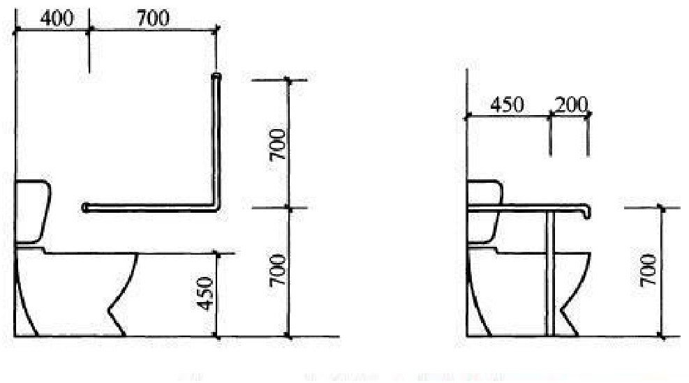  
图3-5 坐式便器及安全抓杆  

3.9.3 无障碍厕所的无障碍设计应符合下列规定：  

1 位置宜靠近公共厕所，应方便乘轮椅者进入和进行回转，回转直径不小于1.50m;  

2 面积不应小于 $4 . 0 0 \ \mathrm { m } ^ { 2 }$ ；  

3 当采用平开门，门扇宜向外开启，如向内开启，需在开启后留有直径不小于 1.50m 的轮椅回转空间，门的通行净宽度不应小于 $8 0 0 \mathrm { m m }$ ，平开门应设高 900mm 的横扶把手，在门扇里侧应采用门外可紧急开启的门锁；  

4 地面应防滑、不积水；  

5 内部应设坐便器、洗手盆、多功能台、挂衣钩和呼叫按钮；  

6 坐便器应符合本规范第 3.9.2 条的有关规定，洗手盆应符合本规范第 3.9.4 条的有关规定；  

7 多功能台长度不宜小于 $7 0 0 \mathrm { m m }$ ，宽度不宜小于400mm ，高度宜为 600mm；  

8 安全抓杆的设计应符合本规范第 3.9.4 条的有关规定；  

9 挂衣钩距地高度不应大于 1.20m；  

10 在坐便器旁的墙面上应设高 $4 0 0 \mathrm { m m } - 5 0 0 \mathrm { m m }$ 的救助呼叫按钮；  

11 入口应设置无障碍标志，无障碍标志应符合本规范第 3.16 节的有关规定。  

# ▲条文说明  

此处的无障碍厕所是无性别区分、男女均可使用的小型厕所。可以在家属的陪同下进入，它的方便性受到了各种人群的欢迎。尽量设在公共建筑中通行方便的地段，也可靠近公共厕所，并用醒目的无障碍标志给予区分。这种厕所的面积要大于无障碍专用厕位。  

3.9.4 厕所里的其他无障碍设施应符合下列规定：  

1 无障碍小便器下口距地面高度不应大于 400mm，小便器两侧应在离墙面 250mm 处，设高度为 1.20m 的垂直安全抓杆，并在离墙面 550mm 处，设高度为 900mm 水平安全抓杆，与垂直安全抓杆连接；  

2 无障碍洗手盆的水嘴中心距侧墙应大于 $5 5 0 \mathrm { m m }$ ，其底部应留出宽 750mm、高 650mm、深 450mm 供乘轮椅者膝部和足尖部的移动空间，并在洗手盆上方安装镜子，出水龙头宜采用杠杆式水龙头或感应式自动出水方式；  

3 安全抓杆应安装牢固，直径应为 $3 0 \mathrm { m m } \ - \ 4 0 \mathrm { m m }$ ，内侧距墙不应小于40mm；  

4 取纸器应设在坐便器的侧前方，高度为 $4 0 0 \mathrm { { m m \mathrm { ~ - ~ } } }$ 500mm。  

# 条文说明  

本条规定了厕所里的其他无障碍设施的做法。  

第1 款 低位小便器的两侧和上部设置安全抓杆，主要是供使用者将胸部靠住，使重心更为稳定。  

第 2 款 无障碍洗手盆的安全抓杆可做成落地式和悬挑式两种，但要方便乘轮椅者靠近洗手盆的下部空间。水龙头的开关应方便开启，宜采用自动感应出水开关。  

第3 款 安全抓杆设在坐便器、低位小便器、洗手盆的周围，是肢体障碍者保持身体平衡和进行移动不可缺少的安全保护措施。其形式有很多种，一般有水平式、直立式、旋转式及吊环式等。安全抓杆要尽量少占地面空间，使轮椅靠近各种设施，以达到方便的使用效果。安全抓杆要安装牢固，应能承受 100kg 以上的重量。安装在墙上的安全抓杆内侧距墙面不小于 40mm。  

# 3.10 公共浴室  

3.10.1 公共浴室的无障碍设计应符合下列规定：  

1 公共浴室的无障碍设施包括1 个无障碍淋浴间或盆浴间以及1 个无障碍洗手盆；  

2 公共浴室的入口和室内空间应方便乘轮椅者进入和使用，浴室内部应能保证轮椅进行回转，回转直径不小于1.50m；  

3 浴室地面应防滑、不积水；  

4 浴间入口宜采用活动门帘，当采用平开门时，门扇应向外开启，设高 900mm 的横扶把手，在关闭的门扇里侧设高900mm 的关门拉手，并应采用门外可紧急开启的插销；  

5 应设置一个无障碍厕位。  

# 条文说明  

公共播室无障碍设计的要求是出入口、通道、浴间及其设施均应该方便行动不便者通行和使用，公共浴室的浴间有淋浴和盆浴两种，无论是哪种，都应该保证有一个为无障碍浴间，另外无障碍洗手盆也是必备的无障碍设施。地面的做法要求防滑和不积水。浴间的入口最好采用活动的门帘，如采用平开门时，门扇应该向外开启，这样做一是可以节省浴间面积，二是在紧急情况时便于将门打开进行救援。  

# 3.10.2 无障碍淋浴间应符合下列规定：  

1 无障碍淋浴间的短边宽度不应小于1.50m；  
2 浴间坐台高度宜为 450mm，深度不宜小于 450mm；  

3 淋浴间应设距地面高700mm 的水平抓杆和高 1.40m -1.60m 的垂直抓杆；  

4 淋浴间内的淋浴喷头的控制开关的高度距地面不应大于 1.20m；5 毛巾架的高度不应大于 $1 . 2 0 \mathrm { m }$ 。  

3.10.3 无障碍盆浴间应符合下列规定：  

1 在浴盆一端设置方便进入和使用的坐台，其深度不应小于 400mm；  

2 浴盆内侧应设高 600mm 和 900mm 的两层水平抓杆，水平长度不小于 800mm; 洗浴坐台一侧的墙上设高 $9 0 0 \mathrm { m m }$ 、水平长度不小于600mm 的安全抓杆；  

3 毛巾架的高度不应大于 1.20m 。  

# 3.11 无障碍客房  

3.11.1 无障碍客房应设在便于到达、进出和疏散的位置。  

# 条文说明  

无障碍客房应设在便于到达、疏散和进出的位置，比如设在客房区的底层以及靠近服务台、公共活动区和安全出口的位置，以方便使用者到达客房、参与各种活动及安全疏散。3.11.2 房间内应有空间能保证轮椅进行回转，回转直径不小于 1.50m。  

$\blacktriangle$ 条文说明  

客房内需要留有直径不小于1.50m 的轮椅回转空间，可以将通道的宽度做到不小于 1.50m，因为通道是客房使用者开门、关门及通行与活动的枢纽，在通道内存取衣物和从通道进入卫生间，也可以在客房床位的一侧留有直径不小于1.50m 的轮椅回转空间，以方便乘轮椅者料理各种相关事务。3.11.3 无障碍客房的门应符合本规范第3.5 节的有关规定。3.11.4 无障碍客房卫生间内应保证轮椅进行回转，回转直径不小于 1.50m，卫生器具应设置安全抓杆，其地面、门、内部设施应符合本规范第 3.9.3 条、第 3.10.2 条及第3.10.3 条的有关规定。  

3.11.5 无障碍客房的其他规定：  

1 床间距离不应小于 1.20m；2 家具和电器控制开关的位置和高度应方便乘轮椅者靠近和使用，床的使用高度为 450mm；3 客房及卫生间应设高 $4 0 0 \mathrm { m m } - 5 0 0 \mathrm { m m }$ 的救助呼叫按钮；4 客房应设置为听力障碍者服务的闪光提示门铃。  

# 条文说明  

客房床面的高度、坐便器的高度、浴盆或淋浴座椅的高度，应与标准轮椅坐高一致，以方便乘轮椅者进行转移。在卫生间及客房的适当部位，需设救助呼叫按钮。  

# 3.12 无障碍住房及宿舍  

3.12.1 户门及户内门开启后的净宽应符合本规范第 3.5 节的有关规定。  
3.12.2 通往卧室、起居室（厅）、厨房、卫生间、储藏室及阳台的通道应为无障碍通道，并按照本规范第3.8 节的要求在一侧或两侧设置扶手。  

# 条文说明  

3.12.1 、3.12.2 无障碍住房及宿舍户门及内门的设计要满足轮椅的通行要求。户内、外通道要满足无障碍的要求，达到方便、安全、便捷。在很多设计中，阳台的地坪与居室存在高差，或地面上安装有落地门框影响无障碍通行，可采取设置缓坡和改变阳台门安装方式来解决。3.12.3 浴盆、淋浴、坐便器、洗手盆及安全抓杆等应符合本规范第 3.9 节、第3.10 节的有关规定。  

# 条文说明  

室内卫生间是极容易出现跌倒事故的地方，设计中要为使用者提供方便牢固的安全抓杆，并根据这些配置的要求调整洁具之间的距离。  

# 3.12.4 无障碍住房及宿舍的其他规定：  

1 单人卧室面积不应小于 $7 . 0 0 \mathrm { ~ m } ^ { 2 }$ ，双人卧室面积不应小于 $1 0 . 5 0 \mathrm { ~ m } ^ { 2 }$ ，兼起居室的卧室面积不应小于 $1 6 . 0 0 \mathrm { m } ^ { 2 }$ ，起居室面积不应小于 $1 4 . 0 0 \mathrm { ~ m } ^ { 2 }$ ，厨房面积不应小于 $6 . 0 0 \ \mathrm { m } ^ { 2 }$ ；  

2 设坐便器、洗浴器（浴盆或淋浴）、洗面盆三件卫生洁具的卫生间面积不应小于 $4 . 0 0 \ \mathrm { m } ^ { 2 }$ ；设坐便器、洗浴器二件卫生洁具的卫生间面积不应小于 $3 . \ 0 0 \ \mathrm { m } ^ { 2 }$ ；设坐便器、洗面盆二件卫生洁具的卫生间面积不应小于 $2 . 5 0 \ \mathrm { m } ^ { 2 }$ ；单设坐便器的卫生间面积不应小于 $2 . \ 0 0 \ \mathrm { m } ^ { 2 }$ ；  

3 供乘轮椅者使用的厨房，操作台下方净宽和高度都不应小于650mm，深度不应小于250mm；  

4 居室和卫生间内应设求助呼叫按钮；  

5 家具和电器控制开关的位置和高度应方便乘轮椅者靠近和使用；  

6 供听力障碍者使用的住宅和公寓应安装闪光提示门铃。  

# 条文说明  

根据无障碍使用人群的分类，在居住建筑的套内空间，有目的地设置相应的无障碍设施；若设计时还不能确认使用者的类型，则所有设施要按照规范一次设计到位。室内各使用空间的面积都略大于现行国家标准《住宅设计规范》 GB50096 - 1999 中相应的最低面积标准，为轮椅通行和停留提供一定的空间。无障碍宿舍的设施和家具一般都是一次安装到位的，所有的要求需按照本规范详细执行。  

# 3.13 轮椅席位  

3.13.1 轮椅席位应设在便于到达疏散口及通道的附近，不  

得设在公共通道范围内。  

# 条文说明  

轮椅席位应设在出入方便的位置，如靠近疏散口及通道的位置，但不应影响其他观众席位，也不应妨碍公共通道的通行，其通行路线要便捷，要能够方便地到达休息厅和有无障碍设施的公共厕所。轮椅席位可以集中设置，也可以分地段设置，平时也可以用作安放活动座椅等使用。3.13.2 观众厅内通往轮椅席位的通道宽度不应小于1.20m。3.13.3 轮椅席位的地面应平整、防滑，在边缘处宜安装栏杆或栏板。  

# 条文说明  

影剧院、会堂等观众厅的地面有一定坡度，但轮椅席位的地面要平坦，否则轮椅倾斜放置会产生不安全感。为了防止乘轮椅者和其他观众座椅碰撞，在轮椅席位的周围宜设置栏杆或栏板，但也不应遮挡他人的视线。  

3.13.4 每个轮椅席位的占地面积不应小于 $1 . \ 1 0 \mathrm { m } * 0 . \ 8 0 \mathrm { m } .$  

# 条文说明  

轮椅席的深度为 1.10m，与标准轮椅的长度基本一致，一个轮椅席位的宽度为 800mm，是乘轮椅者的手臂推动轮椅时所需的最小宽度。3.13.5 在轮椅席位上观看演出和比赛的视线不应当收到遮挡，但也不应遮挡他人的视线。  

3.13.6 在轮椅席位旁或在邻近的观众席内宜设置 1:1 的陪护席位。  

# 条文说明  

考虑到乘轮椅者大多有人陪伴出行，为方便陪伴的人在其附近。轮椅席位旁宜设置一定数量的陪护席位，陪护席位也可以设置在附近的观众席内。3.13.7 轮椅席位处地面上应该设置无障碍标志，无障碍标志应符合本规范第 3.16 节的有关规定。  

# 3.14 无障碍机动车停车位  

3.14.1 应将通行方便、行走距离路线最短的停车位设为无障碍机动车停车位。  

# 条文说明  

无论设置在地上或是地下的停车场地，应将通行方便、距离出入口路线最短的停车位安排为无障碍机动车停车位，如有可能宜将无障碍机动车停车位设置在出入口旁。3.14.2 无障碍机动车停车位的地面应平整、防滑、不积水，地面坡度不应大于 1:50。3.14.3 无障碍机动车停车位一侧，应设宽度不小于 1.20m的通道，供乘轮椅者从轮椅通道直接进入人行道和无障碍入口。  

# 条文说明  

停车位的一侧或与相邻停车位之间应留有宽1.20m 以上的轮椅通道，方便肢体障碍者上下车，相邻两个无障碍机动车停车位可共用一个轮椅通道。3.14.4 无障碍机动车停车位的地面应涂有停车线、轮椅通道线和无障碍标志。  

# 3.15 低位服务设施  

3.15.1 设置低位服务设施的范围包括问询台、服务窗口、电话台、安检验证台、行李托运台、借阅台、各种业务台、饮水机等。  
3.15.2 低位服务设施上表面距地面高度宜为 $7 0 0 \mathrm { m m } - 8 5 0 \mathrm { m m } .$ ，其下部宜至少留出宽 750mm，高 $6 5 0 \mathrm { m m }$ ，深 450mm 供乘轮椅者膝部和足尖部的移动空间。  
3.15.3 低位服务设施前应有轮椅回转空间，回转直径不小于 1.50m 。  
3.15.4 挂式电话离地不应高于 900mm 。  

# 条文说明  

3.15.1、3.15.4 低位服务设施可以使乘轮椅人士或身材较矮的人士方便地接触和使用各种服务设施。除了要求它的上表面距地面有一定的高度以外，还要求它的下方有足够的空间，以便于轮椅接近。它的前方应留有轮椅能够回转的空间。  

# 3.16 无障碍标识系统、信息无障碍  

3.16.1 无障碍标志应符合下列规定：  

1 无障碍标志包括下列几种:  

1) 通用的无障碍标志应符合本规范附录 A 的规定；2) 无障碍设施标志牌符合本规范附录B 的规定；3) 带指示方向的无障碍设施标志牌符合本规范附录C 的规定。  

2 无障碍标志应醒目，避免遮挡。  

3 无障碍标志应纳入城市环境或建筑内部的引导标志系统，形成完整的系统，清楚地指明无障碍设施的走向及位置。  

# 条文说明  

通用的无障碍标志是选用现行国家标准《标志用公共信息图形符号第 9 部分：无障碍设施符号》GB/T 10001.9 -2008中的无障碍设施标志。通用的无障碍标志和图形的大小与其观看的距离相匹配，规格为 $1 0 0 \mathrm { { m m } * 1 0 0 \mathrm { { m m } \mathrm { { ~ - ~ } \ 4 0 0 \mathrm { { m m } * 4 0 0 \mathrm { { m m } _ { \mathrm { { c } } } } } } } }$ 。为了清晰醒目，规定了采用两种对比强烈的颜色，当标志牌为白色衬底时，边框和轮椅为黑色；标志牌为黑色衬底时，边框和轮椅为白色。轮椅的朝向应与指引通行的走向保持一致。  

无障碍设施标志牌和带指示方向的无障碍设施标志牌也是无障碍标志的组成部分，设置的位置应该能够明确地指引人们找到所需要使用的无障碍设施。  

# 3.16.2 盲文标志应符合下列规定：  

1 盲文标志可分成盲文地图、盲文铭牌、盲文站牌；  
2 盲文标志的盲文必须采用国际通用的盲文表示方法。  

# 条文说明  

盲文地图设在城市广场、城市绿地和公共建筑的出入口，方便视觉障碍者出行和游览；盲文铭牌主要用于无障碍电梯的低位横向按钮、人行天桥和人行地道的扶手、无障碍通道的扶手、无障碍楼梯的扶于等部位，帮助视觉障碍者辨别方向；盲文站牌设置在公共交通的站台上，引导视觉障碍者乘坐公共交通。  

# 3.16.3 信息无障碍应符合下列规定：  

1 根据需求，因地制宜设置信息无障碍的设备和设施，使人们便捷地获取各类信息；2 信息无障碍设备和设施位置和布局应合理。  

# 条文说明  

信息无障碍是指无论健全人还是行动障碍者，无论年轻人还是老年人，无论语言文化背景和教育背景如何，任何人在任何情况下都能平等、方便、无障碍地获取信息或使用通常的沟通手段利用信息。  

在获取信息方面，视觉障碍者是最弱的群体，因此应给视觉障碍者提供更好的设备和设施来满足他们的日常生活需要。其中为视觉障碍者服务的设施包括盲道、盲文标识、语音提示导盲系统（听力补偿系统）、盲人图书室（角）等，为视觉障碍者服务的设备包括便携导盲定位系统、无障碍网站和终端设备、读屏软件、助视器、信息家居设备等。为视觉障碍者服务的设施应与背景形成鲜明的色彩对比。  

盲道的设置位置具体见本规范的其他章节。盲文标识一般设置在视觉障碍者经常使用的建筑物的楼层示意图、楼梯、扶手、电梯按钮等部位。音响信号适用于城市交通系统。视觉障碍者图书室（角）是为视觉障碍者提供的专门获取信息的公共场所，应提供无障碍终端设备、读屏软件、助视器等设施。便携导盲定位系统是为视觉障碍者提供出行定位的好帮手，可以利用于机、盲枝等载体。为视觉障碍者服务的信息家居设备主要包括鸣响的水壶等生活设施。  

为听觉障碍者服务的设施包括电子显示屏、同步传声助听设备、提示报警灯（音响频闪显示灯），为听觉障碍者服务的设备包括视频手语、助听设备、可视电话、信息家居设备等。  

电子显示屏应设置在城市道路和建筑物明显的位置，便于人们在第一时间获取信息。同步传声助昕设备是在建筑物中设置的一套音响加强传递系统，听觉障碍者持终端即可接昕信息。提示报警灯（音响频闪显示灯）是为人员逃生时指示方向使用的，应设置在疏散路线上，同时应伴有语音提示。另外建议在有视频的地方加设视频手语解说，家居方面设置可视对讲门禁、提示报警灯等设备。  

为全社会服务的设施应包括标识、标牌、楼层示意图、语音提示系统、电子显示屏、语言转换系统等。信息无障碍设施并非只适用于无障碍人士，实际它使我们社会上的每个人都在受益。  

信息无障碍的发展是全社会文明的标志，是社会进步的缩影。信息无障碍应使任何人在任何地点都能享受到信息的服务。如清晰的标识和标牌使一些初到陌生地方的人或语言障碍的外国人能准确找到目标。  

标识和标牌安装的位置应统一，主要设置在人们行走时需要做出决定的地方，并且标识和标牌大小、图案应规范，避免安装在阴影区或者反光的地方，并且和周围的背景应有反差。楼层示意图应布置在建筑入口和电梯附近，宜同时附有盲文和语音提示设施。  

# 4 城市道路  

# 4.1 实施范围  

4.1.1 城市道路无障碍设计的范围应包括：  

1 城市各级道路；  

2 城镇主要道路；  
3 步行街；  
4 旅游景点、城市景观带的周边道路。  

# 条文说明  

城市道路进行无障碍设计的范围包括主干路、次干路、支路等城市各级道路，郊区、区县、经济开发区等城镇主要道路，步行街等主要商业区道路，旅游景点、城市景观带等周边道路，以及其他有无障碍设施设计需求的各类道路，确保城市道路范围内无障碍设施布置完整，构建无障碍物质环境。  

4.1.2 城市道路、桥梁、隧道、立体交叉中人行系统均应进行无障碍设计，无障碍设施应沿行人通行路径布置。  

4.1.3 人行系统中的无障碍设计主要包括人行道、人行横道、人行天桥及地道、公交车站。  

# 条文说明  

4.1.2、4.1.3 城市道路涉及人行系统的范围均应进行无障碍设计，不仅对无障碍设计范围给予规定，并进一步对城市道路应进行无障碍设计的位置提出要求，便于设计人员及建设部门进行操作。  

# 4.2 人行道  

# 4.2.1 人行道处缘石坡道设计应符合下列规定：  

1 人行道在各种路口、各种出入口位置必须设置缘石坡道；2 人行横道两端必须设置缘石坡道。  

# 条文说明  

第1 款 人行道是城市道路的重要组成部分，人行道在路口及人行横道处与车行道如有高差，不仅造成乘轮椅者的通行困难，也会给人行道上行走的各类群体带来不便。因此，人行道在交又路口、街坊路口、单位出入口、广场出入口、人行横道及桥梁、隧道、立体交叉范围等行人通行位置，通行线路存在立缘石高差的地方，均应设缘石坡道，以方便人们使用。  

第2 款 人行横道两端需设置缘石坡道，为肢体障碍者及全社会各类人士作出提示，方便人们使用。  

4.2.2 人行道处盲道设置应符合下列规定：  

1 城市主要商业街、步行街的人行道应设置盲道；2 视觉障碍者集中区域周边道路应设置盲道；3 坡道的上下坡边缘处应设置提示盲道；4 道路周边场所、建筑等出入口设置的盲道应与道路盲道相衔接。  

# 条文说明  

第 1、2 款 盲道及其他信息设施的布置，要为盲人通行的连续性和安全性提供保证。因此在城市主要商业街、步行街的人行道及视觉障碍者集中区域(指视觉障碍者人数占该区域人数比例 $1 . 5 \%$ 以上的区域，如盲人学校、盲人工厂、医院等)的人行道需设置盲道，协助盲人通过盲杖和脚感的触觉，方便安全地行走。  

第3 款 披道的上下坡边缘处需设置提示盲道，为视觉障碍者及全社会各类人士作出提示，方便人们使用。  

4.2.3 人行道的轮椅坡道设置应符合下列规定：  

1 人行道设置台阶处，应同时设置轮椅坡道；  

2 轮椅坡道的设置应避免干扰行人通行及其他设施的使用。  

# 条文说明  

要满足轮椅在人行道范围通行无障碍，要求人行道中设有台阶的位置，同时应设有坡道，以方便各类人群的通行。坡道设置时应避免与行人通行产生矛盾，在设施布置时，尽量避免轮椅坡道通行方向与行人通行方向产生交叉，尽可能使两个通行流线相平行。  

4.2.4 人行道处服务设施设置应符合下列规定：  

1 服务设施的设置应为残障人士提供方便；  

2 宜为视觉障碍者提供触摸及音响一体化信息服务设施；  

3 设置屏幕信息服务设施，宜为听觉障碍者提供屏幕手语及字幕信息服务；  

4 低位服务设施的设置，应方便乘轮椅者使用；5 设置休息座椅时，应设置轮椅停留空间。  

# 条文说明  

人行道范围内的服务设施是无障碍设施的重要部分，是保证残障人士平等参与社会活动的重要保障设施，服务设施宜针对视觉障碍者、听觉障碍者及肢体障碍者等不同类型的障碍者分别进行考虑，满足各类行动障碍者的服务需求。  

# 4.3 人行横道  

4.3.1 人行横道范围内的无障碍设计应符合下列规定：  

1 人行横道宽度应满足轮椅通行需求；2 人行横道安全岛的形式应方便乘轮椅者使用；3 城市中心区及视觉障碍者集中区域的人行横道，应配置过街音响提示装置。  

# 条文说明  

第1 款 人行横道设置时，人行横道的宽度要满足轮椅通行的需求。在医院、大剧院、老年人公寓等特殊区域，由于轮椅使用数量相对较多，人行横道的宽度还要考虑满足一定数量轮椅同时通行的需求，避免产生安全隐患。  

第2 款 人行横道中间的安全岛，会有高出车行道的情况，影响了乘轮椅者的通行，因此安全岛设置需要考虑与车行道同高或安全岛两侧设置缘石坡道，并从通行宽度方面给予要求，从而方便乘轮椅者通行。  

第3 款 音响设施需要为视觉障碍者的通行提供有效的帮助，在路段提供是否通行和还有多长的通行时间等信息，在路口还需增加通行方向的信息。通过为视觉障碍者提供相关的信息，保证他们过街的安全性。  

# 4.4 人行天桥及地道  

4.4.1 盲道的设置应符合下列规定:  

1 设置于人行道中的行进盲道应与人行天桥及地道出入口处的提示盲道相连接;  

2 人行天桥及地道出入口处应设置提示盲道;  

3 距每段台阶与坡道的起点与终点 $2 5 0 \mathrm { m m } - 5 0 0 \mathrm { m m }$ 处应设提示盲道，其长度应与坡道、梯道相对应。  

# 条文说明  

人行天桥及地道出入口处需设置提示盲道，针对行进规律的变化及时为视觉障碍者提供警示。同时当人行道中有行进盲道时，应将其与人行天桥及人行地道出入口处的提示盲道合理衔接，满足视觉障碍者的连续通行需求。  

4.4.2 人行天桥及地道处坡道与无障碍电梯的选择应符合下列规定：  

1 要求满足轮椅通行需求的人行天桥及地道处宜设置坡道，当设置坡道有困难时，应设置无障碍电梯；  

2 坡道的净宽度不应小于 2.00m；3 坡道的坡度不应大于1:12；4 弧线形坡道的坡度，应以弧线内缘的坡度进行计算；5 坡道的高度每升高 1. 50m 时，应设深度不小于2.00m的中间平台；6 坡道的坡面应平整、防滑。  

# 条文说明  

人行天桥及地道的设计，在场地条件允许的情况下，应尽可能设置坡道或无障碍电梯。当场地条件存在困难时，需要根据规划条件，在进行交通分析时，对行人服务对象的需求进行分析，从道路系统与整体环境要求的高度进行取舍判断。  

人行天桥及地道处设置坡道，方便乘轮椅者及全社会各类人士的通行，当设坡道有困难时可设无障碍电梯，构成无障碍环境，完成无障碍通行。无障碍电梯需求量大或条件允许时，也可进行无障碍电梯设置，满足乘轮椅者及全社会各类人士的通行需求，提高乘轮椅者及全社会各类人士的通行质量。  

人行天桥及地道处的坡道设置，是为了方便乘坐轮椅者能够靠自身力量安全通行。弧线形坡道布置，坡道两侧的长度不同，形成的坡度有差异，因此对坡道的设计提出相应的指标控制要求。  

4.4.3 扶手设置应符合下列规定：  

1 人行天桥及地道在坡道的两侧应设扶手，扶手宜设  

# 上、下两层；  

2 在栏杆下方宜设置安全阻挡措施；  
3 扶手起点水平段宜安装盲文铭牌。  

# 条文说明  

人行天桥和人行地道设扶手，是为了方便行动不便的人通行，未设扶手的人行天桥及地道，曾发生过老年人和行动障碍者摔伤事故，其原因并非技术、经济上的困难，而是未将扶手作为使用功能来重视。在无障碍设计中，扶手同样是重要设施之一。坡道扶手水平段外侧宜设置盲文铭牌，可使视觉障碍者了解自己所在位置及走向，方便其继续行走。4.4.4 当人行天桥及地道无法满足轮椅通行需求时，宜考虑地面安全通行。  

# 条文说明  

人行天桥及地道处无法满足弱势群体通行需求情况下，可考虑通过地面交通实现弱势群体安全通行的需求，体现无障碍设计的多样化及人性化。4.4.5 人行天桥桥下的三角区净空高度小于 2.00m 时，应安装防护设施，并应在防护设施外设置提示盲道。  

# 条文说明  

人行天桥桥下的三角区，对于视觉障碍者来说是一个危  

险区域,容易发生碰撞，因此应在结构边缘设置提示盲道，避免安全隐患。  

# 4.5 公交车站  

4.5.1 公交车站处站台设计应符合下列规定：  

1 站台有效通行宽度不应小于1.50m；  

2 在车道之间的分隔带设公交车站时应方便乘轮椅者使用。  

# 条文说明  

公交车站处站台有效宽度应满足轮椅通行与停放的要求，并兼顾其他乘客的通行，当公交车站设在车道之间的分隔带上时，为了使行动不便的人穿越非机动车道，安全地到达分隔带上的公交候车站，应在穿行处设置缘石坡道，缘石坡道应与人行横道相对应。  

4.5.2 盲道与盲文信息布置应符合下列规定：  

1 站台距路缘石 $2 5 0 \mathrm { m m } - 5 0 0 \mathrm { m m }$ 处应设置提示盲道，其长度应与公交车站的长度相对应；2 当人行道中设有盲道系统时，应与公交车站的盲道相连接；3 宜设置盲文站牌或语音提示服务设施，盲文站牌的位置、高度、形式与内容应方便视觉障碍者的使用。  

# 条文说明  

在我国，视觉障碍者的出行，如上班、上学、购物、探亲、访友、办事等主要靠公共交通，因此解决他们出门找到车站和提供交通换乘十分重要，为了视觉障碍者能够方便到达公交候车站、换乘公交车辆，需要在候车站范围设置提示盲道和盲文站牌。  

在公交候车站铺设提示盲道主要方便视觉障碍者了解候车站的位置，人行道中有行进盲道时，应与公共车站的提示盲道相连接。  

为了给视觉障碍者提供更好的公交站牌信息，在城市主要道路和居住区的公交车站，应安装盲文站牌或有声服务设施，言文站牌的设置，既要方便视觉障碍者的使用，又要保证安全，防止且不易被人破坏。  

# 4.6 无障碍标识系统  

4.6.1 无障碍设施位置不明显时，应设置相应的无障碍标识系统。  
4.6.2 无障碍标志牌应沿行人通行路径布置，构成标识引导系统。  
4.6.3 无障碍标志牌的布置应与其他交通标志牌相协调。  

# 条文说明  

4.6.1、4.6.3 凡设有无障碍设施的道路人行系统中，为了能更好地为残障人士服务，并易于被残障人土所识别，应在无障码设计地点显著位置上安装符合我国国家标准的无障碍标志牌，标志牌应反映一定区域范围内的无障碍设施分布情况，并提示现况位置。无障碍标识的布置，应根据指示、引导和确认的需求进行设计，沿通行路径布置，构成完整引导系统。  

悬挂醒目的无障碍标志，一是使用者一目了然，二是告知无失人员不要随意占用。城市中的道路交通，应尽可能提供多种标志和信息源，以适合各种残障人士的不同要求。  

无障碍设施标志牌可与其他交通设施标志牌协调布置，更好地为道路资源使用者服务。  

# 5 城市广场  

# 5.1 实施范围  

5.1.1 城市广场进行无障碍设计的范围应包括下列内容:  

1 公共活动广场；  
2 交通集散广场。  

# 条文说明  

城市广场的无障碍设计范围是根据《城市道路设计规范》CJJ37 中城市广场篇的内容而定，并把它们分成公共活动广场和交通集散广场两大类。城市广场是人们休闲、娱乐的场所，为了使行动不便的人能与其他人一样平等地享有出行和休闲的权利，平等地参社会活动，应对城市广场进行无障碍设计。  

# 5.2 实施部位和设计要求  

5.2.1 城市广场的公共停车场的停车数在 50 辆以下时应设置不少于 1 个无障碍机动车停车位，100 辆以下时应设置不少于 2 个无障碍机动车停车位，100 辆以上时应设置不少于总停车数 $2 \%$ 的无障碍机动车停车位。  

# $\blacktriangle$ 条文说明  

随着我国机动车保有量的增大，乘轮椅者乘坐及驾驶机动车出游的几率也随之增加。因此，在城市广场的公共停车场应设置一定数量的无障碍机动车停车位。无障碍机动车停车位的数量应当据停车场地大小而定。  

5.2.2 城市广场的地面应平整、防滑、不积水。  

5.2.3 城市广场盲道的设置应符合下列规定：  

1 设有台阶或坡道时，距每段台阶与坡道的起点与终点$2 5 0 \mathrm { m m } \textrm { -- } 5 0 0 \mathrm { m m }$ 处应设提示盲道，其长度应与台阶、坡道相对应，宽度应为 $2 5 0 \mathrm { { m m } \mathrm { ~ - ~ } \ 5 0 0 \mathrm { { m m } ; } }$ ；  

2 人行道中有行进盲道时，应与提示盲道相连接。  

5.2.4 城市广场的地面有高差时坡道与无障碍电梯的选择应符合下列规定：  

1 设置台阶的同时应设置轮椅坡道；  

2 当设置轮椅坡道有困难时，可设置无障碍电梯。5.2.5 城市广场内的服务设施应同时设置低位服务设施。5.2.6 男、女公共厕所均应满足本规范第 8.13 节的有关规定。5.2.7 城市广场的无障碍设施的位置应设置无障碍标志，无障碍标志应符合本规范第 3.16 节的有关规定，带指示方向的无障碍设施标志牌应与无障碍设施标志牌形成引导系统，满足通行的连续性。  

# 条文说明  

广场的无障碍设施处应设无障碍标志，带指示方向的无障设施标志牌应与无障碍设施标志牌形成引导系统，满足通行的连性。  

# 6 城市绿地  

# 6.1 实施范围  

6.1.1 城市绿地进行无障碍设计的范围应包括下列内容：  

1 城市中的各类公园，包括综合公园、社区公园、专类公园、带状公园、街旁绿地等；  

2 附属绿地中的开放式绿地；  

3 对公众开放的其他绿地。  

条文说明  

在高速城市化的建设背景下，城市绿地与人们日常生活的关系日益紧密，是现代城市生活中人们亲近自然、放松身心、体闲健身使用频率最高的公共场所。随着其日常使用频率的加大，使用对象的增多，城市绿地的无障碍建设显得尤为突出，也成为创建舒适、宜居现代城市必要的基础设施条件之一。  

依据现行行业标准《城市绿地分类标准)CJJ/T85,城市绿地分为城市公园绿地、生产绿地、防护绿地、附属绿地、其他绿地{包括风景名胜区、郊野城市绿地、森林城市绿地、野生动植物园、自然保护区、城市绿化隔离带等)共五类。其中，城市公园绿地、附属绿地以及其他绿地中对公众开放的部分，其建设的宗旨是为人们提供方便、安全、舒适和优美的生活环境，满足各类人群参观、游览、休闲的需要。因此城市绿地的无障碍设施建设是非常重要的；城市绿地的无障碍设施建设应该针对上述范围实施。  

# 6.2 公园绿地  

6.2.1 公园绿地停车场的总停车数在 50 辆以下时应设置不少于 1 个无障碍机动车停车位，100 辆以下时应设置不少于2 个无障碍机动车停车位，100 辆以上时应设置不少于总停车数 $2 \%$ 的无障碍机动车停车位。  

# $\blacktriangle$ 条文说明  

本标准是基于综合性公园绿地设计编写的，其他类型的绿地设计可根据其性质和规模大小参照执行。  

6.2.2 售票处的无障碍设计应符合下列规定：  

1 主要出入口的售票处应设置低位售票窗口；  

2 低位售票窗同前地面有高差时，应设轮椅坡道以及不小于 $1 . 5 0 \mathrm { m } \ast 1 . 5 0 \mathrm { m }$ 的平台；  

3 售票窗口前应设提示盲道，距售票处外墙应为 250mm -  
500mm。  

# 条文说明  

第3 款 窗口前设提示盲道是为了帮助视觉障碍者确定窗口位置。  

6.2.3 出入口的无障碍设计应符合下列规定：  

1 主要出入口应设置为无障碍出入口，设有自动检票设备的出入口，也应设置专供乘轮椅者使用的检票口；  

2 出入口检票口的无障碍通道宽度不应小于1.20m；  

3 出入口设置车挡时，车挡间距不应小于 900mm 。  

# 条文说明  

第1 款 公园绿地主要出入口是游客游园的必经之路，应设置为无障碍出入口以便于行动不便者通行。因为行动障碍者、老人等行动不便的人行进速度较普通游客慢，在节假日或高峰时段游客量急剧增大，游客混行可能引发交通受阻的情况，可设置无障碍专用绿色通道引导游客分流出入，可以避免相互间的干扰，有助于消除发生突发性事件时的安全隐患。  

第 2 款 出入口无障碍专用通道宽度设置不应小于1.20m,以证一辆轮椅和一个人侧身通过，条件允许的情况下，建议将无障专用通道宽度设置为 1.80m,这样可以保证同时通行两辆轮椅。  

第3 款 出入口设置车挡可以有效减少机动车、人力三轮车对人行空间的于扰，但同时应确保游人及轮椅通过，实现出入口的无障碍通行。车挡设置最小间距是为了保证乘轮椅者通过，车挡前后需设置轮椅回转空间，供乘轮椅者调整方向。  

# 6.2.4 无障碍游览路线应符合下列规定：  

1 无障碍游览主园路应结合公园绿地的主路设置，应能到达部分主要景区和景点，并宜形成环路，纵坡宜小于 $5 \%$ ，山地公园绿地的无障碍游览主园路纵坡应小于 $8 \%$ ；无障碍游览主园路不宜设置台阶、梯道，必须设置时应同时设置轮椅坡道；  

2 无障碍游览支园路应能连接主要景点，并和无障碍游览主园路相连，形成环路；小路可到达景点局部，不能形成环路时，应便于折返，无障碍游览支园路和小路的纵坡应小于 $8 \%$ ；坡度超过 $8 \%$ 时，路面应作防滑处理，并不宜轮椅通行；  

3 园路坡度大于 $8 \%$ 时，宜每隔 $1 0 . \ 0 0 \mathrm { m } \ - 2 0 . \ 0 0 \mathrm { m }$ 在路旁设置休息平台；4 紧邻湖岸的无障碍游览园路应设置护栏，高度不低于900mm；5 在地形险要的地段应设置安全防妒设施和安全警示线；6 路面应平整、防滑、不松动，园路上的窖井盖板应与路面平齐，排水沟的滤水箅子孔的宽度不应大于15mm。  

# 条文说明  

中国园林大多为自然式山水园，公园也以山水园林居多，地形高差变化较大，山形水系丰富。因此实现所有道路、景点无障碍游览是很困难的，这就需要在规划设计阶段，根据城市绿地的场地条件以及城市园林规划部门意见来规划专门的游览路线，串联主要景区和景点，形成无障碍游览系统，以实现大部分景区的无障碍游览。无障碍游览路线的设置目的一方面是为了让乘轮椅者能够游览主要景区或景点，另一方面是为老年人、体弱者等行动不便的人群在游园时提供方便，提高游园的舒适度。无障碍游览路线包括无障碍主园路、无障碍支园路或无障碍小路。  

第1 款 无障碍游览主园路是无障碍游览路线的主要组成部分，它连接城市绿地的主要景区和景点，保证所有游人的通行。无障碍游览主园路人流量大，除场地条件受限的情况外，设计时应结合城市绿地的主园路设置，避免重复建设。无障碍游览主园路的设置应与无障碍出入口相连，一般应独立形成环路，避免游园时走回头路，在条件受限时，也可以通过无障碍游览支园路形成环路。根据《城市绿地设计规范》GB50420-2007,“主路纵坡宜小于 $8 \% \dots \dots$ 山地城市绿地的园路纵坡应小于 $12 \% ^ { \mathfrak { n } }$ 。考虑到在城市绿地中轮椅长距离推行的情况，无障碍游览主园路的坡度定为，既能满足一部分乘轮椅者在无人帮助的条件下独立通行，也可以使病弱及老年人通行更舒适和安全。山地城市绿地在用地受限制，实施有困难的同部地段，无障碍游览主园路纵坡应小于 $8 \%$ 。  

第2 款 无障碍游览支园路和小路是无障碍游览路线的重要组成部分，应能够引导游人到达城市绿地局部景点。无障碍游览支园路应能与无障碍游览主园路连接，形成环路；无障碍游览小路不能形成环路时，尽端应设置轮椅回转空间以便于轮椅掉头。通行轮椅的小路的宽度不小于1.20m。  

第3 款 当园路的坡度大于 $8 \%$ 时，考虑到园林景观的需求，建议每隔 $1 0 . \ 0 0 \mathrm { m } { - 2 0 } . \ 0 0 \mathrm { m }$ 设置一处体息平台，以供行动不便的人短暂停留、休息。  

第4 款 乘轮椅者的视线水平高度一般为1.10m,为防止乘轮椅者沿湖观景时跌落水中，安全护栏不应低于 900mm。  

第5 款 在地形险要路段设置安全警示线可以起到提示作用，提示游人尤其是视觉障碍者危险地段的位置，设置安全护栏可以防止发生跌落、倾覆、侧翻事故。  

第 6 款 不平整和松动的地面会给轮椅的通行带来困难，积水地面和软硬相间的铺装给拄拐杖者的通行带来危险，因此无障碍游览园路的路面应平整、防滑、不松动。。  

6.2.5 游憩区的无障碍设计应符合下列规定：  

1 主要出入口或无障碍游览园路沿线应设置一定面积的无障碍游憩区;  

2 无障碍游憩区应方便轮椅通行，有高差时应设置轮椅坡道，地面应平整、防滑、不松动；  

3 无障碍游憩区的广场树池宜高出广场地面，与广场地面相平的树池应加箅子。  

# 条文说明  

无障碍休憩区是为方便行动不便的游客游园，为其在园内的活动或休憩提供专用的区域，体现以人为本的设计原则。在无障出入口附近或无障碍游览园路沿线设置无障碍游憩可以使行动便的游客便于抵达，并宜设置专用标识以区别普通活动区域。  

第3 款 广场树池高出广场地面，可以防止轮椅掉进树坑，果树池与广场地面相平，加上与地面相平的箅子也可以防止轮椅的行进受到影响。  

6.2.6 常规设施的无障碍设计应符合下列规定：  

1 在主要出入口、主要景点和景区，无障碍游憩区内的游憩设施、服务设施、公共设施、管理设施应为无障碍设施；  

2 游憩设施的无障碍设计应符合下列规定：  

1) 在没有特殊景观要求的前提下，应设为无障碍游憩设施；  

2) 单体建筑和组合建筑包括亭、廊、榭、花架等，若有台明和台阶时，台明不宜过高，入口应设置坡道，建筑室内应满足无障碍通行；  

3) 建筑院落的出入口以及院内广场、通道有高差时，应设置轮椅坡道；有三个以上出入口时，至少应设两个无障碍出入口，建筑院落的内廊或通道的宽度不应小于 1.20m；  

4) 码头与无障碍园路和广场衔接处有高差时应设置轮椅坡道；  

5) 无障碍游览路线上的桥应为平桥或坡度在 $8 \%$ 以下的小拱桥，宽度不应小于1.20m ，桥面应防滑，两侧应设栏杆。桥面与园路、广场衔接有高差时应设轮椅坡道。  

3 服务设施的无障碍设计应符合下列规定：  

1) 小卖店等的售货窗口应设置低位窗口；2) 茶座、咖啡厅、餐厅、摄影部等出入口应为无障碍出入口，应提供一定数量的轮椅席位；3) 服务台、业务台、咨询台、售货柜台等应设有低位服务设施。  

4 公共设施的无障碍设计应符合下列规定：  

1) 公共厕所应满足本规范第 8.13 节的有关规定，大型园林建筑和主要游览区应设置无障碍厕所；  

2) 饮水器、洗手台、垃圾箱等小品的设置应方便乘轮椅者使用；  

3) 游客服务中心应符合本规范第 8.8 节的有关规定；  

4) 休息座椅旁应设置轮椅停留空间。  

5 管理设施的无障碍设计应符合本规范第8.2 节的有关规定。  

# 条文说明  

第2 款 间隔无障游憩设施主要是指为行动不便的人群提供必要的游憩、观赏、娱乐、休息、活动等内容的游憩设施，包括单体建筑、组合建筑、建筑院落、码头、桥、活动场等。  

第 2 款 2) 单体建筑和组合建筑均应符合无障碍设计的要求。入口有台明和台阶时，台明不宜过高，否则轮椅坡道会较长，甚至影响建筑的景观效果。室内地面有台阶时，应设置满足轮椅通行的坡道。  

第 2 款 3) 院落的出入口、院内广场、通道以及内廊之间应能形成连续的无障碍游线，有高差时，应设置轮椅坡道。为避免迂回，在有三个以上出入口时，应设两个以上无障碍出入口，并在不同方向。院落内廊宽度至少要满足一辆轮椅和一个行人能同时通行，因此宽度不宜小于 $1 . 2 0 \mathrm { m }$ 。  

第 2 款 4) 码头只规定码头与无障碍园路和广场衔接处应满足无障碍设计的规定，连接码头与船台甲板以及甲板与渡船之间的专用设施或通道也应为无障碍的，但因为非本规范适用范围，条文并未列出。  

第 2 款 5) 无障碍游览路线上的园桥在无障碍园路、广场的衔接的地方、桥面的坡度、通行宽度以及桥面做法，应考虑到行动不便的人群的安全需要，桥面两侧应设栏杆。  

第3 款 服务设施包括小卖店、茶座、咖啡厅、餐厅、摄影部以及服务台、业务台、咨询台、售货柜台等，均应满足无障碍设计的要求。  

第4 款公共设施包括公共厕所、饮水器、洗手台、垃圾箱、游客服务中心和休息座椅等，均应满足无障碍设计的要求。  

第5 款管理设施主要是指各种面向游客的管理功能的建筑，如：管理处、派出所等，均应满足无障碍设计的要求。6.2.7 标识与信息应符合下列规定：  

1 主要出入口、无障碍通道、停车位、建筑出入口、公共厕所等无障碍设施的位置应设置无障碍标志，并应形成完整的无障碍标识系统，清楚地指明无障碍设施的走向及位置，无障碍标志应符合第 3.16 节的有关规定；  

2 应设置系统的指路牌、定位导览图、景区景点和园中  

园说明牌；  

3 出入口应设置无障碍设施位置图、无障碍游览图；4 危险地段应设置必要的警示、提示标志及安全警示线。  

# 条文说明  

公园绿地中应尽可能提供多种标志和信息源，以适合不同人群的不同需求。例如：以各种符号和标志帮助行动障碍者，引导其行动路线和到达目的地，使人们最大范围地感知其所处环境的空间状况，缩小各种潜在的、心理上的不安因素。  

# 6.2.8 不同类别的公园绿地的特殊要求：  

1 大型植物园宜设置盲人植物区域或者植物角，并提供语音服务、盲文铭牌等供视觉障碍者使用的设施；  

2 绿地内展览区、展示区、动物园的动物展示区应设置便于乘轮椅者参观的窗口或位置。  

# 条文说明  

第1 款 视觉障碍者可以通过触摸嗅闻和言传而领悟周围环境，感应周围的动物和植物，开阔思想和生活空间，增加生活情趣，感受大自然的赋予，因此大型植物园宜设置盲人植物区域或者植物角，使其游览更为方便和享受其中的乐趣。  

第2 款 各类公园的展示区、展览区也应充分考虑各种人群的不同需要，要使乘坐轮椅者便于靠近围栏或矮围墙，并留出一定数量便于乘坐轮椅者观看的窗口和位置。  

# 6.3 附属绿地  

6.3.1 附属绿地中的开放式绿地应进行无障碍设计。  
6.3.2 附属绿地中的无障碍设计应符合本规范第6.2 节和第  
7.2 节的有关规定。  

# 6.4 其他绿地  

6.4.1 其他绿地中的开放式绿地应进行无障碍设计。  

6.4.2 其他绿地的无障碍设计应符合本规范第6.2 节的有关规定。  

# 7 居住区、居住建筑  

7.1 道路  

7.1.1 居住区道路进行无障碍设计的范围应包括居住区路、小区路、组团路、宅间小路的人行道。  

7.1.2 居住区级道路无障碍设计应符合本规范第4 章的有关规定。  

# 条文说明  

7.1.1、7.1.2 居住区的道路与公共绿地的使用是否便捷，直接影响着居民的日常生活品质。2009 年，我国老龄人口已超过 1.67 亿，且每年以近 800 万的速度增加，以居家为主的人口数量也随之增加。居住区的无障碍建设，满足了老年人、妇女儿童和残障人士出行和生活的无障碍需求，同时也反映了城市化发展以人为本的原则。本章中，道路和公共绿地的分类与《城市居住区规划设计规范)GB50180 一致。  

# 7.2 居住绿地  

7.2.1 居住绿地的无障碍设计应符合下列规定：  

1 居住绿地内进行无障碍设计的范围及建筑物类型包括：出入口、游步道、体理设施、儿童游乐场、休闲广场、健身运动场、公共厕所等；  

2 基地地坪坡度不大于 $5 \%$ 的居住区的居住绿地均应满足无障碍要求，地坪坡度大于 $5 \%$ 的居住区，应至少设置 1 个满足无障碍要求的居住绿地；  

3 满足无障碍要求的居住绿地，宜靠近设有无障碍住房和宿舍的居住建筑设置，并通过无障碍通道到达。  

# 条文说明  

居住绿地是居民日常使用频率最高的绿地类型，在城市绿地中占有较大比重，与城市生活密切相关。老年人、儿童及残障人士日常休憩、活动的主要场所就是居住区内的居住绿地。因此在具备条件的地坪平缓的居住区，所有对居民开放使用的组团绿地、宅间绿地均应满足无障碍要求；对地形起伏大，高差变化复杂的山地城市居住区，很难保证每一块绿地都满足无障碍要求，但至少应有一个开放式组团绿地或宅间绿地应满足无障碍要求。  

7.2.2 出入口应符合下列规定：  

1 居住绿地的主要出入口应设置为无障碍出入口；有 3个以上出入口时，无障碍出入口不应少于2 个；  

2 居住绿地内主要活动广场与相接的地面或路面高差小于 300mm 时，所有出入口均应为无障碍出入口；高差大于300mm 时，当出入口少于 3 个，所有出入口均应为无障碍出入口，当出入口为 3 个或 3 个以上，应至少设置 2 个无障碍出入口；  

3 组团绿地、开放式宅间绿地、儿童活动场、健身运动场出入口应设提示盲道。  

# 条文说明  

第1 款 无障碍出入口的设置位置应方便居民使用，当条件允许时，所有出入口最好都符合无障碍的要求。  

第2 款 居住绿地内的活动广场是老年人、儿童日常活动交流的主要场所，活动广场与相接路面、地面不宜出现高差，因景观需要，设计下沉或抬起的活动广场时，高差不宜大于 300mm,并应采用坡道处理高差，不宜设计台阶；当设计高差大于 300mm 时，至少必须设置一处轮椅坡道，以便轮椅使用者通行；设计台阶时，每级台阶高度不宜大于 120mm,以便老年人及儿童使用。  

第3 款 当居住区的道路设有盲道时，道路盲道应延伸至绿地入口，以便于视觉障碍者前往开放式绿地时掌握绿地的方位和出入口。  

7.2.3 游步道及休憩设施应符合下列规定：  

1 居住绿地内的游步道应为无障碍通道，轮椅园路纵坡不应大于 $4 \%$ ；轮椅专用道不应大于 $8 \%$ ；  

2 居住绿地内的游步道及园林建筑、园林小品如亭、廊、花架等休憩设施不宜设置高于 $4 5 0 \mathrm { m m }$ 的台明或台阶；必须设置时，应同时设置轮椅坡道并在休憩设施入口处设提示盲道；  

3 绿地及广场设置休息座椅时，应留有轮椅停留空间。  

# 条文说明  

第1 款 居住绿地内的游步道，老年人、乘轮椅者及婴儿车的使用频率非常高，为便于上述人群的使用，不宜设置台阶。游道纵坡坡度是依据建设部住宅产业促进中心编写的《居住区环境景观设计导则》(2006 版)，并参考了日本的无障碍设计标准而制定的当游步道因景观需要或场地条件限制，必须设置台阶时，应同时设置轮椅坡道，以保障轮椅通行。  

第 2 款 居住绿地内的亭、廊、橱、花架等园林建筑，是居民、特别是老年人等行动不便者日常休克里交流的主要场所，因而上述休憩设施的地面不宜与周边场地出现高差，以便居民顺利通行进入如因景观需要设置台明、台阶时，必须设置轮椅坡道。  

第3 款 在休息座椅旁要留有适合轮椅停留的空地，以便乘轮椅者安稳休息和交谈，避免轮椅停在绿地的通路上，影响他人行走设置的数量不宜少于总数量的 $1 0 \%$ 。  

7.2.4 活动场地应符合下列规定：  

1 林下铺装活动场地，以种植乔术为主，林下净空不得低于 2.20m；2 儿童活动场地周围不宜种植遮挡视线的树木，保持较好的可通视性，且不宜选用硬质叶片的丛生植物。  

# 条文说明  

第1 款 为保障安全，减少儿童攀爬机会，便于居民活动，林下活动广场应以高大荫浓的乔木为主，分枝点不应小于 2.2m;对于北方地区，应以落叶乔木为主，且应有较大的冠幅，以保障活动广场夏季的遮阳和冬季的光照。  

第2 款 为便于对儿童的监护，儿童活动场周围应有较好的视线，所以在儿童活动场地进行种植设计时，注意保障视线的通透。在儿童活动场地周围种植灌木时，灌木要求选用萌发力强、直立生长的中高型树种，因为矮形灌木向外侧生长的枝条大都在儿童身高范围内，儿童在互相追赶、奔跑嬉戏时，易造成枝折人伤。一些丛生型植物，叶质坚硬，其叶形如剑，指向上方，这类植物如种植在儿童活动场周围，极易发生危险。  

# 7.3 配套公共设施  

7.3.1 居住区内的居委会、卫生站、健身房、物业管理、会所、社区中心、商业等为居民服务的建筑应设置无障碍出入口。设有电梯的建筑至少应设置1 部无障碍电梯；未设有电梯的多层建筑，应至少设置1 部无障碍楼梯。  

7.3.2 供居民使用的公共厕所应满足本规范第 8.13 节的有关规定。  

# 条文说明  

7.3.1、7.3.2 居住区的配套公共建筑需考虑居民的无障碍出行和使用。重点是解决交通和如厕问题。特别是居家的行为障碍者经常光顾和停留的场所，如物业管理、居委会、活动站、商业等建筑是居民近距离地解决生活需求、精神娱乐、人际交往的场所。无障碍设施的便利，能极大地提高居住区的生活品质。  

7.3.3 停车场和车库应符合下列规定：  

1 居住区停车场和车库的总停车位应设置不少于 $0 . 5 \%$ 的无障碍机动车停车位；若设有多个停车场和车库，宜每处设置不少于 1 个无障碍机动车停车位；  

2 地面停车场的无障碍机动车停车位宜靠近停车场的出入口设置。有条件的居住区宜靠近住宅出入口设置无障碍机动车停车位；3 车库的人行出入口应为无障碍出入口。设置在非首层的车库应设无障碍通道与无障碍电梯或无障碍楼梯连通，直达首层。  

# 条文说明  

随着社会经济的飞速发展，居民的机动车拥有量也在不断增加。停车场和车库的无障碍设计，在满足行为障碍者出行的基础上，也为居民日常的购物搬运提供便捷。  

# 7.4 居住建筑  

7.4.1 居住建筑进行无障碍设计的范围应包括住宅及公寓、宿舍建筑（职工宿舍、学生宿舍）等。  

# 条文说明  

居住建筑无障碍设计的贯彻，反映了整体居民生活质量的提高。实施范围涵盖了住宅、公寓和宿舍等多户居住的建筑。商住楼的住宅部分执行本条规定。在独栋、双拼和联排别墅中作为首层单户进出的居住建筑，可根据需要选择使用。  

7.4.2 居住建筑的无障碍设计应符合下列规定：  

1 设置电梯的居住建筑应至少设置 1 处无障碍出入口，通过无障碍通道直达电梯厅；未设置电梯的低层和多层居住建筑，当设置无障碍住房及宿舍时，应设置无障碍出入口；2 设置电梯的居住建筑，每居住单元至少应设置 1 部能直达户门层的无障碍电梯。  

# 条文说明  

第1 款 居住建筑出入口的无障碍坡道，不仅能满足行为障碍者的使用，推婴儿车、搬运行李的正常人也能从中得到方便，使用率很高。入口平台、公共走道和设置无障碍电梯的候梯厅的深度，都要满足轮椅的通行要求。通廊式居住建筑因连通户门间的走廊很长，首层会设置多个出入口，在条件许可的情况下，尽可能多的设置无障碍出入口，以满足使用人群出行的方便，减少绕行路线。  

第2 款 在设有电梯的居住建筑中，单元式居住建筑至少设置部无障碍电梯；通廊式居住建筑在解决无障碍通道的情况下，可以有选择地设置一部或多部无障碍电梯。7.4.3 居住建筑应按每100 套住房设置不少于2 套无障碍住房。  

# 条文说明  

无障碍住房及宿舍的设置，可根据规划方案和居住需要集中设置，或分别设置于不同的建筑中。7.4.4 无障碍住房及宿舍宜建于底层。当无障碍住房及宿舍设在二层及以上且未设置电梯时，其公共楼梯应满足本规范  

# 第 3.6 节的有关规定。  

# 条文说明  

低层(多层)住宅及公寓，因建设条件和资金的限制，很多建筑未设置电梯。在进行无障碍住房设计时，要尽量建于底层，减少无障碍竖向交通的建设量。另外要着重考虑的是，多层居住建筑首层无障碍坡道的设置，使其能真正达到无障碍入户的标准。已建多层居住建筑入口无障碍改造的工作，比高层居住建筑的改造要艰难，多因与原设计楼梯的设置发生矛盾，在新建建筑中要妥善考虑。  

7.4.5 宿舍建筑中，男女宿舍应分别设置无障碍宿舍，每 100套宿舍各应设置不少于 1 套无障碍宿舍；当无障碍宿舍设置在二层以上且宿舍建筑设置电梯时，应设置不少于 1 部无障碍电梯，无障碍电梯应与无障碍宿舍以无障碍通道连接。  

# 条文说明  

无障碍宿舍的设置，是满足行动不便人员参与学习和社会工作的需求。即使明确没有行为障碍者的学校和单位，也要设计至少不少于男女各 1 套无障碍宿舍，以备临时和短期需要，并可根据需要增加设置的套数。7.4.6 当无障碍宿舍内未设置厕所时，其所在楼层的公共厕所至少有1 处应满足本规范3.9.1 条的有关规定或设置无障碍厕所，并宜靠近无障碍宿舍设置。  

# 8 公共建筑  

# 8.1 一般规定  

8.1.1 公共建筑基地的无障碍设计应符合下列规定：  

1 建筑基地的车行道与人行通道地面有高差时，在人行通道的路口及人行横道的两端应设缘石坡道；  

2 建筑基地的广场和人行通道的地面应平整、防滑、不积水；  

3 建筑基地的主要人行通道当有高差或台阶时应设置轮椅坡道或无障碍电梯。  

# 条文说明  

第1 款 建筑基地内的人行道应保证无障碍通道形成环线，并到达每个无障碍出入口。在路口处及人行横道处均应设置缘石坡道，没有人行横道线的路口，优先采用全宽式单面坡缘石坡道。8.1.2 建筑基地内总停车数在 100 辆以下时应设置不少于 1个无障碍机动车停车位，100 辆以上时应设置不少于总停车数 $1 \%$ 的无障碍机动车停车位。  

# $\blacktriangle$ 条文说明  

建筑基地内总停车数是地上、地下停车数量的总合。在建筑基地内应布置一定数量的无障碍机动车停车位是为了满足各类人群无障碍停车的需求，同时也是为了更加合理地  

利用土地资源，在制定总停车的数量与无障碍机动车停车位的数量的比例时力求合理科学。本规范制定的无障碍停车的数量是一个下限标准，各地方可以根据自己实际的情况进行适当地增加。当停车位的数量超过100 辆时，每增加不足 100辆时，仍然需要增加1 个无障碍机动车停车位。  
8.1.3 公共建筑的主要出入口宜设置坡度小于 1:30 的平坡出入口。  
8.1.4 建筑内设有电梯时，至少应设置 1 部无障碍电梯。8.1.5 当设有各种服务窗口、售票窗口、公共电话台、饮水器等时应设置低位服务设施。  
8.1.6 主要出入口、建筑出入口、通道、停车位、厕所电梯等无障碍设施的位置，应设置无障碍标志，无障碍标志应符合本规范第 3.16 节的有关规定；建筑物出入口和楼梯前室宜设楼面示意图，在重要信息提示处宜设电子显示屏。8.1.7 公共建筑的无障碍设施应成系统设计，并宜相互靠近。  

# 8.2 办公、科研、司法建筑  

8.2.1 办公、科研、司法建筑进行无障碍设计的范围包括：政府办公建筑、司法办公建筑、企事业办公建筑、各类科研建筑、社区办公及其他办公建筑等。  

8.2.2 为公众办理业务与信访接待的办公建筑的无障碍设  

施应符合下列规定：  

1 建筑的主要出入口应为无障碍出入口；  

2 建筑出入口大厅、体息厅、贵宾休息室、疏散大厅等人员聚集场所有高差或台阶时应设轮椅坡道，宜提供休息座椅和可以放置轮椅的无障碍休息区；  

3 公众通行的室内走道应为无障碍通道，走道长度大于60.00m 时，宜设休息区，休息区应避开行走路线；  

4 供公众使用的楼梯宜为无障碍楼梯；  

5 供公众使用的男、女公共厕所均应满足本规范第3.9.1 条的有关规定或在男、女公共厕所附近设置 1 个无障碍厕所，且建筑内至少应设置 1 个无障碍厕所，内部办公人员使用的男、女公共厕所至少应各有1 个满足本规范第3.9.1条的有关规定或在男、女公共厕所附近设置1 个无障碍厕所；  

6 法庭、审判庭及为公众服务的会议及报告厅等的公众坐席座位数为300 座及以下时应至少设置1 个轮椅席位，300座以上时不应少于 $0 . 2 \%$ 且不少于2 个轮椅席位。  

# 条文说明  

为公众办理业务与信访接待的办公建筑因其使用的人员复杂，因此应为来访和办理事务的各类人群提供周到完善的无障碍设施。  

建筑的主要出入口最为明显和方便，应尽可能将建筑的主要出入口设计为无障碍出入口。主要人员聚集的场所设置休息座椅时，座椅的位置不能阻碍人行通道，在临近座位旁宜设置一个无障碍休息区，供使用轮椅或者童车、步行辅助器械的人使用。当无障碍通道过长时，行动不便的人需要体息，因此在走道超过 60.00m 处宜设置一个休息处，可以放置座椅和预留轮椅停留空间。法庭、审判庭等建筑内为公众服务的会议及报告厅还应设置轮椅坐席。凡是为公众使用的厕所，都应该满足本规范第3.9 节的有关规定的要录，尽可能设计独立的无障碍厕所，为行动不便的人在家人的照料下使用。  

8.2.3 其他办公建筑的无障碍设施应符合下列规定：  

1 建筑物至少应有 1 处为无障碍出入口，且宜位于主要出入口处；  

2 男、女公共厕所至少各有1 处应满足本规范第 3.9.1条或第3.9.2 条的有关规定；  

3 多功能厅、报告厅等至少应设置 1 个轮椅坐席。  

# 条文说明  

除第 8.2.2 条包括的办公建筑以外，其他办公建筑不论规模大小和级别高低，均应做无障碍设计。尽可能将建筑的主要出入口设计为无障碍出入口，如果条件有限，也可以将其他出入口设计为无障碍出入口，但其位置应明显，并有明确的指示标识。建筑内部也需做必要的无障碍设施。  

# 8.3 教育建筑  

8.3.1 教育建筑进行无障碍设计的范围应包括托儿所、幼儿园建筑、中小学建筑、高等院校建筑、职业教育建筑、特殊教育建筑等。  

8.3.2 教育建筑的无障碍设施应符合下列规定：  

1 凡教师、学生和婴幼儿使用的建筑物主要出入口应为无障碍出入口，宜设置为平坡出入口；  

2 主要教学用房应至少设置 1 部无障碍楼梯；  

3 公共厕所至少有1 处应满足本规范第3.9.1 条的有关规定。  

# 条文说明  

第1 款 教育建筑的无障碍设计是为了满足行动不便的学生、老师及外来访客和家长使用。因此，在这些人群使用的停车场公共场地、绿地和建筑物的出入口部位，都要进行无障碍设计，以完成教育建筑及环境的无障碍化。  

第2 款 教育建筑室内竖向交通的无障碍化，便于行为障者到达不同的使用空间。主要教学用房如教室、实验室、报告厅及图书馆等是为所有教师和学生使用的公共设施，在教育建筑中的使用频率很高，其无障碍的通行很重要。  

8.3.3 接收残疾生源的教育建筑的无障碍设施应符合下列规定：  

1 主要教学用房每层至少有1 处公共厕所应满足本规范  

# 第 3.9.1 条的有关规定；  

2 合班教室、报告厅以及剧场等应设置不少于 2 个轮椅坐席，服务报告厅的公共厕所应满足本规范第 3.9.1 条的有关规定或设置无障碍厕所；  

3 有固定座位的教室、阅览室、实验教室等教学用房，应在靠近出入口处预留轮椅回转空间。  

# 条文说明  

第1 款 为节省行为障碍者的时间和体力，无障碍厕所或设有无障碍厕位的公共厕所应每层设置。  

第2 款 合班教室、报告厅轮椅席的设置，宜靠近无障碍通道和出入口，减少与多数人流的交叉。报告厅的使用会持续一定的时间，建筑设计中要考虑就近设置卫生间，并满足无障碍的设计要求。  

第3 款 有固定座位的教室、阅览室、实验教室等教学用房，室内预留的轮椅回转空间，可作为临时的轮椅停放空间。教室出入口的门宽均应满足无障碍设计中轮椅通行的要求。  

8.3.4 视力、听力、言语、智力残障学校设计应符合现行行业标准《特殊教育学校建筑设计规范》JGJ 76 的有关要求。  

# 8.4 医疗康复建筑  

8.4.1 医疗康复建筑进行无障碍设计的范围应包括综合医  

院、专科医院、疗养院、康复中心、急救中心和其他所有与医疗、康复有关的建筑物。  

# 条文说明  

医院是为特殊人群服务的建筑，所需的无障碍设施应设计齐全、实施到位。无障碍设施的设置会大大提高人们就医的便捷性，缩短就医时间，改善就医环境，而且可以从心理上改善很多行为降碍者就医的畏难情绪。8.4.2 医疗康复建筑中，凡病人、康复人员使用的建筑的无障碍设施应符合下列规定：  

1 室外通行的步行道应满足本规范第3.5 节有关规定的要求；  

2 院区室外的休息座椅旁，应留有轮椅停留空间；  

3 主要出入口应为无障碍出入口，宜设置为平坡出入口；  

4 室内通道应设置无障碍通道，净宽不应小于 1.80m，并按照本规范第 3.8 节的要求设置扶手；  

5 门应符合本规范第 3.5 节的要求；  

6 同一建筑内应至少设置 1 部无障碍楼梯；  

7 建筑内设有电梯时，每组电梯应至少设置1 部无障碍电梯；  

8 首层应至少设置 1 处无障碍厕所；各楼层至少有1 处公共厕所应满足本规范第3.9.1 条的有关规定或设置无障碍厕所；病房内的厕所应设置安全抓杆，并符合本规范第3.9.4条的有关规定；  

9 儿童医院的门、急诊部和医技部，每层宜设置至少 1处母婴室，并靠近公共厕所；  

10 诊区、病区的护士站、公共电话台、查询处、饮水器、自助售货处、服务台等应设置低位服务设施；  

11 无障碍设施应设符合我国国家标准的无障碍标志，在康复建筑的院区主要出入口处宜设置盲文地图或供视觉障碍者使用的语音导医系统和提示系统、供听力障碍者需要的手语服务及文字提示导医系统。  

# 条文说明  

第 4 款 建筑内的无障碍通道按照并行两辆轮椅的要求，宽度不小于 1.8m;若有通行推床的要求按照现行行业标准《综合医院建筑设计规范》JGJ49 的有关规定设计。  

第7 款 无障碍电梯的设置是解决医疗建筑竖向交通无障碍化的关键，在新建建筑中一定要设计到位。改建建筑在更换电梯时，至少要改建 1 部为无障碍电梯。  

第8 款 无障碍厕所的设置，会更加方便亲属之间的互相照顾在医疗建筑中有更多的使用人群，各层都宜设置。  

第 9 款 母婴室的设置，被认为是城市文明的标准之一。在人流密集的交通枢纽如国际机场、火车站等场所己提供了这种设施。儿童医院是哺乳期妇女和婴儿较为集中的场  

所，设置母婴室可以减少一些在公众场合哺乳、换尿布等行为的尴尬，也可以避免母婴在公共环境中可能引起的感染，对母亲和孩子的健康都更为有利。  

第 10 款 服务设施的低位设计是医疗建筑无障碍设计的细节体现，其带来的便利不仅方便就医者，也大大减少了医务人员的工作量。  

8.4.3 门、急诊部的无障碍设施还应符合下列规定：  

1 挂号、收费、取药处应设置文字显示器以及语言广播装置和低位服务台或窗口；  

2 候诊区应设轮椅停留空间。  

# 条文说明  

很多大型医院已经装置了门、急诊部的文字显示器以及语言广播装置，这对于一般就诊者提供了很大的便捷，同时减少了行为障碍者的心理压力。候诊区在设置正常座椅的时候，要预留轮椅停留空间，避免轮椅停留在通道上的不安全感以及造成的交通拥堵。  

8.4.4 医技部的无障碍设施应符合下列规定：  

1 病人更衣室内应留有直径不小于1.50m 的轮椅回转空间，部分吏衣箱高度应小于1.40m；  

2 等候区应留有轮椅停留空间，取报告处宜设文字显示器和语音提示装置。  

# 条文说明  

医技部着重为诊疗过程中提供的无障碍设计，主要体现在低位服务台或窗口、更衣室的无障碍设计，以及文字显示器和语言广播装置的设置。8.4.5 住院部病人活动室墙面四周扶手的设置应满足本规范第 3.8 节的有关规定。8.4.6 理疗用房应根据治疗要求设置扶手，并满足本规范第3.8 节的有关规定。8.4.7 办公、科研、餐厅、食堂、太平间用房的主要出入口应为无障碍出入口。  

# 条文说明  

其他如办公、科研、餐厅、食堂、太平间等用房，因使用和操作主要是内部工作人员，所以要注重无障碍出入口的设置。  

# 8.5 福利及特殊服务建筑  

8.5.1 福利及特殊服务建筑进行无障碍设计的范围应包括福利院、敬（安、养）老院、老年护理院、老年住宅、残疾人综合服务设施、残疾人托养中心、残疾人体训中心及其他残疾人集中或使用频率较高的建筑等。  

# 条文说明  

福利及特殊服务建筑是指收养孤残儿童、弃婴和无人照顾的未成年人的儿童福利院，及照顾身体健康、自理有困难或完全不能自理的孤残人员和老年人的特殊服务设施。  

来自民政部社会福利和慈善事业促进司的最新统计显示，截至 2009 年，全国老年人口有 1.67 亿，占总人口的$1 2 . 5 \%$ 。我国老龄化进入快速发展阶段，老年人口将年均增加 800 万人-900 万人。预计到 2020 年，我国老年人口将达到 2.48 亿，老龄化水平将达到 $1 7 \%$ 。到 2050 年进入重度老龄化阶段，届时我国老年人口将达到 4.37 亿，约占总人口$3 0 \%$ 以上，也就是说，三四个人中就有 1 位老人。全国老龄工作委员会办公室预测，到 2030 年，中国将迎来人口老龄化高峰。不同层次的托老所和敬老院的缺口还很大。  

随着政府和社会力量的关注，福利及特殊服务建筑的需求的加大，建设量也会增加。考虑到使用人群的特殊性，无障碍设计是很重要的部分，不仅仅是解决使用、提高舒适度和便于服务的问题，甚至还会关系到使用者的生命安全。  

8.5.2 福利及特殊服务建筑的无障碍设施应符合下列规定：  

1 室外通行的步行道应满足本规范第3.5 节有关规定的要求；  

2 室外院区的体息座椅旁应留有轮椅停留空间；  

3 建筑物首层主要出入口应为无障碍出入口，宜设置为平坡出入口。主要出入口设置台阶时，台阶两侧宜设置扶手；  

4 建筑出入口大厅、休息厅等人员聚集场所宜提供休息座椅和可以放置轮椅的无障碍休息区；  

5 公共区域的室内通道应为无障碍通道，走道两侧墙面应设置扶手，并满足本规范3.8 节的有关规定；室外的连通走道应选用平整、坚固、耐磨、不光滑的材料并宜设防风避雨设施；  

6 楼梯应为无障碍楼梯；  

7 电梯应为无障碍电梯；  

8 居室户门净宽不应小于 900mm；居室内走道净宽不应小于 1.20m；卧室、厨房、卫生间门净宽不应小于 800mm；  

9 居室内宜留有直径不小于 1.5m 的轮椅回转空间；  

10 居室内的厕所应设置安全抓杆，并符合本规范第  

3.9.4 条的有关规定;居室外的公共厕所应满足本规范第  

3.9.1 条的有关规定或设置无障碍厕所；  

11 公共浴室应满足本规范第 3.10 节的有关规定；居室内的淋浴间或盆浴间应设置安全抓杆，并符合本规范第3.10.2 及 3.10.3 条的有关规定；12 居室宜设置语音提示装置。  

# 条文说明  

第3 款 入口台阶高度和宽度的尺寸要充分考虑老年人和儿童行走的特点进行设计，适当增加踏步的宽度、降低踏步的高度，保证安全。台阶两侧设置扶手，使视力障碍、行动不便而未乘坐轮的使用者抓扶。出入口要优先选用平坡出入口。  

第4 款 大厅和休息厅等人员聚集场所，要考虑使用者的身体情况 ，长久站立会疲乏。预留轮椅的停放区域，并提供体息座椅，给予使用者人文关怀，还可以避免人流聚集时的人车交叉，提供安静而安全的等候环境  

第5 款 无障碍通道两侧的扶手，根据使用者的身体情况安装单层或双层扶手。室外的连通走道要考虑老年人行走缓慢、步态不稳的特点，选用坚固、防滑的材料，在适当位置设置防风避雨的设施，提供停留、休息的区域。  

第 8、9 款 居室内外门、走道的净宽要考虑轮椅和担架床通行的宽度。根据相关规范与标准，养老建筑和儿童福利院的生活用房的使用面积，宜大于 10m 时，短边净尺寸宜大于 3m,在布置室内家具时，要预留轮椅的回转空间。  

第10、11 款 卫生间和浴室因特殊的使用功能和性质，极易发生摔倒等安全问题。根据无障碍要求设置相应的扶手抓杆等助力设施，可以减少危险的发生。在装修选材上，也要遵守平整、防滑的原则。  

第 12 款 有条件的建筑在居室内宜设置显示装置和声音提示装置，对于听力、视力障碍和退化的使用者，可以提供极大的便利。8.5.3 其他不同建筑类别应符合国家现行的有关建筑设计规范与标准的设计要求。  

# 条文说明  

不同建筑类别的特殊设计要求，应符合《老年人建筑设计规范>>JGJ 122、《老年人居住建筑设计标准>>GB/T 50340及《儿童福利院建设标准》、《老年养护院建设标准》、《老年日间照料中心建设标准》等有关的建筑设计规范与设计标准。  

# 8.6 体育建筑  

8.6.1 体育建筑进行无障碍设计的范围应包括作为体育比赛（训练）、体育教学、体育休闲的体育场馆和场地设施等。  

# 条文说明  

本条规定了体育建筑实施无障碍设计的范围，体育建筑作为社会活动的重要场所之一，各类人群应该得到平等参与的机会和权利。因此，体育场馆无障碍设施完善与否直接关系到残障运动员能否独立、公平、有尊严地参与体育比赛，同时也影响到行动不便的人能否平等地参与体育活动和观看体育比赛。因此，各类体育建筑都应该进行无障碍设计。  

8.6.2 体育建筑的无障碍设施应符合下列规定：  

1 特级、甲级场馆基地内应设置不少于停车数量的 $2 \%$ ，且不少于 2 个无障碍机动车停车位，乙级、丙级场馆基地内应设置不少于2 个无障碍机动车停车位；  

2 建筑物的观众、运动员及贵宾出入口应至少各设 1 处无障碍出入口，其他功能分区的出入口可根据需要设置无障碍出入口；  

3 建筑的检票口及无障碍出入口到各种无障碍设施的室内走道应为无障碍通道，通道长度大于 60.00m 时宜设体息区，休息区应避开行走路线；  

4 大厅、休息厅、贵宾休息室、疏散大厅等主要人员聚集场宜设放置轮椅的无障碍休息区；  

5 供观众使用的楼梯应为无障碍楼梯；  

6 特级、甲级场馆内各类观众看台区、主席台、贵宾区内如设置电梯应至少各设置1 部无障碍电梯，乙级、丙级场馆内坐席区设有电梯时，至少应设置 1 部无障碍电梯，并应满足赛事和观众的需要；  

7 特级、甲级场馆每处观众区和运动员区使用的男、女公共厕所均应满足本规范第 3.9.1 条的有关规定或在每处男、女公共厕所附近设置1 个无障碍厕所，且场馆内至少应设置 1 个无障碍厕所，主席台休息区、贵宾休息区应至少各设置 1 个无障碍厕所；乙级、丙级场馆的观众区和运动员区各至少有 1 处男、女公共厕所应满足本规范第3.9.1 条的有关规定或各在男、女公共厕所附近设置 1 个无障碍厕所；  

8 运动员浴室均应满足本规范第 3. 10 节的有关规定；  

9 场馆内各类观众看台的坐席区都应设置轮椅席位，并在轮椅席位旁或邻近的坐席处，设置 1:1 的陪护席位，轮椅席位数不应少于观众席位总数的 $0 . 2 \%$ 。  

# 条文说明  

本条为体育建筑无障碍设计的基本要求。  

特级及甲级体育建筑主要举办世界级及全国性的体育比赛，对无障碍设施提出了更高的要求，因此在无障碍机动车停车位、电梯及厕所等的要求上也更加严格。乙级及丙级体育建筑主要举办地方性、群众性的体育活动，也要满足最基本的无障碍设计要求  

根据比赛和训练的使用要求确定为不同的功能分区，每个功能分区有各自的出入口。要保证运动员、观众及贵宾的出入口各设个无障碍出入口。其他功能分区，比如竟赛管理区、新闻媒体区、场馆运营区等宜根据需要设置无障碍出入口。  

所有检票进入的观众出入口都应为无障碍通道，各类人群由无障碍出入口到使用无障碍设施的通道也应该是无障碍通道，当无障碍通道过长时，行动不便的人需要休息，因此在走道超过 60.00m 处宜设置一个休息处，可以放置座椅和预留轮椅停留空间。  

主要人员聚集的场所设置休息座椅时，座椅的位置不能阻碍人行通道，在临近座位旁宜设置一个无障碍休息区，供使用轮椅或者童车、步行辅助器械的人使用。  

无障碍的坐席可集中设置，也可以分区设置，其数量可以根据赛事的需要适当增加，为了提高利用率，可以将一部分活动坐席临时改为无障碍的坐席，但应该满足无障碍坐席的基本规定。在无障碍坐席的附近应该按照 1:1 的比例设置陪护席位。  

# 8.7 文化建筑  

8.7.1 文化建筑进行无障碍设计的范围应包括文化馆、活动中心、图书馆、档案馆、纪念馆、纪念塔、纪念碑、宗教建筑、博物馆、展览馆、科技馆、艺术馆、美术馆、会展中心、剧场、音乐厅、电影院、会堂、演艺中心等。  

# 条文说明  

本条规定了文化类建筑实施无障碍设计的范围。宗教建筑泛指新建宗教建筑物，文物类的宗教建筑可参考执行。其他未注明的文化类的建筑类型可以参考本节内容进行设计。  

8.7.2 文化类建筑的无障碍设施应符合下列规定：  

1 建筑物至少应有 1 处为无障碍出入口，且宜位于主要出入口处；  

2 建筑出入口大厅、休息厅（贵宾休息厅）、疏散大厅等主要人员聚集场所有高差或台阶时应设轮椅坡道，宜设置休息座椅和可以放置轮椅的无障碍休息区；  

3 公众通行的室内走道及检票口应为无障碍通道，走道长度大于 60.00m，宜设体息区，休息区应避开行走路线；  

4 供公众使用的主要楼梯宜为无障碍楼梯；  

5 供公众使用的男、女公共厕所每层至少有1 处应满足本规范第 3.9.1 条的有关规定或在男、女公共厕所附近设置1 个无障碍厕所；  

6 公共餐厅应提供总用餐数 $2 \%$ 的活动座椅，供乘轮椅者使用。  

# 条文说明  

本条为文化类建筑内无障碍设施的基本要求。  

文化类建筑在主要的通行路线上应畅通，以满足各类人员的基本使用需求。  

建筑物主要出入口无条件设置无障碍出入口时，也可以在其他出入口设置，但其位置应明显，并有明确的指示标识。  

主要人员聚集的场所设置休息座椅时，座椅的位置不能阻碍人行通道，在临近座位旁宜设置一个无障碍体息区，供使用轮椅或者童车、步行辅助器械的人使用。除此以外，垂直交通、公共厕所公共服务设施等均应满足无障碍的规定。8.7.3 文化馆、少儿活动中心、图书馆、档案馆、纪念馆、纪念塔、纪念碑、宗教建筑、博物馆、展览馆、科技馆、艺术馆、美术馆、会展中心等建筑物的无障碍设施还应符合下列规定：  

1 图书馆、文化馆等安有探测仪的出入口应便于乘轮椅者进入；  

2 图书馆、文化馆等应设置低位目录检索台；  

3 报告厅、视听室、陈列室、展览厅等设有观众席位时应至少设 1 个轮椅席位；  

4 县、市级及以上图书馆应设盲人专用图书室（角），在无障碍入口、服务台、楼梯间和电梯间入口、盲人图书室前应设行进盲道和提示盲道；  

5 宜提供语音导览机、助昕器等信息服务。  

# 条文说明  

图书馆和文化馆内的图书室是人员使用率较高的建筑，而且人员复杂，因此在设计这类建筑时需对各类人群给予关注。安有探测仪的入口的宽度也应能满足乘轮椅人顺利通过。书柜及办公家具的高度应根据轮椅乘坐者的需要设置。县、市级及以上的图书馆应设置盲人图书室(角)，给盲人提供同样享有各种信息的渠道。专门的盲人图书馆内可配有盲人可以使用的电脑、图书，盲文朗读室、盲文制作室等。8.7.4 剧场、音乐厅、电影院、会堂、演艺中心等建筑物的无障碍设施应符合下列规定：  

1 观众厅内座位数为300 座及以下时应至少设置1 个轮椅席位，300 座以上时不应少于 $0 . 2 \%$ 且不少于2 个轮椅席位；  

2 演员活动区域至少有1 处男、女公共厕所应满足本规范第3.9 节的有关规定的要求，贵宾室宜设1 个无障碍厕所。  

# 8.8 商业服务建筑  

8.8.1 商业服务建筑进行无障碍设计的范围包括各类百货店、购物中心、超市、专卖店、专业店、餐饮建筑、旅馆等商业建筑，银行、证券等金融服务建筑，邮局、电信局等邮电建筑，娱乐建筑等。  

# 条文说明  

商业服务建筑范围广泛、类别繁多，是接待社会各类人群的营业场所，因此应进行无障碍设计以满足社会各类人群的需求。这样不仅创建了更舒适和安全的营业环境，同时还能吸引顾客为商家扩大盈利。  

8.8.2 商业服务建筑的无障碍设计应符合下列规定：  

1 建筑物至少应有 1 处为无障碍出入口，且宜位于主要出入口处；  

2 公众通行的室内走道应为无障碍通道；  

3 供公众使用的男、女公共厕所每层至少有1 处应满足本规范第 3.9.1 条的有关规定或在男、女公共厕所附近设置1 个无障碍厕所，大型商业建筑宜在男、女公共厕所满足本规范第3.9.1 条的有关规定的同时且在附近设置1 个无障碍厕所；  

4 供公众使用的主要楼梯应为无障碍楼梯。  

# 条文说明  

有楼层的商业服务建筑，当设置人、货两用电梯时，这种电梯也宜满足无障碍电梯的要求。  

调查表明无障碍厕所非常方便行动障碍者使用，大型商业服务建筑，如果有条件可以优先考虑设置这种类型的无障碍公共厕所。凡是有客房的商业服务建筑，应根据规模大小设置不同数量的无障碍客房，以满足行动不便的人外出办事、旅游居住的需要。平时无障碍客房同样可以为其他人服务，不影响经营效益。  

银行、证券等营业网点，应按照相关要求设计和建设无障碍设施，其业务台面的要求要符合无障碍低位服务设施的有关规定邮电建筑指邮政建筑及电信建筑。  

邮政建筑是指办理邮政业务的公共建筑，包括邮件处理中心局、邮件转运站、邮政局、邮电局、邮电支局、邮电所、代办所等。电信建筑包括电信综合局、长途电话局、电报局、市内电话局等。以上均应按照相关要求设计和建设无障碍设施，其业务台面的要求，要符合无障碍低位服务设施的有关规定。  

8.8.3 旅馆等商业服务建筑应设置无障碍客房，其数量应符合下列规定：  

1 100 间以下，应设 1 间-2 间无障碍客房；  
2 100 间-400 间，应设 2 间-4 间无障碍客房；  
3 400 间以上，应至少设 4 间无障碍客房。  

8.8.4 设有无障碍客房的旅馆建筑，宜配备方便导盲犬体息  

的设施。  

# 8.9 汽车客运站  

8.9.1 汽车客运站建筑进行无障碍设计的范围包括各类长途汽车站。  

# 条文说明  

汽车客运站建筑是与各类人群日常生活密切相关的交通类建筑，因此应进行无障碍设计以协助旅客通畅便捷地到达要去的地方，满足社会各类人群的需求。  

8.9.2 汽车客运站建筑的无障碍设计应符合下列规定：  

1 站前广场人行通道的地面应平整、防滑、不积水，有高差时应做轮椅坡道；  

2 建筑物至少应有 1 处为无障碍出入口，宜设置为平坡出入口，且宜位于主要出入口处；  

3 门厅、售票厅、候车厅、检票口等旅客通行的室内走道应为无障碍通道；  

4 供旅客使用的男、女公共厕所每层至少有1 处应满足本规范第 3.9.1 条的有关规定或在男、女公共厕所附近设置1 个无障碍厕所，且建筑内至少应设置 1 个无障碍厕所；  

5 供公众使用的主要楼梯应为无障碍楼梯；  
6 行包托运处（含小件寄存处）应设置低位窗口。  

条文说明  

站前广场是站房与城市道路连接的纽带，车站通过站前广场吸引和疏散旅客，因此站前广场当地面存在高差时，需要做轮椅坡道，以保证行动障碍者实现顺畅通行。  

建筑物主要出入口旅客进出频繁，宜设置成平坡出入口，以方便各类人群。  

站房的候车厅、售票厅、行包房等是旅客活动的主要场所，应能用无障碍通道联系，包括检票口也应满足乘轮椅者使用。  

# 8.10 公共停车场（库）  

8.10.1 公共停车场（库）应设置无障碍机动车停车位，其数量应符合下列规定：  

1 Ⅰ类公共停车场（库）应设置不少于停车数量 $2 \%$ 的无障碍机动车停车位；  

2 Ⅱ类及Ⅲ类公共停车场（库）应设置不少于停车数量$2 \%$ ，且不少于 2 个无障碍机动车停车位；  

3 Ⅳ类公共停车场（库）应设置不少于 1 个无障碍机动车停车位。  

# 条文说明  

本节涉及的公共停车场(库)是指独立建设的社会公共停车场(库)，属于城市基础设施范畴。新修订的《机动车驾驶证申领和使用规定))，已于 2010 年4 月 1 日起正式施行。  

通过此次修订，允许五类残障人士可以申领驾照，该规定实施后将有越来越多的残障人士可以自行驾驶汽车走出家门。除此之外，还有携带乘轮椅的老人、病人、残障人士驾车出行的情况。因此配套的停车设施是非常需要的，可以为这些人群的出行带来更多的方便。公共停车场库)必须安排一定数量的无障碍机动车停车位以满足各方面的需求。但同时我国又是人口大国，城市的机动车保有量也越来越多，为了更加合理地利用土地资源，在制定总停车的数量与无障碍机动车停车位的数量的比例上要合理、科学。本规范制定的无障碍停车的数量是一个下限标准，各地方可以根据自己实际的情况进行适当地增加 8.10.2 有楼层的公共停车库的无障碍机动车停车位宜设在与公共交通道路同层的位置，这样乘轮椅者可以方便地出入停车库。如果受条件限制不能全部设在地面层，应能通过无障碍设施通往地面层。  

8.10.2 设有楼层公共停车库的无障碍机动车停车位宜设在与公共交通道路同层的位置，或通过无障碍设施衔接通往地面层。  

# 条文说明  

有楼层的公共停车库的无障碍机动车停车位宜设在与公共交通道路同层的位置，这样乘轮椅者可以方便地出入停车库。如果受条件限制不能全部设在地面层，应能通过无障碍设施通往地面层。  

# 8.11 汽车加油加气站  

8.11.1 汽车加油加气站附属建筑的无障碍设计应符合下列规定：  

1 建筑物至少应有 1 处为无障碍出入口，且宜位于主要出入口处；  

2 男、女公共厕所宜满足本规范第8.13 节的有关规定。  

# 8.12 高速公路服务区建筑  

8.12.1 高速公路服务区建筑内的服务建筑的无障碍设计应符合下列规定：  

1 建筑物至少应有 1 处为无障碍出入口，且宜位于主要出入口处；  

2 男、女公共厕所应满足本规范第8.13 节的有关规定。  

# 8.13 城市公共厕所  

8.13.1 城市公共厕所进行无障碍设计的范围应包括独立式、附属式公共厕所。  

8.13.2 城市公共厕所的无障碍设计应符合下列规定：  

1 出入口应为无障碍出入口；  
2 在两层公共厕所中，无障碍厕位应设在地面层；  

3 女厕所的无障碍设施包括至少1 个无障碍厕位和1 个无障碍洗手盆；男厕所的无障碍设施包括至少 1 个无障碍厕位、1 个无障碍小便器和 1 个无障碍洗手盆；并应满足本规范第 3.9.1 条的有关规定；  

4 宜在公共厕所旁另设1 处无障碍厕所；5 厕所内的通道应方便乘轮椅者进出和回转，回转直径不小于 1.50m；6 门应方便开启，通行净宽度不应小于 800mm；7 地面应防滑、不积水。  

# 9 历史文物保护建筑无障碍建设与改造  

# 9.1 实施范围  

9.1.1 历史文物保护建筑进行无障碍设计的范围应包括开放参观的历史名园、开放参观的古建博物馆、使用中的庙宇、开放参观的近现代重要史迹及纪念性建筑、开放的复建古建筑等。  

# 条文说明  

在以人为本的和谐社会，历史文物保护建筑的无障碍建设与改造是必要的；在科学技术日益发展的今天，历史文物保护建筑的无障碍建设与改造也是可行的。但由于文物保护建筑及其环境所具有的历史特殊性及不可再造性，在进行无障碍设施的建设与改造中存在很多困难，为保护文物不受到破坏必须遵循一些最基本的原则。  

第一，文物保护建筑中建设与改造的无障碍设施，应为非永人性设施，週有特殊情况时，可以将其移开或拆除；且无障碍设施与文物建筑应釆取柔性接触或保护性接触，不可直接安装固定在原有建筑物上，也不可在原有建筑物上进行打孔、锚固、胶粘等辅助安装措施，不得对文物建筑本体造成任何损坏  

第二，文物保护建筑中建设与改造的无障碍设施，宜采用木材、有仿古做旧涂层的金属材料、防滑橡股地面等，在色彩和质感上与原有建筑物相协调的材料；在设计及造型上，宜采用仿古风格；且无障碍设施的体量不宜过大，以免影响古建环境氛围。  

第三，文物保护建筑基于历史的原因，受到其原有的、已建成因素的限制，在一些地形或环境复杂的区域无法设置无障碍设施，要全面进行无障碍设施的建设和改造，是十分困难的。因此，应结合无障碍游览线路的设置，优先进行通路及服务类设施的无障碍建设和改造，使行动不便的游客可以按照设定的无障碍路线到达各主要景点外围参观游览。在游览线路上的，有条件进行无障碍设施建设和改造的主要景点内部，也可以进行相应的改造，使游客可以最大限度地游览设定在游览线路上的景点。  

第四，各地各类各级文物保护建筑，由于其客观条件各不相同，无法以统一的标准进行无障碍设施的建设和改造，需要根据实际情况进行相应的个性化设计。对于一些保护等级高或情况比较特殊的文物保护建筑，在对其进行无障碍设施的建设和改造时，还应在文物保护部门的主持下，请相关专家作出可行性论证并给予专业性的建议，以确保改造的成功和文物不受到破坏。  

# 9.2 无障碍游览路线  

9.2.1 对外开放的文物保护单位应根据实际情况设计无障碍游览路线，无障碍游览路线上的文物建筑宜尽量满足游客参观的需求。  

# 条文说明  

文物保护单位中的无障碍游览通路，是为了方便行动不便的游客而设计的游览路线。由于现状条件的限制，通常只能在现有的游览通道中选择有条件的路段设置  

# 9.3 出入口  

9.3.1 无障碍游览路线上对游客开放参观的文物建筑对外的出入口至少应设 1 处无障碍出入口，其设置标准要以保护文物为前提，坡道、平台等可为可拆卸的活动设施。  

# 条文说明  

在无障碍游览路线上的对外开放的文物建筑应设置无障碍出入口，以方便各类人群参观。无障碍出入口的无障碍设施尺度不宜过大，使用的材料以及设施采用的形式都应与原有建筑相协调无障碍设施的设置也不能对普通游客的正常出入以及紧急情况下的疏散造成妨碍。无障碍坡道及其扶手的材料可选用木制、铜制等材料，避免与原建筑环境产生较大反差。  

9.3.2 展厅、陈列室、视听室等，至少应设 1 处无障碍出入口，其设置标准要以保护文物为前提，坡道、平台等可为可拆卸的活动设施。  

9.3.3 开放的文物保护单位的对外接待用房的出入口宜为无障碍出入口。  

# 条文说明  

9.3.2、9.3.3 展厅、陈列室、视听室以及各种接待用房是游人参观活动的场所，因此也应满足无障碍出入口的要求，当展厅、陈列室、视听室以及各种接待用房也是文物保护建筑时，应该满足第 9.3.1 条的有关规定。  

# 9.4 院落  

9.4.1 无障碍游览路线上的游览通道的路面应平整、防滑，其纵坡不宜大于 1:50 ，有台阶处应同时设置轮椅坡道，坡道、平台等可为可拆卸的活动设施。  

# 条文说明  

文物保护单位中的无障碍游览通道，必要时可利用一些古建特有的建筑空间作为过渡或连接，因此在通行宽度方面可根据情况适度放宽限制。比如古建的前廊，通常宽度不大，在利用前胞作为通路时，只要突出的柱顶石间的净宽度允许轮椅单独通过即可  

9.4.2 开放的文物保护单位内可不设置盲道，当特别需要时可设置，且应与周围环境相协调。  

9.4.3 位于无障碍游览路线上的院落内的公共绿地及其通道、休息凉亭等设施的地面应平整、防滑，有台阶处宜同时设置坡道，坡道、平台等可为可拆卸的活动设施。  

# 条文说明  

文物保护单位中的休息凉亭等设施，新建时应该是无码设施，因此有台阶时应同时设置轮椅坡道，本身也是文物的景观性游憩设施在没有特殊景观要求时，也宜为无障碍游憩设施。  

9.4.4 院落内的休息座椅旁宜设轮椅停留空间。  

# 9.5 服务设施  

9.5.1 供公众使用的男、女公共厕所至少应有1 处满足本规范第 8. 13 节的有关规定。  

# 条文说明  

文物保护单位的服务设施应最大限度地满足各类游览参观的人群的需要，其中包括各种小卖店、茶座咖啡厅、餐  

厅等服务用房，厕所、电话、饮水器等公共设施，管理办公、广播室等管理设施，均应该进行无障碍设施的建设与改造。9.5.2 供公众使用的服务性用房的出入口至少应有1 处为无障碍出入口，且宜位于主要出入口处。  
9.5.3 售票处、服务台、公用电话、饮水器等应设置低位服务设施。  
9.5.4 纪念品商店如有开放式柜台、收银台，应配备低位柜台。  
9.5.5 设有演播电视等服务设施的，其观众区应至少设置 1个轮椅席位。  
9.5.6 建筑基地内设有停车场的，应设置不少于1 个无障碍机动车停车位。  

# 9.6 信息与标识  

9.6.1 信息与标识的无障碍设计应符合下列规定：  

1 主要出入口、无障碍通道、停车位、建筑出入口、厕所等无障碍设施的位置，应设置无障碍标志，无障碍标志应符合本规范第3.16 节的有关规定；  

2 重要的展览性陈设，宜设置盲文解说牌。  

# 条文说明  

对公众开放的文物保护单位，应提供多种标志和信息源，以适合人群的不同要求，如以各种符号和标志帮助引导  

行动障碍者确定其行动路线和到达目的地，为视觉障碍者提供盲文解说牌、语音导游器、触摸屏等设施，保障其进行参观游览。  

# 附录 A 无障碍标志  

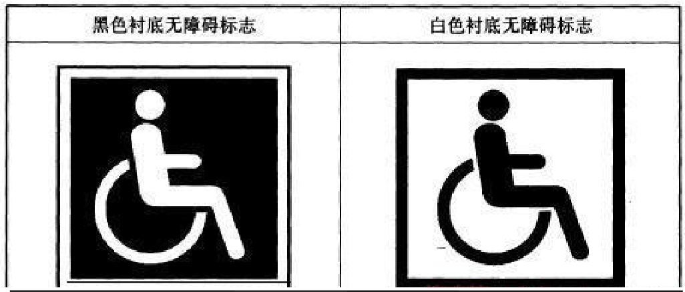  

# 附录 B 无障碍设施标志牌  

表 B 无障碍设施标志牌  

<html><body><table><tr><td>用于指示的无 障碍设施名称</td><td>标志牌的 具体形式</td><td>用于指示的无 障碍设施名称</td><td>标志牌的 具体形式</td></tr><tr><td>听觉障碍者 使用的设施</td><td>?</td><td>肢体障碍者 使用的设施</td><td>K</td></tr><tr><td>供导盲犬 使用的设施</td><td></td><td>无障碍厕所</td><td></td></tr><tr><td>视觉障碍者 使用的设施</td><td></td><td></td><td></td></tr><tr><td></td><td></td><td></td><td></td></tr></table></body></html>  

# 附录 C 用于指示方向的无障碍设施标志牌  

表 C 用于指示方向的无障碍设施标志牌  

<html><body><table><tr><td>用于指示方向的无障碍 设施标志牌的名称</td><td colspan="2">用于指示方向的无障碍设施标志牌的具体形式</td></tr><tr><td>无障碍坡道指示标志</td><td></td><td></td></tr><tr><td>人行横道指示标志</td><td colspan="2"></td></tr><tr><td>人行地道指示标志</td><td></td><td></td></tr><tr><td>人行天桥指示标志</td><td>5</td><td></td></tr></table></body></html>  

<html><body><table><tr><td>用于指示方向的无障碍 设施标志牌的名称</td><td colspan="2">用于指示方向的无障碍设施标志牌的具体形式</td></tr><tr><td>无障碍厕所指示标志</td><td></td><td></td></tr><tr><td>无障碍设施指示标志</td><td></td><td></td></tr><tr><td>无障碍客房指示标志</td><td colspan="2"></td></tr><tr><td>低位电话指示标志</td><td colspan="2"></td></tr></table></body></html>  

# 本规范用词说明  

1 为便于在执行本规范条文时区别对待，对要求严格程度不同的用词说明如下：  

1) 表示很严格，非这样做不可的：正面词采用“必须”，反面词采用“严禁”；  

2) 表示严格，在正常情况下均应这样做的：正面词采用“应”，反面词采用“不应”或“不得”；  

3) 表示允许稍有选择，在条件许可时首先应这样做  

的：正面词采用“宜”，反面词采用“不宜”；  

4) 表示有选择，在一定条件下可以这样做的，采用“可”  

2 条文中指明应按其他有关标准执行的写法为“应符合......的规定”或“应按......执行”。  

# 中华人民共和国国家标准  

# 建筑施工安全技术统一规范 Unified code for safety technology in construction  

GB50870-2013  

# 前   言  

本标准是根据建设部[]号文件的要求，由北京中建建筑科学技术研究院会同有关单位对1956 年国务院制定的《建筑安装工程安全技术规程》（[56]国议周字第40 号）进行修订而成。  

在修订过程中，2001 年 月我国批准国际劳工组织（ILO）的 167 号公约—《建筑业安全卫生公约》，为与之接轨，本标准经反复修改而审查定稿。  

本规范主要规定的内容有：工地建设、土石方作业、高处作业、脚手架、模板、施工用电、施工机具、垂直运输机械、起重吊装、建筑拆除。  

本规范将来可能需要局部修订，有关局部修订的信息和条文内容将刊登在《工程建设标准化》杂志上。  

本规范以黑体书写的条文是强制性条文，必须严格执行。  

为了提高标准质量，请各单位在执行本标准的过程中，注意总结经验，积累资料，随时将意见和建议寄给北京中建建筑科学技术研究院（北京南苑新华路1号，邮编 100076）  

本标准主编单位：北京中建建筑科学技术研究院本标准参编单位：天津建工集团总公司上海市建设工程安全监督总站深圳市施工安全监督站北京建工集团总公司哈尔滨工业大学沈阳建筑工程学院杭州市建筑工程安全监督站中国建筑一局（集团）有限公司本标准主要起草人：刘嘉福、邢孝仪、戴贞洁、姜敏、夏静、唐伟、徐崇宝、徐荣杰、戴宝荣、姜华  

# 目 次  

# 1   总   则  

2 术语、符号  

# 3 工地建设  

3．1 一般规定 4  
3．2 临时建筑、设施  
3．3 工地防火  
3．4 季节施工  

# 4 土石方作业  

4．1 一般规定  
4．2 施工准备 6  
4．3 土方挖掘 7  
4．4 基坑支护 7  
4．5 桩基施工 8  
4．6 地下水控制 9  

# 5 高处作业  

5．1 一般规定 11  
5．2 临边作业 11  
5．3 洞口作业 11  
5． 4 攀登作业 12  
5． 5 悬空作业 12  
5. 6 交叉作业 12  

# 6 脚手架 14  

6．1 一般规定 14   
6．2 落地式脚手架 17   
6． 3 悬挑式脚手架 18   
6． 4 吊篮式脚手架 18   
6．5 附着升降脚手架 20  

# 7 模板 22  

7. 1 一般规定 22  
7. 2 设计计算 22  
7. 3 构造要求 23  
7. 4 模板拆除 23  

# 8 施工用电 D  

8. 1 一般规定 25  
8．2 用电环境 25  
8．3 接地、接零 26  
8． 4 配电线路 28  
8． 5 配电箱及开关箱 29  
8．6 照明 30  

# 9 施工机具 31  

9．1 中小型机械 31  
9．2 焊接设备 32  

# 10  垂直运输机械 35  

10．1 一般规定 35  
10．2 塔式起重机 36  
10．3 施工升降机 37  
10．4 物料提升机 38  

# 11  起重吊装 1  

11．1 一般规定 41  
11．2 索具设备 42  
11．3 起重机吊装作业 43  
11． 4 扒杆吊装、滚杠平移作业 45  
11． 5 混凝土构件吊装 45  
11． 6 钢构件吊装 46  
11．7 大型墙板安装 47  

# 12  建筑拆除 48  

12．1 一般规定 4812．2 高处拆除 4812．3 推倒法拆除 4912．4 爆破法拆除 50本规范用词说明条文说明  

# 1 总  则  

1.0.1 为了统一我国建筑施工各种安全标准、规范、规程的技术规定，特制定本规范。  
1.0.2  本规范适用于房屋建筑的施工。  
1.0.3  建筑施工安全与卫生分为安全管理、安全技术、现场环境与卫生三方面内容，本规范仅对第二方面内容作出统一规定。建筑施工安全管理、建筑施工现场环境与卫生应另执行其它标准及统一规定。  
1.0.4  企业各级管理人员都必须熟悉相关安全技术标准、规范、规程的要求，并严格执行，不得违章指挥；工人必须熟悉相关安全技术规定及其岗位的安全操作规程，不得违章作业。  
1.0.5 企业应建立安全技术管理制度，制定安全技术措施的编制、审定、监督实施程序，对施工方案及需设计计算部分应建立审核制度，和安全技术资料归档制度。  
1.0.6 企业在编制施工组织设计时，应当根据建筑工程的特点制定相应的安全技术措施；对专业性较强的施工项目如：爆破、起重吊装、深基础、高支模作业和高层脚手架（包括整体提升架）、垂直运输设备（塔吊、升降机等）的拆、装、建筑物（或构筑物）拆除以及结构复杂、危险性大的施工项目，应当编制专项安全施工组织设计，有图纸、计算书和单项安全技术措施，并应加强监理监督。1.0.7 企业应实行逐级安全技术交底制度。开工前，技术负责人应将工程概况、施工方法、安全技术措施等向全体职工进行详细交底；施工队长、工长应按工程进度向有关班组进行作业的安全交底；班组长每天应向班组进行施工要求和作业环境的安全交底。  
1.0.8 企业应该建立验收确认制度，对脚手架、高支模、施工用电、垂直运输设备（塔吊、升降机等）、起重机、施工机械及各种安全防护设施，在施工现场安装后，应按规定进行检查验收。对外购的设备、设施、产品，在正式使用前，应按相关标准进行验收确认。  
1.0.9 企业应对参加施工的职工，根据不同工种和劳动条件发给符合标准的劳动防护用品，并教育正确使用。  
1.0.10 从事建筑施工作业的人员，应体检合格，并符合相应工种身体条件要求。  

# 2 术 语、符号  

# 2.1 术语  

2.1.1  施工现场(工地) construction site从事施工中任何工序或作业的场地。  

2.1.2  工作场所  workplace从事施工的任何人员因工作原因必须停留或前往的一切场所。  

# 2.1.3 安全技术 safety technique  

是一门为控制或消除生产劳动过程中的危险因素，防止发生人身事故和财产损失而研究与应用的技术。  

2.1.4  安全技术措施  safety technical measures以保障职工安全、防止伤亡事故为目的的，在技术上所采取的措施。  

2.1.5  安全防护装置  safeguard plant配置在施工现场及生产设备上，起保障人员和设备安全作用的所有附属装置。  

2.1.6  高处作业  work at heights凡在坠落高度基准面 $2 \mathrm { m }$ 以上（含2m）有可能坠落的高处进行的作业。  

2.1.7  特种作业  special work对操作者本人及其他人和周围设施的安全有重大危害因素的作业。  

2.1.8  脚手架  scaffold为建筑施工而搭设的上料、堆料与施工作业用的临时结构架。  

2.1.9  施工用电（临时用电） electricity on construction site由施工现场提供，工程施工完毕即行拆除的电力，并专用于工程施工的电力线路与电气设施。  

2.1.10  季节施工  seasonal construction在冬期、夏季、雨季及台风季节所进行的建筑工程施工。  

2.1.11  冬期施工  winter construction根据当地多年气温资料，在室外日平均气温连续5 天低于 $+ 5 ^ { \circ } C$ 的环境下施工。  

# 2.2 符号  

K1— 结构强度安全系数K2— 结构稳定安全系数γ0— 结构重要性系数$S$ ——荷载效应  
$R$ ——结构抗力  
$\mathcal { W } _ { \sf k }$ ——风荷载标准值  
W 风荷载设计值  
µS 风荷载体型系数µZ 风压高度变化系数$\mathcal { W } _ { \circ }$ ——基本风压值  

L1、L2、L3 ——三相电路的三相相线N ——中性点、中性线、工作零线PE——保护线（在TN 接零保护系统中称保护零线）—电流$t$ 通过电流I 所用的时间TN-C 工作零线与保护零线合一的接零保护系统TN-S 工作零线与保护零线分开的接零保护系统  

# 3 工地建设  

# 3．1 一般规定  

3.1.1 工地应创造条件实行封闭管理。在作业区域范围设置高度不低于 1.8m 的围档，应选用坚固、整洁的材料，沿工地四周连续设置。围挡墙边严禁堆物。在建筑物外侧应采用密目式安全立网进行全封闭围护。  
3.1.2 工地应设置固定的出入口。  
3.1.3 工地应铺设整齐、足够宽度的硬化道路，不积水、不堆放构件、材料、保持经常畅通。3.1.4 行人、车辆运输频繁的交叉路口，应悬挂安全指示标牌，在火车道口两侧应设落杆。  
3.1.5 各种料具应按照总平面图规定的位置，按品种、分规格堆放整齐。在建工程内部各楼层，应随完工随清理，拆除的模板、料具应码放整齐。  
3.1.6 在天然光线不足的作业场地、通道及用电设备的开关箱处，应设置足够的照明设备。  
3.1.7 工地应将施工作业区与生活区分开设置。  

# 3．2 临时建筑、设施  

3.2.1 临时建筑物设计应符合《建筑结构可靠度设计统一标准》(GB50068)、《建筑结构荷载规范》(GB50009)的规定。临时建筑物使用年限 $\mathfrak { n }$ 定为 5 年3.2.2 临时办公用房、宿舍、食堂、厕所等建筑物结构重要性系数 $\mathrm { \Delta ~ V ~ } _ { 0 } { = } 1 . \mathrm { \Delta } 0$ 。工地非危险品仓库等建筑物结构重要性系数 $\mathrm {  ~ \gamma ~ } _ { 0 } = 0 . 9$ ，工地危险品仓库按相关规定设计。  

3.2.3 临时建筑及设施设计可不考虑地震作用。  

# 3．3 工地防火  

3.3.1 工地应建立消防管理制度、动火审批制度和易燃易爆物品的管理办法。3.3.2 工地应按施工规模建立消防组织，配备义务消防人员，并应经过专业培训和定期组织进行演习。  
3.3.3 工地应按照总平面图划分防火责任区，根据作业条件合理配备灭火器材。当工程施工高度超过 $3 0 \mathrm { { m } }$ 时，应配备有足够扬程的消防水源和必须保障畅通的疏散通道。  
3.3.4 对各类灭火器材、消火栓及水带应经常检查和维护保养，保证使用效果。3.3.5 工地应设置吸烟室，吸烟人员必须到吸烟室吸烟。  
3.3.6 各种气瓶应单独存放，库房应通风良好，各种设施符合防爆要求。3.3.7 当发生火险工地消防人员不能及时扑救时，应迅速准确地向当地消防部门  

报警，并清理通道障碍和查清消火栓位置，为消防灭火做好准备。  

# 3．4 季节施工  

3.4.1 工地应该按照作业条件针对季节性施工的特点，制定相应的安全技术措施。  
3.4.2 雨季施工应考虑施工作业的防雨、排水及防雷措施。如雨天挖坑槽、露天使用的电气设备、爆破作业遇雷电天气以及沿河流域的工地做好防洪准备，傍山的施工现场做好防滑坡塌方的工作和做好临时设施及脚手架等的防强风措施。雷雨季节到来之前，应对现场防雷装置的完好情况进行检查，防止雷击伤害。3.4.3 冬期施工应采取防滑、防冻措施。作业区附近应设置的休息处所和职工生活区休息处所，一切取暖设施应符合防火和防煤气中毒要求；对采用蓄热法浇筑混凝土的现场应有防火措施。  
3.4.4 遇六级以上（含六级）强风、大雪、浓雾等恶劣气候，严禁露天起重吊装和高处作业。  

# 4 土石方作业  

# 4．1 一般规定  

4.1.1 土石方作业基坑工程的勘察、设计、施工和监理应实行统一管理。应加强施工队伍的培训管理，并建立专业化施工队伍。  
4.1.2 基坑工程的设计和施工任务，应由具有相应资质的单位承接。基坑工程监理应对基坑工程的设计和施工进行全面监理。  
4.1.3 基坑工程应贯彻先设计后施工；先支撑后开挖；边施工边监测；边施工边治理的原则。严禁坑边超载，严禁相邻基坑施工不防范相互干扰等做法。4.1.4 基坑工程的设计和施工必须遵守相关规范，结合当地成熟经验，因地制宜的进行。深基工程施工方案应经主管部门审批或经专家论证。  
4.1.5 应加强基坑工程的监测和预报工作，包括对支护结构、周围环境及对岩土变化的监测，应通过监测分析及时预报并提出建议作到信息化施工，防止隐患扩大和随时检验设计施工的正确性。  
4.1.6 应建立健全基坑工程档案，内容应包括勘察、设计、施工及监测等方面的有关资料。  

# 4．2 施工准备  

4.2.1 土石方作业和基坑支护的设计、施工应根据现场的环境、地质与水文情况，针对基坑开挖深度、范围大小，综合考虑支护方案、土方开挖、降排水方法以及对周边环境采取的措施。  
4.2.2 勘察范围应根据开挖深度及场地条件确定，应大于开挖边界外按开挖深度1 倍以上范围布置勘探点。应根据土的性质、含水情况以及基坑环境合理选定土压力参数。  
4.2.3 应查明作业范围周边环境及荷载情况，包括地下各种管线分布及现状，道路距离及车辆载重情况，影响范围内的建筑类型以及地表水排泄情况等。  

# 4．3 土方挖掘  

4.3.1 土方挖掘方法、挖掘顺序应根据支护方案和降排水要求进行，当采用局部或全部放坡开挖时，放坡坡度应满足其稳定性要求。  
4.3.2 挖掘应自上而下进行，严禁先挖坡脚。软土基坑无可靠措施时应分层均衡开挖，层高不宜超过1m。土方每次开挖深度和挖掘顺序必须按设计要求。坑（槽）沟边1m 以内不得堆土、堆料，不得停放机械。  
4.3.3 当基坑开挖深度大于相邻建筑的基础深度时，应保持一定距离或采取边坡支撑加固措施，并进行沉降和移位观测。  
4.3.4 施工中如发现不能辨认的物品时，应停止施工，保护现场，并立即报告所在地有关部门处理，严禁随意敲击或玩弄。  
4.3.5 挖土机作业的边坡应验算其稳定性，当不能满足时，应采取加固措施。在停机作业面以下挖土应选用反铲或拉铲作业，当使用正铲作业时，挖掘深度应严格按其说明书规定进行。有支撑的基坑使用机械挖掘时，应防止作业中碰撞支撑。4.3.6 配合挖土机作业人员，应在其作业半径以外工作，当挖土机停止回转并制动后，方可进入作业半径内工作。  
4.3.7 开挖至坑底标高后，应及时进行下道工序基础工程施工，减少暴露时间。如不能立即进行下道工序施工，应预留 $3 0 0 \mathrm { { m m } }$ 厚的覆盖层。  
4.3.8 当基坑施工深度超过 2m 时，坑边应按照高处作业的要求设置临边防护，作业人员上下应有专用梯道。当深基坑施工中形成的立体交叉作业时，应合理布局基位、人员、运输通道，并设置防止落物伤害的防护层。  
4.3.9 从事爆破工程设计、施工的企业必须取得相关资质证书，按照批准的允许经营范围并严格遵照爆破作业的相关规定进行。  

# 4．4 基坑支护  

4.4.1 支护结构的选型应考虑结构的空间效应和基坑特点，选择有利支护的结构型式或采用几种型式相结合。  
4.4.2 当采用悬臂式结构支护时，基坑深度不宜大于6m。基坑深度超过6m 时，可选用单支点和多支点的支护结构。地下水位低的地区和能保证降水施工时，也可采用土钉支护。  
4.4.3 寒冷地区基坑设计应考虑土体冻胀力的影响。  
4.4.4 支撑安装必须按设计位置进行，施工过程严禁随意变更，并应切实使围檩与档土桩墙结合紧密。档土板或板桩与坑壁间的回填土应分层回填夯实。4.4.5 支撑的安装和拆除顺序必须与设计工况相符合，并与土方开挖和主体工程的施工顺序相配合。分层开挖时，应先支撑后开挖；同层开挖时，应边开挖边支撑。支撑拆除前，应采取换撑措施，防止边坡卸载过快。  
4.4.6 钢筋混凝土支撑其强度必须达设计要求（或达 $7 5 \%$ ）后，方可开挖支撑面以下土方；钢结构支撑必须严格材料检验和保证节点的施工质量，严禁在负荷状态下进行焊接。  
4.4.7 应合理布置锚杆的间距与倾角，锚杆上下间距不宜小于 $2 . 0 \mathrm { m }$ ，水平间距不宜小于 1.5m；锚杆倾角宜为 $1 5 ^ { \circ } \sim 2 5 ^ { \circ }$ ，且不应大于 $4 5 ^ { \mathrm { { \circ } } }$ 。最上一道锚杆覆土厚不得小于4m 。4.4.8 锚杆的实际抗拔力除经计算外，还应按规定方法进行现场试验后确定。可采取提高锚杆抗力的二次压力灌浆工艺。  
4.4.9 采用逆做法施工时，要求其外围结构必须有自防水功能。基坑上部机械挖土的深度，应按地下墙悬臂结构的应力值确定；基坑下部封闭施工，应采取通风措施；当采用电梯间作为垂直运输的井道时，对洞口楼板的加固方法应由工程设计确定。  
4.4.10 逆做法施工时，应合理的解决支撑上部结构的单柱单桩与工程结构的梁柱交叉及节点构造并在方案中预先设计，当采用坑内排水时必须保证封井质量。  

# 4．5 桩基施工  

4.5.1 桩基施工应按施工方案要求进行。打桩作业区应有明显标志或围栏，作业区上方应无架空线路。  
4.5.2 予制桩施工桩机作业时，严禁吊装、吊锤、回转、行走动作同时进行；桩机移动时，必须将桩锤落至最低位置；施打过程中，操作人员必须距桩锤 5m 以外监视。  
4.5.3 沉管灌注桩施工，在未灌注混凝土和未沉管以前，应将预钻的孔口盖严。  

4.5.4 人工挖孔桩施工，应遵守以下规定：  

1  各种大直径桩的成孔，应首先采用机械成孔。当采用人工挖孔或人工扩孔时，必须经上级主管部门批准后方可施工。2  应由熟悉人工挖孔桩施工工艺、遵守操作规定和具有应急监测自防护能力的专业施工队伍施工。3  开挖桩孔应从上自下逐层进行，挖一层土及时浇筑一节混凝土护壁。第一节护壁应高出地面 $3 0 0 \mathrm { { m m } }$ 。4  距孔口顶周边1m 搭设围栏。孔口应设安全盖板，当盛土吊桶自孔内提出地面时，必须将盖板关闭孔口后，再进行卸土。孔口周边 1m 范围内不得有堆土和其他堆积物。5  提升吊桶的机构其传动部分及地面扒杆必须牢靠，制作、安装应符合施工设计要求。人员不得乘盛土吊桶上下，必须另配钢丝绳及滑轮并有断绳保护装置，或使用安全爬梯上下。  

6  应避免落物伤人，孔内应设半圆形防护板，随挖掘深度逐层下移。吊运物料时，作业人员应在防护板下面工作。  

7  每次下井作业前应检查井壁和抽样检测井内空气，当有害气体超过规定时，应进行处理和用鼓风机送风。严禁用纯氧进行通风换气。  

8  井内照明应采用安全矿灯或 12V 防爆灯具。桩孔较深时，上下联系可通过对讲机等方式，地面不得少于2 名监护人员。井下人员应轮换作业，连续工作时间不应超过2h。  

9  挖孔完成后，应当天验收，并及时将桩身钢筋笼就位和浇注混凝土。正在浇注混凝土的桩孔周围 $1 0 \mathrm { m }$ 半径内，其它桩不得有人作业。  

# 4．6 地下水控制  

4.6.1 基坑工程的设计施工必须充分考虑对地下水进行治理，采取排水、降水措施，防止地下水渗入基坑。  
4.6.2 基坑施工除降低地下水水位外，基坑内尚应设置明沟和集水井，以排除暴雨和其他突然而来的明水倒灌，基坑边坡视需要可覆盖塑料布，应防止大雨对土坡的侵蚀。  
4.6.3 膨胀土场地应在基坑边缘采取抹水泥地面等防水措施，封闭坡顶及坡面，防止各种水流（渗）入坑壁。不得向基坑边缘倾倒各种废水并应防止水管泄露冲走桩间土。  
4.6.4 软土基坑、高水位地区应做截水帷幕，应防止单纯降水造成基土流失。4.6.5 截水结构的设计，必须根据地质、水文资料及开挖深度等条件进行，截水结构必须满足隔渗质量，且支护结构必须满足变形要求。  
4.6.6 在降水井点与重要建筑物之间宜设置回灌井（或回灌沟），在基坑降水的同时，应沿建筑物地下回灌，保持原地下水位，或采取减缓降水速度，控制地面沉降。  

# 5 高处作业  

# 5．1 一般规定  

5.1.1  进入施工现场必须戴安全帽。安全帽的制作与使用应符合国家现行标准《安全帽》(GB2811)的有关规定。  
5.1.2  悬空高处作业人员应挂牢安全带，安全带的选用与佩带应符合国家现行标准《安全带》（GB6095）的有关规定。  
5.1.3 建筑施工过程中，应采用密目式安全立网对建筑物进行封闭（或采取临边防护措施）。  
5.1.4 建筑施工期间，应采取有效措施对施工现场和建筑物的各种孔洞盖严并固定牢固。  
5.1.5 对人员活动集中和出入口处的上方应搭设防护棚。  
5.1.6 高处作业的安全技术措施应在施工方案中确定，并在施工前完成，最后经验收确认符合要求。  
5.1.7 高处作业的人员应按规定定期进行体检。  

# 5．2 临边作业  

5.2.1 工作边沿无维护设施或维护设施高度低于 $8 0 0 \mathrm { m m }$ 的，必须设置防护设施，如：基坑周边，尚未安装栏杆或拦板的阳台及楼梯段，框架结构各层楼板尚未砌筑维护墙的周边，坡形屋顶周边以及施工升降机与建筑物通道的两侧边等都必须设置防护栏杆。  
5.2.2 水平工作面防护栏杆高度应为1.2m，坡度大于1：2.2 的屋面，周边栏杆应高 1.5m，应能经受 1000N 外力。防护栏杆应用安全立网封闭，或在栏杆底部设置高度不低于 $1 8 0 \mathrm { m m }$ 的挡脚板。  

# 5．3 洞口作业  

5.3.1 在孔与洞口边的高处作业必须设置防护设施，包括因施工工艺形成的深度在2m 及以上的桩孔边、沟槽边和因安装设备、管道预留的洞口边等。  

5.3.2 较小的洞口，应采用坚实的盖板盖严，盖板应能防止移位；较大的洞口除应在洞口采用安全网或盖板封严外，还应在洞口四周设置防护栏杆。5.3.3 墙面处的竖向洞口（如电梯井口、管道井口），除应在井口处设防护栏杆或固定栅门外，井道内应每隔 $1 0 \mathrm { m }$ 设一道平网。  

# 5.4 攀登作业  

5.4.1 用于登高和攀登的设施应在施工组织设计中确定，攀登用具必须牢固可靠。  
5.4.2 梯子不得垫高使用。梯脚底部应坚实并应有防滑措施，上端应有固定措施。折梯使用时，应有可靠的拉撑措施。  
5.4.3 作业人员应从规定的通道上下，不得任意利用升降机架体等施工设备进行攀登。  

# 5．5 悬空作业  

5.5.1 在周边临空状态下进行高处作业时应有牢靠的立足处（如搭设脚手架或作业平台），并视作业条件设置防护栏杆、张挂安全网、佩带安全带等安全措施。5.5.2 钢筋绑扎、安装骨架作业应搭设脚手架。不得站在钢筋骨架上作业或攀登骨架上下。  
5.5.3 浇注离地 2m 以上混凝土时，应设置操作平台，不得站在模板或支撑杆上操作。  
5.5.4 悬空进行门窗安装作业时，严禁站在拦板上作业，且必须挂牢安全带，并将安全带拴牢在上方可靠物上。  

# 5．6 交叉作业  

5.6.1 交叉施工不宜上下在同一垂直方向上的作业。下层作业的位置，宜处于上层高度可能坠落半径范围以外，当不能满足要求时，应设置安全防护层。5.6.2 各种拆除作业（如钢模板、脚手架等）上面拆除时下面不得同时进行清整。  

物料临时堆放处应离楼层边沿不应小于1m。  

5.6.3 建筑物的出入口，升降机的上料口等人员集中处的上方，应设置防护棚。  
防护棚的长度不应小于防护高度的物体坠落半径的规定。  

当建筑外侧面临街道时，除建筑立面采取密目式安全立网封闭外，尚应在临街段搭设防护棚并设置安全通道。5.6.4 设置悬挑物料平台应按现行的相关规范进行设计，必须将其荷载独立传递给建筑结构，不得以任何形式将物料平台与脚手架、模板支撑进行连接。  

# 6 脚手架  

# 6．1 一般规定  

6.1.1 各种脚手架应根据建筑施工的要求选择合理的构架形式,并制定搭设、拆除作业的程序和安全措施，当搭设高度超过免计算仅构造要求的搭设高度时，必须按规定进行设计计算。  

6.1.2 脚手架材料及配件应符合下列规定：  

1 脚手架杆件应符合下列规定：  

1) 木脚手架立杆、纵向水平杆、斜撑、剪刀撑、连墙件应选用剥皮杉、落叶松木杆，横向水平杆应选用杉木、落叶松、柞木、水曲柳。不得使用折裂、扭裂、虫蛀、纵向严重裂缝以及腐朽等木杆。立杆有效部分的小头直径不得小于 $7 0 \mathrm { m m }$ ，纵向水平杆有效部分的小头直径不得小于 $8 0 \mathrm { m m }$ 。  

2) 竹杆应选用生长期三年以上毛竹或楠竹，不得使用弯曲、青嫩、枯脆、腐烂、裂纹连通两节以上以及虫蛀的竹杆。 立杆、顶撑、斜杆有效部分的小头直径不得小于 $7 5 \mathrm { m m }$ ，横向水平杆有效部分的小头直径不得小于 $9 0 \mathrm { { m m } }$ ，搁栅、栏杆的有效部分小头直径不得小于 $6 0 \mathrm { m m }$ 。对于小头直径在 $6 0 \mathrm { m m }$ 以上，不足 $9 0 \mathrm { m m }$ 的竹杆可采用双杆。  

3）钢管材质应符合 $\mathsf { Q 2 3 5 - A }$ 级标准，不得使用有明显变形、裂纹、严重锈蚀材料。钢管规格宜采用 $\Phi 4 8 \times 3 . 5 \$ ，亦可采用 $\Phi 5 1 \times 3 . 0$ 钢管。  

4）同一脚手架中，不得混用两种材质，也不得将两种规格钢管用于同一  

脚手架中。  

2 脚手架绑扎材料应符合下列规定：  

1) 镀锌钢丝或回火钢丝严禁有锈蚀和损伤，且严禁重复使用。2）竹篾严禁发霉、虫蛀、断腰、有大节疤和折痕，使用其它绑扎材料时，应符合其它规定。3）扣件应与钢管管径相配合，并符合国家现行标准的规定。  

3 脚手架上脚手板应符合下列规定：  

1）木脚手板厚度不得小于 $5 0 \mathrm { m m }$ ，板宽宜为 ${ 2 0 0 } \mathrm { \sim } 3 0 0 \mathrm { m m }$ ，两端应用镀锌钢丝扎紧。材质不得低于国家Ⅱ等材标准的杉木和松木，且不得使用腐朽、劈裂的木板。  
2）竹串片脚手板应使用宽度不小于 $5 0 \mathrm { m m }$ 的竹片，拼接螺栓间距不得大于$6 0 0 \mathrm { { m m } }$ ，螺栓孔径与螺栓应紧密配合。  
3）各种形式金属脚手板，单块重量不宜超过 0.3kN，性能应符合设计使用要求，表面应有防滑构造。  

# 6.1.3 脚手架搭设高度应符合下列规定：  

1  钢管脚手架中扣件式单排架不宜超过 $2 4 \mathrm { { m } }$ ，扣件式双排架不宜超过 $5 0 \mathrm { m }$ 。门式架不宜超过 $6 0 \mathrm { m }$ 2  木脚手架中单排架不宜超过 $2 0 \mathrm { m }$ ，双排架不宜超过 $3 0 \mathrm { m }$ 。3  竹脚手架中不得搭设单排架，双排架不宜超过 $3 5 \mathrm { m }$ 。  

6.1.4 脚手架构造要求应符合下列规定：  

1 单、双排脚手架的立杆纵距及水平杆步距不应大于 $2 . 1 \mathrm { { m } }$ ，立杆横距不应大于 $1 . 6 \mathrm { m }$ 。2  应按规定的间隔采用连墙件（或连墙杆）与建筑结构进行连接，在脚手架使用期间不得拆除。3  沿脚手架外侧应设置剪刀撑，并随脚手架同步搭设和拆除。4  双排扣件式钢管脚手架高度超过 $2 4 \mathrm { { m } }$ 时，应设置横向斜撑。5  门式钢管脚手架的顶层门架上部、连墙件设置层、防护棚设置处必须设置水平架。  

6 竹脚手架应设置顶撑杆，并与立杆绑扎在一起顶紧横向水平杆。7 架高超过40m 且有风涡流作用时，应设置抗风涡流上翻作用的连墙措施。8 脚手板必须按脚手架宽度铺满、铺稳，脚手板与墙面的间隙不应大于$2 0 0 \mathrm { { m m } }$ ，作业层脚手板的下方必须设置防护层。9 作业层外侧，应按规定设置防护栏杆和挡脚板。10 脚手架应按规定采用密目式安全立网封闭。  

6.1.5 脚手架荷载标准值应符合下列规定：  

1 恒荷载应符合以下规定：  

包括构架、防护设施、脚手板等自重，应按《建筑结构荷载规范》GB50009选用，对木脚手板、竹串片脚手板可取自重标准值为 $0 . 3 5 \mathrm { k N } / \mathrm { m } ^ { 2 }$ （按厚度 $5 0 \mathrm { m m }$ 计）。  

2 施工荷载应符合下列规定：  

施工荷载应包括作业层人员、器具、材料的重量：  
结构作业架应取3kN /m  
装修作业架应取2kN / ${ \mathrm { ~ m } } ^ { 2 }$   
定型工具式脚手架按标准值取用，但不得低于1kN /m²  

# 3 风荷载应符合下列规定：  

作用于脚手架的水平风荷载标准值 $\mathrm { W k }$ 应按下式计算：  

$$
{ \mathcal W } _ { \mathrm { k \Omega } } = \mu _ { \mathrm { S } } \mu _ { \mathrm { Z } } \ { \mathcal W } _ { o }
$$  

式中 µs——脚手架风荷载体型系数，按下表选用：  

表 6.1.5 脚手架的风荷载体型系数 µs  

<html><body><table><tr><td>背靠建筑物状况</td><td>全封闭</td><td>开、开洞</td></tr><tr><td>μs</td><td>1.0Φ</td><td>1.3Φ</td></tr></table></body></html>  

注： $\boldsymbol { \Phi }$ 为挡风系数，按脚手架封闭状况确定； $\Phi =$ 脚手架挡风面积/脚手架迎风面积µz——风压高度变化系数，按现行《建筑结构荷载规范》GB50009 的规定取用；  

$\mathcal { W } _ { \bar { o } }$ ——基本风压，按现行国家标准《建筑结构荷载规范》GB50009 的规定，取 $\mathrm { n } { = } 5$ 。  

6.1.6 钢管脚手架结构设计应符合下列方法和基本计算模式：  

1  钢管脚手架的结构设计应采用概率极限状态计算法，同时要求其计算结果应按单一安全系数法计算的安全度进行校核：强度 $\mathrm { { K } } 1 \geqslant 1 . 5$ ；稳定 $\mathrm { K } _ { 2 } \geqslant 2 . 0$ 。  

2 钢管脚手架结构设计应采用以下基本计算模式：  

$$
\gamma \circ S \leqslant R
$$  

式中 $\gamma$ 。—— 结构重要性系数，取 $\gamma \circ \geqslant 1 . 0$ ；$S$ —— 荷载效应，$R$ —— 结构抗力，  

# 6．2 落地式脚手架  

6.2.1 落地式脚手架的基础应坚实、平整，并应定期检查。立杆不埋设时，每根立杆底部应设置垫板或底座，并应设置纵、横向扫地杆。  

6.2.2 落地式脚手架连墙件应符合下列规定：  

1  扣件式钢管脚手架双排架高在 $5 0 \mathrm { m }$ 以下或单排架在 $2 4 \mathrm { { m } }$ 以下，按不大于$4 0 \mathrm { m } ^ { 2 }$ 设置一处；双排架高在 $5 0 \mathrm { m }$ 以上，按不大于 $2 7 \mathrm { m } ^ { 2 }$ 设置一处。  

门式钢管脚手架架高在 $4 5 \mathrm { m }$ 以下，基本风压 $\leqslant 0 . 5 5 \mathrm { k N } / \mathrm { m } ^ { 2 }$ ，按不大于 $4 8 \ m ^ { 2 }$ 设置一处；架高在 $4 5 \mathrm { m }$ 以下，基本风压> $> 0 . 5 5 \mathrm { k N } / \mathrm { m } ^ { 2 }$ ，或架高在 $4 5 \mathrm { m }$ 以上，按不大于 $2 4 \mathrm { m } ^ { 2 }$ 设置一处。  

木脚手架按垂直不大于双排3 倍立杆步距、单排2 倍立杆步距，水平不大于3 倍立杆纵距设置。  

竹脚手架按垂直不大于4m ，水平不大于4 倍立杆纵距设置。  

2 一字型、开口型脚手架的两端，必须设置连墙件。  
3 连墙件必须采用可承受拉力和压力的构造，并与建筑结构连接。  

6.2.3 落地式脚手架剪刀撑及横向斜撑应符合下列规定：  

1 扣件式钢管脚手架应沿全高设置剪刀撑。架高在 $2 4 \mathrm { { m } }$ 以下时，可沿脚手架长度间隔不大于15m 设置；架高在 $2 4 \mathrm { { m } }$ 以上时应沿脚手架全长连续设置剪刀撑，并应设置横向斜撑，横向斜撑由架底至架顶呈之字型连续布置，沿脚手架长度间隔6 跨设置一道。  

2 碗扣式钢管脚手架，架高在 $2 4 \mathrm { { m } }$ 以下时，于外侧框格总数的1/5 设置斜杆；架高在 $2 4 \mathrm { { m } }$ 以上时，按框格总数的1/3 设置斜杆。  

3 门式钢管脚手架的内外两个侧面除应满设交叉支撑杆外，当架高超过$2 0 \mathrm { m }$ 时，还应在脚手架外侧沿长度和高度连续设置剪刀撑，剪刀撑钢管规格应与门架钢管规格一致。当剪刀撑钢管直径与门架钢管直径不一致时，应采用异型扣件连接。  

4 满堂扣件式钢管脚手架除沿脚手架外侧四周和中间设置竖向剪刀撑外，当脚手架高于4m 时，还应沿脚手架每两步高度设置一道水平剪刀撑。6.2.4 扣件式钢管脚手架的主节点处必须设置横向水平杆，在脚手架使用期间严禁拆除。单排脚手架横向水平杆插入墙内长度不应小于 $1 8 0 \mathrm { m m }$ 。6.2.5 扣件式钢管脚手架除顶层外立杆杆件接长时，相临杆件的对接接头不应设在同步内。相临纵向水平杆对接接头不宜设置在同步或同跨内。  

扣件式钢管脚手架立杆接长除顶层外应采用对接。木脚手架立杆接头搭接长度应跨两根纵向水平杆，且不得小于1.5m 。竹脚手架立杆接头的搭接长度应超过一个步距，并不得小于1.5m 。  

# 6．3 悬挑式脚手架  

6.3.1 悬挑一层的脚手架应符合下列规定：  

1 悬挑架斜立杆的底部必须搁置在楼板、梁或墙体等建筑结构部位，并有固定措施。立杆与墙面的夹角不得大于 $3 0 ^ { \circ }$ ，挑出墙外宽度不得大于 $1 . 2 \mathrm { m }$ 。  

2 斜立杆必须与建筑结构进行连接固定。不得与模板支架进行连接。  

3 斜立杆纵距不得大于 $1 . 5 \mathrm { m }$ ，底部应设置扫地杆并按不大于1.5m 的步距设置纵向水平杆。  

4 作业层除应按规定满铺脚手板和设置临边防护外，还应在脚手板下部挂一层平网，在斜立杆里侧用密目网封严。  

6.3.2 悬挑多层的脚手架应符合下列规定：  

1  悬挑支承结构必须专门设计计算，应保证有足够的强度、稳定性和刚度，并将脚手架的荷载传递给建筑结构。悬挑式脚手架的高度不得超过 $2 4 \mathrm { m }$ 。2 悬挑支承结构可采用悬挑梁或悬挑架等不同结构形式。悬挑梁应采用型钢制作，悬挑架应采用型钢或钢管制作成三角形桁架，其节点必须是螺栓或焊接的刚性节点，不得采用扣件（或碗扣）连接。3 支撑结构以上的脚手架应符合落地式脚手架搭设规定，并按要求设置连墙件。脚手架立杆纵距不得大于1.5m，底部与悬挑结构必须进行可靠连接。  

# 6．4 吊篮式脚手架  

6.4.1 吊篮式脚手架吊篮平台制作应符合下列规定：  

1 吊篮平台应经设计计算并应采用型钢、钢管制作，其节点应采用焊接或螺栓连接，不得使用钢管和扣件（或碗扣）组装。  

2 吊篮平台宽度宜为 $0 . 8 { \sim } 1 . 0 \mathrm { m }$ ，长度不宜超过 6m。当底板采用木板时，厚度不得小于 $5 0 \mathrm { m m }$ ；采用钢板时应有防滑构造。  

3 吊篮平台四周应设防护栏杆，除靠建筑物一侧的栏杆高度不应低于0.8m外，其余侧面栏杆高度均不得低于 $1 . 2 \mathrm { m }$ 。栏杆底部应设 $1 8 0 \mathrm { m m }$ 高挡脚板，上部应用钢板网封严。  

4 吊篮应设固定吊环，其位置距底部不应小于800mm 。吊篮平台应在明显处标明最大使用荷载（人数）及注意事项。  

6.4.2 吊篮式脚手架悬挂结构应符合下列规定：  

1  悬挂结构应经设计计算，可制作成悬挑梁或悬挑架，尾端与建筑结构锚固连接；当采用压重方法平衡挑梁的倾覆力矩时，应确认压重的质量，并应有防止压重移位的锁紧装置。悬挂结构抗倾覆应专门计算。  

2  悬挂结构外伸长度应保证悬挂平台的钢丝绳与地面呈垂直。挑梁与挑梁之间应采用纵向水平杆连成稳定的结构整体。  

6.4.3 吊篮式脚手架提升机构应符合下列规定：  

1  提升机构的设计计算应按容许应力法，提升钢丝绳安全系数不应小于10，提升机的安全系数不应小于2。  

2  提升机可采用手搬葫芦或电动葫芦，应采用钢芯钢丝绳。手搬葫芦可用于单跨（两个吊点）的升降，当吊篮平台多跨同时升降时，必须使用电动葫芦且应有同步控制装置。  

6.4.4 吊篮式脚手架安全装置应符合下列规定：  

1  使用手搬葫芦应装设防止吊篮平台发生自动下滑的闭锁装置。2  吊篮平台必须装设安全锁，并应在各吊篮平台悬挂处增设一根与提升钢丝绳相同型号的安全绳，每根安全绳上应安装安全锁。3  当使用电动提升机时，应在吊篮平台上、下两个方向装设对其上、下运行位置、距离进行限定的行程限位器。4  电动提升机构宜配两套独立的制动器，每套制动器均可使带有额定荷载$1 2 5 \%$ 的吊篮平台停住。6.4.5 吊篮式脚手架吊篮安装完毕，应以2 倍的均布额定荷载进行检验平台和悬挂结构的强度及稳定性的试压试验。  

提升机构应进行运行试验，其内容应包括空载、额定荷载、偏载及超载试验，并应同时检验各安全装置并进行坠落试验。6.4.6 吊篮式脚手架必须经设计计算、吊篮升降应采用钢丝绳传动、装设安全锁等防护装置并经检验确认。严禁使用悬空吊椅进行高层建筑外装修清洗等高处作业。  

# 6．5 附着升降脚手架  

6.5.1 附着升降脚手架的架体结构和附着支撑结构应按“概率极限状态法”进行设计计算；升降机构应按“容许应力计算法”进行设计计算。荷载标准值应分别按使用、升降、坠落三种状况确定。  

6.5.2 附着升降脚手架架体构造应符合下列规定：  

1 架体尺寸应符合下列规定：  

1） 架体高度不应大于 $1 5 \mathrm { m }$ ；宽度不应大于 $1 . 2 \mathrm { m }$ ； 架体构架的全高与支撑跨度的乘积不应大于 $1 1 0 \mathrm m ^ { 2 }$ 。2）升降和使用情况下，架体悬臂高度均不应大于6.0m 和2/5 架体高度。  

# 2 架体结构应符合下列规定：  

1）水平梁架应满足承载和架体整体作用的要求，采用焊接或螺栓连接的定型桁架梁式结构，不得采用钢管扣件、碗扣等脚手架连接方式。  

2）架体必须在附着支撑部位沿全高设置定型的竖向主框架，且应采用焊接或螺栓连接结构，并应能与水平梁架和架体构架整体作用，且不得使用钢管扣件或碗扣等脚手架杆件组装。  
3）架体外立面必须沿全高设置剪刀撑；悬挑端应与主框架设置对称斜拉杆；架体遇塔吊、施工电梯、物料平台等设施而需断开处应采取加强构造措施。6.5.3 附着升降脚手架的附着支撑结构必须满足附着升降脚手架在各种情况下的支承、防倾和防坠落的承载力要求。在升降和使用工况下，确保每一竖向主框架的附着支撑不得少于二套，且每一套均应能独立承受该跨全部设计荷载和倾覆作用。  
6.5.4 附着升降脚手架必须设置防倾装置、防坠落装置及整体（或多跨）同时升降作业的同步控制装置，并应符合下列规定：  

1  防倾装置应符合下列规定：  

1）防倾装置必须与建筑结构、附着支撑或竖向主框架可靠连接，应采用螺栓连接，不得采用钢管扣件或碗扣方式连接；  
2）升降和使用工况下在同一竖向平面的防倾装置不得少于二处，二处的最小间距不得小于架体全高的1/3。  

2  防坠装置应符合下列规定：  

1）防坠装置应设置在竖向主框架部位，且每一竖向主框架提升设备处必须设置一个；  
2）防坠装置与提升设备必须分别设置在两套互不影响的附着支撑结构上，当有一套失效时另一套必须能独立承担全部坠落荷载；  
3）防坠装置应有专门的以确保其工作可靠、有效的检查方法和管理措施。  

3  同步装置应符合下列规定：  

1）升降脚手架的吊点超过两点时，不得使用手拉葫芦，且必须装设同步装置。  
2）同步装置应能同时控制各提升设备间的升降差和荷载值。同步装置应具备超载报警、欠载报警和自动显示功能，在升降过程中，应显示各  

机位实际荷载、平均高度、同步差，并自动调整使相临机位同步差控制在限定值内。  

6.5.5 附着升降脚手架必须按要求用密目式安全立网封闭严密，脚手板底部应用平网及密目网双层网兜底，脚手板与建筑物的间隙不得大于 $2 0 0 \mathrm { m m }$ 。单跨或多跨提升的脚手架，其两端断开处必须加设栏杆并用密目网封严。6.5.6 附着升降脚手架组装完毕后应经检查、验收确认合格后方可进行升降作业。且每次升降到位架体固定后，必须进行交接验收，确认符合要求时，方可继续作业。  

# 7.模板  

# 7.1 一般规定  

7.1.1 模板施工前，应根据建筑物结构特点和混凝土施工工艺进行模板设计，并编制安全技术措施。  
7.1.2 模板及支架应具有足够的强度、刚度和稳定性，能可靠地承受新浇混凝土自重、侧压力和施工中产生的荷载及风荷载。  
7.1.3 各种材料模板的制作，应符合相关技术标准的规定。  
7.1.4 模板支架材料宜采用钢管、门型架、型钢、塔身标准节、木杆等。模板支架材质应符合相关技术标准的规定。  

# 7.2 设计计算  

7.2.1 模板荷载效应组合及其各项荷载标准值，应符合现行国家标准《建筑结构荷载规范》GB50009 的有关规定。  
7.2.2 模板风荷载标准值应按现行国家标准《建筑结构荷载规范》GB50009 的规定，取 $\mathrm { n } { = } 5$ 。  
7.2.3 模板支架立杆的稳定性计算，对扣件式钢管支架在符合有关构造要求后，可按国家现行标准《建筑施工扣件式钢管脚手架安全技术规范》JGJ130 有关脚  

手架立杆的稳定性计算公式进行。  

1 模板支架立杆轴向力设计值 $N$ 及弯矩设计值 $\pmb { M }$ ，应按下列公式计算：  

$$
\pmb { N } = \mathrm { ~ 1 . ~ 2 \Sigma { N } \mathrm { { k } \mathrm { { k } \mathrm { { \Sigma } + 1 . ~ 4 \Sigma { N } \mathrm { { k } \mathrm { { k } \mathrm { { \Sigma } } } } } } } }
$$  

$$
\mathcal { M } = 0 . 6 \times 1 . 4 M w { \mathrm { k } } = 0 . 6 \times 1 . 4 \ \mathcal { W } \times L a H ^ { 2 } / 1 0
$$  

式中  ΣNGk——模板及支架自重、新浇混凝土自重与钢筋自重标准值产生的轴向力总和；  

ΣNQk——施工人员及施工设备荷载标准值、振捣混凝土时产生的荷载标准值产生的轴向力总和；  

Mwk—— 水平风荷载产生的弯矩标准值；  

M——水平风荷载产生的弯矩设计值。  

2  模板支架立杆的计算长度 $\scriptstyle { \mathcal { L } } o$ ，应按下式计算：  

L0=h+2a  

式中 h——支架立杆的步距；a— 模板支架立杆伸出顶层横向水平杆中心线至模板支撑点距离。  

7.2.4 模板支架底部的建筑物结构或地基，必须具有支撑上层荷载的能力。当底部支撑楼板的设计荷载不足时，可采取保留两层或多层支架立杆（经计算确定）加强；当支撑在地基上时，应验算地基的承载力。  

# 7.3 构造要求  

7.3.1 各种模板的支架应自成体系，严禁与脚手架进行连接。  

7.3.2 模板支架立杆底部应设置垫板，不得使用砖及脆性材料铺垫。并应在支架的两端和中间部分与建筑结构进行连接。  
7.3.3 模板支架立杆在安装的同时，应加设水平支撑，立杆高度大于 $2 \mathrm { m }$ 时，应设两道水平支撑，每增高 $1 . 5 \mathrm { - } 2 \mathrm { m }$ 时，再增设一道水平支撑。  
7.3.4 满堂模板立杆除必须在四周及中间设置纵、横双向水平支撑外，当立杆高度超过4m 以上时，尚应每隔2 步设置一道水平剪刀撑。7.3.5 当采用多层支模时，上下各层立杆应保持在同一垂直线上。  
7.3.6 需进行二次支撑的模板，当安装二次支撑时，模板上不得有施工荷载。7.3.7 模板支架的安装应按照设计图纸进行，安装完毕浇筑混凝土前，经验收确认符合要求。  
7.3.8 应严格控制模板上堆料及设备荷载，当采用小推车运输时，应搭设小车运输通道，将荷载传给建筑结构。  

# 7.4 模板拆除  

7.4.1 模板支架拆除必须有工程负责人的批准手续及混凝土的强度报告。  

7.4.2 模板拆除顺序应按设计方案进行。当无规定时，应按照先支的后拆，先拆主承重模板后拆次承重模板。  
7.4.3 拆除较大跨度梁下支柱时，应先从跨中开始，分别向两端拆除。拆除多层楼板支柱时，应确认上部施工荷载不需要传递的情况下方可拆除下部支柱。7.4.4 当水平支撑超过二道以上时，应先拆除二道以上水平支撑，最下一道大横杆与立杆应同时拆除。  
7.4.5 模板拆除应按规定逐次进行，不得采用大面积撬落方法。拆除的模板、支撑、连接件应用槽滑下或用绳系下。不得留有悬空模板。  

# 8 施工用电  

# 8．1 一般规定  

8.1.1 施工用电设备数量在 5 台及以上，或用电设备容量在 $5 0 \mathrm { k W }$ 及以上时，应  
编制用电施工组织设计，并经企业技术负责人审核。  
8.1.2 施工用电应建立用电安全技术挡案，定期经项目负责人检验签字。  
8.1.3 施工现场应定期对电工和用电人员进行安全用电教育培训和技术交底。  
8.1.4 施工用电应定期检测。  

# 8.2 用电环境  

8.2.1 与外电架空线路的安全距离应符合下列规定：  

1 在建工程不得在高、低压线路下方施工、搭设作业棚、生活设施和堆放构件、材料等。  

2 在架空线路一侧施工时，在建工程应与架空线路边线之间保持安全操作距离，安全操作距离不得小于下表数值：  

在建工程（含脚手架）的外侧边缘  

表 8.2.1 与外电架空线路的边缘之间的最小安全操作距离  

<html><body><table><tr><td>架空线路电压</td><td>1kV 以下</td><td>1—10kV</td><td>35—110kV</td><td>154—220kV</td></tr><tr><td>最小安全操作距离</td><td>4m</td><td>6m</td><td>8m</td><td>10m</td></tr></table></body></html>  

3 起重机的任何部位或被吊物边缘与 $1 0 \mathrm { k V }$ 以下的架空线路边缘最小水平距离不得小于 $2 \mathrm { m }$ 。  

8.2.2 对外电架空线路的防护应符合下列规定：  

1  施工现场不能满足第 8.2.1 条中规定的最小距离时，必须按现行行业规范规定搭设防护设施并设置警告标志。  

2 在架空线路一侧或上方搭设或拆除防护屏障等设施时，必须停电后作业，并设监护人员。  

8.2.3 对易燃、易爆物和腐蚀介质的防护应符合下列规定：  

电气设备周围应无可能导致电气火灾的易燃、易爆物和导致绝缘损坏的腐蚀介质，否则应予清除或做防护处理。  

8.2.4 对机械损伤的防护应符合以下规定：  

电气设备设置场所应能避免物体打击、撞击等机械伤害，否则应做防护处理。  

8.2.5 雷电防护应符合下列规定：  

1  施工现场内的施工升降机、钢管脚手架等金属设施，若在相临建筑物、构筑物的防雷装置的保护范围以外且在下表规定范围之内时，应按有关规定安装防雷装置。  

表 8.2.5 施工现场内金属设施需安装防雷装置的规定  

<html><body><table><tr><td>地区年平均雷暴日 (d)</td><td>金属设施高度(m)</td></tr></table></body></html>  

<html><body><table><tr><td>≤15</td><td>≤50</td></tr><tr><td>15<，<40</td><td>≤32</td></tr><tr><td>40≤，<90</td><td>≤20</td></tr><tr><td>≤90及雷害特别严重地区</td><td>≤12</td></tr></table></body></html>

注：地区年平均雷暴日可查阅《建筑施工用电安全技术规范》。  

2 防雷装置的避雷针（接闪器）可采用 $\Phi 2 0$ 钢筋，长度应为 $1 { \sim } 2 \mathrm { m }$ ；当利用金属构架做引下线时，应保证构架之间的电气连接；防雷装置的冲击接地电阻值不得大于 $3 0 \Omega$ 。  

# 8.3 接地、接零  

8.3.1 施工用电基本保护系统应符合以下规定：  

施工用电应采用中性点直接接地的 380/220V 三相四线制低压电力系统，其保护方式应符合下列规定。  

1 施工现场由专用变压器供电时，应将变压器低压侧中性点直接接地，并采用TN—S 接零保护系统。2 施工现场由专用发电机供电时，必须将发电机的中性点直接接地，并采用TN—S 接零保护系统，且应独立设置。3 当施工现场直接由市电（电力部门变压器）等非专用变压器供电时，其基本接地、接零方式应与原有市电供电系统保持一致。在同一供电系统中，不得一部分设备做保护接零，另一部分设备做保护接地。4 在供电端为三相四线供电的接零保护（TN）系统中，应将进户处的中性线（N 线）重复接地，并同时由接地点另引出保护零线（PE 线），形成局部TN-S接零保护系统。  

8.3.2 施工用电保护接零与重复接地应符合下列规定：  

1  在接零保护系统中电气设备的金属外壳必须与保护零线（PE 线）连接。  

2  保护零线应符合下列规定：  

1）保护零线应自专用变压器、发电机中性点处，或配电室、总配电箱进  

线处的中性线（N 线）上引出；  

2）保护零线的统一标志为绿/黄双色绝缘导线，在任何情况下不得使用绿/黄双色线做负荷线；  
3）保护零线（PE 线）必须与工作零线（N 线）相隔离，严禁保护零线与工作零线混接、混用。  
4）保护零线上不得装设控制开关或熔断器；  
5）保护零线的截面不应小于对应工作零线截面。与电气设备相连接的保护零线截面不应小于 $2 . 5 \mathrm { m m } ^ { 2 }$ 的多股绝缘铜线。  

3  保护零线的重复接地点不得少于三处，应分别设置在配电室或总配电箱处，以及配电线路的中间处和末端处。  

8.3.3 施工用电接地电阻应符合下列规定：  

1  电力变压器或发电机的工作接地电阻值不应大于 $4 \Omega$ 。2  在 TN 接零保护系统中 重复接地应与保护零线连接，每处重复接地电阻值不应大于 $1 0 \Omega$ 。  

8.3.4 施工用电配电室应符合下列规定：  

1  配电室应靠近电源，接近负荷中心，应便于线路的引入和引出，并有防止雨雪和小动物出入措施。  

2  配电柜应符合下列要求：  

1）柜两端应做接地（接零）；  
2）柜应做名称、用途、分路标记；  
3）柜不得直接挂接其他临时用电设备；  
4）柜或线路维修时应挂停电标志牌。停、送电必须由专人负责，停止作  
业时断电上锁。  

8.3.5 施工用电自备电源应符合下列规定：  

1  发电机组电源应与外电线路联锁，严禁并列运行；2  发电机组应采用三相四线制中性点直接接地系统，并应独立设置，与外电源隔离。  

# 8．4 配电线路  

8.4.1 施工用电架空线路敷设应符合下列规定：  

1  架空线路应采用绝缘导线，并经横担和绝缘子架设在专用电杆上；2  架空导线截面应满足计算负荷、线路末端电压偏移（不大于 $5 \%$ ）和机械强度要求；3 架空敷设档距不应大于 $3 5 \mathrm { m }$ ，线间距离不应小于 $0 . 3 \mathrm { { m } }$ 。  

4 架空线敷设高度应满足下列要求：  

1）距施工现场地面不小于 $4 \mathrm { m }$ ；  
2）距机动车道不小于6m；  
3）距铁路轨道不小于7.5m；  
4）距暂设工程和地面堆放物顶端不小于2.5m；  
5）距交叉电力线路：0.4kV 线路不小于1.2m；10kV 线路不小于2.5m。  

5  架空线路敷设的相序排列应满足下列要求：  

1）单横担架设时，面向负荷侧，从左起为L1、N、L2、L3、PE；2）双横担架设时，面向负荷侧，上横担从左起为L1、L2、L3；下横担从左起为 L1、（L2、L3）N、PE；  

8.4.2 施工用电电缆线路应符合下列规定：  

1  电缆线路应采用埋地或架空敷设，不得沿地面明设；2  埋地敷设深度不应小于 0.6m，并应覆盖硬质保护层；穿越建筑物、道路等易受损伤的场所时，应另加防护套管；3 架空敷设时，应沿墙或电杆做绝缘固定，电缆最大弧垂处距地面不得小于2.5m；4 在建工程内的电缆线路应采用电缆埋地穿管引入，沿工程竖井、垂直孔洞，逐层固定，电缆水平敷设高度不应小于1.8m；  

# 8．5 配电箱及开关箱  

8.5.1 施工用电应实行三级配电，即设置总配电箱或室内总配电柜、分配电箱、开关箱三级配电装置。开关箱以下应为用电设备。  

8.5.2 施工用电动力配电与照明配电宜分箱设置，当合置在同一箱内时，动力与照明配电应分路设置。  
8.5.3 施工用电配电箱、开关箱应采用铁板（厚度为 $1 . 2 \mathrm { - } 2 . 0 \mathrm { m m }$ ）或阻燃绝缘材料制作。不得使用木质配电箱、开关箱及木质电器安装板。  
8.5.4 施工用电配电箱、开关箱应装设在干燥、通风、无外来物体撞击的地方，其周围应有足够二人同时工作的空间和通道。  
8.5.5 施工用电移动式配电箱、开关箱应装设在坚固的支架上，严禁于地面上拖拉。  
8.5.6 施工用电开关箱应实行“一机一闸”制，不得设置分路开关。  
8.5.7 施工用电配电箱、开关箱中应装设电源隔离开关、短路保护器、过载保护器，其额定值和动作整定值应与其负荷相适应。总配电箱、开关柜中还应装设漏电保护器。  
8.5.8 施工用电漏电保护器的额定漏电动作参数选择应符合下列规定：  
1   在开关箱（末级）内的漏电保护器，其额定漏电动作电流不应大于 $3 0 \mathrm { m A }$ ，额定漏电动作时间不应大于 0.1S；使用于潮湿场所时，其额定漏电动作电流应不大于15mA，额定漏电动作时间不应大于0.1S。  
2  总配电箱内的漏电保护器，其额定漏电动作电流应大于 $3 0 \mathrm { m A }$ ，额定漏电动作时间应大于0.1S 。但其额定漏电动作电流（ $\mathit { I } )$ 与额定漏电动作时间（t）的乘积不应大于30mA.S（ $\mathrm { \Delta } I . ~ t { \leqslant } 3 0 { \bmod { . } } \mathrm { \Delta S } )$ ）。  

# 8．6 照明  

8.6.1 施工照明供电电压应符合下列规定：  

1  一般场所，照明电压应为 $2 2 0 \mathrm { V }$ 。  
2 隧道、人防工程、高温、有导电粉尘和狭窄场所，照明电压不应大于 $3 6 \mathrm { V }$ 。  
3 潮湿和易触及照明线路场所，照明电压不应大于 $2 4 \mathrm { V }$ 。  
4 特别潮湿、导电良好的地面、锅炉或金属容器内，照明电压不应大于12V。  
5 行灯电压不应大于 $3 6 \mathrm { V }$ 。  

8.6.2 施工用电照明变压器必须为隔离双绕组型，严禁使用自耦变压器。  

8.6.3 施工照明室外灯具距地面不得低于 $3 \mathrm { m }$ ，室内灯具距地面不得低于 $2 . 5 \mathrm { m }$ 。  

8.6.4 施工照明使用220V 碘钨灯应固定安装，其高度不应低于 $3 \mathrm { m }$ ，距易燃物不  

得小于 $5 0 0 \mathrm { m m }$ ，并不得直接照射易燃物，不得将220V 碘钨灯做移动照明。  
8.6.5 施工用电照明器具的形式和防护等级应与环境条件相适应。  
8.6.6 需要夜间或暗处施工的场所，必须配置应急照明电源。  
8.6.7 夜间可能影响行人、车辆、飞机等安全通行的施工部位或设施、设备，必须设置红色警戒照明。  

# 9 施工机具  

# 9．1 中小型机械  

9.1.1 中小型机械应符合下列规定：  

1 各种施工机具运到施工现场，必须经检查验收确认符合要求挂合格证后，方可使用。  

2 所有用电设备的金属外壳、基座除必须与PE 线连接外，且必须在设备负荷线的首端处装设漏电保护器。对产生振动的设备其金属基座、外壳与 PE 线的连接点不得少于两处。  

3 每台用电设备必须设置独立专用的开关箱，必须实行“一机一闸”并按设备的计算负荷设置相匹配的控制电器。  

4 各种设备应按规定装设符合要求的安全防护装置。  

5 作业人员必须按规定穿戴劳动保护用品。  

6 作业人员应按机械保养规定做好各级保养工作。机械运转中不得进行维护保养。  

9.1.2 手持式电动工具应符合下列规定：  

1  空气湿度小于 $7 5 \%$ 的一般场所可选用Ⅰ类或Ⅱ类手持电动工具。若采用Ⅰ类手持式电动工具，必须将其金属外壳与 PE 线连接,操作人员应穿戴绝缘用品。  

2 手持式电动工具的负荷线应采用耐气候型的橡皮护套铜芯软电缆，并不得有接头。手持式砂轮等电动工具应按规定安装防护罩。  

9.1.3 移动式电动机械应符合下列规定：  

1 移动式电动机械的扶手应有绝缘防护，负荷线应采用耐气候型橡皮护套铜芯软电缆，操作人员必须按规定穿戴绝缘用品。  

2 使用潜水泵放入水中或提出水面时，必须先切断电源，严禁拉拽电缆或出水管。  

9.1.4 固定式机械应符合下列规定：  

1  机械安装应稳定牢固，露天应有防雨棚。开关箱与机械的水平距离不得超过 3m，其电源线路应穿管固定。操作及分、合闸时应能看到机械各部位工作情况。  

2  混凝土搅拌机作业中严禁将工具探入筒内扒料;维修、清洗前，必须切断电源并有专人监护；清理料坑时，必须用保险链将料斗锁牢。  

3 混凝土泵车作业前，应支牢支腿，周围无障碍物，上面无架空线路；混凝土浇注人员不得在布料杆正下方作业；当布料杆呈全伸状态时，不得移动车身，施工超高层建筑时，应编制专项施工方案。  

4 钢筋冷拉机场地应设置防护栏杆及警告标志，卷扬机位置应使操作人员看清全部冷拉现场，并应能避免断筋伤及操作人员。  

5 木工平刨、电锯必须有符合要求的安全防护装置，严禁随意拆除。操作人员必须是经培训的指定人员。严禁使用平刨和圆盘锯合用一台电动机的多功能机械。  

9.1.5 机动翻斗车司机应持有特种作业人员合格证。行车时必须将料斗锁牢，严禁料斗内载人。在坑边卸料时，应设置安全档块，接近坑边时应减速行驶。司机离机时，应将内燃机熄火，并挂挡、拉紧手制动器。  

# 9．2 焊接设备  

9.2.1 电焊机应符合下列规定：  

1 电焊机露天放置应有防雨设施。每台电焊机应有专用开关箱，使用断路器控制，一次侧应装设漏电保护器，二次侧应装设空载降压装置。焊机外壳应与PE 线相连接。  

2 电焊机二次侧进行接地（接零）时，应将二次线圈与工件相接的一端接地（接零），不得将二次线圈与焊钳相接的一端接地（接零）。  

3 一次侧电源线长度不应超过5m，且不应拖地，与焊机接线柱连接牢固，  

接线柱上部应有防护罩。  

4 焊接电缆应使用防水橡皮护套多股铜芯软电缆，且无接头，电缆经过通道和易受损伤场所时必须采取保护措施。严禁使用脚手架、金属栏杆、钢筋等金属物搭接代替导线使用。5 焊钳必须采用合格产品，手柄有良好的绝缘和隔热性能，与电缆连接牢靠。严禁使用自制简易焊钳。6 焊工必须经培训合格持证操作，并按规定穿工作服、绝缘鞋、戴手套及面罩。7 焊接场所应通风良好，不得有易燃、易爆物，否则应予清除或采取防护措施。8 焊修其它机电设备时必须首先分断该机电设备的电源，并暂时拆除该机电设备的PE 线后，方可进行焊修。  

9 下列作业情况应先分断电源：  

1）改变焊机接头；  
2）更换焊件、改接二次回路；  
3）焊机转移作业地点；  
4）焊机检修；  
5）暂停工作或下班时。  

9.2.2 气焊设备应符合下列规定：  

1  氧气瓶应符合下列规定：  

1）氧气瓶应有防护圈和安全帽，瓶阀不得粘有油脂。场内搬运应采用专门抬架或小推车，不得采用肩扛、高处滑下、地面滚动等方法搬运。  
2）严禁氧气瓶和其它可燃气瓶（如乙炔、液化石油等）同车运输和在一起存放。  
3）氧气瓶距明火应大于 $1 0 \mathrm { m }$ ，瓶内气体不得全部用尽，应留有0.1Mpa 以上的余压。  
4）夏季应防止爆晒，冬季当瓶阀、减压器、回火防止器发生冻结时可用热水解冻，严禁用火焰烘烤。  

2 乙炔瓶应符合下列规定：  

1）气焊作业应使用乙炔瓶，不得使用浮筒式乙炔罐。  
2）乙炔瓶存放和使用必须立放，严禁卧放。  
3）乙炔瓶的环境温度不得超过 $4 0 ^ { \circ } \mathrm { C }$ ，夏季应防止爆晒，冬季发生冻结时，应采用温水解冻。  

3 胶管应符合下列规定：  

1）气焊、气割应使用专用胶管，不得通入其它气体和液体，两根胶管不得混用（氧气胶管为红色，乙炔胶管为黑色）。  
2）胶管两端应卡紧，不得有漏气，出现折裂应及时更换，胶管应避免接触油脂。  
3）操作中发生胶管燃烧时，应首先确定哪根胶管，然后折叠、断气通路、关闭阀门。  

4  气焊设备安全装置应符合下列规定：  

1）氧气瓶和乙炔瓶必须装有减压器，使用前应进行检查，不得有松动、漏气、油污等。工作结束时应先关闭瓶阀，放掉余气，表针回零位，卸表妥善保管。  
2）乙炔瓶必须安装回火防止器。当使用水封式回火防止器时，必须经常检查水位，每天更换清水，检查泄压装置保持灵活完好；当使用干式回火防止器时，应经常检查灭火管具并应防止堵塞气孔。当遇回火爆破后，应检查装置，属于开启式应进行复位；属于泄压模式应更换膜片。  

# 9.2.3 气焊设备在容器、管道的焊补工作应符合下列规定：  

1 凡可以拆卸的，应进行拆卸，移到安全区域作业；2 设备管道停工后，应用盲板截断与其相连接的其它出入管道；3 动火前，容器、管道必须彻底置换清洗；4 采用置换清洗时，应不断地从设备管道内外的不同地点采取空气样品检验，对置换后的结果，必须以化学分析报告为准；5  动火焊补时，应打开设备管道所有人孔、清扫孔等孔盖；6  进入设备管道内采用气焊作业时，点燃和熄灭焊枪均应在设备外部进行。  

# 10 垂直运输机械  

# 10．1 一般规定  

10.1.1 各类垂直运输机械的安装及拆卸，应由具备相应承包资质的专业人员进行，其工作程序应严格按照原机械图纸及说明书规定，并根据现场环境条件制定安全作业方案。  
10.1.2 转移工地重新安装的垂直运输机械，在交付使用前，应按有关标准进行试验、检验并对各安全装置的可靠度及灵敏度进行测试，确认符合要求后方可投入运行。试验资料应纳入该设备安全技术档案。  
10.1.3 起重机的基础必须能承受工作状态的和非工作状态下的最大载荷，并应满足起重机稳定性的要求。  
10.1.4 除按规定允许载人的施工升降机外，其它起重机严禁在提升和降落过程中载人。  
10.1.5 起重机司机及信号指挥人员应经专业培训、考核合格并取得有关部门颁发的操作证后，方可上岗操作。  
10.1.6 每班作业前，起重机司机应对制动器、钢丝绳及安全装置进行检查，各机构进行空载运转，发现不正常时，应予排除。  
10.1.7 起重机司机开机前，必须鸣铃示警。  
10.1.8 必须按照垂直运输机械出厂说明书规定的技术性能、使用条件正确操作，严禁超载作业或扩大使用范围。  
10.1.9 起重机处于工作状态时，严禁进行保养、维修及人工润滑作业。当需进行维修作业时，必须在醒目位置挂警示牌。  
10.1.10 作业中起重机司机不得擅自离开岗位或交给非本机的司机操作。工作结束后应将所有控制手柄扳至零位，断开主电源，锁好电箱。  
10.1.11 维修更换零部件应与原垂直运输机械零部件的材料、性能相同；外购件应有材质、性能说明；材料代用不得降低原设计规定的要求；维修后，应按相关标准要求试验合格；机械维修资料应纳入该机设备档案。  

# 10．2 塔式起重机  

10.2.1 塔式起重机必须是取得生产许可证的专业生产厂生产的合格产品。使用塔式起重机除需进行日常检查、保养外，还应按规定进行正常使用时的常规检验。  

10.2.2 塔式起重机安装与拆卸应符合下列规定：  

1 塔式起重机的基础及轨道铺设，必须严格按照图纸和说明书进行。塔式起重机安装前，应对路基及轨道进行检验，符合要求后，方可进行塔式起重机的安装。  

2 安装及拆卸作业前，必须认真研究作业方案，严格按照架设程序分工负责，统一指挥。  

3 安装塔式起重机必须保证安装过程中各种状态下的稳定性，必须使用专用螺栓，不得随意代用。  

4 用旋转塔身方法进行整体安装及拆卸时，应保证自身的稳定性。详细规定架设程序与安全措施，对主、副地锚的埋设位置、受力性能以及钢丝绳穿绕、起升机构制动等应进行检查，并排除塔式起重机旋转过程中障碍，确保塔式起重机旋转中途不停机。  

5 塔式起重机附墙杆件的布置和间隔，应符合说明书的规定。当塔身与建筑物水平距离大于说明书规定时，应验算附着杆的稳定性，或重新设计、制作，并经技术部门确认，主管部门验收。在塔式起重机未拆卸至允许悬臂高度前，严禁拆卸附墙杆件。  

6 顶升作业时应遵守下列规定：  

1）液压系统应空载运转，并检查和排净系统内的空气；  
2）应按说明书规定调整顶升套架滚轮与塔身标准节的间隙，使起重臂力矩与平衡臂力矩保持平衡符合说明书要求，并将回转机构制动住；  
3）顶升作业应随时监视液压系统压力及套架与标准节间的滚轮间隙。顶升过程中严禁起重机回转和其他作业；  
4）顶升作业应在白天进行，风力在四级及以上时必须立即停止，并应紧固上、下塔身连接螺栓。  

10.2.3 塔式起重机必须按照现行国家标准《塔式起重机安全规程》GB5144 及说明书规定，安装起重力矩限制器、起重量限制器、幅度限制器、起升高度限制器、回转限制器、行走限位开关及夹轨器等安全装置。  

10.2.4 塔式起重机操作使用应符合下列规定：  

1 塔式起重机作业前，应检查轨道及清理障碍物；检查金属结构、连接螺栓及钢丝绳磨损情况；送电前，各控制器手柄应在零位，空载运转，试验各机构及安全装置并确认正常。  

2 塔式起重机作业时严禁超载、斜拉和起吊埋在地下等不明重量的物件；  

3 吊运散装物件时，应制作专用吊笼或容器，并应保障在吊运过程中物料不会脱落。吊笼或容器在使用前应按允许承载能力的两倍荷载进行试验，使用中应定期进行检查；  

4 吊运多根钢管、钢筋等细长材料时，必须确认吊索绑扎牢靠，防止吊运中吊索滑移物料散落；  

5 两台及两台以上塔式起重机之间的任何部位（包括吊物）的距离不应小于2m 。当不能满足要求时，应采取调整相临塔式起重机的工作高度、加设行程限位、回转限位装置等措施，并制定交叉作业的操作规程；  

6 塔式起重机在弯道上不得进行吊装作业或吊物行走；  

7 轨道式塔式起重机的供电电缆不得拖地行走；沿塔身垂直悬挂的电缆，应使用不被电缆自重拉伤和磨损的可靠装置悬挂；  

8 作业完毕，塔式起重机应停放在轨道中间位置，起重臂应转到顺风方向，并应松开回转制动器，起重小车及平衡重应置于非工作状态。  

# 10．3 施工升降机（人货两用电梯）  

10.3.1 施工升降机安装与拆卸应符合下列规定：  

1 施工升降机处于安装工况，应按照现行国家标准《施工升降机检验规则》GB10053 及说明书的规定，依次进行不少于两节导轨架标准节的接高试验；  

2  施工升降机导轨架随接高标准节的同时，必须按说明书规定进行附墙连接，导轨架顶部悬臂部分不得超过说明书规定的高度；  

3  施工升降机吊笼与吊杆不得同时使用。吊笼顶部应装设安全开关，当人  

员在吊笼顶部作业时，安全开关应处于吊笼不能启动的断路状态；  

4  有对重的施工升降机在安装或拆卸过程吊笼处于无对重运行时，应严格控制吊笼内载荷及避免超速刹车；  

5  施工升降机安装或拆卸导轨架作业不得与铺设或拆除各层通道作业上下同时进行。当搭设或拆除楼层通道时，吊笼严禁运行。  

6  施工升降机拆卸前，应对各机构、制动器及附墙进行检查，确认正常时，方可进行拆卸工作。  

10.3.2 按照现行国家标准《施工升降机安全规则》GB10055 及说明书规定，施工升降机应安装限速器、安全钩、制动器、限位开关、笼门联锁装置、停层门（或停层栏杆）、底层防护栏杆、缓冲装置、地面出入口防护棚等安全防护装置。  

10.3.3 凡新安装的施工升降机，应进行额定荷载下的坠落试验。正在使用的施工升降机，按说明书规定的时间（至少每3 个月）进行一次额定荷载的坠落试验。  

10.3.4 施工升降机操作、使用应符合下列规定：  

1 每班使用前应对施工升降机金属结构、导轨接头、吊笼、电源、控制开关在零位、联锁装置等进行检查，并进行空载运行试验及试验制动器可靠度；  

2 施工升降机额定荷载试验在每班首次载重运行时，应从最低层开始上升，不得自上而下运行，当吊笼升高离地面 $1 { \sim } 2 \mathrm { m }$ 时，停机试验制动器的可靠性。  

3 施工升降机吊笼进门明显处必须标明限载重量和允许乘人数量，司机必须经核定后，方可运行。严禁超载运行。  

4 施工升降机司机应按指挥信号操作，作业运行前应鸣声示意。司机离机前，必须将吊笼降到底层，并切断电源锁好电箱。  

5 施工升降机的防坠安全器，不得任意拆检调整，应按规定的期限，由生产厂或指定的认可单位进行鉴定或检修。  

# 10．4 物料提升机  

10.4.1 物料提升机应有图纸、计算书及说明书，并按相关标准进行试验，确认符合要求后，方可投入运行。  

10.4.2 物料提升机设计、制作应符合下列规定：  

1 物料提升机的结构设计计算应符合现行行业标准《龙门架及井架物料提升机安全技术规范》JGJ88、现行国家标准《钢结构设计规范》GB50017 的有关规定；  

2 物料提升机设计提升机结构的同时，应对其安全防护装置进行设计和选型，不得留给使用单位解决。物料提升机应包括以下安全防护装置：  

1）安全停靠装置、断绳保护装置；  

2）楼层口停靠栏杆（门）；  

3）吊篮安全门；  

4）上料口防护门；  

5）上极限限位器；  

6）信号、音响装置。  

对于高架（ $3 0 \mathrm { { m } }$ 以上）物料提升机，还应具备下列安全装置：  

7）下极限限位器；  

8）缓冲器；  

9）超载限制器；  

10）通讯装置。  

3 物料提升机应有标牌，标明额定起重量、最大提升高度及制造单位、制造日期。  

10.4.3 物料提升机安装与拆卸应符合下列规定：  

1 提升机的安装和拆卸工作必须按照施工方案进行，并设专人统一指挥；  

2 物料提升机安装前，对基础、金属结构配套及节点情况进行检查，并对缆风绳锚固及墙体附着连接处进行检查；  

3 物料提升机架体应随安装随固定，节点采用设计图纸规定的螺栓连接不得任意扩孔；  

4 物料提升机稳固架体的缆风绳必须采用钢丝绳。附墙杆必须与物料提升机架体材质相同，严禁将附墙杆连接在脚手架上，必须可靠的与建筑结构相连接。架体顶端自由高度与附墙间距应符合设计要求；  

5 物料提升机采用旋转法整体安装或拆卸时，必须对架体采取加固措施，拆卸时必须待起重机吊点索具垂直拉紧后，方可松开缆风绳或拆除附墙杆件；安装时，必须将缆风绳与地锚拉紧或附墙杆与墙体连接牢靠后，起重机方可摘钩；  

6 物料提升机卷扬机应安装在视线良好，远离危险作业区域。钢丝绳应能在卷筒上整齐排列，其吊篮处于最低工作位置时，卷筒上应留有不少于3 圈的钢丝绳。10.4.4 凡安装断绳保护装置的物料提升机，除在物料提升机重新安装时进行额定荷载下的坠落试验外，对正在使用的物料提升机，应定期（至少1 个月）进行一次额定荷载的坠落试验。  

10.4.5 物料提升机操作使用应符合下列规定：  

1 每班作业前，应对物料提升机架体、缆风绳、附墙架及各安全防护装置进行检查，并经空载运行试验，确认符合要求后，方可投入使用。  

2 物料提升机运行时，物料在吊篮内应均匀分配，不得超载运行和物料超出吊篮外运行；  

3 物料提升机作业时，应设置统一信号指挥，当无可靠联系措施时，司机不得开机；高架提升机应使用通讯装置联系，或设置摄像显示装置。  

4 设有起重扒杆的物料提升机，作业时，其吊篮与起重扒杆不得同时使用；  

5 不得随意拆除物料提升机安全装置，发现安全装置失灵时，应立即停机修复；  

6 严禁人员攀登物料提升机或乘其吊篮上下；  

7 物料提升机司机下班或司机暂时离机，必须将吊篮降至地面，并切断电源，锁好电箱。  

# 11 起重吊装  

# 11．1 一般规定  

11.1.1 参加起重吊装作业人员,包括司机、起重工、信号指挥、电焊工等均应属特种作业人员，必须是经专业培训、考核取得合格证、并经体检确认可进行高处作业的人员。  

11.1.2 起重吊装作业前应详细勘察现场，按照工程特点及作业环境编制专项施工  

方案，并经企业技术负责人审批，其内容应包括：现场环境及措施、工程概况及施工工艺、起重机械的选型依据、起重扒杆的设计计算、地锚设计、钢丝绳及索具的设计选用、地耐力及道路的要求、构件堆放就位图以及吊装过程中的各种防护措施等。  
11.1.3 起重机械进入现场后应经检查验收，重新组装的起重机械应按规定进行试运转，包括静载、动载试验，并对各种安全装置进行灵敏度可靠度的测试。扒杆按方案组装后应经试吊检验，确认符合要求方可使用。  
11.1.4 汽车式起重机除应按规定进行定期的维修保养外，还应每年定期进行运转试验，包括额定荷载、超载试验，检验其机械性能、结构变形及负荷能力，达不到规定时，应减载使用。  
11.1.5 起重吊装索具吊具使用前应按施工方案设计要求进行逐件检查验收。11.1.6 起重机运行道路应进行检查，达不到地耐力要求时应采用路基箱等铺垫措施。  
11.1.7 起重吊装各种防护措施用料、脚手架的搭设以及危险作业区的围圈等准备工作应符合方案要求。  
11.1.8 起重吊装作业前应进行安全技术交底，内容包括吊装工艺、构件重量及注意事项。  
11.1.9 当进行高处吊装作业或司机不能清楚地看到作业地点或信号时，应设置信号传递人员。  
11.1.10 起重吊装高处作业人员应佩带工具袋，工具及另配件应装入工具袋内，不得抛掷物品。  

# 11．2 索具设备  

# 11.2.1 起重吊装钢丝绳应符合下列规定：  

1 计算钢丝绳允许拉力时，应根据不同的用途按表11.2.1 选用安全系数。  

表 11.2.1 钢丝绳安全系数  

<html><body><table><tr><td>用 途</td><td>安全系数</td></tr><tr><td>缆风绳</td><td>3.5</td></tr></table></body></html>  

<html><body><table><tr><td>手动起重设备</td><td>4.5</td></tr><tr><td>卷扬机起重</td><td>5~6</td></tr><tr><td>吊索</td><td>6~7</td></tr></table></body></html>  

2 钢丝绳的连接强度不得小于其破断拉力的 $80 \%$ ；当采用绳卡连接时，应按照钢丝绳直径选用绳卡规格及数量，绳卡压板应在钢丝绳长头一边，当采用编结连接时，编结长度不应小于钢丝绳直径的15 倍，且不应小于 $3 0 0 \mathrm { m m }$ 。  

3 钢丝绳出现磨损断丝时，应减载使用，当磨损断丝达到报废标准时，应及时更换合格钢丝绳。11.2.2 应根据构件的重量、长度及吊点合理制作吊索，工作中吊索的水平夹角宜在 $4 5 ^ { \mathrm { o } } \widetilde { \ } 6 0 ^ { \mathrm { o } }$ 之间，不得小于 $3 0 ^ { \circ }$ 。11.2.3 吊具（铁扁担）的设计制作应有足够的强度及刚度，根据构件重量、形状、吊点和吊装方法确定，吊具应使构件吊点合理吊索受力均匀。11.2.4 应正确使用吊钩，严禁使用焊接钩、钢筋钩，当吊钩挂绳断面处磨损超过高度 $1 0 \%$ 时应报废。11.2.5 应按照钢丝绳直径及工作类型选用滑车，滑车直径与钢丝绳直径比值不得小于 15。  

11.2.6 千斤顶使用应符合下列规定：  

1 千斤顶底部应放平，并应在底部及顶部加垫木板；2 不得超负荷使用，顶升高度不得超过活塞的标志线，或活塞总高度的3/4；3 顶升过程中应随构件的升高及时用枕木垫牢，应防止千斤顶顶斜或回油引起活塞突然下降；4 多台千斤顶联合使用时，应采用同一型号千斤顶并应保持各千斤顶的同步性，每台千斤顶的起升能力不得小于计算承载力的1.2 倍。  

# 11.2.7 倒链（手拉葫芦）使用应符合下列规定：  

1 用前应空载检查，挂上重物后应慢慢拉动进行负荷检查，确认符合要求后方可继续使用；  
2 拉链方向应与链轮一致，拉动速度应均匀，拉不动时应查明原因，不得采取增加人数强拉的方法；  
3 起重中途停止时间较长时，应将手拉小链拴在链轮的大链上。  

11.2.8 手搬葫芦使用应符合下列规定：  

1 手搬葫芦钢丝绳应选用钢芯钢丝绳，不得有扭结、接头；2 不得采用加长搬把手柄的方法操作；3 当使用牵拉重物的手搬葫芦用于载人的吊篮时，其载重能力必须降为额定载荷的1/3，且应加装自锁夹钳装置。  

11.2.9 绞磨使用应符合下列规定：  

1 绞磨应与地锚连接牢固，受力后不得倾斜和悬空，起重钢丝绳在卷筒上缠绕不得少于4 圈，工作时，应设专人拉紧卷筒后面绳头；  

2 绞磨必须装设制动器，当绞磨暂时停止转动时应用制动器锁住，且推杠人员不得离开；  

3 松弛起重绳时，必须采用推杠反方向旋转控制，严禁采用松后尾拉绳的方法。  

11.2.10 地锚埋设应符合下列规定：  

1 地锚可按经验做法，亦可经设计确定，埋设的地面不得被水浸泡；2 木质地锚应选用落叶松、杉木等坚实木料，严禁使用质脆或腐朽木料。埋设前应涂刷防腐油并在钢丝绳捆绑处加钢管和角钢保护；3 重要地锚或旧有地锚使用前必须经试拉确认，可采用地面压铁的方法增加安全系数。  

# 11．3 起重机吊装作业  

11.3.1 构件吊点的选择应符合下列规定：  

1 当采用一个吊点起吊时，吊点必须选择在构件重心以上，使吊点与构件重  
心的连线和构件的横截面呈垂直；2 当采用多个吊点起吊时，应使各吊点吊索拉力的合力作用点置于构件的重  
心以上，使各吊索的汇交点（起重机的吊钩位置）与构件重心的连线，和构件的  
支座面垂直。  
11.3.2 应根据建筑工程结构的跨度、吊装高度、构件重量以及作业条件和现有  
起重机类型、起重机的起重量、起升高度、工作半径、起重臂长度等工作参数选  

择起重机。  

11.3.3 履带式起重机应符合下列规定：  

1 起重机运到现场组装起重臂杆时，必须将臂杆放置在枕木架上进行螺栓连接和穿绕钢丝绳作业；  

2 起重机应按照现行国家标准《起重机械安全规程》GB6067 和该机说明书的规定安装幅度指示器、超高限位器、力矩限制器等安全装置。  

3 起重机工作前应先空载运行检查，并检查各安全装置的灵敏可靠性。起吊重物时应离地面 $2 0 0 ^ { \sim } 3 0 0 \mathrm { m m }$ 停机，进行试吊检验，确认符合要求时，方可继续作业；  

4 当起重机接近满负荷作业时，应避免起重臂杆与履带呈垂直方位；当起重机吊物做短距离行走时，吊重不得超过额定起重量的 $7 0 \%$ ，且吊物必须位于行车的正前方，用拉绳保持吊物的相对稳定。  

5 采用双机抬吊作业时，应选用起重性能相似的起重机进行，单机的起吊载荷不得超过额定载荷的 $8 0 \%$ 。两机吊索在作业中均应保持竖直，必须同步吊起载荷和同步落位。  

11.3.4 汽车、轮胎式起重机应符合下列规定：  

1 作业前应全部伸出支腿，并采用方木或铁板垫实，调整水平度，锁牢定位销；2 起重机吊装作业时，汽车驾驶室内不得有人，重物不得超越驾驶室上方且不得在车前区吊装；3 起重机作业时，重物应垂直起吊且不得侧拉，臂杆吊物回转时动作应缓慢进行；4 起重机吊物下降时必须采用动力控制，下降停止前应减速，不得采用紧急制动；5 当采用起重臂杆的付杆作业时，付杆由原来叠放位置转向调直后，必须确认付杆与主杆之间的连接定位销锁牢后，方可进行作业；6 起重机的安全装置除应按规定装设力矩限制器、超高限位器等安全装置外，还应装设偏斜调整和显示装置。  

7 起重机行驶时，严禁人员在底盘走台上站立或蹲坐，并不得堆放物件。  

# 11．4  扒杆吊装、滚杠平移作业  

11.4.1 扒杆吊装前应使重物离地 $2 0 0 \mathrm { ^ { \sim } 3 0 0 m m }$ ，检查起重钢丝绳、各导向滑车、扒杆受力以及缆风绳、地锚等情况，确认符合要求后方可使用；  
11.4.2 扒杆作业时，应设专人指挥合理布置各缆风绳角度，每根缆风绳必须设专人操作，缆风绳根数应按扒杆的形式和作业条件确定，人字扒杆不得少于 5根，独脚扒杆不得少于6 根；  
11.4.3 扒杆吊物时，向前倾角不得大于 $1 0 ^ { \circ }$ ，必须保持吊索垂直。扒杆的后方应至少有 2 根固定缆风绳和一根活动缆风绳（跑风）；扒杆移动时应统一指挥各缆风绳的收放与配合，应保持扒杆的角度；  
11.4.4 扒杆作业中和暂停作业时，必须确认拴牢缆风绳，严禁松解或拆除。11.4.5 用滚动法移动设备或构件时，运输木排应制作坚固，设备的重心较高时，应用绳索与木排栓牢，滚杠的直径应一致，其长度比木排宽度长 $5 0 0 \mathrm { m m }$ ，地面应坚实平整，操作人员严禁带手套填滚杠。  

# 11．5 混凝土构件吊装  

11.5.1 混凝土构件运输、吊装时混凝土强度，一般构件不得低于设计强度的 $7 5 \%$ ，桁架、薄壁等大型构件应达到 $100 \%$ 。  
11.5.2 混凝土构件运输、堆放的支承方式应与设计安装位置一致。楼板叠放各层垫木应在同一垂直线上；屋架、梁的放置，除沿长度方向的两侧设置不少于三道撑木外，可将几榀屋架用方木、钢丝绑扎连接成一稳定整体；墙板应放置在专用的堆放架上，堆放架的稳定应经计算确定。  
11.5.3 当予制柱吊点的位置设计无规定时，应经计算确定。柱子吊装入基础杯口必须将柱脚落底，吊装后及时校正，柱子每侧面不得少于两个楔子固定，且应两人在柱子两侧面同时对打。当采用缆风绳校正时，必须待缆风绳固定后，起重机方可脱钩。11.5.4 采用双机抬吊装时，应统一指挥相互配合，两台起重机吊索都应保持与地面呈垂直状态。除应合理分配荷载外，还应指挥使两机同步将柱子吊离地面和同步落下就位。  
11.5.5 混凝土屋架平卧制作翻身扶直时，应根据屋架跨度确定吊索绑扎形式及加固措施，吊索与水平线夹角不应小于 ${ { 6 0 } ^ { \circ } }$ ，起重机扶直过程中宜一次扶直不应有急刹车。  
11.5.6 混凝土吊车梁、屋架的安装应在柱子杯口二次灌浆固定和柱间支撑安装后进行。  
11.5.7 混凝土屋盖安装应按节间进行，首先应将第一节间包括屋面板、屋架支撑全部安装好形成稳定间。屋面板的安装顺序应自两边向跨中对称进行；屋架支撑应先安装垂直支撑，再安装水平支撑，先安装中部水平支撑，再安装两端水平支撑。  
11.5.8 混凝土屋架安装前应在作业节间范围挂好安全平网。作业人员可沿屋架上绑扎的临时木杆上挂牢安全带行走操作，不得无任何防护措施在屋架上弦行走。11.5.9 混凝土屋盖吊装作业人员上下应有专用走道或梯子，严禁人员随起重机吊装构件上下。屋架支座的垫铁及焊接工作，应站在脚手架或吊篮内进行，严禁站在柱顶或牛腿等处操作。  

# 11．6 钢构件吊装  

11.6.1 进入施工现场的钢构件，应按照钢结构安装图纸的要求进行检查，包括截面规格、连接板、高强螺栓、垫板等均应符合设计要求。  

11.6.2 钢构件应按吊装顺序分类堆放。  

11.6.3 钢柱的吊装应选择绑扎点在重心以上，并对吊索与钢柱绑扎处采取防护措施。当柱脚与基础采用螺栓固定时，应对地脚螺栓采取防护措施，采用垂直吊装法应将钢柱柱脚套入地脚螺栓后，方可拆除地脚螺栓防护。钢柱的校正，必须在起重机不脱钩下进行。  

11.6.4 钢结构吊装，必须按照施工方案要求搭设高处作业的安全防护设施。严禁作业人员攀爬构件上下和无防护措施的情况下人员在钢构件上作业、行走。  

11.6.5 钢柱吊装时，起重人员应站在作业平台或脚手架上作业，临边应有防护措施。人员上下应设专用梯道。  
11.6.6 安装钢梁时可在梁的两端采用挂脚手架，或搭设落地脚手架。当需在梁上行走时，应设置临边防护或沿梁一侧设置钢丝绳并拴挂在钢柱上做扶手绳，人员行走时应将安全带扣挂在钢丝绳上。  
11.6.7 钢屋架吊装，应采取在地面组装并进行临时加固。高处作业的防护设施，按吊装工艺不同，可采用临边防护与挂节间安全平网相结合方法。应在第一和第二节间的三榀屋架随吊装随将全部钢支撑安装紧固后，方可继续其余节间屋架的安装。  

# 11．7 大型墙板安装  

11.7.1 大型墙板起吊时混凝土强度应按方案要求不低于设计强度或设计强度的$7 5 \%$ 。  
11.7.2 大型墙板安装顺序，应从中部一个开间开始，按先内墙板，后外墙板，先横墙板，再纵墙板的顺序逐间封闭。  
11.7.3 大型墙板外墙板应在焊接固定后，起重机方可脱钩。内墙板与隔墙板可在采取临时固定后脱钩，并应做到一次就位。  
11.7.4 大型墙板同一层墙板全部安装后，应立即进行验收，并及时浇筑各墙板之间的立缝及浇筑钢筋混凝土圈梁，待强度达 $7 5 \%$ 后，立即吊装楼板。  
11.7.5 大型墙板框架挂板运输和吊装不得用钢丝绳兜索起吊，平吊时应有预埋吊环，立吊时应有预留孔。当无吊环和预留孔时，吊索捆绑点距板端不应大于 1/5板长，吊索与水平面夹角不应小于 ${ { 6 0 } ^ { \circ } }$ ，吊装时，板两端应设防止撞击的拉绳。  

# 12 建筑拆除  

# 12．1 一般规定  

12.1.1 建筑拆除施工应经有关部门审批，必须由有拆除资质的施工队伍进行。12.1.2 建设单位应提供被拆除建筑的详细图纸和相关资料，包括原施工过程中的设计变更及使用过程中的改建等全部资料。  

12.1.3 施工单位应对作业区进行勘测调查，评估拆除过程中对相邻环境可能造成的影响，并选择最安全的拆除方法。  

12.1.4 建筑拆除施工必须编制专项施工组织设计，其内容应包括下列各项：  

1）对作业区环境包括周围建筑、道路、管线、架空线路等，准备采取的  
措施说明；  
2）被拆除建筑的高度、结构类型以及结构受力简图；  
3）拆除方法设计及其安全措施；  
4）垃圾、废弃物的处理；  
5）采取减少对环境影响的措施，包括噪声、粉尘、水污染等；  
6）人员、设备、材料计划；  
7）施工总平面布置图。  

12.1.5 建筑拆除施工前，必须将通入该建筑的各种管道及电气线路切断。  

12.1.6 建筑拆除作业区应设置围栏、警告标志，并设专人监护。12.1.7 建筑拆除作业必须有统一指挥人员，施工前应向全体作业人员按施工组织设计规定，进行岗位分工和岗位交底，使全体人员都清楚作业要求。12.1.8 建筑拆除过程中，需用照明和电动机械时，必须另设专用配电线路，严禁使用被拆除建筑中的电气线路。12.1.9 由于建筑改造、装修工程，当涉及建筑结构的变动及拆除时，应由建设单位提供原设计单位（或具有相应资质的单位）的设计方案，否则不得施工。  

# 12．2 高处拆除  

12.2.1 高处拆除施工的原则应是按建筑物建设时相反的顺序进行。应先拆高处，后拆低处；先拆非承重构件，后拆承重构件；屋架上的屋面板拆除，应由跨中向两端对称进行。  
12.2.2 高处拆除顺序应按施工组织设计要求由上至下逐层进行，不得数层同时进行交叉拆除。当拆除某一部分时，应保持未拆除部分的稳定，必要时应先加固后拆除，其加固措施应在方案中预先设计。  
12.2.3 高处拆除作业人员必须站在稳固的结构部位上，当不能满足时，应搭设  

工作平台。  

12.2.4 高处拆除石棉瓦等轻型屋面工程时，严禁踩在石棉瓦上操作，应使用移动式挂梯，挂牢后操作。  
12.2.5 高处拆除时楼板上不得有多人聚集，也不得在楼板上堆放材料和被拆除的构件。  
12.2.6 高处拆除时拆除的散料应从设置的溜槽中滑落，较大或较重的构件应使用吊绳或起重机吊下。严禁向下抛掷。  
12.2.7 高处拆除中每班作业休息前，应拆除至结构的稳定部位  

# 12．3 推倒法拆除  

12.3.1 建筑物不宜采用推倒方法拆除，在建筑物推倒范围内若有其他建筑物时，严禁采用推倒方法拆除。  

12.3.2 当建筑物必须采用推倒法拆除时，应遵守下列规定：  

1 砍切墙根的深度不得超过墙厚的1/3。墙厚小于两块半砖时，不得进行掏掘。  

2 在掏掘前应用支撑撑牢，应防止墙壁向掏掘方向倾倒。  

3 建筑物推倒前，应发出信号，待所有人员退至建筑物高度二倍以外时，方可推倒。  

4 钢筋混凝土柱的拆除，必须先用吊车将柱吊牢，再将柱根部一侧剔凿混凝土，用气焊切断柱一侧钢筋。然后方可用拖拉机将柱拉倒，拖拉机与柱子之间应有足够避开柱子拉倒时的危险的距离。  

# 12．4 爆破法拆除  

12.4.1 爆破法拆除施工企业应按批准的允许经营范围施工，参加爆破作业人员应由专门培训考核取得相应资格证书的人员进行。  
12.4.2 爆破法拆除作业前，应清理现场完成预拆除工作，并准备现场药包临时存放与制作场所。  
12.4.3 应严格遵守《拆除爆破安全规程》 $\mathrm { G B } \times \times \times \times$ 的规定。施工方案中应预估计拆除物塌落的震动及对附近建筑物的影响，必要时采取防震措施。可采取在建筑物内部洒水、起爆前用消防车喷水等减少粉尘污染措施。  
12.4.4 爆破法拆除时，可采用对爆破区周围道路的防护、避开道路方向或规定断绝交通时间等方法。  
12.4.5 拆除爆破作业应有设计人员在场，并对炮孔逐个验收以及设专人检查装药作业，并按爆破设计进行防护和覆盖。  
12.4.6 爆破法拆除时，除对爆破体表面进行覆盖外，还应对保护物做重点覆盖或设防护屏障。  
12.4.7 爆破法拆除时，拆除爆破应采用电力起爆网路或导爆管起爆网路。手持式或其他移动式电信通讯设备进入爆区前应先关闭。  
12.4.8 爆破法拆除时，必须待建筑物爆破倒塌稳定后，方可进入现场检查，发现问题应立即研究处理，经检查确认爆破作业安全后，方可下达警戒解除信号。  

# 中华人民共和国国家标准  

# 建筑与市政施工现场安全卫生与职业健康通用规范  

General code for safety and occupational health on construction site of building and municipal engineering  

# 中华人民共和国住房和城乡建设部国家市场监督管理总局  

联合发布  

# 中华人民共和国国家标准  

# 建筑与市政施工现场安全卫生与职业健康通用规范  

General code for safety and occupational health on construction site of building and municipal engineering  

# GBS到134- 却组  

主编部门:中华人民共和国住房和城乡建设部批准部门:中华人民共和国住房和城乡建设部施行日期: 2 0 2 3 年 6 月 1 日  

# 中国建筑工业出版社  

# 2022 北京  

# 中华人民共和国住房和城乡建设部公 I且=主t  

2022 年第 164 号  

# 住房和城乡建设部关于发布国家标准《建筑与市政施工现场安全卫生与职业健康通用规范》的公告  

现批准《建筑与市政施工现场安全卫生与职业健康通用规范》为国家标准，编号为 GB 55034 - 2022 ，自 2023 年 6 月 1 日起实施。本规范为强制性工程建设规范，全部条文必须严格执行。现行工程建设标准中有关规定与本规范不一致的，以本规范的规定为准。同时废止下列工程建设标准相关强制性条文:  

《施工企业安全生产管理规范)) GB 50656 - 2011 第3.0.9 、 5. o. 3 、 10.0.6 、 12.0.3 (6) 、 15.0.4 条(款)。  

二、《建筑机械使用安全技术规程)) JGJ 33 - 2012 第 2. 0.1 、2. o. 2 、 2. o. 3 、 2. o. 21 、 4. 1. 11 、 4. 1. 14 、 4.5.2 、 5. 1. 4 、5. 1. 10 、 5.5.6 、 5.10.20 、 5.13.7 、 7. 1. 23 、 8.2.7 、 10.3.1 、12. 1. 4 、 12. 1. 9 条。  

三、《施工现场临时用电安全技术规范)) JGJ 46 - 2005 第1. 0.3 、 3. 1. 4 、 3. 1. 5 、 3.3.4 、 5. 1. 1 、 5. 1. 2 、 5. 1. 10 、 5.3.2 、5.4.7 、 6. 1. 6 、 6. 1. 8 、 6.2.3 、 6.2.7 、 7.2.1 、 7.2.3 、 8. 1. 3 、8. 1. 11 、 8.2.10 、 8.2.11 、 8.2.15 、 8.3.4 、 9.7.3 、 10.2.2 、  

10.2.5 、 10.3.11 条。  

四、 《建筑施工安全检查标准)) JGJ 59 - 2011 第 4. O. 1 、5. 0.3 条。  

五、《液压滑动模板施工安全技术规程)) JGJ 65 - 2013 第5.0.5 、 12.0.7 条。  

六、《建筑施工高处作业安全技术规范)) JGJ 80 - 2016 第4. 1. 1 、 4.2.1 、 5.2.3 、 6.4.1 、 8. 1. 2 条。  

七、 《龙门架及井架物料提升机安全技术规范)) JGJ 88 -2010 第 5. 1. 5 、 5. 1. 7 、 6. 1. 1 、 6. 1. 2 ， 8.3.2 、 9. 1. 1 、 1 1. O. 2 、11. o. 3 条。  

八、《建筑工程施工现场环境与卫生标准)) JGJ 146 - 2013 第4.2.1 、 4.2.5 、 4.2.6 、 5. 1. 6 条。  

九、《建筑拆除工程安全技术规范)) JGJ 147 - 2016 第 5.1.1 、5.1.2 、 5.1.3 、 5.2.2 、 6. o. 3 条。  

十、《建筑施工模板安全技术规范)) JGJ 162 - 2∞8 第 5.1.6 、6. 1. 9 、 6.2.4 条。  

十一、《建筑外墙清洗维护技术规程)) JGJ 168 - 2009 第 4. 1. 3 、5.5.5 条。  

十二、《建筑施工土石方工程安全技术规范)) JGJ 180 - 2009第 2. O. 2 、 2.0.3 、 2. o. 4 、 5. 1. 4 、 6.3.2 条。  

十三、《建筑施工作业劳动防护用品配置及使用标准)) JGJ184 - 2009 第 2.0.4 、 3. 0.1 、 3. o. 2 、 3. 0.3 、 3.0.4 、 3. o. 5 、3. 0.6 、 3.0.10 、 3.0.14 、 3.0.17 、 3.0.19 条。  

十四、《建筑施工升降机安装、使用、拆卸安全技术规程》JGJ 215 一 2010 第 4. 1. 6 、 4.2.10 、 5.2.2 、 5.2.10 、 5.3.9 条。  

十五、《市政架桥机安全使用技术规程)) JGJ 266 - 2011 第3. 0.1 、 3. o. 3 、 3. o. 5 、 4.4.5 条。  

十六、《建筑施工起重吊装工程安全技术规范)) JGJ 276 -2012 第 3. o. 1 、 3.0.19 、 3.0.23 条。  

十七、《建筑塔式起重机安全监控系统应用技术规程)) JGJ  

332 - 2014 第 3. 1. 1 、 3. 1. 2 、 3. 1. 3 条。  

本规范在住房和城乡建设部门户网站 (www. mohurd go认 cn)公开，并由住房和城乡建设部标准定额研究所组织中国建筑出版传媒有限公司出版发行。  

中华人民共和国住房和城乡建设部2022 年 10 月 31 日  

# 前言  

为适应国际技术法规与技术标准通行规则， 2016 年以来，住房和城乡建设部陆续印发《深化工程建设标准化工作改革的意见》等文件，提出政府制定强制性标准、社会团体制定自愿采用性标准的长远目标，明确了逐步用全文强制性工程建设规范取代现行标准中分散的强制性条文的改革任务，逐步形成由法律、行政法规、部门规章中的技术性规定与全文强制性工程建设规范构成的"技术法规"体系。  

关于规范种类。强制性工程建设规范体系覆盖工程建设领域各类建设工程项目，分为工程项目类规范(简称项目规范)和通用技术类规范(简称通用规范)两种类型。项目规范以工程建设项目整体为对象，以项目的规模、布局、功能、性能和关键技术措施等五大要素为主要内容。通用规范以实现工程建设项目功能性能要求的各专业通用技术为对象，以勘察、设计、施工、维修、养护等通用技术要求为主要内容。在全文强制性工程建设规范体系中，项目规范为主干，通用规范是对各类项目共性的、通用的专业性关键技术措施的规定。  

关于五大要素指标。强制性工程建设规范中各项要素是保障城乡基础设施建设体系化和效率提升的基本规定，是支撑城乡建设高质量发展的基本要求。项目的规模要求主要规定了建设工程项目应具备完整的生产或服务能力，应与经济社会发展水平相适应。项目的布局要求主要规定了产业布局、建设工程项目选址、总体设计、总平面布置以及与规模相协调的统筹性技术要求，应考虑供给能力合理分布，提高相关设施建设的整体水平。项目的功能要求主要规定项目构成和用途，明确项目的基本组成单元，是项目发挥预期作用的保障。项目的性能要求主要规定建设工程项目建设水平或技术水平的高低程度，体现建设工程项目的适用性，明确项目质量、安全、节能、环保、宜居环境和可持续发展等方面应达到的基本水平。关键技术措施是实现建设项目功能、性能要求的基本技术规定，是落实城乡建设安全、绿色、韧性、智慧、宜居、公平、有效率等发展目标的基本保障。  

关于规范实施。强制性工程建设规范具有强制约束力，是保障人民生命财产安全、人身健康、工程安全、生态环境安全、公众权益和公众利益，以及促进能源资源节约利用、满足经济社会管理等方面的控制性底线要求，工程建设项目的勘察、设计、施工、验收、维修、养护、拆除等建设活动全过程中必须严格执行，其中，对于既有建筑改造项目(指不改变现有使用功能) ,当条件不具备、执行现行规范确有困难时，应不低于原建造时的标准。与强制性工程建设规范配套的推荐性工程建设标准是经过实践检验的、保障达到强制性规范要求的成熟技术措施，一般情况下也应当执行。在满足强制性工程建设规范规定的项目功能、性能要求和关键技术措施的前提下，可合理选用相关团体标准、企业标准，使项目功能、性能更加优化或达到更高水平。推荐性工程建设标准、团体标准、企业标准要与强制性工程建设规范协调配套，各项技术要求不得低于强制性工程建设规范的相关技术水平。  

强制性工程建设规范实施后，现行相关工程建设国家标准、行业标准中的强制性条文同时废止。现行工程建设地方标准中的强制性条文应及时修订，且不得低于强制性工程建设规范的规定。现行工程建设标准(包括强制性标准和推荐性标准)中有关规定与强制性工程建设规范的规定不一致的，以强制性工程建设规范的规定为准。  

# 目次  

1 总则…...  

2 基本规定... 2  
3 安全管理 3  
3.1 一般规定...... 3  
3.2 高处坠落.... 3  
3.3 物体打击…. 4  
3.4 起重伤害……... 4  
3.5 期塌... 5  
3.6 机械伤害..... 6  
3. 7 冒顶片帮.... 7  
3.8 车辆伤害..... 7  
3.9 中毒和窒息..... 8  
3. 10 触电…... 8  
3.11 爆炸.. 9  
3. 12 爆破作业..... 10  
3. 13 透水….. 11  
3. 14 淹溺... 11  
3. 15 灼烫... 11  
4 环境管理 12  
5 卫生管理..... 13  
6 职业健康管理 14  
附:起草说明........ 17  

# 1 总则  

1. 0.1 为在建筑与市政工程施工中保障人身健康和生命财产安全、生态环境安全，满足经济社会管理基本需要，制定本规范。1. O. 2 建筑与市政工程施工现场安全、环境、卫生与职业健康管理必须执行本规范。  
1. O. 3 建筑与市政工程施工应符合国家施工现场安全、环保、防灾减灾、应急管理、卫生及职业健康等方面的政策，实现人身健康和生命财产安全、生态环境安全。  
1. O. 4 工程建设所采用的技术方法和措施是否符合本规范要求，由相关责任主体判定。其中，创新性的技术方法和措施，应进行论证并符合本规迫中有关性能的要求。  

# 2 基本规定  

2.0.1 工程项目专项施工方案和应急预案应根据工程类型、环境地质条件和工程实践制定。  

2.0.2 工程项目应根据工程特点及环境条件进行安全分析、危险源辨识和风险评价，编制重大危险源清单并制定相应的预防和控制措施。  

2.0.3 施工现场规划、设计应根据场地情况、入住队伍和人员数量、功能需求、工程所在地气候特点和地方管理要求等各项条件.采取满足施工生产、安全防护、消防、卫生防疫、环境保护、防范自然灾害和规范化管理等要求的措施。  

2.0.4 施工现场生活区应符合下列规定:  

1 围挡应采用可循环、可拆卸、标准化的定型材料，且高度不得假于1 $1 . 8 \mathrm { m }$ 。  

2 应设置门卫室、宿舍、厕所等临建房屋，配备满足人员管理和生活需要的场所和设施;场地应进行硬化和绿化，并应设置有效的排水设施。  

3 出入大门处应有专职门卫，并应实行封闭式管理。  

4 应制定法定传染病、食物中毒、急性职业中毒等突发疾病应急预案。  

2.0.5 应根据各主种的作业条件和劳动环境等为作业人员配备安全有效的劳动防护用品，并应及时开展劳动防护用品使用培训。  

2.0.6 进场材料应具备质量证明文件，其品种、规格、性能等应满足使用及安全卫生要求。  

2. O. 7 各类设施、设备应具备制造许可证或其他质量证明文件。  

2.0.8 停缓建工程项目应做好停工期间的安全保障工作，复工前应进行检查，排除安全隐患。  

# 3 安全管理  

# 3.1 一般规定  

3.1.1 工程项目应根据工程特点制定各项安全生产管理制度，建立健全安全生产管理体系。  
3. 1. 2 施工现场应合理设置安全生产宣传标语和标牌，标牌设置应牢固可靠。应在主要施工部位、作业层面、危险区域以及主要通道口设置安全警示标识。  
3.1.3 施工现场应根据安全事故类型采取防护措施。对存在的安全问题和隐患，应定人、定时间、定措施组织整改。  
3.1.4 不得在外电架空线路正下方施工、吊装、搭设作业棚、建造生活设施或堆放构件、架具、材料及其他杂物等。  

# 3.2 高处坠落  

3.2.1 在坠落高度基准面上方 $2 \mathrm { m }$ 及以上进行高空或高处作业时，应设置安全防护设施并采取防滑措施，高处作业人员应正确佩戴安全帽、安全带等劳动防护用品。  
3.2.2 高处作业应制定合理的作业顺序。多工种垂直交叉作业存在安全风险时，应在上下层之间设置安全防护设施。严禁无防护措施进行多层垂直作业。  
3.2.3 在建工程的预留洞口、通道口、楼梯口、电梯井口等孔洞以及无围护设施或围护设施高度低于1 $1 . 2 \mathrm { m }$ 的楼层周边、楼梯侧边、平台或阳台边、屋面周边和沟、坑、槽等边沿应采取安全防护措施，并严禁随意拆除。  
3.2.4 严禁在未固定、无防护设施的构件及管道上进行作业或通行。  
3.2.5 各类操作平台、载人装置应安全可靠，周边应设置临边防护，并应具有足够的强度、刚度和稳定性，施工作业荷载严禁超过其设计荷载。  
3.2.6 遇雷雨、大雪、浓雾或作业场所 5 级以上大风等恶劣天气时，应停止高处作业。  

# 3.3 物体打击  

3.3.1 在高处安装构件、部件、设施时，应采取可靠的临时固定措施或防坠措施。  
3.3.2 在高处拆除或拆卸作业时，严禁上下同时进行。拆卸的施工材料、机具、构件、配件等，应运至地面，严禁抛掷。3.3.3 施工作业平台物料堆放重量不应超过平台的容许承载力，物料堆放高度应满足稳定性要求。  
3.3.4 安全通道上方应搭设防护设施，防护设施应具备抗高处坠物穿透的性能。  
3.3.5 预应力结构张拉、拆除时，预应力端头应采取防护措施，且轴线方向不应有施工作业人员。元粘结预应力结构拆除时，应先解除预应力，再拆除相应结构。  

# 3.4 起重伤害  

3.4.1 吊装作业前应设置安全保护区域及警示标识，吊装作业时应安排专人监护，防止无关人员进入，严禁任何人在吊物或起重臂下停留或通过。  

3.4.2 使用吊具和索具应符合下列规定:  

1 吊具和索具的性能、规格应满足吊运要求，并与环境条件相适应;2 作业前应对吊具与索具进行检查，确认完好后方可投入使用;3 承载时不得超过额定荷载。3.4.3 吊装重量不应超过起重设备的额定起重量。吊装作业严禁超载、斜拉或起吊不明重量的物体。  

3.4.4 物料提升机严禁使用摩擦式卷扬机。  
3.4.5 施工升降设备的行程限位开关严禁作为停止运行的控制开关。  
3.4.6 吊装作业时，对未形成稳定体系的部分，应采取临时固定措施。对临时固定的构件，应在安装固定完成并经检查确认无误后，方可解除临时固定措施。  
3.4.7 大型起重机械严禁在雨、雪、雾、磊、沙尘等低能见度天气时进行安装拆卸作业;起重机械最高处的风速超过 $9 . 0 \mathrm { m / s }$ 时，应停止起重机安装拆卸作业。  

# 3.5 明塌  

3.5.1 土方开挖的顺序、方法应与设计工况相一致，严禁超挖。3.5.2 边坡坡顶、基坑顶部及底部应采取截水或排水措施。3.5.3 边坡及基坑周边堆放材料、停放设备设施或使用机械设备等荷载严禁超过设计要求的地面荷载限值。  
3.5.4 边坡及基坑开挖作业过程中，应根据设计和施工方案进行监测。  
3.5.5 当基坑出现下列现象时，应及时采取处理措施，处理后方可继续施工。  
1 支护结构或周边建筑物变形值超过设计变形控制值;2 基坑侧壁出现大量漏水、流土，或基坑底部出现管涌;3 桩间土流失孔洞深度超过桩径。  
3.5.6 当桩基成孔施工中发现斜孔、弯孔、缩孔、塌孔或沿护筒周围冒浆及地面沉陷等现象时，应及时采取处理措施。  
3.5.7 基坑回填应在具有挡土功能的结构强度达到设计要求后进行。  
3.5.8 回填土应控制土料含水率及分层压实厚度等参数，严禁使用淤泥、沼泽土、泥炭土、冻土、有机土或含生活垃圾的土。3.5.9 模板及支架应根据施工工况进行设计，并应满足承载力、刚度和稳定性要求。  

3.5.10 混凝土强度应达到规定要求后，方可拆除模板和支架。  

3.5.11 施工现场物料、物品等应整齐堆放，并应根据具体情况采取相应的固定措施。  

3.5.12 临时支撑结构安装、使用时应符合下列规定:  

1 严禁与起重机械设备、施工脚手架等连接;2 临时支撑结构作业层上的施工荷载不得超过设计允许荷载;3 使用过程中，严禁拆除构配件。  

3.5.13 建筑施工临时结构应进行安全技术分析，并应保证在设计使用工况下保持整体稳定性。  

3.5.14 拆除作业应符合下列规定:  

1 拆除作业应从上至下逐层拆除，并应分段进行，不得垂直交叉作业。  

2 人工拆除作业时，作业人员应在稳定的结构或专用设备上操作，水平构件上严禁人员聚集或物料集中堆放;拆除建筑墙体时，严禁采用底部掏掘或推倒的方法。  

3 拆除建筑时应先拆除非承重结构，再拆除承重结构。  

4 上部结构拆除过程中应保证剩余结构的稳定。  

# 3.6 机械伤害  

3.6.1 机械操作人员应按机械使用说明书规定的技术性能、承载能力和使用条件正确操作、合理使用机械，严禁超载、超速作业或扩大使用范围。  
3.6.2 机械操作装置应灵敏，各种仪表功能应完好，指示装置应醒目、直观、清晰。  
3.6.3 机械上的各种安全防护装置、保险装置、报警装置应齐全有效，不得随意更换、调整或拆除。  
3.6.4 机械作业应设置安全区域，严禁非作业人员在作业区停留、通过、维修或保养机械。当进行清洁、保养、维修机械时，应设置警示标识，待切断电源、机械停稳后，方可进行操作。  

3.6.5 工程结构上搭设脚手架、施工作业平台，以及安装塔式起重机、施工升降机等机具设备时，应进行工程结构承载力、变形等验算，并应在工程结构性能达到要求后进行搭设、安装。3.6.6 塔式起重机安全监控系统应具有数据存储功能，其监视内容应包含起重量、起重力矩、起升高度、幅度、回转角度、运行行程等信息。塔式起重机有运行危险趋势时，控制回路电源应能自动切断。  

# 3.7 冒顶片帮  

3.7.1 暗挖施工应合理规划开挖顺序，严禁超挖，并应根据围岩情况、施工方法及时采取有效支护，当发现支护变形超限或损坏时，应立即整修和加固。  

3.7.2 盾构作业时，掘进速度应与地表控制的隆陷值、进出土量及同步注浆等相协调。  

3.7.3 盾构掘进中遇有下列情况之一时，应停止掘进，分析原因并采取措施:  

1 盾构前方地层发生娓塌或遇有障碍;  
2 盾构自转角度超出允许范围;  
3 盾构位置偏离超出允许范围;  
4 盾构推力增大超出预计范围;  
5 管片防水、运输及注浆等过程发生故障。  

3.7.4 顶进作业前，应对施工范围内的既有线路进行加固。顶进施工时应对既有线路、顶力体系和后背实时进行观测、记录、分析和控制，发现变形和位移超限时，应立即进行调整。  

# 3.8 车辆伤害  

3.8.1 施工车辆运输危险物品时应悬挂警示牌。  

3.8.2 施工现场车辆行驶道路应平整坚实，在特殊路段应设置反光柱、爆闪灯、转角灯等设施，车辆行驶应遵守施工现场限速要求。  

3.8.3 车辆行驶过程中，严禁人员上下。  
3.8.4 夜间施工时，施工现场应保障充足的照明，施工车辆应降低行驶速度。  
3.8.5 施工车辆应定期进行检查、维护和保养。  

# 3.9 中毒和童息  

3.9.1 领取和使用有毒物品时，应实行双人双重责任制，作业中途不得擅离职守。  
3.9.2 施工单位应根据施工环境设置通风、换气和照明等设备。3.9.3 受限或密闭空间作业前，应按照氧气、可燃性气体、有毒有害气体的顺序进行气体检测。当气体浓度超过安全允许值时，严禁作业。  
3.9.4 室内装修作业时，严禁使用苯、工业苯、石油苯、重质苯及混苯作为稀释剂和溶剂，严禁使用有机溶剂清洗施工用具。建筑外墙清洗时，不得采用强酸强碱清洗剂及有毒有害化学品。  

# 3.10 触电  

3.10.1 施工现场用电的保护接地与防雷接地应符合下列规定:  

1 保护接地导体 CPE) 、接地导体和保护联结导体应确保  
自身可靠连接;2 采用剩余电流动作保护电器时应装设保护接地导体  
CPE) ;3 共用接地装置的电阻值应满足各种接地的最小电阻值的  
要求。  
3.10.2 施工用电的发电机组电源应与其他电源互相闭锁，严禁  
并列运行。  
3.10.3 施工现场配电线路应符合下列规定:1 线缆敷设应采取有效保护措施，防止对线路的导体造成  
机械损伤和介质腐蚀。2 电缆中应包含全部工作芯线、中性导体 CN) 及保护接  

地导体 (PE) 或保护中性导体 (PEN) ;保护接地导体 (PE)及保护中性导体 (PEN) 外绝缘层应为黄绿双色;中性导体(N) 外绝缘层应为谈蓝色;不同功能导体外绝缘色不应混用。  

3.10.4 施工现场的特殊场所照明应符合下列规定:  

1 手持式灯具应采用供电电压不大于 36V 的安全特低电压(SELV) {共电;  

2 照明变压器应使用双绕组型安全隔离变压器，严禁采用自藕变压器;  

3 安全隔离变压器严禁带人金属容器或金属管道内使用。  

3.10.5 电气设备和线路检修应符合下列规定:  

1 电气设备检修、线路维修时，严禁带电作业。应切断并隔离相关配电回路及设备的电源，并应检验、确认电源被切除，对应配电间的门、配电箱或切断电源的开关上锁，及应在锁具或其箱门、墙壁等醒目位置设置警示标识牌。  

2 电气设备发生故障时，应采用验电器检验，确认断电后方可检修，并在控制开关明显部位悬挂"禁止合闸、有人工作"停电标识牌。停送电必须由专人负责。  

3 线路和设备作业严禁预约停送电。  

3.10.6 管道、容器内进行焊接作业时，应采取可靠的绝缘或接地措施，并应保障通风。  

# 3.11 爆炸  

3.11.1 柴油、汽油、氧气瓶、乙快气瓶、煤气罐等易燃、易爆液体或气体容器应轻拿轻放，严禁暴力抛掷，并应设置专门的存储场所，严禁存放在住人用房。  
3.11.2 严禁利用输送可燃液体、可燃气体或爆炸性气体的金属管道作为电气设备的保护接地导体。  
3.11.3 输送管道进行强度和严密性试验时，严禁使用可燃气体和氧气进行试验。  

3.11.4 当管道强度试验和严密性试验中发现缺陷时，应待试验压力降至大气压后进行处理，处理合格后应重新进行试验。  

3.11.5 设备、管道内部涂装和衬里作业时，应采用防爆型电气设备和照明器具，并应采取防静电保护措施。可燃性气体、蒸汽和粉尘浓度应控制在可燃烧极限和爆炸下限的 $10 \%$ 以下。  
3.11.6 输送臭氧、氧气的管道及附件在安装前应进行除锈、吹扫、脱脂。  
3.11.7 压力容器及其附件应合格、完好和有效。严禁使用减压器或其他附件缺损的氧气瓶。严禁使用乙快专用减压器、回火防止器或其他附件缺损的乙快气瓶。  
3.11.8 对承压作业时的管道、容器或装有剧毒、易燃、易爆物品的容器，严禁进行焊接或切割作业。  

# 3.12 爆破作业  

3.12.1 爆破作业前应对爆区周围的自然条件和环境状况进行调查，了解危及安全的不利环境因素，并应采取必要的安全防范措施。  
3.12.2 爆破作业前应确定爆破警戒范围，并应采取相应的警戒措施。应在人员、机械、车辆全部撤离或者采取防护措施后方可起爆。  
3.12.3 爆破作业人员应按设计药量进行装药，网路敷设后应进行起爆网路检查，起爆信号发出后现场指挥应再次确认达到安全起爆条件，然后下令起爆。  
3.12.4 露天浅孔、深孔、特种爆破实施后，应等待 5min 后方准许人员进入爆破作业区检查;当无法确认有无盲炮时，应等待$1 5 \mathrm { { m i n } }$ 后方准许人员进入爆破作业区检查;地下工程爆破后，经通风除尘排烟确认井下空气合格后，应等待 $1 5 \mathrm { { m i n } }$ 后方准许人员进入爆破作业区检查。  

3.12.5 有下列情况之一时，严禁进行爆破作业:  

1 爆破可能导致不稳定边坡、滑坡、崩塌等危险;  
2 爆破可能危及建(构)筑物、公共设施或人员的安全;  
3 危险区边界未设警戒的3  
4 恶劣天气条件下。  

# 3.13 透水  

3.13.1 地下施工作业穿越富水地层、岩榕发育地质、采空区以及其他可能引发透水事故的施工环境时，应制定相应的防水、排水、降水、堵水及截水措施。  
3.13.2 盾构机气压作业前，应通过计算和试验确定开挖仓内气压，确保地层条件满足气体保压的要求。  
3.13.3 钢板桩或钢管桩围堪施工前，其锁口应采取止水措施;土石围堪外侧迎水面应采取防冲刷措施，防水应严密;施工过程中应监测水位变化，围堪内外水头差应满足安全要求。  

# 3.14 淹溺  

3.14.1 当场地内开挖的槽、坑、沟、池等积水深度超过 $0 . 5 \mathrm { m }$ 时，应采取安全防护措施。  
3.14.2 水上或水下作业人员，应正确佩戴救生设施。  
3.14.3 水上作业时，操作平台或操作面周边应采取安全防护措施。  

# 3.15 灼烫  

3.15.1 高温条件下，作业人员应正确佩戴个人防护用品。3.15.2 带电作业时，作业人员应采取防灼烫的安全措施。3.15.3 具有腐蚀性的酸、碱、盐、有机物等应妥善储存、保管和使用，使用场所应有防止人员受到伤害的安全措施。  

# 4 环境管理  

4.0.1 主要通道、进出道路、材料加工区及办公生活区地面应全部进行硬化处理;施工现场内裸露的场地和集中堆放的土方应采取覆盖、固化或绿化等防尘措施。易产生扬尘的物料应全部篷盖。  
4.0.2 施工现场出口应设冲洗池和沉淀池，运输车辆底盘和车轮全部冲洗干净后方可驶离施工现场。施工场地、道路应采取定期洒水抑尘措施。  
4.0.3 建筑垃圾应分类存放、按时处置。收集、储存、运输或装卸建筑垃圾时应采取封闭措施或其他防护措施。  
4. O. 4 施工现场严禁熔融沥青及焚烧各类废弃物。  
4.0.5 严禁将有毒物质、易燃易爆物品、油类、酸碱类物质向城市排水管道或地表水体排放。  
4. O. 6 施工现场应设置排水沟及沉淀池，施工污水应经沉淀处理后，方可排人市政污水管网。  
4.0.7 严禁将危险废物纳入建筑垃圾回填点、建筑垃圾填埋场，或送人建筑垃圾资源化处理厂处理。  
4.0.8 施工现场应编制噪声污染防治工作方案并积极落实，并应采用有效的隔声降噪设备、设施或施工工艺等，减少噪声排放，降低噪声影响。  
4.0.9 施工现场应在安全位置设置临时休息点。施工区域禁止吸烟。  

# 5 卫生管理  

5.0.1 施工现场应根据工人数量合理设置临时饮水点。施工现场生活饮用水应符合卫生标准。  
5. O. 2 饮用水系统与非饮用水系统之间不得存在直接或间接连接。  
5.0.3 施工现场食堂应设置独立的制作间、储藏间，配备必要的排风和冷藏设施;应制定食品留样制度并严格执行。  
5. O. 4 食堂应有餐饮服务许可证和卫生许可证，炊事人员应持有身体健康证。  
5.0.5 施工现场应选择满足安全卫生标准的食品，且食品加工、准备、处理、清洗和储存过程应无污染、无毒害。  
5.0.6 施工现场应根据施工人员数量设置厕所，厕所应定期清扫、消毒，厕所粪便严禁直接排人雨水管网、河道或水沟内。5. O. 7 施工现场和生活区应设置保障施工人员个人卫生需要的设施。  
5. O. 8 施工现场生活区宿舍、休息室应根据人数合理确定使用面积、布置空间格局，且应设置足够的通风、采光、照明设施。5.0.9 办公区和生活区应采取灭鼠、灭蚊蝇、灭蝉蜘及灭其他害虫的措施。  
5.0.10 办公区和生活区应定期消毒，当遇突发疫情时，应及时上报，并应按卫生防疫部门相关规定进行处理。  
5.0.11 办公区和生活区应设置封闭的生活垃圾箱，生活垃圾应分类技放，收集的垃圾应及时清运。  
5.0.12 施工现场应配备充足有效的医疗和急救用品，且应保障在需要时方便取用。  

# 6 职业健康管理  

6.0.1 应为从事放射性、高毒、高危粉尘等方面工作的作业人员，建立、健全职业卫生档案和健康监护档案，定期提供医疗咨询服务。  

6.0.2 架子工、起重吊装工、信号指挥工配备劳动防护用品应 符合下列规定:  

1 架子工、塔式起重机操作人员、起重吊装工应配备灵便紧口的工作服、系带防滑鞋和工作手套;  

2 信号指挥工应配备专用标识服装，在强光环境条件作业时，应配备有色防护眼镜。  

6.0.3 电工配备劳动防护用品应符合下列规定:  

1 维修电工应配备绝缘鞋、绝缘手套和灵便紧口的工作服;  

2 安装电工应配备手套和防护眼镜;  

3 高压电气作业时，应配备相应等级的绝缘鞋、绝缘手套和有色防护眼镜。  

6.0.4 电焊工、气割工配备劳动防护用品应符合下列规定:  

1 电焊工、气割工应配备阻燃防护服、绝缘鞋、鞋盖、电焊手套和焊接防护面罩;高处作业时，应配备安全帽与面罩连接式焊接防护面罩和阻燃安全带;  

2 进行清除焊渣作业时，应配备防护眼镜;  

3 进行磨削鸽极作业时，应配备手套、防尘口罩和防护眼镜;  

4 进行酸碱等腐蚀性作业时，应配备防腐蚀性工作服、耐酸碱胶鞋、耐酸碱手套、防护口罩和防护眼镜;  

5 在密闭环境或通风不良的情况下，应配备送风式防护面罩。  

6.0.5 锅炉、压力容器及管道安装工配备劳动防护用品应符合 下列规定:  

1 锅炉、压力容器安装工及管道安装工应配备紧口工作服  
和保护足趾安全鞋;在强光环境条件作业时，应配备有色防护  
眼镜;2 在地下或潮湿场所作业时，应配备紧口工作服、绝缘鞋  
和绝缘于套。  
6. O. 6 油漆工在进行涂刷、喷操作业时，应配备防静电工作服、  
防静电鞋、防静电手套、防毒口罩和防护眼镜;进行砂纸打磨作  
业时，应配备防尘口罩和密闭式防护眼镜。  
6.0.7 普通工进行淋灰、筛灰作业时，应配备高腰工作鞋、鞋  
盖、手套和防尘口罩，并应配备防护眼镜;进行抬、扛物料作业  
时，应配备垫肩;进行人工挖扩桩孔井下作业时，应配备雨靴、  
手套和安全绳;进行拆除工程作业时，应配备保护足趾安全鞋和  
手套。  
6.0.8 磨石工应配备紧口工作服、绝缘胶靴、绝缘于套和防尘  
口罩。  
6. O. 9 防水工配备劳动防护用品应符合下列规定:1 进行涂刷作业时，应配备防静电工作服、防静电鞋和鞋  
盖、防护手套、防毒口罩和防护眼镜;2 进行沥青熔化、运送作业时，应配备防烫工作服、高腰  
布面胶底防滑鞋和鞋盖、工作帽、耐高温长手套、防毒口罩和防  
护眼镜。  
6.0.10 钳工、钢工、通风工配备劳动防护用品应符合下列  
规定:1 使用铿刀、刮刀、辈子、扁铲等工具进行作业时，应配  
备紧口工作服和防护眼镜;2 进行剔凿作业时，应配备手套和防护眼镜;进行搬抬作  
业时，应配备保护足趾安全鞋和手套;3 进行石棉、玻璃棉等含尘毒材料作业时，应配备防异物  

工作服、防尘口罩、风帽、风镜和薄膜手套。  

6.0.11 电梯、起重机械安装拆卸工进行安装、拆卸和维修作业时，应配备紧口工作服、保护足趾安全鞋和手套。  

6.0.12 进行电钻、砂轮等于持电动工具作业时，应配备绝缘鞋、绝缘于套和防护眼镜;进行可能飞溅渣屑的机械设备作业时，应配备防护眼镜。  

6.0.13 其他特殊环境作业的人员配备劳动防护用品应符合下列规定:  

1 在噪声环境下工作的人员应配备耳塞、耳罩或防噪声帽等;  

2 进行地下管道、井、池等检查、检修作业时，应配备防毒面具、防滑鞋和手套;  

3 在有毒、有害环境中工作的人员应配备防毒面罩或面具;  

4 冬期施工期间或作业环境温度较低时，应为作业人员配备防寒类防护用品;  

5 雨期施工期间，应为室外作业人员配备雨衣、雨鞋等个人防护用品。  

# 中华人民共和国国家标准  

建筑与市政施工现场安全卫生与职业健康通用规范  

GB 55034 - 2022  

起草说明  

# 目次  

一、基本情况 19  
二、本规范编制单位、起草人员及审查人员 20  
三、术语 22  
四、条文说明 24  
1 总则 24  
2 基本规定 25  
3 安全管理 26  
4 环境管理 35  
5 卫生管理 35  
6 职业健康管理 36  

# 一、基本情况  

按照《住房和城乡建设部关于印发 2019 年工程建设规范和标准编制及相关工作计划的通知)) (建标函 [2019J 8 号)要求，编制组在国家现行相关工程建设标准基础上，认真总结实践经验，参考了国外技术法规、国际标准和国外先进标准，并与国家法规政策相协调，经广泛调查研究和征求意见，编制了本规范。  

本规范的主要内容是:  

1 规定了施工现场高处坠落、物体打击、起重伤害、胡塌、机械伤害、冒顶片帮、车辆伤害等 14 种安全管理要求;2 规定了施工现场扬尘、建筑垃圾、施工污水、噪声污染等环境管理要求;3 规定了施工现场饮用水、食品、防疫等卫生管理要求;4 规定了施工现场起重机械操作、电焊、切割、安装、油漆等工种职业健康管理要求。  

本规范规定了建筑与市政工程施工现场安全管理、环境管理、卫生管理和职业健康管理等的基本要求，必须严格执行。  

本规范由住房和城乡建设部负责管理和解释。  

# 二、本规范编制单位、起草人员及审查人员  

# (一)编制单位  

中国建筑第七工程局有限公司  
中国建筑股份有限公司  
中建七局安装工程有限公司  
中建七局第四建筑有限公司  
中建海峡建设发展有限公司  
中建七局第一建筑有限公司  
河南省建设安全监督总站  
河南省建筑科学研究院有限公司  
郑州市市政工程总公司  
宁波建工工程集团有限公司  
清华大学  
南通四建集团有限公司  
中国建筑第八工程局有限公司  
中建三局集团有限公司  
重庆大学  
中建四局第六建筑工程有限公司  
中国建筑第五工程局有限公司  
哈尔滨工业大学  
沈阳建筑大学  
陕西省市政工程协会  
中国建筑业协会  
国家建筑工程质量监督检验中心  
中国建筑科学研究院有限公司  
河南省交通规划设计研究院股份有  

陕西省建设工程质量安全监督总站北京市政建设集团有限责任公司重庆建工集团股份有限公司广州市市政集团有限公司河南省第五建筑集团有限公司  

# (二)起草人员  

焦安 冯大 黄延 张中 王永 何瑞 霍国 秦立 王大 王耀 伟保 小冬 卢春 曹维存 华建民 卢海陆 闰亚召 纪东 管小 曹立 肖玉 楼跃 张建 孟刚 林贵 郑培 王维 旭东 佳男 桂娟 程晨 钊李寰 王俊 石卫 王峰 子金 王笑 任占 刘海 于海 张慧 陈璐 朱宏洲  

# (三)审查人员  

肖绪 李守 林朱军陈浩刘新玉李久林 金睿 艳云 景阳  

# 兰、术语  

1 高处坠落 falling accident  

危险重力势能差引起的安全事故。包括脚手架、平台等高于地面的坠落，也包括由地面踏空失足坠入洞、坑、沟、升降口、漏斗等情况;但排除由其他类别诱发的坠落，如高处作业时，因触电失足坠落。  

# 2 物体打击 object beating  

失控物体的惯性力造成的安全事故，如落物、滚石、锤击、碎裂、崩块等造成的伤害。  

3 起重伤害 crane lllJury  

从事起重作业时引起的安全事故。包括各种起重作业引起的机械伤害;但不包括触电、检修时制动失灵等引起的伤害。  

# 4 胡塌 collapse  

建筑物、构筑物、堆置物等的倒塌以及土石塌方引起的安全事故。包括因设计或施工不合理而造成的倒塌，以及土方、岩石发生的塌陷事故，如建筑物倒塌，脚手架倒塌，挖掘沟、坑洞时土石的塌方等情况;但不包括矿山冒顶片帮事故，或因爆炸引起的规塌事故。  

5 机械伤害 machine inj ury  

机械设备与工具引起绞、辗、碰、割、戳、切等伤害的安全事故，如工件或刀具飞出伤人，切屑伤人，于或身体被卷入，子或其他部位被刀具碰伤，被转动的机构缠压等;但不包括车辆起重设备所造成的机械伤害。  

6 冒顶片帮 roof falling and rib spalling  

隧道、涵洞等地下开采、掘进及其他坑道作业发生的胡塌事故。施工工作面、侧壁由于支护不当、压力过大造成的拥塌，称为片帮;顶板垮落为冒顶。三者常同时发生，称为冒顶片帮。  

7 车辆伤害 vehicle injury  

施工现场机动车辆引起的机械伤害安全事故，如机动车辆在行驶中的挤、压、撞车或倾覆等事故，在行驶中上下车所引起的事故，以及车辆运输脱钩、跑车事故等。  

8 中毒和窒息 poisoning and suffocatio日  

人接触有毒物质，如误食有毒食物、吸人有毒气体引起的急性中毒事故，称为中毒;在废弃的坑道、暗井、涵洞、地下管道等通风不良的地方工作，因为氧气缺乏，有时会发生突然晕倒，甚至死亡的事故，称为窒息。两种现象合为一体，称为中毒和窒息。不适用于病理变化导致的中毒和窒息事故，也不适用于慢性中毒的职业病导致的死亡。  

9 触电 electric shock  

电流流经人体造成生理伤害的安全事故。包括触电、雷击等伤害。  

10 爆炸 explosion damage  

瓦斯爆炸、火药爆炸、锅炉爆炸、容器爆炸以及其他爆炸引起的安全事故。  

11 爆破作业 blasting operation施工现场由爆破作业造成伤亡的事故。  

12 透水 water inrush  

矿山、地下开采或其他坑道作业时，意外水源引起的安全事故。包括井巷与含水岩层、地下含水带、恪洞或与被淹巷道、地面水域相通时，涌水成灾的事故;但不包括地面水害事故。  

13 淹溺 drowning  

大量水经口、鼻进入肺内造成呼吸道阻塞，发生急性缺氧而窒息死亡的事故。  

# 14 灼烫 burn  

强酸、强碱、火焰引起的烧伤，高温物体引起的烫伤，放射线引起的皮肤损伤等事故。包括烧伤、烫伤、化学灼伤、放射性皮肤损伤等伤害;但不包括电烧伤、火灾事故引起的烧伤。  

# 四、条文说明  

本条文说明不具备与规范正文同等的法律效力，仅供使用者作为理解和把握规范规定的参考。  

# 1 总则  

1. 0.1 本条规定了本规范的制定目的。  
1. O. 2 本条规定了本规范的适用范围。  
1. O. 3 本条规定了建筑与市政施工现场安全卫生和职业健康管理的总体原则。  
1. O. 4 工程建设强制性规范是以工程建设活动结果为导向的技术规定，突出了建设工程的规模、布局、功能、性能和关键技术措施，但是，规范中关键技术措施不能涵盖工程规划建设管理采用的全部技术方法和措施，仅仅是保障工程性能的"关键点"很多关键技术措施具有"指令性"特点，即要求工程技术人员去"做什么"，规范要求的结果是要保障建设工程的性能，因此，能否达到规范中性能的要求，以及工程技术人员所采用的技术方法和措施是否按照规范的要求去执行，需要进行全面的判定，其中，重点是能否保证工程性能符合规范的规定。  

进行这种判定的主体应为工程建设的相关责任主体，这是我国现行法律法规的要求。《中华人民共和国劳动法)) <<中华人民共和国建筑法)) <<中华人民共和国安全生产法)) <<建设工程安全生产管理条例》等相关的法律法规，突出强调了工程监管、建设、规划、勘察、设计、施工、监理、检测、造价、咨询等各方主体的法律责任，既规定了首要责任，也确定了主体责任。在工程建设过程中，执行强制性工程建设规范是各方主体落实责任的必要条件，是基本的、底线的要求;相关责任主体有义务对工程规划建设管理采用的技术方法和措施是否符合本规范规定进行判定。  

同时，为了支持创新，鼓励创新成果在建设工程中应用，当拟采用的新技术在工程建设强制性规范或推荐性标准中没有相关规定时，应当对拟采用的工程技术或措施进行论证，确保建设工程达到工程建设强制性规范规定的工程性能要求，确保建设工程质量和安全，并应满足国家对建设工程环境保护、卫生健康、经济社会管理、能源资源节约与合理利用等相关基本要求。  

# 2 基本规定  

2.0.1 本条要求的工程项目专项施工方案和应急预案是指针对施工过程中涉及安全、卫生、环保、职业健康等方面的方案和预案;应根据工程类型、地质条件和工程实践制定，内容主要包括施工工艺安全操作技术规程、对周边环境的影响及应对措施等，确保施工作业在安全和卫生环境下进行。  

2. O. 2 工程施工由于作业环境复杂，工种多、工序多、投入使用的机械设备多，而且随着新工艺、新技术、新材料、新设备的不断应用，在施工生产活动过程中危险和危害因素也相应地多而繁杂，施工单位应充分辨识工程各个施工阶段、部位和场所需控制的危险源和环境因素，列出清单，并采取适当方法，评价危险源和环境因素对施工现场场界内外的影响，将其中导致事故发生的可能性较大且事故发生后会造成严重后果的危险源确定为施工现场重大危险源，以此为依据做好防控措施。本条是为了提高对危险源的重视程度而增加的条文，只有确定了危险源，才能依据相关技术规定给出相应的防控措施。  

2.0.3 依据《住房和城乡建设部等部门关于加快培育新时代建筑产业工人队伍的指导意见)) (建市 (2020J 105 号)的相关要求，生活区规划、设计、选址应根据场地情况、人住队伍和人员数量、功能需求、工程所在地气候特点和地方管理要求等各项条件，满足施工生产、安全防护、消防、卫生防疫、环境保护、防范自然灾害和规范化管理等要求。生活区域建(构)筑物的外观、色调等应与周边环境协调一致。  

2. O. 4 依据《住房和城乡建设部等部门关于加快培育新时代建筑产业工人队伍的指导意见)) (建市 (2020J 105 号)的相关要求，制定了本条文。  

2.0.5 不同工种因作业环境不同，危害职业健康的因素也不尽相同，应根据具体情况为施工作业人员提供劳动防护用品并进行防护用品使用方法培训。  

2.0.6 材料质量不过关，可能会造成结构缺陷，轻者造成外观缺陷。为了保障工程安全，我国大多现行技术规范中都有关于材料品种、属性的规定，例如钢材、混凝土、水泥等，因为工程材料较多，本条不再针对具体材料给出具体指标的规定，而是从整体上对所有工程材料给出统一规定。  

2.0.7 本条是为了保证各类设施、机械、设备等为正规厂家出产的合格产品。施工现场发生机械事故一般分为两种，一种是人为操作不当，另一种则是设施、机械及设备本身存在质量缺陷。例如设计缺陷，采用的材料低劣、质量差，采用的零部件不合格，致使其结构本身不合规格，这样必然存在安全隐患，有可能导致重大事故，因此应严格控制其质量。  

# 3 安全管理  

# 3.1 一般规定  

3. 1. 1 为确保安全施工，工程项目应根据工程特点制定各项安全生产管理制度，建立健全安全管理体系，落实各岗位安全管理职责。  
3.1.2 为提醒现场人员注意安全生产，避免安全事故发生，施工现场应配置安全生产标识。  

# 3. 2 高处坠落  

3.2.1 临空高度在 $2 \mathrm { m }$ 及以上的临边部位，如楼面、屋面周边，阳台、雨篷、挑檐边，坑、沟、槽周边等，具有较大的高处坠落隐患，通过设置防护栏杆、密目式安全立网及踢脚板或工具式栏板等设施可以保障高处作业的人员安全，防止高处坠落物体伤人等安全事故发生。当坡度较大时，人和物易滑落，应采取防滑措施。高处作业人员正确佩戴劳动防护用品，可预防高处坠落、高处坠落物体伤人等安全事故发生。  

3.2.2 高处作业易发生坠落事故，凡必须在可能坠落范围之内进行交叉作业的，应搭设能防止坠物伤害下方人员的安全防护设施。  

3.2.3 各类洞口、临边的防护应根据具体情况采取加盖板、设置防护栏杆、密目网或工具式栏板等设施，并严禁随意拆除;确因施工需要，拆除后应及时恢复。盖板须有固定位置或防止移位的措施，禁止采用施工材料随意盖设。  

本条也适用于管道和通风井口、隧道口等各类竖向和水平洞口，以及施工用斜道两侧边、卸料平台的外侧边等。  

3.2.4 安装中的管道，特别是横向管道，并不具备承受操作人员重量的能力，严禁在其上面站立和行走。  

3.2.5 本条的目的是保障高处作业平台及载人装置能够满足安全作业的要求。  

# 3.3 物体打击  

3.3.1 高处安装和拆除构件、部件、设施时，有可能因为结构体系不完善，存在倾倒或坠落的潜在安全风险，应采取临时固定措施或防坠措施。  
3.3.2 施工作业时，严禁抛掷施工材料、机具、构件、配件等，减少因抛掷产生的物体打击伤害的风险。  
3.3.5 解除预应力可能对结构稳定和安全带来较大影响。在预应力孔道灌浆不实等情况下，切割、破碎结构混凝土，可能会出现预应力筋飞出、反弹等危险，多发于端头和轴线方向，应在端头设置防护装置，并避免轴线方向有人。无粘结预应力筋可通过  

种植锚栓安装防蹦钢箍等方式进行防护q 预应力结构的张拉、拆除，要对张拉设备采取防护措施，设备的拆除要按照正确的拆除顺序进行作业，保证施工安全。  

# 3.4 起重伤害  

3.4.1 吊装作业前设置安全区域和警示标识，可有效防止无关人员进入作业区域，减少伤亡事故;作业过程中也应严格控制作业下方人员通过，除操作人员外，其他作业人员应保持安全距离。  

3.4.4 摩擦式卷扬机无反转功能，吊笼下降时无动力控制，下降速度易失控，同时对导轨架产生的冲击力较大，存在安全隐患，所以物料提升机严禁使用摩擦式卷扬机。  

3.4.5 行程限位开关的主要作用是在非正常操作或施工升降机本身发生故障造成意外时能有效制动施工升降设备，频繁使用限位开关会影响使用寿命及功能，对施工升降设备的安全性造成严重影响。  

# 3.5 椅塌  

3.5.1 土方开挖过程中土体变形与施工时间有较大关系，因此，施工过程应尽量缩短工期，特别要减少在支撑体系未形成情况下的基坑暴露时间，不得出现乱挖、超挖等现象，应重视基坑变形的时空效应。  

3.5.2 边坡和基坑可能会发生积水、浸水、灌水等现象，降水方案直接影响施工使用中的基坑工程安全、人身安全以及周边建(构)筑物的安全。  

3.5.4 基坑支护结构以及周边环境的变形和稳定与基坑的开挖深度有关，相同条件下基坑开挖深度越深，支护结构变形以及对周边环境的影响越大;基坑工程的安全性还与场地的岩土工程条件以及周边环境的复杂性密切相关。对深基坑及周边环境复杂的基坑工程实施监测，是确保基坑及周边环境安全的重要措施。  

支护结构水平位移和基坑周边建筑物沉降能直观、快速反映支护结构的受力、变形状态及对环境的影响程度，安全等级为一级、二级的支护结构均应对其进行监测，且监测应覆盖基坑开挖与支护结构使用期的全过程。  

3.5.7 具有挡土功能的海凝土结构或砌体结构，其砂浆的强度未达到设计要求而进行回填时，很容易发生拥塌和群死群伤事故。  

3.5.8 含水率和分层厚度是控制回填土压实程度的重要参数。  
龄泥、沼泽土、泥炭土等不易压实，容易造成塌陷下沉等隐患。  

3.5.9 模板及支架虽然是施工过程中的临时结构，但其受力情况复杂，在施工过程中可能遇到多种不同的荷载及其组合。模板及支架设计既要符合建筑结构设计的基本要求，考虑结构形式、荷载大小等;又要结合施工过程的安装、使用和拆除等各种主要工况进行设计，具有足够的承载力、刚度和稳定性。  

3.5.11 材料物品堆放整齐是文明施工的要求，同时预制构件、钢材、石料等大型构件或材料，如果堆砌过高或乱堆乱放，易造成蜿塌事故。  

3.5.12 支撑结构与其他设施相连接，其受力状态会发生变化，存在安全隐患，甚至导致安全事故发生;使用过程中随意拆除构配件会影响支撑结构的承载能力，存在安全隐患，甚至可能导致倾覆及倒塌事故。  

3.5.13 安全技术分析是工程施工临时结构的技术基础，设计人员应当在设计文件中明确临时结构的使用工况和使用条件。临时结构施工前，应检查是否具有设计文件，是否对临时结构进行了安全技术分析;施工过程中，应严格按设计要求进行施工;使用过程中，应检查是否符合设计规定的使用工况。  

3.5.14 本条规定了拆除作业的基本原则。拆除作业应保证拆除过程中结构及作业面的稳定，严禁盲目拆除，避免引起拥塌等安全事故。  

# 3.6 机械伤害  

3.6.3 机械上的安全防护装置、保险装置及报警装置是保障机械安全使用的重要保障，因此应确保其齐全有效，不得随意更换、调整或拆除。  
3.6.4 施工机械作业时，除操作人员外，其他人员应与施工机械保持安全距离，以防止机械作业时发生伤人事故。  
3.6.5 塔式起重机、施工升降机、脚手架、施工作业平台等机具设备在工程结构上搭设或安装，因建筑结构承载能力不足、施工期间棍凝土龄期不足、锚固件拔出、结构变形失稳、等原因易引起安全事故，因此作出相应的规定。  
3.6.6 本条规定了塔式起重机安全监控系统最基本的功能要求。起重量、起重力矩、起升高度、幅度、回转角度和运行行程(对有大车运行功能的塔机)是塔式起重机最核心的工作参数;当超出塔式起重机额定能力范围时，应能切断继续往危险方向运行的控制回路电源，限制司机危险操作;各工作参数的存储为塔式起重机的维护保养提供数据支撑或在发生事故后进行回溯。在既有塔式起重机升级加装安全监控系统时，不得对塔式起重机结构进行焊接或切割作业，以防止可能改变塔式起重机结构力的传递或内力的分配而影响结构承载安全，在将安全控制信号接人塔机电气控制系统后，不得拆除原有的各安全保护装置并应保证其有效，同时不得改变或调整原调速和操作、控制方式，以防止可能给塔式起重机带来附加的安全隐患。  

# 3. 7 冒顶片帮  

3.7.1 隧道、涵洞等暗挖施工中因开挖或支护不当，顶部或侧壁可能大面积垮塌造成伤害事故，应严格控制其开挖、支护方法。  

3.7.2 盾构掘进速度主要受盾构设备进出土速度的限制，如果进出土速度不协调，易出现正面土体失稳和地表隆陷等不良现象。盾构掘进应均衡组织施工，保持连续作业，以保证工程质量，减小地层扰动和沉降。当确需停止时，应采取防止盾构正面与盾尾土体流人的措施，避免盾构和地面沉降以及盾构变位和损坏。  

3.7.3 出现盾构停止掘进的情况主要有以下原因:  

1 对地层情况了解不详细，遇有桩、块石、气体或其他构筑物;  
2 对水文地质掌握不全，遇有流沙、暗祺、回填土、承压水等;  
3 在线路曲线半径较小的区段施工;  
4 地质情况不均匀，正面土体忽软忽硬;  
5 盾构设备自重不平衡、推进时千斤顶顶力大小与方向有偏移、仪表反应不正常以及进出土状况有变动等;  
6 注浆部位不合理。  

# 3. 8 车辆伤害  

3. 8. 1 - 3. 8. 5 施工现场存在由施工车辆造成的事故，法律法规和标准鲜见对其作出规定，为避免施工车辆运行过程中常见的安全隐患，作出了相关规定。  

# 3.9 中毒和窒息  

3.9.1 本条对剧毒药品的使用作出了严格规定，要求使用剧毒药品时实行双人双重责任制，即两人应共同接收和使用剧毒药品，两人应分开保管储藏室钥匙。同时应做好剧毒药品接收和使用记录，记录应有日期、用途、用量、剩余量和剩余药品的处置情况，有关责任人应同时签字确认。不得一人单独接收和发放，严防有毒药品流出作业场所，对社会安定造成严重危害。  

3.9.2 施工现场应根据施工环境设置足够的通风、换气、照明和用电设备，防止施工作业人员发生窒息、碰撞事故。  

3.9.3 受限空间及密闭空间由于通风不畅，可能会集聚有毒有害气体，极易发生闪爆或人体中毒事故，因此应对受限空间的氧含量、易燃易爆气体和毒气成分进行监控，并有发生事故时的预防措施，避免对施工人员造成伤害。在氧含量和可燃、有毒气体浓度可能发生变化的作业环境中，应保持必要的检测频率或连续监测。  

3.9.4 苯对人类健康有严重危害，因此禁止使用含苯(包括工业苯、石油苯、重质苯，不包括甲苯、二甲苯)或1昆苯的涂料、稀释剂和溶剂。强酸强碱、溶剂及有毒有害化学品对人身健康和环境有危害，也可能影响工程结构，故不得采用。  

# 3. 10 触电  

3.10.1 为提高保护接地导体 CPE) 的可靠性，防止保护接地导体 CPE) 断线，保护接地导体 CPE) 上严禁装设开关或熔断器。  

3.10.2 本条对发电机组电源与外电源线路的电气隔离作出相关规定，避免因发电机组与外电线路并列运行而发生倒送电烧毁事故。  

3.10.3 由于施工的特殊性，供电线路、设施经常由于各种原因而改动，但施工现场易忽视线路的安装质量，其安全性大大降低，易诱发触电事故。因此，对施工现场配电线路的种类、规格和安装必须严格检查。  

3.10.4 目前很多工程都要进行夜间施工和地下施工，对施工照明的要求更加严格。施工现场必须提供科学合理的照明，根据不同场所设置一般照明、局部照明、混合照明和应急照明，保障施工安全。  

安全电压的选用要根据使用环境和使用方式等因素进行确定。金属容器内、特别潮湿处等特别危险环境中使用的照明电源应采用 12V 的安全电压，潮湿和易触及带电体场所的照明电源安全电压为 24V 等。  

3.10.5 电气设备停电后还要进一步验证设备是否有电，验电时  

必须要有专人进行监护，并使用经检验合格的验电器进行检查。  
室外设备必须保持环境的干燥。  

预约停送电不能确认电气设备和线路上是否有电，容易出现预约停电时电并未停，作业人员就开始施工，从而发生触电伤亡事故。3.10.6 为保障封闭的空间内焊接作业人员的生命健康安全，制定本条文。  

# 3.11 爆炸  

3.11.2 为避免出现燃烧、爆炸等事故，制定本条文。  
3.11.3 为保障试验安全，严禁用可燃气体和氧气做试验介质。3.11.4 带压操作极其危险，因此应待试验压力降至大气压后方可对缺陷进行处理。  
3.11.5 设备、管道内部涂装和衬里作业时，因作业环境受限，易发生爆炸事故，应采用防爆型电气设备、照明器具和防静电保护措施，并应严格控制设备及管道内部可燃性气体、蒸汽和粉尘等的浓度。  
3.11.7 氧气、乙快、液化气等气瓶及其附件不合格或违规储装、运输、使用气体，易导致火灾、爆炸。  
3.11.8 对承压状态的压力容器和装有剧毒、易燃、易爆物品的容器进行焊接和切割，易发生爆炸、火灾、有毒气体和烟尘中毒等安全事故，因此应严格禁止。  

# 3. 12 爆破作业  

3.12.2 爆破时产生的震动、空气冲击波、碎石飞散及有害气体可能造成安全事故，爆破设计时必须确定爆破危害范围，并确定爆点到附近人员、设备、建筑物及井巷等的安全距离，合理设置爆破警戒范围和设施。  

3.12.4 爆破解除警戒是为确保爆破结束后，作业人员能够安全进入现场的重要信号。爆破作业完成后，需经检查人员确定安全  

后方可进场。  

3.12.5 恶劣天气是指风力 6 级及以上、雷电、大风雪、能见度不超过 $1 0 0 \mathrm { m }$ 的浓雾等。  

# 3. 13 透水  

3.13.2 盾构掘进施工过程中，由于地质条件的复杂性和不可预见性，通常需要专业技术人员进人盾构开挖仓进行刀具等设备检查、更换作业。对于气压作业，开挖仓内气压与开挖工作面土侧压力相适应，以保证开挖面稳定和防止地下水渗漏。因此需要通过理论计算和保压试验确定合理气压值。开挖仓内工作气压可按下式计算:  

$$
P = P _ { \mathrm { w } } + P _ { \mathrm { r } }
$$  

式中 : $P$ →一工作压力值;$P _ { \mathrm { ~ w ~ } }$ 水头压力值;$P _ { \mathrm { ~ r ~ } }$ 考虑不同地质条件、地面环境及开挖面位置的压力调整值，通常情况下可取 $0 { \sim } 2 0 \mathrm { { k P a } }$ 。  

3.13.3 围堪是为在水域建造永久性设施修建的临时性围护结构。其作用是防止水和土进入建筑物的修建位置，以便在围堪内排水、开挖基坑、修筑建筑物。围堪本身应具有足够的防水和1[.水性能。  

# 3. 14 淹溺  

3.14.1 施工场地的坑洞在雨季容易积水，为防止溺水等次生灾害的发生，坑1同周边应采取必要的防护措施。  
3.14.2, 3.14.3 淹溺事故为常见安全事故类型之一;在水上、水下以及水源相对丰富的区域作业时，易发生淹溺事故，因此对救生和防护作出规定。  

# 3. 15 灼烫  

3.15.2 带电作业时，可能会产生电弧灼烫，因此施工作业人员  

应穿戴绝缘服和防弧面罩等。  

3.15.3 具有腐蚀性的酸、碱、盐、有机物等接触人员的皮肤时，可能会引起灼烫事故，因此应加强管理。  

# 4 环境管理  

4.0.1 硬化处理可采取铺设混凝土、碎石等方法，并定期洒水，防止扬尘污染。  
4.0.3 使用容器运输或搭设专用封闭式垃圾通道清运垃圾，可有效避免高空坠物及扬尘污染。  
4.0.4 施工现场焚烧废弃物容易引发火灾，燃烧过程中会产生有毒有害气体造成环境污染。  
4.0.5 依据《中华人民共和国水污染防治法ìì ， 禁止向水体排放油类、酸类、碱类和剧毒废液。施工作业产生的废水排放到城市污水管道内的水质必须符合排放标准，酸碱类物质必须经过中和处理，达到排放标准后方可排放;有毒物质、易燃易爆物品和油类应分类集中存放，回收处理。  
4. O. 6 本条要求施工现场设置排水沟及沉淀池，施工污水必须经沉淀处理后，方可排入市政污水管网。  
4.0.9 为保障工人有安全的休息环境，现场应有安全的临时休息点。参考《住房和城乡建设部等部门关于加快培育新时代建筑产业工人队伍的指导意见ìì (建市 [2020J 105 号)的相关要求，制定了本条文。  

# 5 卫生管理  

5.0.2 非饮用水系统和饮用水系统存在连接时，会对饮用水造成污染，影响施工现场人员健康。  
5. O. 5 食品供货渠道应严格把控，避免因食品问题引发中毒、腹泻等有害人员身体健康的事故。  
5. O. 7 保障设施应包括盟洗室、淋浴间、洗衣房等。  
5.0.9 施工现场如果出现鼠、蝇、虫草蜘等会影响食物品质、居  

住环境等，同时也会传播细菌和疾病，因此应制定相关措施进行控制。  

5.0.11 本条是对施工现场办公区和生活区生活垃圾管理的要求，与当前国家生活垃圾分类管理的要求相协调，同时也是保障施工作业人员身体健康的一项措施。  

5.0.12 施工现场应配置医疗和急救用品，并突出强调数量充足、品种齐全、方便取用。  

# 6 职业健康管理  

6.0.1 建立健全职业卫生档案和健康监护档案，有助于作业人员的职业疾病防控，因此制定本条文。  

6.0.2 本条规定的信号指挥工是指垂直运输机械的专职指挥人员。强光环境条件是指人员在面向强光直接照射的环境条件，强光会影响指挥人员的视力健康。  

6. o. 3 高压电气作业是指高压电气设备的维修、调试、值班等。6. O. 4 电焊、气割作业时，经常会接触多种易燃易爆气体，各种等级电流、电压的电气设备及压力容器、燃料容器，以及某些金属元素、焊药在高温火焰下散发的有毒有害气体、金属烟尘、弧光辐射和高频电磁场、噪声级射线等，有时还需要在狭小空间、密闭容器、隧道深处、高处、水坝和水下作业，这些不安全因素在一定条件下会引起火灾、爆炸、触电、烫伤、高处坠落和急性中毒等伤害事故，影响作业人员的安全和健康，因此本条针对几种常见作业情况的防护进行了规定。  

6.0.6 长期接触油漆会对身体健康造成危害，油漆工长期处在有毒、有害工作环境中，因此应严格防护。  

6.0.7 淋灰、筛灰作业会产生粉尘，为保护操作人员身体健康，作业时应穿戴相应的劳动防护用品。  

6.0.8 磨石工在施工操作过程中，会产生较多粉尘，因此应配备紧口工作服、绝缘胶靴、绝缘于套和防尘口罩等，避免粉尘接触皮肤和进入呼吸道。  

6.0.9 防水作业时，涂刷处理剂和胶粘剂必须戴防毒口罩和防护眼镜，防止有害气体和液体进人眼睛。  
6.0.11 为防止物体打击以及其他事故，电梯安装工、起重机械安装拆卸工从事安装、拆卸和维修作业时，应配备紧口工作服、保护足趾安全鞋和手套。  

# 中华人民共和国行业标准  

P  

# 建筑施工安全检查标准  

Standard for construction safety inspection  

# 中华人民共和国行业标准  

# 建筑施工安全检查标准  

Standard for construction safety inspection  

JGJ59-2011   
J1334-2011  

批准部门：中华人民共和国住房和城乡建设部  

实施日期：2012 年 7 月 1 日  

# 中国建筑工业出版社  

2011 北京  

# 中华人民共和国住房和城乡建设部公    告  

第 1204 号  

# 关于发布行业标准《建筑施工安全检查标准》的公告  

现批准《建筑施工安全检查标准》为行业标准，编号为JGJ59-2011，自 2012 年 7 月 1 日起实施。其中，第 4.0.1、5.0.3 条为强制性条文，必须严格执行。原行业标准《建筑施工安全检查标准》JGJ59-99 同时废止。  

本标准由我部标准定额研究所组织中国建筑工业出版社出版发行。  

中华人民共和国住房和城乡建设部2011 年 12 月 7 日  

# 前   言  

根据住房和城乡建设部《关于印发<2009 年工程建设标准规范制订、修订计划>的通知》（建标[2009]88 号）的要求，标准编制组经广泛调查研究，认真总结实践经验，参考有关国际标准和国外先进标准，并在广泛征求意见的基础上，修订本标准。  

本标准的主要技术内容是：1. 总则；2. 术语；3. 检查评定项目；4. 检查评分方法；5. 检查评定等级以及相关附录。  

本标准修订的主要技术内容是：1. 增设“术语”章节；2. 增设“检查评定项目”章节；3. 将原“检查分类及评分方法”一章调整为“检查评分方法”和“检查评定等级”两个章节，并对评定等级的划分标准进行了调整；4. 将原“检查评分表”一章调整为附录；5. 将“建筑施工安全检查评分汇总表”中的项目名称及分值进行了调整；6. 删除“挂脚手架检查评分表”、“吊篮脚手架检查评分表”；7. 将“‘三宝’、‘四口’防护检查评分表”改为“高处作业检查评分表”，并新增移动式操作平台和悬挑式钢平台的检查内容；8. 新增“碗扣式钢管脚手架检查评分表”、“承插型盘扣式钢管脚手架检查评分表”、“满堂脚手架检查评分表”、“高处作业吊篮检查评分表”；9. 依据现行法规和标准对检查评分表的内容进行了调整。  

本标准中以黑体字标志的条文为强制性条文，必须严格执行。  

本标准由住房和城乡建设部负责管理和对强制性条文的解释，由天津市建工工程总承包有限公司负责具体技术内容的解释。在执行过程中如有意见或建议，请寄送天津市建工工程总承包有限公司（地址：天津市新技术产业园区华苑产业区开华道 1 号，邮政编码：300384）。  

本标准主编单位：天津市建工工程总承包有限公司中启胶建集团有限公司  

本标准参编单位：中国建筑业协会建筑安全分会中国工程建设标准化协会施工安全专业委员会天津市建设工程质量安全监督管理总队天津一建建筑工程有限公司天津二建建筑工程有限公司天津三建建筑工程有限公司上海市建设工程安全质量监督总站陕西省建设工程质量安全监督总站河南省建设安全监督总站杭州市建设工程质量安全监督总站北京建工集团有限责任公司重庆建工集团有限责任公司北京建科研软件技术有限公司  

本标准主要起草人员：耿洁明 张宝利 郭道盛 陈  锟 秦春芳 戴贞洁 翟家常王兰英 王明明 薛  涛 丁天强 孙汝西 左洪胜 张德光倪树华 戴宝荣 刘  震 牛福增 熊  琰 丁守宽 任占厚唐  伟 孙宗辅 李海涛 王玉恒 康电祥 李忠雨 张承亮  
本标准主要审查人员：郭正兴 任兆祥 张有闻 祁忠华 陈高立 杨福波 汤坤林刘新玉 施卫东 葛兴杰 张继承  

# 目      次  

1 总则 …5  
2 术语 …6  
3 检查评定项目… …7  
3.1 安全管理 7  
3.2 文明施工 8  
3.3 扣件式钢管脚手架 10  
3.4 门式钢管脚手架 11  
3.5 碗扣式钢管脚手架 12  
3.6 承插型盘扣式钢管脚手架 14  
3.7 满堂脚手架 15  
3.8 悬挑式脚手架 16  
3.9 附着式升降脚手架 7  
3.10 高处作业吊篮 18  
3.11 基坑工程… 20  
3.12 模板支架… 21  
3.13 高处作业… 22  
3.14 施工用电… 24  
3.15 物料提升机 26  
3.16 施工升降机 27  
3.17 塔式起重机 28  
3.18 起重吊装… …30  
3.19 施工机具… …31  
4 检查评分方法… 33  
5 检查评定等级… …34  
附录 A 建筑施工安全检查评分汇总表 …35  

附录B  建筑施工安全分项检查评分表 36  

# 1  总  则  

1.0.1  为科学评价建筑施工现场安全生产，预防生产安全事故的发生，保障施工人员的安全和健康，促进文明施工的管理水平，实现安全检查工作的标准化，制定本标准。1.0.2  本标准适用于房屋建筑工程施工现场安全生产的检查评定。1.0.3  建筑施工安全检查除应符合本标准外，尚应符合国家现行有关标准的规定。  

# 2  术 语  

2.0.1  保证项目  Assuring items检查评定项目中，对施工人员生命、设备设施及环境安全起关键性作用的项目。  

2.0.2  一般项目  General items检查评定项目中，除保证项目以外的其他项目。  

2.0.3 公示标牌 Public signs  

在施工现场的进出口处设置的工程概况牌、管理人员名单及监督电话牌、消防保卫牌、安全生产牌、文明施工牌及施工现场总平面图等。  

# 2.0.4 临边  Temporary edges  

施工现场内无围护设施或围护设施高度低于 0.8m 的楼层周边、楼梯侧边、平台或阳台边、屋面周边和沟、坑、槽、深基础周边等危及人身安全的边沿的简称。  

# 3  检查评定项目  

# 3.1 安全管理  

3.1.1  安全管理检查评定应符合国家现行有关安全生产的法律、法规、标准的规定。  

3.1.2  安全管理检查评定保证项目应包括：安全生产责任制、施工组织设计及专项施工方案、安全技术交底、安全检查、安全教育、应急救援。一般项目应包括：分包单位安全管理、持证上岗、生产安全事故处理、安全标志。  

3.1.3  安全管理保证项目的检查评定应符合下列规定：  

1  安全生产责任制  

1）工程项目部应建立以项目经理为第一责任人的各级管理人员安全生产责任制；  
2）安全生产责任制应经责任人签字确认；  
3）工程项目部应有各工种安全技术操作规程；  
4）工程项目部应按规定配备专职安全员；  
5）对实行经济承包的工程项目，承包合同中应有安全生产考核指标；  
6）工程项目部应制定安全生产资金保障制度；  
7）按安全生产资金保障制度，应编制安全资金使用计划，并应按计划实施；  
8）工程项目部应制定以伤亡事故控制、现场安全达标、文明施工为主要内容的安全  
生产管理目标；  
9）按安全生产管理目标和项目管理人员的安全生产责任制，应进行安全生产责任目  
标分解；  
10）应建立对安全生产责任制和责任目标的考核制度；  
11）按考核制度，应对项目管理人员定期进行考核。  

2  施工组织设计及专项施工方案  

1）工程项目部在施工前应编制施工组织设计，施工组织设计应针对工程特点、施工工艺制定安全技术措施；  
2）危险性较大的分部分项工程应按规定编制安全专项施工方案，专项施工方案应有针对性，并按有关规定进行设计计算；  
3）超过一定规模危险性较大的分部分项工程，施工单位应组织专家对专项施工方案进行论证；  
4）施工组织设计、安全专项施工方案，应由有关部门审核，施工单位技术负责人、监理单位项目总监批准；  
5）工程项目部应按施工组织设计、专项施工方案组织实施。  

3  安全技术交底  

1）施工负责人在分派生产任务时，应对相关管理人员、施工作业人员进行书面安全技术交底；  
2）安全技术交底应按施工工序、施工部位、施工栋号分部分项进行；  
3）安全技术交底应结合施工作业场所状况、特点、工序，对危险因素、施工方案、规范标准、操作规程和应急措施进行交底；  
4）安全技术交底应由交底人、被交底人、专职安全员进行签字确认。  

4  安全检查  

1）工程项目部应建立安全检查制度；  
2）安全检查应由项目负责人组织，专职安全员及相关专业人员参加，定期进行并填写检查记录；  

3）对检查中发现的事故隐患应下达隐患整改通知单，定人、定时间、定措施进行整改。重大事故隐患整改后，应由相关部门组织复查。  

# 5  安全教育  

1）工程项目部应建立安全教育培训制度；  

2）当施工人员入场时，工程项目部应组织进行以国家安全法律法规、企业安全制度、施工现场安全管理规定及各工种安全技术操作规程为主要内容的三级安全教育培训和考核；  
3）当施工人员变换工种或采用新技术、新工艺、新设备、新材料施工时，应进行安全教育培训；  
4）施工管理人员、专职安全员每年度应进行安全教育培训和考核。  

6  应急救援  

1）工程项目部应针对工程特点，进行重大危险源的辨识。应制定防触电、防坍塌、防高处坠落、防起重及机械伤害、防火灾、防物体打击等主要内容的专项应急救援预案，并对施工现场易发生重大安全事故的部位、环节进行监控；  
2）施工现场应建立应急救援组织，培训、配备应急救援人员，定期组织员工进行应急救援演练；  
3）按应急救援预案要求，应配备应急救援器材和设备。  

3.1.4  安全管理一般项目的检查评定应符合下列规定：  

1  分包单位安全管理  

1）总包单位应对承揽分包工程的分包单位进行资质、安全生产许可证和相关人员安全生产资格的审查；  
2）当总包单位与分包单位签订分包合同时，应签订安全生产协议书，明确双方的安全责任；  
3）分包单位应按规定建立安全机构，配备专职安全员。  

2  持证上岗  

1）从事建筑施工的项目经理、专职安全员和特种作业人员，必须经行业主管部门培训考核合格，取得相应资格证书，方可上岗作业；  
2）项目经理、专职安全员和特种作业人员应持证上岗。  

3  生产安全事故处理  

1）当施工现场发生生产安全事故时，施工单位应按规定及时报告；  
2）施工单位应按规定对生产安全事故进行调查分析，制定防范措施；  
3）应依法为施工作业人员办理保险。  

4  安全标志  

1）施工现场入口处及主要施工区域、危险部位应设置相应的安全警示标志牌；  
2）施工现场应绘制安全标志布置图；  
3）应根据工程部位和现场设施的变化，调整安全标志牌设置；  
4）施工现场应设置重大危险源公示牌。  

# 3.2 文明施工  

3.2.1  文明施工检查评定应符合现行国家标准《建设工程施工现场消防安全技术规范》GB50720 和现行行业标准《建筑施工现场环境与卫生标准》JGJ146、《施工现场临时建筑物技术规范》JGJ/T188 的规定。  

3.2.2  文明施工检查评定保证项目应包括：现场围挡、封闭管理、施工场地、材料管理、  

现场办公与住宿、现场防火。一般项目应包括：综合治理、公示标牌、生活设施、社区服务。  

3.2.3  文明施工保证项目的检查评定应符合下列规定：  

# 1  现场围挡  

1）市区主要路段的工地应设置高度不小于2.5m 的封闭围挡；  
2）一般路段的工地应设置高度不小于1.8m 的封闭围挡；  
3）围挡应坚固、稳定、整洁、美观。  

2  封闭管理  

1）施工现场进出口应设置大门，并应设置门卫值班室；  
2）应建立门卫职守管理制度，并应配备门卫职守人员；  
3）施工人员进入施工现场应佩戴工作卡；  
4）施工现场出入口应标有企业名称或标识，并应设置车辆冲洗设施。  

3  施工场地  

1）施工现场的主要道路及材料加工区地面应进行硬化处理；  
2）施工现场道路应畅通，路面应平整坚实；  
3）施工现场应有防止扬尘措施；  
4）施工现场应设置排水设施，且排水通畅无积水；  
5）施工现场应有防止泥浆、污水、废水污染环境的措施；  
6）施工现场应设置专门的吸烟处，严禁随意吸烟；  
7）温暖季节应有绿化布置。  

4  材料管理  

1）建筑材料、构件、料具应按总平面布局进行码放；  
2）材料应码放整齐，并应标明名称、规格等；  
3）施工现场材料码放应采取防火、防锈蚀、防雨等措施；  
4）建筑物内施工垃圾的清运，应采用器具或管道运输，严禁随意抛掷；  
5）易燃易爆物品应分类储藏在专用库房内，并应制定防火措施。  

5  现场办公与住宿  

1）施工作业、材料存放区与办公、生活区应划分清晰，并应采取相应的隔离措施；  
2）在施工程、伙房、库房不得兼做宿舍；  
3）宿舍、办公用房的防火等级应符合规范要求；  
4）宿舍应设置可开启式窗户，床铺不得超过2 层，通道宽度不应小于 $0 . 9 \mathrm { { m } }$ ；  
5）宿舍内住宿人员人均面积不应小于 $2 . 5 \mathrm { \ m } ^ { 2 }$ ，且不得超过 16 人；  
6）冬季宿舍内应有采暖和防一氧化碳中毒措施；  
7）夏季宿舍内应有防暑降温和防蚊蝇措施；  
8）生活用品应摆放整齐，环境卫生应良好。  

6 现场防火  

1）施工现场应建立消防安全管理制度、制定消防措施；  
2）施工现场临时用房和作业场所的防火设计应符合规范要求；  
3）施工现场应设置消防通道、消防水源，并应符合规范要求；  
4）施工现场灭火器材应保证可靠有效，布局配置应符合规范要求；  
5）明火作业应履行动火审批手续，配备动火监护人员。  

3.2.4  文明施工一般项目的检查评定应符合下列规定：  

# 1  综合治理  

1）生活区内应设置供作业人员学习和娱乐的场所；  
2）施工现场应建立治安保卫制度、责任分解落实到人；  

3）施工现场应制定治安防范措施。  

# 2  公示标牌  

1）大门口处应设置公示标牌，主要内容应包括：工程概况牌、消防保卫牌、安全生产  
牌、文明施工牌、管理人员名单及监督电话牌、施工现场总平面图；  
2）标牌应规范、整齐、统一；  
3）施工现场应有安全标语；  
4）应有宣传栏、读报栏、黑板报。  

3  生活设施  

1）应建立卫生责任制度并落实到人；  
2）食堂与厕所、垃圾站、有毒有害场所等污染源的距离应符合规范要求；  
3）食堂必须有卫生许可证，炊事人员必须持身体健康证上岗；  
4）食堂使用的燃气罐应单独设置存放间，存放间应通风良好，并严禁存放其它物品；  
5）食堂的卫生环境应良好，且应配备必要的排风、冷藏、消毒、防鼠、防蚊蝇等设施；  
6）厕所内的设施数量和布局应符合规范要求；  
7）厕所必须符合卫生要求；  
8）必须保证现场人员卫生饮水；  
9）应设置淋浴室，且能满足现场人员需求；  
10）生活垃圾应装入密闭式容器内，并应及时清理。  

4  社区服务  

1）夜间施工前，必须经批准后方可进行施工；  
2）施工现场严禁焚烧各类废弃物；  
3）施工现场应制定防粉尘、防噪音、防光污染等措施；  
4）应制定施工不扰民措施。  

# 3.3  扣件式钢管脚手架  

3.3.1  扣件式钢管脚手架检查评定应符合现行行业标准《建筑施工扣件式钢管脚手架安全技术规范》JGJ130 的规定。  

3.3.2  扣件式钢管脚手架检查评定保证项目应包括：施工方案、立杆基础、架体与建筑结构拉结、杆件间距与剪刀撑、脚手板与防护栏杆、交底与验收。一般项目应包括：横向水平杆设置、杆件连接、层间防护、构配件材质、通道。  

3.3.3  扣件式钢管脚手架保证项目的检查评定应符合下列规定：  

1  施工方案  

1）架体搭设应编制专项施工方案，结构设计应进行计算，并按规定进行审核、审批；  
2）当架体搭设超过规范允许高度时，应组织专家对专项施工方案进行论证。  

2  立杆基础  

1）立杆基础应按方案要求平整、夯实，并应采取排水措施，立杆底部设置的垫板、底座应符合规范要求；  
2）架体应在距立杆底端高度不大于 $2 0 0 \mathrm { { m m } }$ 处设置纵、横向扫地杆，并应用直角扣件固定在立杆上，横向扫地杆应设置在纵向扫地杆的下方。  

3  架体与建筑结构拉结  

1）架体与建筑结构拉结应符合规范要求；  
2）连墙件应从架体底层第一步纵向水平杆处开始设置，当该处设置有困难时应采取其它可靠措施固定；  

3）对搭设高度超过 $2 4 \mathrm { { m } }$ 的双排脚手架，应采用刚性连墙件与建筑结构可靠拉结。  

4  杆件间距与剪刀撑  

1）架体立杆、纵向水平杆、横向水平杆间距应符合设计和规范要求；  
2）纵向剪刀撑及横向斜撑的设置应符合规范要求；  
3）剪刀撑杆件的接长、剪刀撑斜杆与架体杆件的固定应符合规范要求。  

5  脚手板与防护栏杆  

1）脚手板材质、规格应符合规范要求，铺板应严密、牢靠；  
2）架体外侧应采用密目式安全网封闭，网间连接应严密；  
3）作业层应按规范要求设置防护栏杆；  
4）作业层外侧应设置高度不小于 180mm 的挡脚板。  

6  交底与验收  

1）架体搭设前应进行安全技术交底，并应有文字记录；  
2）当架体分段搭设、分段使用时，应进行分段验收；  
3）搭设完毕应办理验收手续，验收应有量化内容并经责任人签字确认。  

3.3.4  扣件式钢管脚手架一般项目的检查评定应符合下列规定：  

1  横向水平杆设置  

1）横向水平杆应设置在纵向水平杆与立杆相交的主节点处，两端应与纵向水平杆固定；  
2）作业层应按铺设脚手板的需要增加设置横向水平杆；  
3）单排脚手架横向水平杆插入墙内不应小于 $1 8 0 \mathrm { m m }$ 。  

2  杆件连接  

1）纵向水平杆杆件宜采用对接，若采用搭接，其搭接长度不应小于1m，且固定应符  
合规范要求；  
2）立杆除顶层顶步外，不得采用搭接；  
3）杆件对接扣件应交错布置，并符合规范要求；  
4）扣件紧固力矩不应小于 $4 0 \mathrm { N } \cdot \mathrm { m }$ ，且不应大于 $6 5 \mathrm { N } \cdot \mathrm { m }$ 。  

3  层间防护  

1）作业层脚手板下应采用安全平网兜底，以下每隔10m 应采用安全平网封闭；  
2）作业层里排架体与建筑物之间应采用脚手板或安全平网封闭。  

4  构配件材质  

1）钢管直径、壁厚、材质应符合规范要求；  
2）钢管弯曲、变形、锈蚀应在规范允许范围内；  
3）扣件应进行复试且技术性能符合规范要求。  

# 5  通道  

1）架体应设置供人员上下的专用通道；  
2）专用通道的设置应符合规范要求。  

# 3.4  门式钢管脚手架  

3.4.1  门式钢管脚手架检查评定应符合现行行业标准《建筑施工门式钢管脚手架安全技术规范》JGJ128 的规定。3.4.2  门式钢管脚手架检查评定保证项目应包括：施工方案、架体基础、架体稳定、杆件锁臂、脚手板、交底与验收。一般项目应包括：架体防护、构配件材质、荷载、通道。  

3.4.3  门式钢管脚手架保证项目的检查评定应符合下列规定：  

1  施工方案  

1）架体搭设应编制专项施工方案，结构设计应进行计算，并按规定进行审核、审批；  
2）当架体搭设超过规范允许高度时，应组织专家对专项施工方案进行论证。  

2  架体基础  

1）立杆基础应按方案要求平整、夯实，并应采取排水措施；  
2）架体底部应设置垫板和立杆底座，并应符合规范要求；  
3）架体扫地杆设置应符合规范要求。  

3  架体稳定  

1）架体与建筑物结构拉结应符合规范要求；  
2）架体剪刀撑斜杆与地面夹角应在 $4 5 ^ { \circ } \sim 6 0 ^ { \circ }$ 之间，应采用旋转扣件与立杆固定，  
剪刀撑设置应符合规范要求；  
3）门架立杆的垂直偏差应符合规范要求；  
4）交叉支撑的设置应符合规范要求。  

4  杆件锁臂  

1）架体杆件、锁臂应按规范要求进行组装；  
2）应按规范要求设置纵向水平加固杆；  
3）架体使用的扣件规格应与连接杆件相匹配。  

5  脚手板  

1）脚手板材质、规格应符合规范要求；  
2）脚手板应铺设严密、平整、牢固；  
3）挂扣式钢脚手板的挂扣必须完全挂扣在水平杆上，挂钩应处于锁住状态。  

6  交底与验收  

1）架体搭设前应进行安全技术交底，并应有文字记录；  
2）当架体分段搭设、分段使用时，应进行分段验收；  
3）搭设完毕应办理验收手续，验收应有量化内容并经责任人签字确认。  

3.4.4  门式钢管脚手架一般项目的检查评定应符合下列规定：  

1  架体防护  

1）作业层应按规范要求设置防护栏杆；  
2）作业层外侧应设置高度不小于 180mm 的挡脚板；  
3）架体外侧应采用密目式安全网进行封闭，网间连接应严密；  
4）架体作业层脚手板下应采用安全平网兜底，以下每隔 10m 应采用安全平网封闭。  

2  构配件材质  

1）门架不应有严重的弯曲、锈蚀和开焊；  
2）门架及构配件的规格、型号、材质应符合规范要求。  

# 3  荷载  

1）架体上的施工荷载应符合设计和规范要求；  
2）施工均布荷载、集中荷载应在设计允许范围内。  

4  通道  

1）架体应设置供人员上下的专用通道；  
2）专用通道的设置应符合规范要求。  

# 3.5 碗扣式钢管脚手架  

3.5.1  碗扣式钢管脚手架检查评定应符合现行行业标准《建筑施工碗扣式钢管脚手架安全  

技术规范》JGJ166 的规定。  

3.5.2  碗扣式钢管脚手架检查评定保证项目应包括：施工方案、架体基础、架体稳定、杆件锁件、脚手板、交底与验收。一般项目应包括：架体防护、构配件材质、荷载、通道。  

3.5.3  碗扣式钢管脚手架保证项目的检查评定应符合下列规定：  

1  施工方案  

1）架体搭设应编制专项施工方案，结构设计应进行计算，并按规定进行审核、审批；  
2）当架体搭设超过规范允许高度时，应组织专家对专项施工方案进行论证。  

2  架体基础  

1）立杆基础应按方案要求平整、夯实，并应采取排水措施，立杆底部设置的垫板和底座应符合规范要求；  
2）架体纵横向扫地杆距立杆底端高度不应大于 $3 5 0 \mathrm { m m }$ 。  

3  架体稳定  

1）架体与建筑结构拉结应符合规范要求，并应从架体底层第一步纵向水平杆处开始  
设置连墙件，当该处设置有困难时应采取其它可靠措施固定；  
2）架体拉结点应牢固可靠；  
3）连墙件应采用刚性杆件；  
4）架体竖向应沿高度方向连续设置专用斜杆或八字撑；  
5）专用斜杆两端应固定在纵横向水平杆的碗扣节点处；  
6）专用斜杆或八字型斜撑的设置角度应符合规范要求。  

4  杆件锁件  

1）架体立杆间距、水平杆步距应符合设计和规范要求；  
2）应按专项施工方案设计的步距在立杆连接碗扣节点处设置纵、横向水平杆；  
3）当架体搭设高度超过 $2 4 \mathrm { ~ m ~ }$ 时，顶部 $2 4 \mathrm { { m } }$ 以下的连墙件层应设置水平斜杆，并应符  
合规范要求；  
4）架体组装及碗扣紧固应符合规范要求。  

5  脚手板  

1）脚手板材质、规格应符合规范要求；  
2）脚手板应铺设严密、平整、牢固；  
3）挂扣式钢脚手板的挂扣必须完全挂扣在水平杆上，挂钩应处于锁住状态。  

6  交底与验收  

1）架体搭设前应进行安全技术交底，并应有文字记录；  
2）架体分段搭设、分段使用时，应进行分段验收；  
3）搭设完毕应办理验收手续，验收应有量化内容并经责任人签字确认。  

3.5.4  碗扣式钢管脚手架一般项目的检查评定应符合下列规定：  

1  架体防护  

1）架体外侧应采用密目式安全网进行封闭，网间连接应严密；  
2）作业层应按规范要求设置防护栏杆；  
3）作业层外侧应设置高度不小于 180mm 的挡脚板；  
4）作业层脚手板下应采用安全平网兜底，以下每隔10m 应采用安全平网封闭。  

2  构配件材质  

1）架体构配件的规格、型号、材质应符合规范要求；  
2）钢管不应有严重的弯曲、变形、锈蚀。  

# 3  荷载  

1）架体上的施工荷载应符合设计和规范要求；  

2）施工均布荷载、集中荷载应在设计允许范围内。  

4  通道  

1）架体应设置供人员上下的专用通道；  
2）专用通道的设置应符合规范要求。  

# 3.6 承插型盘扣式钢管脚手架  

3.6.1  承插型盘扣式钢管脚手架检查评定应符合现行行业标准《建筑施工承插型盘扣式钢管支架安全技术规范》JGJ231 的规定。  

3.6.2  承插型盘扣式钢管脚手架检查评定保证项目包括：施工方案、架体基础、架体稳定、杆件设置、脚手板、交底与验收。一般项目包括：架体防护、杆件连接、构配件材质、通道。  

3.6.3  承插型盘扣式钢管脚手架保证项目的检查评定应符合下列规定：  

1  施工方案  

1）架体搭设应编制专项施工方案，结构设计应进行计算；  
2）专项施工方案应按规定进行审核、审批。  

2  架体基础  

1）立杆基础应按方案要求平整、夯实，并应采取排水措施；  
2）土层地基上立杆底部必须设置垫板和可调底座，并应符合规范要求；  
3）架体纵、横向扫地杆设置应符合规范要求。  

3  架体稳定  

1）架体与建筑结构拉结应符合规范要求，并应从架体底层第一步水平杆处开始设置  
连墙件，当该处设置有困难时应采取其它可靠措施固定；  
2）架体拉结点应牢固可靠；  
3）连墙件应采用刚性杆件；  
4）架体竖向斜杆、剪刀撑的设置应符合规范要求；  
5）竖向斜杆的两端应固定在纵、横向水平杆与立杆汇交的盘扣节点处；  
6）斜杆及剪刀撑应沿脚手架高度连续设置，角度应符合规范要求。  

4  杆件设置  

1）架体立杆间距、水平杆步距应符合设计和规范要求；  
2）应按专项施工方案设计的步距在立杆连接插盘处设置纵、横向水平杆；  
3）当双排脚手架的水平杆层未设挂扣式钢脚手板时，应按规范要求设置水平斜杆。  

5  脚手板  

1）脚手板材质、规格应符合规范要求；  
2）脚手板应铺设严密、平整、牢固；  
3）挂扣式钢脚手板的挂扣必须完全挂扣在水平杆上，挂钩应处于锁住状态。  

6  交底与验收  

1）架体搭设前应进行安全技术交底，并应有文字记录；  
2）架体分段搭设、分段使用时，应进行分段验收；  
3）搭设完毕应办理验收手续，验收应有量化内容并经责任人签字确认。  

3.6.4  承插型盘扣式钢管脚手架一般项目的检查评定应符合下列规定：  

1  架体防护  

1）架体外侧应采用密目式安全网进行封闭，网间连接应严密；  
2）作业层应按规范要求设置防护栏杆；  
3）作业层外侧应设置高度不小于 $1 8 0 \mathrm { m m }$ 的挡脚板；  

4）作业层脚手板下应采用安全平网兜底，以下每隔10m 应采用安全平网封闭。  

2  杆件连接  

1）立杆的接长位置应符合规范要求；  
2）剪刀撑的接长应符合规范要求。  

3  构配件材质  

1）架体构配件的规格、型号、材质应符合规范要求；  
2）钢管不应有严重的弯曲、变形、锈蚀。  

# 4  通道  

1）架体应设置供人员上下的专用通道；  
2）专用通道的设置应符合规范要求。  

# 3.7 满堂脚手架  

3.7.1  满堂脚手架检查评定应符合现行行业标准《建筑施工扣件式钢管脚手架安全技术规范》JGJ130、《建筑施工门式钢管脚手架安全技术规范》JGJ128、《建筑施工碗扣式钢管脚手架安全技术规范》JGJ166 和《建筑施工承插型盘扣式钢管支架安全技术规范》JGJ231 的规定。  

3.7.2  满堂脚手架检查评定保证项目应包括：施工方案、架体基础、架体稳定、杆件锁件、脚手板、交底与验收。一般项目应包括：架体防护、构配件材质、荷载、通道。  

3.7.3  满堂脚手架保证项目的检查评定应符合下列规定：  

1  施工方案  

1）架体搭设应编制专项施工方案，结构设计应进行计算；  
2）专项施工方案应按规定进行审核、审批。  

2  架体基础  

1）架体基础应按方案要求平整、夯实，并应采取排水措施；  
2）架体底部应按规范要求设置垫板和底座,垫板规格应符合规范要求；  
3）架体扫地杆设置应符合规范要求。  

3  架体稳定  

1）架体四周与中部应按规范要求设置竖向剪刀撑或专用斜杆；  
2）架体应按规范要求设置水平剪刀撑或水平斜杆；  
3）当架体高宽比大于规范规定时应按规范要求与建筑结构拉结或采取增加架体宽度、设置钢丝绳张拉固定等稳定措施。  

4  杆件锁件  

1）架体立杆件间距，水平杆步距应符合设计和规范要求；  
2）杆件的接长应符合规范要求；  
3）架体搭设应牢固，杆件节点应按规范要求进行紧固。  

# 5  脚手板  

1）作业层脚手板应满铺，铺稳、铺牢；  
2）脚手板的材质、规格应符合规范要求；  
3）挂扣式钢脚手板的挂扣应完全挂扣在水平杆上，挂钩处应处于锁住状态。  

6  交底与验收  

1）架体搭设前应进行安全技术交底，并应有文字记录；  
2）架体分段搭设、分段使用时，应进行分段验收；  
3）搭设完毕应办理验收手续，验收应有量化内容并经责任人签字确认。  

3.7.4  满堂脚手架一般项目的检查评定应符合下列规定：  

1  架体防护  

1）作业层应按规范要求设置防护栏杆；  
2）作业层外侧应设置高度不小于 180mm 的挡脚板；  
3）作业层脚手板下应采用安全平网兜底，以下每隔10m 应采用安全平网封闭。  

2  构配件材质  

1）架体构配件的规格、型号、材质应符合规范要求；  
2）杆件的弯曲、变形和锈蚀应在规范允许范围内。  

# 3  荷载  

1）架体上的施工荷载应符合设计和规范要求；  
2）施工均布荷载、集中荷载应在设计允许范围内。  

4  通道  

1）架体应设置供人员上下的专用通道；  
2）专用通道的设置应符合规范要求。  

# 3.8 悬挑式脚手架  

3.8.1  悬挑式脚手架检查评定应符合现行行业标准《建筑施工扣件式钢管脚手架安全技术规范》JGJ130、《建筑施工门式钢管脚手架安全技术规范》JGJ128、《建筑施工碗扣式钢管脚手架安全技术规范》JGJ166 和《建筑施工承插型盘扣式钢管支架安全技术规范》JGJ231 的规定。  

3.8.2  悬挑式脚手架检查评定保证项目应包括：施工方案、悬挑钢梁、架体稳定、脚手板、荷载、交底与验收。一般项目应包括：杆件间距、架体防护、层间防护、构配件材质。  

3.8.3  悬挑式脚手架保证项目的检查评定应符合下列规定：  

1  施工方案  

1）架体搭设应编制专项施工方案，结构设计应进行计算；  
2）架体搭设超过规范允许高度，专项施工方案应按规定组织专家论证；  
3）专项施工方案应按规定进行审核、审批。  

2  悬挑钢梁  

1）钢梁截面尺寸应经设计计算确定，且截面型式应符合设计和规范要求；  
2）钢梁锚固端长度不应小于悬挑长度的 1.25 倍；  
3）钢梁锚固处结构强度、锚固措施应符合设计和规范要求；  
4）钢梁外端应设置钢丝绳或钢拉杆与上层建筑结构拉结；  
5）钢梁间距应按悬挑架体立杆纵距设置。  

# 3  架体稳定  

1）立杆底部应与钢梁连接柱固定；2）承插式立杆接长应采用螺栓或销钉固定；3）纵横向扫地杆的设置应符合规范要求；4）剪刀撑应沿悬挑架体高度连续设置，角度应为 $4 5 ^ { \circ } \sim 6 0 ^ { \circ }$ ；5）架体应按规定设置横向斜撑；6）架体应采用刚性连墙件与建筑结构拉结，设置的位置、数量应符合设计和规范要求。  

4  脚手板  

1）脚手板材质、规格应符合规范要求；  
2）脚手板铺设应严密、牢固，探出横向水平杆长度不应大于 $1 5 0 \mathrm { m m }$ 。  

# 5  荷载  

架体上施工荷载应均匀，并不应超过设计和规范要求。  

6  交底与验收  

1）架体搭设前应进行安全技术交底，并应有文字记录；  
2）架体分段搭设、分段使用时，应进行分段验收；  
3）搭设完毕应办理验收手续，验收应有量化内容并经责任人签字确认。  

3.8.4  悬挑式脚手架一般项目的检查评定应符合下列规定：  

1  杆件间距  

1）立杆纵、横向间距、纵向水平杆步距应符合设计和规范要求；  
2）作业层应按脚手板铺设的需要增加横向水平杆。  

2  架体防护  

1）作业层应按规范要求设置防护栏杆；  
2）作业层外侧应设置高度不小于 $1 8 0 \mathrm { m m }$ 的挡脚板；  
3）架体外侧应采用密目式安全网封闭，网间连接应严密。  

3  层间防护  

1）架体作业层脚手板下应采用安全平网兜底，以下每隔 10m 应采用安全平网封闭；  
2）作业层里排架体与建筑物之间应采用脚手板或安全平网封闭；  
3）架体底层沿建筑结构边缘在悬挑钢梁与悬挑钢梁之间应采取措施封闭；  
4）架体底层应进行封闭。  

4  构配件材质  

1）型钢、钢管、构配件规格材质应符合规范要求；  
2）型钢、钢管弯曲、变形、锈蚀应在规范允许范围内。  

# 3.9 附着式升降脚手架  

3.9.1  附着式升降脚手架检查评定应符合现行行业标准《建筑施工工具式脚手架安全技术规范》JGJ202 的规定。  

3.9.2  附着式升降脚手架检查评定保证项目包括：施工方案、安全装置、架体构造、附着支座、架体安装、架体升降。一般项目包括：检查验收、脚手板、架体防护、安全作业。  

3.9.3  附着式升降脚手架保证项目的检查评定应符合下列规定：  

1  施工方案  

1）附着式升降脚手架搭设作业应编制专项施工方案，结构设计应进行计算；  
2）专项施工方案应按规定进行审核、审批；  
3）脚手架提升超过规定允许高度，应组织专家对专项施工方案进行论证。  

2  安全装置  

1）附着式升降脚手架应安装防坠落装置，技术性能应符合规范要求；  
2）防坠落装置与升降设备应分别独立固定在建筑结构上；  
3）防坠落装置应设置在竖向主框架处，与建筑结构附着；  
4）附着式升降脚手架应安装防倾覆装置，技术性能应符合规范要求；  
5）升降和使用工况时，最上和最下两个防倾装置之间最小间距应符合规范要求；  
6）附着式升降脚手架应安装同步控制装置，并应符合规范要求。  

3  架体构造  

1）架体高度不应大于 5 倍楼层高度，宽度不应大于 $1 . 2 \mathrm { m }$ ；  
2）直线布置的架体支承跨度不应大于 $7 \mathrm { m }$ ，折线、曲线布置的架体支撑点处的架体外侧距离不应大于 5.4m；  

3）架体水平悬挑长度不应大于 $2 \mathrm { m }$ ，且不应大于跨度的 $1 / 2$ ；  
4）架体悬臂高度不应大于架体高度的 $2 / 5$ ，且不应大于 6m；  
5）架体高度与支承跨度的乘积不应大于 $\mathsf { 1 1 0 ~ m ^ { 2 } }$ 。  

4  附着支座  

1）附着支座数量、间距应符合规范要求；  
2）使用工况应将竖向主框架与附着支座固定；  
3）升降工况应将防倾、导向装置设置在附着支座上；  
4）附着支座与建筑结构连接固定方式应符合规范要求。  

# 5  架体安装  

1）主框架和水平支承桁架的节点应采用焊接或螺栓连接，各杆件的轴线应汇交于节点；  
2）内外两片水平支承桁架的上弦和下弦之间应设置水平支撑杆件，各节点应采用焊接或螺栓连接；  
3）架体立杆底端应设在水平桁架上弦杆的节点处；  
4）竖向主框架组装高度应与架体高度相等；  
5）剪刀撑应沿架体高度连续设置，并应将竖向主框架、水平支承桁架和架体构架连成一体，剪刀撑斜杆水平夹角应为 $4 5 ^ { \circ } \ \sim 6 0 ^ { \circ }$ 。  

# 6  架体升降  

1）两跨以上架体同时升降应采用电动或液压动力装置，不得采用手动装置；  
2）升降工况附着支座处建筑结构混凝土强度应符合设计和规范要求；  
3）升降工况架体上不得有施工荷载，严禁人员在架体上停留。  

3.9.4  附着式升降脚手架一般项目的检查评定应符合下列规定：  

1  检查验收  

1）动力装置、主要结构配件进场应按规定进行验收；  
2）架体分区段安装、分区段使用时，应进行分区段验收；  
3）架体安装完毕应按规定进行整体验收，验收应有量化内容并经责任人签字确认；  
4）架体每次升、降前应按规定进行检查，并应填写检查记录。  

2  脚手板  

1）脚手板应铺设严密、平整、牢固；  
2）作业层里排架体与建筑物之间应采用脚手板或安全平网封闭；  
3）脚手板材质、规格应符合规范要求。  

3  架体防护  

1）架体外侧应采用密目式安全网封闭，网间连接应严密；  
2）作业层应按规范要求设置防护栏杆；  
3）作业层外侧应设置高度不小于 $1 8 0 \mathrm { m m }$ 的挡脚板。  

4  安全作业  

1）操作前应对有关技术人员和作业人员进行安全技术交底，并应有文字记录；  
2）作业人员应经培训并定岗作业；  
3）安装拆除单位资质应符合要求，特种作业人员应持证上岗；  
4）架体安装、升降、拆除时应设置安全警戒区，并应设置专人监护；  
5）荷载分布应均匀，荷载最大值应在规范允许范围内。  

# 3.10 高处作业吊篮  

3.10.1  高处作业吊篮检查评定应符合现行行业标准《建筑施工工具式脚手架安全技术规范》JGJ202 的规定。3.10.2  高处作业吊篮检查评定保证项目应包括：施工方案、安全装置、悬挂机构、钢丝绳、安装作业、升降作业。一般项目应包括：交底与验收、安全防护、吊篮稳定、荷载。  

3.10.3  高处作业吊篮保证项目的检查评定应符合下列规定：  

1  施工方案  

1）吊篮安装作业应编制专项施工方案，吊篮支架支撑处的结构承载力应经过验算；  
2）专项施工方案应按规定进行审核、审批。  

# 2  安全装置  

1）吊篮应安装防坠安全锁，并应灵敏有效；  
2）防坠安全锁不应超过标定期限；  
3）吊篮应设置为作业人员挂设安全带专用的安全绳和安全锁扣，安全绳应固定在建  
筑物可靠位置上，不得与吊篮上的任何部位连接；  
4）吊篮应安装上限位装置，并应保证限位装置灵敏可靠。  

3  悬挂机构  

1）悬挂机构前支架不得支撑在女儿墙及建筑物外挑檐边缘等非承重结构上；  
2）悬挂机构前梁外伸长度应符合产品说明书规定；  
3）前支架应与支撑面垂直，且脚轮不应受力；  
4）上支架应固定在前支架调节杆与悬挑梁连接的节点处；  
5）严禁使用破损的配重块或其他替代物；  
6）配重块应固定可靠，重量应符合设计规定。  

# 4  钢丝绳  

1）钢丝绳不应存断丝、断股、松股、锈蚀、硬弯及油污和附着物；  
2）安全钢丝绳应单独设置，型号规格应与工作钢丝绳一致；  
3）吊篮运行时安全钢丝绳应张紧悬垂；  
4）电焊作业时应对钢丝绳采取保护措施。  

5  安装作业  

1）吊篮平台的组装长度应符合产品说明书和规范要求；  
2）吊篮的构配件应为同一厂家的产品。  

6 升降作业  

1）必须由经过培训合格的人员操作吊篮升降；  
2）吊篮内的作业人员不应超过 2 人；  
3）吊篮内作业人员应将安全带用安全锁扣正确挂置在独立设置的专用安全绳上；  
4）作业人员应从地面进出吊篮。  

3.10.4  高处作业吊篮一般项目的检查评定应符合下列规定：  

1  交底与验收  

1）吊篮安装完毕，应按规范要求进行验收，验收表应由责任人签字确认；  
2）班前、班后应按规定对吊篮进行检查；  
3）吊篮安装、使用前对作业人员进行安全技术交底，并应有文字记录。  

2  安全防护  

1）吊篮平台周边的防护栏杆、挡脚板的设置应符合规范要求；  
2）上下立体交叉作业时吊篮应设置顶部防护板。  

3  吊篮稳定  

1）吊篮作业时应采取防止摆动的措施；  

2）吊篮与作业面距离应在规定要求范围内。  

# 4  荷载  

1）吊篮施工荷载应符合设计要求；  
2）吊篮施工荷载应均匀分布。  

# 3.11 基坑工程  

3.11.1  基坑工程安全检查评定应符合现行国家标准《建筑基坑工程监测技术规范》GB50497及现行行业标准《建筑基坑支护技术规程》JGJ120 和《建筑施工土石方工程安全技术规范》JGJ180 的规定。  

3.11.2  基坑工程检查评定保证项目应包括：施工方案、基坑支护、降排水、基坑开挖、坑边荷载、安全防护。一般项目应包括：基坑监测、支撑拆除、作业环境、应急预案。  

3.11.3  基坑工程保证项目的检查评定应符合下列规定：  

# 1  施工方案  

1）基坑工程施工应编制专项施工方案，开挖深度超过 $3 \mathrm { m }$ 或虽未超过 $3 \mathrm { m }$ 但地质条件和周边环境复杂的基坑土方开挖、支护、降水工程，应单独编制专项施工方案；  
2）专项施工方案应按规定进行审核、审批；  
3）开挖深度超过 $5 \mathrm { m }$ 的基坑土方开挖、支护、降水工程或开挖深度虽未超过 $5 \mathrm { m }$ 但地质条件、周围环境复杂的基坑土方开挖、支护、降水工程专项施工方案，应组织专家进行论证；  

4）当基坑周边环境或施工条件发生变化时，专项施工方案应重新进行审核、审批。  

2  基坑支护  

1）人工开挖的狭窄基槽，开挖深度较大并存在边坡塌方危险时，应采取支护措施；  
2）地质条件良好、土质均匀且无地下水的自然放坡的坡率应符合规范要求；  
3）基坑支护结构应符合设计要求；  
4）基坑支护结构水平位移应在设计允许范围内。  

3  降排水  

1）当基坑开挖深度范围内有地下水时，应采取有效的降排水措施；2）基坑边沿周围地面应设排水沟；放坡开挖时，应对坡顶、坡面、坡脚采取降排水措施；3）基坑底四周应按专项施工方案设排水沟和集水井，并应及时排除积水。  

4  基坑开挖  

1）基坑支护结构必须在达到设计要求的强度后，方可开挖下层土方，严禁提前开挖和超挖；  
2）基坑开挖应按设计和施工方案的要求，分层、分段、均衡开挖；  
3）基坑开挖应采取措施防止碰撞支护结构、工程桩或扰动基底原状土土层；  
4）当采用机械在软土场地作业时，应采取铺设渣土或砂石等硬化措施。  

5  坑边荷载  

1）基坑边堆置土、料具等荷载应在基坑支护设计允许范围内；  
2）施工机械与基坑边沿的安全距离应符合设计要求。  

6  安全防护  

1）开挖深度超过 2m 及以上的基坑周边必须安装防护栏杆，防护栏杆的安装应符合规范要求；  
2）基坑内应设置供施工人员上下的专用梯道。梯道应设置扶手栏杆，梯道的宽度不应小于1m，梯道搭设应符合规范要求；  

3）降水井口应设置防护盖板或围栏，并应设置明显的警示标志。  

3.11.4  基坑工程一般项目的检查评定应符合下列规定：  

1  基坑监测  

1）基坑开挖前应编制监测方案，并应明确监测项目、监测报警值、监测方法和监测点的布置、监测周期等内容；  
2）监测的时间间隔应根据施工进度确定。当监测结果变化速率较大时，应加密观测次数；  
3）基坑开挖监测工程中，应根据设计要求提交阶段性监测报告。  

2  支撑拆除  

1）基坑支撑结构的拆除方式、拆除顺序应符合专项施工方案的要求；  
2）当采用机械拆除时，施工荷载应小于支撑结构承载能力；  
3）人工拆除时，应按规定设置防护设施；  
4）当采用爆破拆除、静力破碎等拆除方式时，必须符合国家现行相关规范的要求。  

3  作业环境  

1）基坑内土方机械、施工人员的安全距离应符合规范要求；  
2）上下垂直作业应按规定采取有效的防护措施；  
3）在电力、通信、燃气、上下水等管线 2m 范围内挖土时，应采取安全保护措施，并  
应设专人监护；  
4）施工作业区域应采光良好，当光线较弱时应设置有足够照度的光源。  

4  应急预案  

1）基坑工程应按规范要求结合工程施工过程中可能出现的支护变形、漏水等影响基坑工程安全的不利因素制定应急预案；  
2）应急组织机构应健全，应急的物资、材料、工具、机具 等品种、规格、数量应满足应急的需要，并应符合应急预案的要求。  

# 3.12 模板支架  

3.12.1  模板支架安全检查评定应符合现行行业标准《建筑施工模板安全技术规范》JGJ162、《建筑施工扣件式钢管脚手架安全技术规范》JGJ130、《建筑施工门式钢管脚手架安全技术规范》JGJ128、《建筑施工碗扣式钢管脚手架安全技术规范》JGJ166 和《建筑施工承插型盘扣式钢管支架安全技术规范》JGJ231 的规定。  

3.12.2  模板支架检查评定保证项目应包括：施工方案、支架基础、支架构造、支架稳定、施工荷载、交底与验收。一般项目应包括：杆件连接、底座与托撑、构配件材质、支架拆除。  

3.12.3  模板支架保证项目的检查评定应符合下列规定：  

1  施工方案  

1）模板支架搭设应编制专项施工方案，结构设计应进行计算，并应按规定进行审核、审批；  
2）模板支架搭设高度 8m 及以上；跨度18m 及以上，施工总荷载 $\mathrm { 1 5 k N / m ^ { 2 } }$ 及以上；集中线荷载 $2 0 \mathrm { { k N / m } }$ 及以上的专项施工方案应按规定组织专家论证。  

2  支架基础  

1）基础应坚实、平整，承载力应符合设计要求，并应能承受支架上部全部荷载；  
2）底部应按规范要求设置底座、垫板，垫板规格应符合规范要求；  
3）支架底部纵、横向扫地杆的设置应符合规范要求；  
4）基础应采取排水措施，并应排水通畅；  

5）当支架设在楼面结构上时，应对楼面结构强度进行验算，必要时应对楼面结构采取加固措施。  

# 3  支架构造  

1）立杆间距应符合设计和规范要求；  
2）水平杆步距应符合设计和规范要求，水平杆应按规范要求连续设置；  
3）竖向、水平剪刀撑或专用斜杆、水平斜杆的设置应符合规范要求。  

4  支架稳定  

1） 当支架高宽比大于规定值时，应按规定设置连墙杆或采用增加架体宽度的加强措施；  
2）立杆伸出顶层水平杆中心线至支撑点的长度应符合规范要求；  
3）浇筑混凝土时应对架体基础沉降、架体变形进行监控，基础沉降、架体变形应在规定允许范围内。  

5  施工荷载  

1）施工均布荷载、集中荷载应在设计允许范围内；  
2）当浇筑混凝土时，应对混凝土堆积高度进行控制。  

6  交底与验收  

1）支架搭设、拆除前应进行交底，并应有交底记录；  
2）支架搭设完毕，应按规定组织验收，验收应有量化内容并经责任人签字确认。  

3.12.4  模板支架一般项目的检查评定应符合下列规定：  

1  杆件连接  

1）立杆应采用对接、套接或承插式连接方式，并应符合规范要求；  
2）水平杆的连接应符合规范要求；  
3）当剪刀撑斜杆采用搭接时，搭接长度不应小于 1m；  
4）杆件各连接点的紧固应符合规范要求。  

2  底座与托撑  

1）可调底座、托撑螺杆直径应与立杆内径匹配，配合间隙应符合规范要求；  
2）螺杆旋入螺母内长度不应少于 5 倍的螺距。  

3  构配件材质  

1）钢管壁厚应符合规范要求；  
2）构配件规格、型号、材质应符合规范要求；  
3）杆件弯曲、变形、锈蚀量应在规范允许范围内。  

4  支架拆除  

1）支架拆除前结构的混凝土强度应达到设计要求；  
2）支架拆除前应设置警戒区，并应设专人监护。  

# 3.13 高处作业  

3.13.1  高处作业检查评定应符合现行国家标准《安全网》GB5725、《安全帽》GB2118、《安全带》GB6095 和现行行业标准《建筑施工高处作业安全技术规范》JGJ80 的规定。  

3.13.2  高处作业检查评定项目应包括：安全帽、安全网、安全带、临边防护、洞口防护、通道口防护、攀登作业、悬空作业、移动式操作平台、悬挑式物料钢平台。  

3.13.3  高处作业的检查评定应符合下列规定：  

# 1  安全帽  

1）进入施工现场的人员必须正确佩戴安全帽；  

2）安全帽的质量应符合规范要求。  

2  安全网  

1）在建工程外脚手架的外侧应采用密目式安全网进行封闭；  
2）安全网的质量应符合规范要求。  

3  安全带  

1）高处作业人员应按规定系挂安全带；  
2）安全带的系挂应符合规范要求；  
3）安全带的质量应符合规范要求。  

4  临边防护  

1）作业面边沿应设置连续的临边防护设施；  
2）临边防护设施的构造、强度应符合规范要求；  
3）临边防护设施宜定型化、工具式，杆件的规格及连接固定方式应符合规范要求。  

5  洞口防护  

1）在建工程的预留洞口、楼梯口、电梯井口等孔洞应采取防护措施；  
2）防护措施、设施应符合规范要求；  
3）防护设施宜定型化、工具式；  
4）电梯井内每隔二层且不大于 10m 应设置安全平网防护。  

6  通道口防护  

1）通道口防护应严密、牢固；  
2）防护棚两侧应采取封闭措施；  
3）防护棚宽度应大于通道口宽度，长度应符合规范要求；  
4）当建筑物高度超过 $2 4 \mathrm { { m } }$ 时，通道口防护顶棚应采用双层防护；  
5）防护棚的材质应符合规范要求。  

7  攀登作业  

1）梯脚底部应坚实，不得垫高使用；  
2）折梯使用时上部夹角宜为 $3 5 ^ { \circ } \ \sim 4 5 ^ { \circ }$ ，并应设有可靠的拉撑装置；  
3）梯子的材质和制作质量应符合规范要求。  

8  悬空作业  

1）悬空作业处应设置防护栏杆或采取其它可靠的安全措施；  
2）悬空作业所使用的索具、吊具等应经验收，合格后方可使用；  
3）悬空作业人员应系挂安全带、佩戴工具袋。  

9  移动式操作平台  

1）操作平台应按规定进行设计计算；  
2）移动式操作平台轮子与平台连接应牢固、可靠，立柱底端距地面高度不得大于  
80mm；  
3）操作平台应按设计和规范要求进行组装，铺板应严密；  
4）操作平台四周应按规范要求设置防护栏杆，并应设置登高扶梯；  
5）操作平台的材质应符合规范要求。  

10  悬挑式物料钢平台  

1）悬挑式物料钢平台的制作、安装应编制专项施工方案，并应进行设计计算；  
2）悬挑式物料钢平台的下部支撑系统或上部拉结点，应设置在建筑结构上；  
3）斜拉杆或钢丝绳应按规范要求在平台两侧各设置前后两道；  
4）钢平台两侧必须安装固定的防护栏杆，并应在平台明显处设置荷载限定标牌；  
5）钢平台台面、钢平台与建筑结构间铺板应严密、牢固。  

# 3.14 施工用电  

3.14.1  施工用电检查评定应符合现行国家标准《建设工程施工现场供用电安全规范》GB50194 和现行行业标准《施工现场临时用电安全技术规范》JGJ46 的规定。3.14.2  施工用电检查评定的保证项目应包括：外电防护、接地与接零保护系统、配电线路、配电箱与开关箱。一般项目应包括：配电室与配电装置、现场照明、用电档案。  

3.14.3 施工用电保证项目的检查评定应符合下列规定：  

1  外电防护  

1）外电线路与在建工程及脚手架、起重机械、场内机动车道的安全距离应符合规范要求；  
2）当安全距离不符合规范要求时，必须采取隔离防护措施，并应悬挂明显的警示标志；  
3）防护设施与外电线路的安全距离应符合规范要求，并应坚固、稳定；  
4）外电架空线路正下方不得进行施工、建造临时设施或堆放材料物品。  

2  接地与接零保护系统  

1）施工现场专用的电源中性点直接接地的低压配电系统应采用 TN-S 接零保护系统；  
2）施工现场配电系统不得同时采用两种保护系统；  
3）保护零线应由工作接地线、总配电箱电源侧零线或总漏电保护器电源零线处引出，电气设备的金属外壳必须与保护零线连接；  
4）保护零线应单独敷设，线路上严禁装设开关或熔断器，严禁通过工作电流；  
5）保护零线应采用绝缘导线，规格和颜色标记应符合规范要求；  
6）保护零线应在总配电箱处、配电系统的中间处和末端处做重复接地；  
7) 接地装置的接地线应采用 2 根及以上导体，在不同点与接地体做电气连接。接地体应采用角钢、钢管或光面圆钢；  
8）工作接地电阻不得大于 4Ω，重复接地电阻不得大于 $1 0 \Omega$ ；  
9）施工现场起重机、物料提升机、施工升降机、脚手架应按规范要求采取防雷措施，防雷装置的冲击接地电阻值不得大于 $3 0 \Omega$ ；  
10）做防雷接地机械上的电气设备，保护零线必须同时做重复接地。  

3  配电线路  

1）线路及接头应保证机械强度和绝缘强度；  
2）线路应设短路、过载保护，导线截面应满足线路负荷电流；  
3）线路的设施、材料及相序排列、档距、与邻近线路或固定物的距离应符合规范要求；  
4) 电缆应采用架空或埋地敷设并应符合规范要求，严禁沿地面明设或沿脚手架、树木等敷设；  
5) 电缆中必须包含全部工作芯线和用作保护零线的芯线，并应按规定接用；  
6）室内明敷主干线距地面高度不得小于 $2 . 5 \mathrm { m }$ 。  

4  配电箱与开关箱  

1）施工现场配电系统应采用三级配电、二级漏电保护系统，用电设备必须有各自专用的开关箱；  
2）箱体结构、箱内电器设置及使用应符合规范要求；  
3）配电箱必须分设工作零线端子板和保护零线端子板，保护零线、工作零线必须通过各自的端子板连接；  
4）总配电箱与开关箱应安装漏电保护器，漏电保护器参数应匹配并灵敏可靠；  

5）箱体应设置系统接线图和分路标记，并应有门、锁及防雨措施；  
6）箱体安装位置、高度及周边通道应符合规范要求；  
7）分配箱与开关箱间的距离不应超过 $3 0 \mathrm { { m } } .$ ,开关箱与用电设备间的距离不应超过 $3 \mathrm { m }$ 。  

3.14.4  施工用电一般项目的检查评定应符合下列规定：  

1  配电室与配电装置  

1）配电室的建筑耐火等级不应低于三级，配电室应配置适用于电气火灾的灭火器材；  
2）配电室、配电装置的布设应符合规范要求；  
3）配电装置中的仪表、电器元件设置应符合规范要求；  
4）备用发电机组应与外电线路进行联锁；  
5）配电室应采取防止风雨和小动物侵入的措施；  
6）配电室应设置警示标志、工地供电平面图和系统图。  

2  现场照明  

1）照明用电应与动力用电分设；  
2）特殊场所和手持照明灯应采用安全电压供电；  
3）照明变压器应采用双绕组安全隔离变压器；  
4）灯具金属外壳应接保护零线；  
5）灯具与地面、易燃物间的距离应符合规范要求；  
6）照明线路和安全电压线路的架设应符合规范要求；  
7) 施工现场应按规范要求配备应急照明。  

3  用电档案  

1）总包单位与分包单位应签订临时用电管理协议，明确各方相关责任；  
2）施工现场应制定专项用电施工组织设计、外电防护专项方案；  
3）专项用电施工组织设计、外电防护专项方案应履行审批程序，实施后应由相关部  
门组织验收；  
4）用电各项记录应按规定填写，记录应真实有效；  
5）用电档案资料应齐全，并应设专人管理。  

# 3.15 物料提升机  

3.15.1  物料提升机检查评定应符合现行行业标准《龙门架及井架物料提升机安全技术规范》JGJ88 的规定。  

3.15.2  物料提升机检查评定保证项目应包括：安全装置、防护设施、附墙架与缆风绳、钢丝绳、安拆、验收与使用。一般项目应包括：基础与导轨架、动力与传动、通信装置、卷扬机操作棚、避雷装置。  

3.15.3  物料提升机保证项目的检查评定应符合下列规定：  

1  安全装置  

1）应安装起重量限制器、防坠安全器，并应灵敏可靠；  
2）安全停层装置应符合规范要求，并应定型化；  
3）应安装上行程限位并灵敏可靠，安全越程不应小于 $3 \mathrm { m }$ ；  
4）安装高度超过 $3 0 \mathrm { { m } }$ 的物料提升机应安装渐进式防坠安全器及自动停层、语音影像  
信号监控装置。  

2  防护设施  

1）应在地面进料口安装防护围栏和防护棚，防护围栏、防护棚的安装高度和强度应符合规范要求；  

2）停层平台两侧应设置防护栏杆、挡脚板，平台脚手板应铺满、铺平；  
3）平台门、吊笼门安装高度、强度应符合规范要求，并应定型化。  

3  附墙架与缆风绳  

1）附墙架结构、材质、间距应符合产品说明书要求；  
2）附墙架应与建筑结构可靠连接；  
3）缆风绳设置的数量、位置、角度应符合规范要求，并应与地锚可靠连接；  
4）安装高度超过 $3 0 \mathrm { { m } }$ 的物料提升机必须使用附墙架；  
5）地锚设置应符合规范要求。  

# 4  钢丝绳  

1）钢丝绳磨损、断丝、变形、锈蚀量应在规范允许范围内；  
2）钢丝绳夹设置应符合规范要求；  
3）当吊笼处于最低位置时，卷筒上钢丝绳严禁少于3 圈；  
4）钢丝绳应设置过路保护措施。  

5  安拆、验收与使用  

1）安装、拆卸单位应具有起重设备安装工程专业承包资质和安全生产许可证；  
2）安装、拆卸作业应制定专项施工方案，并应按规定进行审核、审批；  
3）安装完毕应履行验收程序，验收表格应由责任人签字确认；  
4）安装、拆卸作业人员及司机应持证上岗；  
5）物料提升机作业前应按规定进行例行检查，并应填写检查记录；  
6）实行多班作业、应按规定填写交接班记录。  

3.15.4  物料提升机一般项目的检查评定应符合下列规定：  

1  基础与导轨架  

1）基础的承载力和平整度应符合规范要求；  
2）基础周边应设置排水设施；  
3）导轨架垂直度偏差不应大于导轨架高度 $0 . 1 5 \%$ ；  
4）井架停层平台通道处的结构应采取加强措施。  

2  动力与传动  

1）卷扬机曳引机应安装牢固，当卷扬机卷筒与导轨底部导向轮的距离小于20 倍卷筒  
宽度时，应设置排绳器；  
2）钢丝绳应在卷筒上排列整齐；  
3）滑轮与导轨架、吊笼应采用刚性连接，滑轮应与钢丝绳相匹配；  
4）卷筒、滑轮应设置防止钢丝绳脱出装置；  
5）当曳引钢丝绳为2 根及以上时，应设置曳引力平衡装置。  

3  通信装置  

1）应按规范要求设置通信装置；  
2）通信装置应具有语音和影像显示功能。  

4  卷扬机操作棚  

1）应按规范要求设置卷扬机操作棚；  
2）卷扬机操作棚强度、操作空间应符合规范要求。  

5  避雷装置  

1）当物料提升机未在其他防雷保护范围内时，应设置避雷装置；2）避雷装置设置应符合现行行业标准《施工现场临时用电安全技术规范》JGJ46 的规定。  

# 3.16 施工升降机  

3.16.1  施工升降机检查评定应符合现行国家标准《施工升降机安全规程》GB 10055 和现行行业标准《建筑施工升降机安装、使用、拆卸安全技术规程》JGJ 215 的规定。3.16.2  施工升降机检查评定保证项目应包括：安全装置、限位装置、防护设施、附墙架、钢丝绳、滑轮与对重、安拆、验收与使用。一般项目应包括：导轨架、基础、电气安全、通信装置。  

3.16.3  施工升降机保证项目的检查评定应符合下列规定：  

# 1  安全装置  

1）应安装起重量限制器，并应灵敏可靠；  
2）应安装渐进式防坠安全器并应灵敏可靠，防坠安全器应在有效的标定期内使用；  
3）对重钢丝绳应安装防松绳装置，并应灵敏可靠；  
4）吊笼的控制装置应安装非自动复位型的急停开关，任何时候均可切断控制电路停  
止吊笼运行；  
5）底架应安装吊笼和对重缓冲器，缓冲器应符合规范要求；  
6）SC 型施工升降机应安装一对以上安全钩。  

2  限位装置  

1）应安装非自动复位型极限开关并应灵敏可靠；  
2）应安装自动复位型上、下限位开关并应灵敏可靠，上、下限位开关安装位置应符  
合规范要求；  
3）上极限开关与上限位开关之间的安全越程不应小于 0.15m；  
4）极限开关、限位开关应设置独立的触发元件；  
5）吊笼门应安装机电联锁装置并应灵敏可靠；  
6）吊笼顶窗应安装电气安全开关并应灵敏可靠。  

3  防护设施  

1）吊笼和对重升降通道周围应安装地面防护围栏，防护围栏的安装高度、强度应符  
合规范要求，围栏门应安装机电联锁装置并应灵敏可靠；  
2）地面出入通道防护棚的搭设应符合规范要求；  
3）停层平台两侧应设置防护栏杆、挡脚板，平台脚手板应铺满、铺平；  
4）层门安装高度、强度应符合规范要求，并应定型化。  

4  附墙架  

1）附墙架应采用配套标准产品，当附墙架不能满足施工现场要求时，应对附墙架另行设计，附墙架的设计应满足构件刚度、强度、稳定性等要求，制作应满足设计要求；  
2）附墙架与建筑结构连接方式、角度应符合产品说明书要求；  
3）附墙架间距、最高附着点以上导轨架的自由高度应符合产品说明书要求。  

5  钢丝绳、滑轮与对重  

1）对重钢丝绳绳数不得少于 2 根且应相互独立；  
2）钢丝绳磨损、变形、锈蚀应在规范允许范围内；  
3）钢丝绳的规格、固定应符合产品说明书及规范要求；  
4）滑轮应安装钢丝绳防脱装置并应符合规范要求；  
5）对重重量、固定应符合产品说明书要求；  
6）对重除导向轮或滑靴外应设有防脱轨保护装置。  

6  安拆、验收与使用  

1）安装、拆卸单位应具有起重设备安装工程专业承包资质和安全生产许可证；  
2）安装、拆卸应制定专项施工方案，并经过审核、审批；  
3）安装完毕应履行验收程序，验收表格应由责任人签字确认；  
4）安装、拆卸作业人员及司机应持证上岗；  
5）施工升降机作业前应按规定进行例行检查，并应填写检查记录；  
6）实行多班作业，应按规定填写交接班记录。  

3.16.4  施工升降机一般项目的检查评定应符合下列规定：  

1  导轨架  

1）导轨架垂直度应符合规范要求；  
2）标准节的质量应符合产品说明书及规范要求；  
3）对重导轨应符合规范要求；  
4）标准节连接螺栓使用应符合产品说明书及规范要求。  

2 基础  

1）基础制作、验收应符合说明书及规范要求；  
2）基础设置在地下室顶板或楼面结构上时，应对其支承结构进行承载力验算；  
3）基础应设有排水设施。  

3  电气安全  

1）施工升降机与架空线路的安全距离或防护措施应符合规范要求；  
2）电缆导向架设置应符合说明书及规范要求；  
3）施工升降机在其他避雷装置保护范围外应设置避雷装置，并应符合规范要求。  

# 4  通信装置  

施工升降机应安装楼层信号联络装置，并应清晰有效。  

# 3.17 塔式起重机  

3.17.1  塔式起重机检查评定应符合现行国家标准《塔式起重机安全规程》GB 5144 和现行行业标准《建筑施工塔式起重机安装、使用、拆卸安全技术规程》JGJ196 的规定。  

3.17.2  塔式起重机检查评定保证项目应包括：载荷限制装置、行程限位装置、保护装置、吊钩、滑轮、卷筒与钢丝绳、多塔作业、安拆、验收与使用。一般项目应包括：附着、基础与轨道、结构设施、电气安全。  

3.17.3  塔式起重机保证项目的检查评定应符合下列规定：  

# 1  载荷限制装置  

1）应安装起重量限制器并应灵敏可靠。当起重量大于相应档位的额定值并小于该额定值的 $1 1 0 \%$ 时，应切断上升方向上的电源，但机构可做下降方向的运动；  
2）应安装起重力矩限制器并应灵敏可靠。当起重力矩大于相应工况下的额定值并小于该额定值的 $1 1 0 \%$ 应切断上升和幅度增大方向的电源，但机构可做下降和减小幅度方向的运动。  

2  行程限位装置  

1）应安装起升高度限位器，起升高度限位器的安全越程应符合规范要求，并应灵敏可靠；  
2）小车变幅的塔式起重机应安装小车行程开关，动臂变幅的塔式起重机应安装臂架幅度限制开关，并应灵敏可靠；  
3）回转部分不设集电器的塔式起重机应安装回转限位器，并应灵敏可靠；  
4）行走式塔式起重机应安装行走限位器，并应灵敏可靠。  

3  保护装置  

1）小车变幅的塔式起重机应安装断绳保护及断轴保护装置，并应符合规范要求；  
2）行走及小车变幅的轨道行程末端应安装缓冲器及止挡装置，并应符合规范要求；  
3）起重臂根部绞点高度大于 $5 0 \mathrm { m }$ 的塔式起重机应安装风速仪，并应灵敏可靠；  
4）当塔式起重机顶部高度大于 $3 0 \mathrm { { m } }$ 且高于周围建筑物时，应安装障碍指示灯。  

4  吊钩、滑轮、卷筒与钢丝绳  

1）吊钩应安装钢丝绳防脱钩装置并应完好可靠，吊钩的磨损、变形应在规定允许范围内；  
2）滑轮、卷筒应安装钢丝绳防脱装置并应完好可靠，滑轮、卷筒的磨损应在规定允许范围内；  
3）钢丝绳的磨损、变形、锈蚀应在规定允许范围内，钢丝绳的规格、固定、缠绕应符合说明书及规范要求。  

5  多塔作业  

1）多塔作业应制定专项施工方案并经过审批；  
2）任意两台塔式起重机之间的最小架设距离应符合规范要求。  

6  安拆、验收与使用  

1）安装、拆卸单位应具有起重设备安装工程专业承包资质和安全生产许可证；  
2）安装、拆卸应制定专项施工方案，并经过审核、审批；  
3）安装完毕应履行验收程序，验收表格应由责任人签字确认；  
4）安装、拆卸作业人员及司机、指挥应持证上岗；  
5）塔式起重机作业前应按规定进行例行检查，并应填写检查记录；  
6）实行多班作业、应按规定填写交接班记录。  

3.17.4  塔式起重机一般项目的检查评定应符合下列规定：  

1  附着  

1）当塔式起重机高度超过产品说明书规定时，应安装附着装置，附着装置安装应符  
合产品说明书及规范要求；  
2）当附着装置的水平距离不能满足产品说明书要求时，应进行设计计算和审批；  
3）安装内爬式塔式起重机的建筑承载结构应进行承载力验算；  
4）附着前和附着后塔身垂直度应符合规范要求。  

2  基础与轨道  

1）塔式起重机基础应按产品说明书及有关规定进行设计、检测和验收；  
2）基础应设置排水措施；  
3）路基箱或枕木铺设应符合产品说明书及规范要求；  
4）轨道铺设应符合产品说明书及规范要求。  

3  结构设施  

1）主要结构件的变形、锈蚀应在规范允许范围内；  
2）平台、走道、梯子、护栏的设置应符合规范要求；  
3）高强螺栓、销轴、紧固件的紧固、连接应符合规范要求，高强螺栓应使用力矩扳手或专用工具紧固。  

4  电气安全  

1）塔式起重机应采用 TN-S 接零保护系统供电；  
2）塔式起重机与架空线路的安全距离或防护措施应符合规范要求；  
3）塔式起重机应安装避雷接地装置，并应符合规范要求；  
4）电缆的使用及固定应符合规范要求。  

# 3.18 起重吊装  

3.18.1  起重吊装检查评定应符合现行国家标准《起重机械安全规程》GB6067 的规定。3.18.2  起重吊装检查评定保证项目应包括：施工方案、起重机械、钢丝绳与地锚、索具、作业环境、作业人员。一般项目应包括：起重吊装、高处作业、构件码放、警戒监护。  

3.18.3  起重吊装保证项目的检查评定应符合下列规定：  

1  施工方案  

1）起重吊装作业应编制专项施工方案，并按规定进行审核、审批；  
2）超规模的起重吊装作业，应组织专家对专项施工方案进行论证。  

2  起重机械  

1）起重机械应按规定安装荷载限制器及行程限位装置；  
2）荷载限制器、行程限位装置应灵敏可靠；  
3）起重拔杆组装应符合设计要求；  
4）起重拔杆组装后应进行验收，并应由责任人签字确认。  

3  钢丝绳与地锚  

1）钢丝绳磨损、断丝、变形、锈蚀应在规范允许范围内；  
2）钢丝绳规格应符合起重机产品说明书要求；  
3）吊钩、卷筒、滑轮磨损应在规范允许范围内；  
4）吊钩、卷筒、滑轮应安装钢丝绳防脱装置；  
5）起重拔杆的缆风绳、地锚设置应符合设计要求。  

4  索具  

1）当采用编结连接时，编结长度不应小于15 倍的绳径，且不应小于 $3 0 0 \mathrm { { m m } }$ ；  
2）当采用绳夹连接时，绳夹规格应与钢丝绳相匹配，绳夹数量、间距应符合规范要  
求；  
3）索具安全系数应符合规范要求；  
4）吊索规格应互相匹配，机械性能应符合设计要求。  

5  作业环境  

1）起重机行走、作业处地面承载能力应符合产品说明书要求；  
2）起重机与架空线路安全距离应符合规范要求。  

6  作业人员  

1）起重机司机应持证上岗，操作证应与操作机型相符；  
2）起重机作业应设专职信号指挥和司索人员，一人不得同时兼顾信号指挥和司索作业；  
3）作业前应按规定进行安全技术交底，并应有交底记录。  

3.18.4  起重吊装一般项目的检查评定应符合下列规定：  

1  起重吊装  

1）当多台起重机同时起吊一个构件时，单台起重机所承受的荷载应符合专项施工方  
案要求；  
2）吊索系挂点应符合专项施工方案要求；  
3）起重机作业时，任何人不应停留在起重臂下方，被吊物不应从人的正上方通过；  
4）起重机不应采用吊具载运人员；  
5）当吊运易散落物件时，应使用专用吊笼。  

2  高处作业  

1）应按规定设置高处作业平台；  

2）平台强度、护栏高度应符合规范要求；  
3）爬梯的强度、构造应符合规范要求；  
4）应设置可靠的安全带悬挂点，并应高挂低用。  

3  构件码放  

1）构件码放荷载应在作业面承载能力允许范围内；  
2）构件码放高度应在规定允许范围内；  
3）大型构件码放应有保证稳定的措施。  

4  警戒监护  

1）应按规定设置作业警戒区；  
2）警戒区应设专人监护。  

# 3.19 施工机具  

3.19.1  施工机具检查评定应符合现行行业标准《建筑机械使用安全技术规程》JGJ33 和《施工现场机械设备检查技术规程》JGJ160 的规定。  

3.19.2  施工机具检查评定项目应包括：平刨、圆盘锯、手持电动工具、钢筋机械、电焊机、搅拌机、气瓶、翻斗车、潜水泵、振捣器、桩工机械。  

3.19.3 施工机具的检查评定应符合下列规定：  

# 1  平刨  

1）平刨安装完毕应按规定履行验收程序，并应经责任人签字确认；  
2）平刨应设置护手及防护罩等安全装置；  
3）保护零线应单独设置，并应安装漏电保护装置；  
4）平刨应按规定设置作业棚，并应具有防雨、防晒等功能；  
5）不得使用同台电机驱动多种刃具、钻具的多功能木工机具。  

2  圆盘锯  

1）圆盘锯安装完毕应按规定履行验收程序，并应经责任人签字确认；  
2）圆盘锯应设置防护罩、分料器、防护挡板等安全装置；  
3）保护零线应单独设置，并应安装漏电保护装置；  
4）圆盘锯应按规定设置作业棚，并应具有防雨、防晒等功能；  
5）不得使用同台电机驱动多种刃具、钻具的多功能木工机具。  

3  手持电动工具  

1）Ⅰ类手持电动工具应单独设置保护零线，并应安装漏电保护装置；  
2）使用Ⅰ类手持电动工具应按规定穿戴绝缘手套、绝缘鞋；  
3）手持电动工具的电源线应保持出厂时的状态，不得接长使用。  

4  钢筋机械  

1）钢筋机械安装完毕应按规定履行验收程序，并应经责任人签字确认；  
2）保护零线应单独设置，并应安装漏电保护装置；  
3）钢筋加工区应搭设作业棚，并应具有防雨、防晒等功能；  
4）对焊机作业应设置防火花飞溅的隔离设施；  
5）钢筋冷拉作业应按规定设置防护栏；  
6）机械传动部位应设置防护罩。  

5  电焊机：  

1）电焊机安装完毕应按规定履行验收程序，并应经责任人签字确认；  
2）保护零线应单独设置，并应安装漏电保护装置；  
3）电焊机应设置二次空载降压保护装置；  
4）电焊机一次线长度不得超过 5m，并应穿管保护；  
5）二次线应采用防水橡皮护套铜芯软电缆；  
6) 电焊机应设置防雨罩，接线柱应设置防护罩。  

6  搅拌机  

1）搅拌机安装完毕应按规定履行验收程序，并应经责任人签字确认；  
2）保护零线应单独设置，并应安装漏电保护装置；  
3）离合器、制动器应灵敏有效，料斗钢丝绳的磨损、锈蚀、变形量应在规定允许范  
围内；  
4）料斗应设置安全挂钩或止挡装置，传动部位应设置防护罩；  
5）搅拌机应按规定设置作业棚，并应具有防雨、防晒等功能。  

# 7  气瓶  

1）气瓶使用时必须安装减压器，乙炔瓶应安装回火防止器，并应灵敏可靠；  
2）气瓶间安全距离不应小于 5m，与明火安全全距离不应小于 $1 0 \mathrm { m }$ ；  
3）气瓶应设置防震圈、防护帽，并应按规定存放。  

8  翻斗车  

1）翻斗车制动、转向装置应灵敏可靠；   
2）司机应经专门培训，持证上岗，行车时车斗内不得载人。  

# 9  潜水泵  

1）保护零线应单独设置，并应安装漏电保护装置；  
2）负荷线应采用专用防水橡皮电缆，不得有接头。  

# 10  振捣器  

1）振捣器作业时应使用移动配电箱、电缆线长度不应超过 $3 0 \mathrm { m }$ ；  
2）保护零线应单独设置，并应安装漏电保护装置；  
3）操作人员应按规定穿戴绝缘手套、绝缘鞋。  

11  桩工机械：  

1）桩工机械安装完毕应按规定履行验收程序，并应经责任人签字确认；  
2）作业前应编制专项方案，并应对作业人员进行安全技术交底；  
3）桩工机械应按规定安装安全装置，并应灵敏可靠；  
4）机械作业区域地面承载力应符合机械说明书要求；  
5）机械与输电线路安全距离应符合现行行业标准《施工现场临时用电安全技术规范》  
JGJ46 的规定。  

# 4  检查评分方法  

4.0.1  建筑施工安全检查评定中，保证项目应全数检查。  

4.0.2  建筑施工安全检查评定应符合本标准第 3 章中各检查评定项目的有关规定，并应按本标准附录 A、B 的评分表进行评分。检查评分表应分为安全管理、文明施工、脚手架、基坑工程、模板支架、高处作业、施工用电、物料提升机与施工升降机、塔式起重机与起重吊装、施工机具分项检查评分表和检查评分汇总表。  

4.0.3  各评分表的评分应符合下列规定：  

1  分项检查评分表和检查评分汇总表的满分分值均应为 100 分，评分表的实得分值应为各检查项目所得分值之和；  

2  评分应采用扣减分值的方法，扣减分值总和不得超过该检查项目的应得分值；  

3  当按分项检查评分表评分时，保证项目中有一项未得分或保证项目小计得分不足 40分，此分项检查评分表不应得分；  

4  检查评分汇总表中各分项项目实得分值应按下式计算：  

$$
A _ { 1 } = \frac { B \times C } { 1 0 0 }
$$  

式中： $A _ { 1 }$ — 汇总表各分项项目实得分值；$B$ — 汇总表中该项应得满分值；$c$ — 该项检查评分表实得分值。  

5  当评分遇有缺项时，分项检查评分表或检查评分汇总表的总得分值应按下式计算：  

$$
A _ { 2 } = \frac { D } { E } { \times } 1 0 0 \
$$  

式中：A2 — 遇有缺项时总得分值；$D$ — 实查项目在该表的实得分值之和；$E$ — 实查项目在该表的应得满分值之和。  

6  脚手架、物料提升机与施工升降机、塔式起重机与起重吊装项目的实得分值，应为所对应专业的分项检查评分表实得分值的算术平均值。  

# 5  检查评定等级  

5.0.1  应按汇总表的总得分和分项检查评分表的得分，对建筑施工安全检查评定划分为优良、合格、不合格三个等级。  

5.0.2  建筑施工安全检查评定的等级划分应符合下列规定：  

1  优良：分项检查评分表无零分，汇总表得分值应在80 分及以上。  

2  合格：分项检查评分表无零分，汇总表得分值应在80 分以下，70 分及以上。  

3  不合格：1）当汇总表得分值不足70 分时；2）当有一分项检查评分表得零分时。  

5.0.3  当建筑施工安全检查评定的等级为不合格时，必须限期整改达到合格。  

<html><body><table><tr><td rowspan="2"></td><td rowspan="2"></td><td rowspan="2">结型</td><td rowspan="2"></td><td colspan="3"></td><td>项 目</td><td></td><td>名</td><td>称 及</td><td>分</td><td>值</td><td></td><td></td><td></td></tr><tr><td></td><td></td><td></td><td></td><td></td><td></td><td>有地作业</td><td>加工</td><td>10分)</td><td></td><td></td></tr><tr><td colspan="2">评语：</td><td colspan="10"></td></tr><tr><td colspan="4">检查单位 负责人</td><td></td><td>受检项目</td><td></td><td></td><td></td><td></td><td></td><td></td></tr></table></body></html>  

表 B.1 安全管理检查评分表  

<html><body><table><tr><td>序号</td><td>检查项目 安全</td><td>扣分标准 未建立安全生产责任制，扣10分 安全生产责任制未经责任人签字确认，扣3分 未备有各工种安全技术操作规程，扣2～10分 未按规定配备专职安全员，扣2～10分</td><td>应徽 10</td><td></td><td>实徽</td></tr><tr><td>2</td><td>未制定伤亡控制、安全达标、文明施工等管理目标，扣5分 施工组 织设计 及专项家论证，扣10分 施工 方案</td><td>未进行安全责任目标分解的，扣5分 未建立对安全生产责任制和责任目标的考核制度，扣5分 未按考核制度对管理人员定期考核，扣2～5分 施工组织设计中未制定安全技术措施，扣10分 危险性较大的分部分项工程未编制安全专项施工方案，扣10 分 未按规定对超过一定规模危险性较大的分部分项工程专项方案进行专 施工组织设计、专项施工方案未经审批，扣10分 安全技术措施、专项施工方案无针对性或缺少设计计算，扣2～8分</td><td>10</td><td></td><td></td></tr><tr><td>保 3 证 项</td><td>安全 技术 交底</td><td>未按施工组织设计、专项施工方案组织实施，扣2～10分 未进行书面安全技术交底，扣10 分 未接分部分项进行交，扣，2~5分 交底未履行签字手续，扣4分</td><td>10</td><td></td><td></td></tr><tr><td>目 4</td><td>安全 检查</td><td>未建立安全检查制度，扣10 分 未有安全检查记录，扣5分 事故隐患的整改未做到定人、定时间、定措施，扣2～6分 对重大事故隐患改通知书所列项目未按期整改和复查，扣5-10分</td><td>10</td><td></td><td></td></tr><tr><td>5</td><td>安全</td><td>未建立安全教育培训制度，扣10分 施工人员入场工人未进行三级安全教育培训和考核，扣5分 本具体案全、新工艺新设各、新材料施工时未进行安全教 施工管理人员、专职安全员未按规定进行年度教育培训和考核，</td><td>10</td><td></td><td></td></tr><tr><td>6</td><td>应急 预案</td><td>每人扣2分 未制定安全生产应急救援预案，扣10分 未建立应急救援组织或未按规定配备救援人员，扣2～6分 未定期进行应急救援演练，扣5分 未配置应急救援器材和设备，扣5分</td><td>10</td><td></td><td></td></tr><tr><td></td><td>小计</td><td>不，</td><td>60</td><td></td><td></td></tr><tr><td>7</td><td>分包全 管理</td><td>分包单位未按规定建立安全机构或未配备专职安全员，扣2～6分 未经培训从事施工、安全管理和特种作业，每人扣5分</td><td>10</td><td></td><td></td></tr><tr><td>8</td><td>持证 上岗 般项</td><td>项目经理、专职安全员和特种作业人员未持证上岗，每人扣2分 全事安|生产安全事故未按规定提行调扣16析、制定防范措施，扣10分</td><td>10</td><td></td><td></td></tr><tr><td>9</td><td>目 处理 安全</td><td>未依法为施工作业人员办理保险，扣5分 主要施工区域、危险部位未按规定悬挂安全标志，扣2～6分 未绘制现场安全标志布置图，扣3分</td><td>10</td><td></td><td></td></tr><tr><td>10</td><td>标志 小计</td><td>未按部位和现场设施的变化调整安全标志设置，扣2～6分 未设置重大危险源公示牌，扣5分</td><td>10 40</td><td></td><td></td></tr><tr><td colspan="2">检查项目合计</td><td></td><td>100</td><td></td><td></td></tr><tr><td colspan="2">检查人</td><td></td><td>检查日期</td><td></td><td></td></tr></table></body></html>  

表 B.2 文明施工检查评分表  

<html><body><table><tr><td colspan="2"></td><td colspan="2">扣分标准</td><td>应得</td><td>招藏 实徽</td></tr><tr><td colspan="2">序号</td><td>检查项目</td><td>市区主要路段的工地未设置封闭围挡或围挡高度小于 2.5m的，扣5～10 分 一般路段的工地未设置封闭围挡或围挡高度小于1.8m，扣5～10 分</td><td>10</td><td></td></tr><tr><td>1 2</td><td>现扬 封闭 管理</td><td>围挡未达到坚固、稳定、整洁、美观，扣5～10 分 施工现场出入口未设置大门，扣10分 未设置门卫室，扣5分 未建立门卫值守管理制度或未配备门卫值守人员，扣2～6分 施工人员进入施工现场未佩戴工作卡，扣2分 施工现场出入口未标有企业名称或标识，扣2分</td><td>10</td><td></td><td></td></tr><tr><td>3</td><td>场地</td><td>未设置车辆冲洗设施，扣3分 施工现场主要道路及材料加工区地面未进行硬化处理，扣5分 现场道路不畅通、路面不平整坚实，扣5分 施工现场未采取防尘措施，扣5分 施工现场未设置排水设施或排水不通畅、有积水，扣5分 未采取防止泥浆、污水、废水污染环境措施，扣2～10 分 未设置吸烟处、随意吸烟，扣5分</td><td>10</td><td></td><td></td></tr><tr><td>保证项目 4</td><td>材料 管理</td><td>温暖季节未进行绿化布置，扣3分 建筑材料、构件、料具未按总平面布局码放，扣4分 材料码放不整齐、未标明名称、规格，扣2分 施工现场材料存放未采取防火、防锈蚀、防雨措施，扣3～10分 建筑物内施工垃圾的清运未使用器具或管道运输，扣5分</td><td>10</td><td></td><td></td></tr><tr><td>5</td><td></td><td>易燃易爆物品未分类储藏在专用库房、未采取防火措施，扣5～10分 施工作业区、材料存放区与办公、生活区未采取隔离措施，扣6分 宿舍、办公用房防火等级不符合有关消防安全技术规范要求，扣10分 在施工程何房启库房兼作住宿，扣10 分 宿舍未设置床铺、床铺超过2 层或通道宽度小于0.9m，扣2～6 分 宿舍人均面积或人员数量不符合规范要求，扣5分 冬季宿舍内未采取保暖和防一氧化碳中毒措施，扣5分 夏季宿舍内未采取防暑降温和防蚊蝇措施，扣5分</td><td>10</td><td></td><td></td></tr><tr><td>6</td><td>现场 防火</td><td>生活用品摆放混乱、环境卫生不符合要求，扣3分 施工现场未制定消防安全管理制度、消防措施，扣10分 施工现场的临时用房和作业场所的防火设计不符合规范要求，扣10分 施工现场消防通道、消防水源的设置不符合规范要求，扣5～10 分 施工现场灭火器材布局、配置不合理或灭火器材失效，扣5分 未办理动火审批手续或未指定动火监护人员，扣5～10分</td><td>10</td><td></td><td></td></tr><tr><td>7</td><td>小计 综会</td><td>生活现设置作人保设习积禾场到扣，3~5分</td><td>10</td><td>60</td><td></td></tr><tr><td>8</td><td>公际牌</td><td>施工现场未制定治安防范措施，扣5分 大门口处设置的公示牌内容不齐全，扣2～8分 标牌不标不，，扫3分 未设置宣传栏、读报栏、黑板报，扣2～4分</td><td>10</td><td></td><td></td></tr><tr><td>9 般项口 自</td><td></td><td>未建立卫生责任制度，扣5分 食堂与厕所、垃圾站、有毒有害场所的距离不符合规范要求，扣2～6 分 食堂未办理卫生许可证或未办理炊事人员健康证，扣5分 食堂使用的燃气罐未单独设置存放间或存放间通风条件不良，扣2～4分 食未配排凤量冷局消荐规混、防拥等设施，扣4分 厕所卫生未达到规定要求，扣4分 不能保证现场人员卫生饮水，扣5分</td><td>10</td><td></td><td></td></tr><tr><td>10</td><td>社服务</td><td>未设置淋浴室或淋浴室不能满足现场人员需求，扣4分 生活垃圾未装容器或未及时清理，扣3～5分 夜间未经许可施工，扣8分 施工现场禁制类废物，8、防光污染等措施，扣5分 未制定施工不扰民措施，扣5分</td><td></td><td>10</td><td></td></tr><tr><td></td><td>小计</td><td></td><td></td><td>40</td><td></td></tr><tr><td colspan="2">检查项目合计</td><td></td><td></td><td>100</td><td></td></tr><tr><td colspan="2">检查人</td><td></td><td colspan="2">检查日期</td><td></td></tr></table></body></html>  

表 B.3 扣件式钢管脚手架检查评分表  

<html><body><table><tr><td>序号</td><td>检查项目</td><td></td><td>扣分标准</td><td>应微</td><td>扫藏</td><td>实数</td></tr><tr><td>1</td><td></td><td>施工 方案</td><td>架体搭设未编制专项施工方案或未按规定审核、审批，扣10分 架体结构设计未进行设计计算，扣10分 架体搭设超过规范允许高度,专项施工方案未按规定组织专家论 证，扣10分</td><td>10</td><td></td><td></td></tr><tr><td>2</td><td></td><td>立杆 2-5分 基础</td><td>立杆基础不平、不实，不符合专项施工方案要求，扣5～10分 立杆底部缺少底座、垫板或垫板的规格不符合规范要求，每处扣 未按规范要求设置纵、横向扫地杆，扣5～10分 扫地杆的设置和固定不符合规范要求，扣5分 未采取排水措施，扣8分</td><td>10</td><td></td><td></td></tr><tr><td>3</td><td>保 证 项</td><td>架体与 建筑结 构拉结</td><td>架体与建筑结构拉结方式或间距不符合规范要求，每处扣2分 架体底层第一步纵向水平杆处未按规定设置连墙件或未采用其 他可靠措施固定，每处扣2分 搭设高度超过 24m的双排脚手架，未采用刚性连墙件与建筑结构 可靠连接，扣10分 立杆、纵向水平杆、横向水平杆间距超过设计或规范要求，每处</td><td>10</td><td></td><td></td></tr><tr><td>4</td><td>目</td><td>扣2分 杆件间距 与剪刀撑 分 求，每处扣2分</td><td>未按规定设置纵向剪刀撑或横向斜撑，每处扣5分 剪刀撑未沿脚手架高度连续设置或角度不符合规范要求，扣5 剪刀撑斜杆的接长或剪刀撑斜杆与架体杆件固定不符合规范要</td><td>10</td><td></td><td></td></tr><tr><td>5</td><td></td><td>脚手板与 防护栏杆 分</td><td>脚手板未满铺或铺设不牢、不稳，扣5～10分 脚手板规格或材质不符合规范要求，扣5～10分 架体外侧未设置密目式安全网封闭或网间连接不严，扣5～10 作业层防护栏杆不符合规范要求，扣5分 作业层未设置高度不小于180 mm的挡脚板，扣3 分</td><td>10</td><td></td><td></td></tr><tr><td>6</td><td></td><td>交底与 验收</td><td>架体搭设前未进行交底或交底未留有文字记录，扣5～10分 架体分段搭设、分段使用未进行分段验收，扣5分 架体搭设完毕未办理验收手续，扣10分</td><td>10</td><td></td><td></td></tr><tr><td></td><td></td><td>小计</td><td>验收内容未进行量化，或未经责任人签字确认，扣5分</td><td>60</td><td></td><td></td></tr><tr><td>7</td><td></td><td>横向水平 杆设置</td><td>未在立杆与纵向水平杆交点处设置横向水平杆，每处扣2分 未按脚手板铺设的需要增加设置横向水平杆，每处扣2分 双排脚手架横向水平杆只固定一端，每处扣2分 单排脚手架横向水平杆插入墙内小于180mm，每处扣2分</td><td>10</td><td></td><td></td></tr><tr><td>8</td><td></td><td>杆件 连接</td><td>纵向水平杆搭接长度小于1m或固定不符合要求，每处扣2 分 立杆除顶层顶步外采用搭接，每处扣4 分 杆件对接扣件的布置不符合规范要求,扣2分 扣件紧固力矩小于40N·m或大于65N·m，每处扣2分</td><td>10</td><td></td><td></td></tr><tr><td>9</td><td>般 项 目</td><td>层间 安全平网封闭，扣5分 防护</td><td>作业层脚手板下未用安全平网兜底或作业层以下每隔 10m未用 作业层与建筑物之间未按规定进行封闭，扣5分</td><td>10</td><td></td><td></td></tr><tr><td>10</td><td></td><td>构配件</td><td>钢体、零、技体合接茶、推，扣5分</td><td>5</td><td></td><td></td></tr><tr><td>11</td><td></td><td>通道</td><td>未设置人员上下专用通道，扣5分 通道设置不符合要求，扣2分</td><td>5</td><td></td><td></td></tr><tr><td></td><td></td><td>小计</td><td></td><td>40</td><td></td><td></td></tr><tr><td colspan="2">检查项目合计</td><td></td><td colspan="2"></td><td>100</td><td></td></tr><tr><td colspan="3">检查人</td><td></td><td>检查日期</td><td></td><td></td></tr></table></body></html>  

表 B.4 门式钢管脚手架检查评分表  

<html><body><table><tr><td>序号</td><td>检查项目</td><td>扣分标准</td><td>应得 分数</td><td>扣减 分数</td><td>实得 分数</td></tr><tr><td>1</td><td>施工 方案</td><td>未编制专项施工方案或未进行设计计算，扣10 分 专项施工方案未按规定审核、审批，扣10 分 架体搭设超过规范允许高度，专项施工方案未组织专 家论证，扣10分</td><td>10</td><td></td><td></td></tr><tr><td>2</td><td>架体 基础</td><td>架体基础不平、不实、不符合专项施工方案要求，扣 5~10分 架体底部未设垫板或垫板的规格不符合要求，扣2～5 分 架体底部未按规范要求设置底座，每处扣2 分 架体底部未按规范要求设置扫地杆，扣5分 未采取排水措施，扣8分 架体与建筑结构拉结方式或间距不符合规范要求，每 处扣2分</td><td>10</td><td></td><td></td></tr><tr><td>3 保 证 项 4 目</td><td>架体 稳定 杆件</td><td>未按规范要求设置剪刀撑，扣10 分 门架立杆垂直度偏差超过规范要求，扣5分 交叉支撑的设置不符合规范要求，每处扣2分 未按规定组装或漏装杆件、锁臂，扣2～6分 未与莲要求设参向水平加固，处扣20分</td><td>10 10</td><td></td><td></td></tr><tr><td>5</td><td>脚手板</td><td>脚手板未满铺或铺设不牢、不稳，扣5～10分 脚手板规格或材质不符合要求的，扣5～10分 采用挂扣式钢脚手板时挂钩未挂扣在横向水平杆上或</td><td>10</td><td></td><td></td></tr><tr><td>6</td><td>交底与 验收</td><td>挂钩未处于锁住状态，每处扣2分 架体搭设前未进行交底或交底未有文字记录，扣5～ 10分 架体分段搭设、分段使用未办理分段验收，扣6分 架体搭设完毕未办理验收手续，扣10 分 验收内容未进行量化，或未经责任人签字确认，扣5</td><td>10</td><td></td><td></td></tr><tr><td>7</td><td>分 小计 架体 防护</td><td>作业层防护栏杆不符合规范要求，扣5分 作业层未设置高度不小于180 mm的挡脚板，扣3分 架体外侧未设置密目式安全网封闭或网间不严,扣5～ 10分 作业层脚手板下未用安全平网双层兜底或作业层以下 每隔10m未用安全平网封闭，扣5 分</td><td>60 10</td><td></td><td></td></tr><tr><td>8 般 项 目</td><td>构配件</td><td>杆件变形、锈蚀严重，扣10分 门开爆、号、材质或产品质量不符合规范要 求，扣5～10分</td><td>10</td><td></td><td></td></tr><tr><td>9</td><td>荷载</td><td>施工荷载超过设计规定，扣10分 荷载堆放不均匀，每处扣5分</td><td>10</td><td></td><td></td></tr><tr><td>10</td><td>通道</td><td>未设置人员上下专用通道，扣10分 通道设置不符合要求，扣5分</td><td>10</td><td></td><td></td></tr><tr><td></td><td>小计</td><td colspan="2"></td><td>40</td><td></td></tr><tr><td colspan="4">检查项目合计</td><td></td><td></td><td>100</td></tr><tr><td colspan="4">检查人</td><td colspan="4">检查日期</td></tr></table></body></html>  

表 B.5 碗扣式钢管脚手架检查评分表  

<html><body><table><tr><td>序号</td><td>检查项目 施工</td><td>扣分标准 未编制专项施工方案或未进行设计计算，扣10分 专项施工方案未按规定审核、审批，扣10分</td><td>应得 分数</td><td>扣减 分数</td><td>实得 分数</td></tr><tr><td>1</td><td>方案 架体</td><td>架体搭设超过规范允许高度，专项施工方案未组织专家论 证，扣10分 基础不平、不实，不符合专项施工方案要求，扣5～10分 架体底部未设置垫板或垫板的规格不符合要求，扣2～5分 架体底部未按规范要求设置底座，每处扣2 分</td><td colspan="2">10 10</td><td></td></tr><tr><td>2 3</td><td>基础 架体 稳定 保 证</td><td>架体底部未按规范要求设置扫地杆，扣5分 未采取排水措施，扣8分 架体与建筑结构未按规范要求拉结，每处扣2分 架体底层第一步水平杆处未按规范要求设置连墙件或未采 用其它可靠措施固定，每处扣2 分 连墙件未采用刚性杆件，扣10分 未按规范要求设置专用斜杆或八字形斜撑，扣5分 专用斜杆两端未固定在纵、横向水平杆与立杆汇交的碗扣 结点处，每处扣2分</td><td colspan="2">10</td><td></td></tr><tr><td>4</td><td>项 目 杆件 锁件</td><td>专用斜杆或八字形斜撑未沿脚手架高度连续设置或角度不 符合要求，扣5分 立杆间距、水平杆步距超过设计或规范要求，每处扣2分 未按专项施工方案设计的步距在立杆连接碗扣结点处设置 纵、横向水平杆，每处扣2分 架体搭设高度超过 24 m时，顶部 24m 以下的连墙件层未按 规定设置水平斜杆，扣10 分 架体组装不牢或上碗扣紧固不符合要求，每处扣2分 脚手板未满铺或铺设不牢、不稳，扣5～10分</td><td colspan="2">10</td><td></td></tr><tr><td>5</td><td>脚手板 交底与</td><td>脚手板规格或材质不符合要求，扣5～10分 采用挂扣式钢脚手板时挂钩未挂扣在横向水平杆上或挂钩 未处于锁住状态，每处扣2分 架体搭设前未进行交底或交底未有文字记录，扣5～10 分 架体分段搭设、分段使用未进行分段验收，扣5分</td><td colspan="2">10</td><td></td></tr><tr><td>6 7</td><td>验收 小计 架体 防护</td><td>架体搭设完毕未办理验收手续，扣10 分 验收内容未进行量化，或未经责任人签字确认，扣5分 架体外侧未采用密目式安全网封闭或网间连接不严，扣5～10分 作业层防护栏杆不符合规范要求，扣5分 作业层外侧未设置高度不小于 180 mm的挡脚板，扣3 分 作业层脚手板下未用安全平网兜底或作业层以下每隔10m</td><td colspan="2">10 60 10</td><td></td></tr><tr><td>8</td><td>般 构配件 项 材质 目</td><td>未采用安全平网封闭，扣5分 杆件弯曲、变形、锈蚀严重，扣10分 钢管、构配件的规格、型号、材质或产品质量不符合规范 要求，扣5～10分 施工荷载超过设计规定，扣10分</td><td colspan="2">10</td><td></td></tr><tr><td>9 10</td><td>荷载 通道 小计</td><td colspan="2">荷载堆放不均匀，每处扣5 分 未设置人员上下专用通道，扣10分 通道设置不符合要求，扣5分</td><td>10 10</td><td></td></tr><tr><td colspan="2">检查项目合计 检查人</td><td colspan="2"></td><td colspan="2">40 100</td></tr></table></body></html>  

表 B. 6 承插型盘扣式钢管支架检查评分表  

<html><body><table><tr><td>序号 1</td><td>检查项目 施工</td><td>扣分标准 未编制专项施工方案或未进行设计计算，扣10分</td><td>应微</td><td></td><td>实数</td></tr><tr><td>2</td><td>方案 架体 基础</td><td>专项施工方案未按规定审核、审批，扣10 分 架体基础不平、不实、不符合专项方案设要求，扣5～10分 架体立杆底部缺少垫板或垫板的规格不符合规范要求，每 处扣2分</td><td>10 10</td><td></td><td></td></tr><tr><td>3</td><td>体 保</td><td>架体立杆底部未按要求设置可调底座，每处扣2分 未按规范要求设置纵、横向扫地杆，扣5～10 分 未采取排水措施，扣8分 架体与建筑结构未按规范要求拉结，每处扣2分 架体底层第一步水平杆处未按规范要求设置连墙件或未 采用其它可靠措施固定，每处扣2分 件木扣汇交的</td><td>10</td><td></td><td></td></tr><tr><td>4</td><td>证 项 目 杆件</td><td>结点处，每处扣2分 斜杆或剪刀撑未沿脚手架高度连续设置或角度不符合要 求，扣5分 架体立杆间距、水平杆步距超过设计或规范要求，每处扣2分 未接工丹是干在立杆连处设纵 要求设置水平斜杆，扣5～10分 脚手板不满铺或铺设不牢、不稳，扣5～10分</td><td>10</td><td></td><td></td></tr><tr><td>5</td><td>脚手板</td><td>手板规或材不符挂求，挂扣在水平杆上或挂钩未 处于锁住状态，每处扣2分 架体搭设前未进行交底或未有文字记录，扣5～10分</td><td>10</td><td></td><td></td></tr><tr><td>6</td><td>交底 与验收</td><td>架体分段搭设、分段使用未进行分段验收，扣5分 架体搭设完毕未办理验收手续，扣10分 验收内容未进行量化，或未经责任人签字确认，扣5分</td><td>10</td><td></td><td></td></tr><tr><td></td><td>小计</td><td>架体外侧未设置密目式安全网封闭或网间连接不严，扣5～10分</td><td>60</td><td></td><td></td></tr><tr><td>7</td><td>架体 杆件</td><td>作业层防护栏杆不符合规范要求，扣5分 作业层外设案高度不小于180m作层板，扫3分0m 未采用安全平网封闭，扣5分</td><td>10</td><td></td><td></td></tr><tr><td>8</td><td>般 连接 项目</td><td>立杆竖向接长位置不符合要求，每处扣2分 剪刀撑的斜杆接长不符合要求，扣8分 钢管、构配件的规格、型号、材质或产品质量不符合规范</td><td>10</td><td></td><td></td></tr><tr><td>9</td><td>构配件 材质</td><td>要求，扣5分 钢管弯曲、变形、锈蚀严重，扣10分 未设置人员上下专用通道，扣10分</td><td>10</td><td></td><td></td></tr><tr><td>10</td><td>通道</td><td>通道设置不符合要求，扣5分</td><td>10</td><td></td><td></td></tr><tr><td></td><td>小计</td><td></td><td>40</td><td></td><td></td></tr><tr><td colspan="4">检查项目合计</td><td>100</td><td></td></tr><tr><td colspan="4">检查人 检查日期</td><td></td><td colspan="2"></td></tr></table></body></html>  

表 B.7 满堂式脚手架检查评分表  

<html><body><table><tr><td>序 号</td><td>检查项目</td><td>扣分标准</td><td>应得 分数</td><td>扣减 分数</td><td>实得 分数</td></tr><tr><td>1 2</td><td>施工 方案 架体 基础</td><td>未编制专项施工方案或未进行设计计算，扣10分 专项施工方案未按规定审核、审批，扣10分 架体基础不平、不实、不符合专项施工方案要求，扣5～10分 架体底部未设置垫板或垫板的规格不符合规范要求，每处扣 2~5分 架体底部未按规范要求设置底座，每处扣2 分 架体底部未按规范要求设置扫地杆，扣5分</td><td>10 10</td><td></td><td></td></tr><tr><td>3</td><td>架体 稳定</td><td>未采取排水措施，扣8分 架体四周与中间未按规范要求设置竖向剪刀撑或专用斜杆， 扣10分 未按规范要求设置水平剪刀撑或专用水平斜杆，扣10分 架体高宽比超过规范要求时未采取与结构拉结或其他可靠的</td><td>10</td><td></td><td></td></tr><tr><td>4</td><td>保 证 项 杆件 目 锁件</td><td>稳定措施，扣10分 架体立杆间距、水平杆步距超过设计和规范要求，每处扣2分 杆件接长不符合要求，每处扣2分</td><td>10</td><td></td><td></td></tr><tr><td>5</td><td>脚手 板</td><td>架体搭设不牢或杆件节点紧固不符合要求，每处扣2分 脚手板不满铺或铺设不牢、不稳，扣5～10分 脚手板规格或材质不符合要求，扣5～10 分 采用挂扣式钢脚手板时挂钩未挂扣在水平杆上或挂钩未处于</td><td>10</td><td></td><td></td></tr><tr><td>6</td><td>交底 与 验</td><td>锁住状态，每处扣2 分 架体搭设前未进行交底或交底未有文字记录，扣5～10 分 架体分段搭设、分段使用未进行分段验收，扣5分 架体搭设完毕未办理验收手续，扣10 分</td><td>10</td><td></td><td></td></tr><tr><td>7</td><td>收 小计 架体 防护</td><td>验收内容未进行量化，或未经责任人签字确认，扣5分 作业层防护栏杆不符合规范要求，扣5分 作业层外侧未设置高度不小于180mm 挡脚板，扣3 分 作业层脚手板下未用安全平网兜底或作业层以下每隔10m未用</td><td>60 10</td><td></td><td></td></tr><tr><td>8</td><td>构配 件</td><td colspan="2">安全平网封闭，扣5分 钢管、构配件的规格、型号、材质或产品质量不符合规范要求， 扣5～10分</td><td>10</td><td></td></tr><tr><td>9</td><td>般 材质 项 目 荷载</td><td colspan="3">杆件弯曲、变形、锈蚀严重，扣10 分 架体的施工荷载超过设计和规范要求，扣10分 荷载堆放不均匀，每处扣5 分</td><td>10</td><td></td></tr><tr><td>10</td><td>通道</td><td colspan="3">未设置人员上下专用通道，扣10分 通道设置不符合要求，扣5分</td><td>10</td><td></td></tr><tr><td></td><td>小计</td><td colspan="3"></td><td>40</td><td></td></tr><tr><td colspan="2">检查项目合计</td><td colspan="3"></td><td>100</td><td></td></tr><tr><td colspan="3">检查人</td><td colspan="2">检查日期</td><td></td><td></td></tr></table></body></html>  

表 B.8 悬挑式脚手架检查评分表  

<html><body><table><tr><td rowspan="3">序号</td><td rowspan="3">检查项目</td><td rowspan="3">扣分标准</td><td rowspan="3"></td><td>实得</td><td rowspan="3">扣减</td></tr><tr><td>分数</td></tr><tr><td>应得 分数</td></tr><tr><td>1</td><td>施工 方案</td><td>未编制专项施工方案或未进行设计计算，扣10分 专项施工方案未按规定审核、审批，扣10 分 架体搭设超过规范允许高度，专项施工方案未按规定组织 进行专家论证，扣10分 钢梁截面高度未按设计确定或载面形式不符合设计和规</td><td>10</td><td rowspan="2"></td><td rowspan="2">分数</td></tr><tr><td>2</td><td>悬挑 钢梁</td><td>范要求，扣10分 钢梁固定段长度小于悬挑段长度的1.25倍，扣5分 钢梁外端未设置钢丝绳或钢拉杆与上一层建筑结构拉结, 每处扣2分 钢梁与建筑结构锚固处结构强度、锚固措施不符合设计和 规范要求，扣5-10分</td><td>10</td></tr><tr><td>保 证 3 项 目</td><td>架体 稳定</td><td>钢梁间距未按悬挑架体立杆纵距设置，扣5分 立杆底部与悬挑钢梁连接处未采取可靠固定措施，每处扣 承猛式立杆接长未采取螺栓或销钉固定，每处扣2分 纵横向扫地杆的设置不符合规范要求，扣5～10 分 未在架体外侧设置连续式剪刀撑，扣10分 未按规定设置横向斜撑，扣5分</td><td>10</td><td></td><td></td></tr><tr><td>4</td><td>脚手板</td><td>架体未按规定与建筑结构拉结，每处扣5分 脚手板规格、材质不符合要求，扣5～10分 脚手板未满铺或铺设不严、不牢、不稳，扣5～10分 脚手架放超过设计规，扫10分</td><td>10</td><td></td><td></td></tr><tr><td>5</td><td>荷载</td><td>架体搭设前未进行交底或交底未有文字记录，扣5～10分 架体分段搭设、分段使用未进行分段验收，扣6 分</td><td>10</td><td></td><td></td></tr><tr><td>6</td><td>交底与 验收</td><td>架体搭设完毕未办理验收手续，扣10 分 验收内容未进行量化，或未经责任人签字确认，扣5分</td><td>10</td><td></td><td></td></tr><tr><td></td><td>小计</td><td>立杆间距、纵向水平杆步距超过设计或规范要求，每处扣 2分</td><td>60</td><td></td><td></td></tr><tr><td>7</td><td>杆件 间距</td><td>未在立杆与纵向水平杆交点处设置横向水平杆，每处扣 2 分 未按脚手板铺设的需要增加设置横向水平杆，每处扣2分 作业层防护栏杆不符合规范要求，扣5分</td><td>10</td><td></td><td></td></tr><tr><td>8 般 项</td><td>架体 防护</td><td>作业层架体外侧未设置高度不小于 180mm的挡脚板，扣 3 分 架体外侧未采用密目式安全网封闭或网间不严，扣 5～10 分 作业层脚手板下未采用安全平网兜底或作业层以下每隔 10m 未采用安全平网封闭，扣5分</td><td>10</td><td></td><td></td></tr><tr><td>目 9</td><td>层间 防护</td><td>作业层与建筑物之间未进行封闭，扣5分 架体底层沿建筑结构边缘，悬挑钢梁与悬挑钢梁之间未采 取封闭措施或封闭不严，扣2～8分 架体底层未进行封闭或封闭不严，扣2～10分 型钢、钢管、构配件规格及材质不符合规范要求，扣5～</td><td>10</td><td></td><td></td></tr><tr><td>10</td><td>构配件 材质 小计</td><td colspan="2">10分 型钢、钢管、构配件弯曲、变形、锈蚀严重，扣10分</td><td>10 40</td><td></td></tr><tr><td colspan="3">检查项目各计</td><td>100</td><td></td><td></td></tr><tr><td colspan="3">检查人</td><td>检查日期</td><td></td><td></td></tr></table></body></html>  

表 B.9 附着式升降脚手架检查评分表  

<html><body><table><tr><td>序号 检查项目</td><td></td><td>扣分标准</td><td>应得 分数</td><td>扣减 分数</td><td>实得 分数</td></tr><tr><td>1</td><td>施工 方案</td><td>未编制专项施工方案或未进行设计计算，扣10分 专项施工方案未按规定审核、审批，扣10分 脚手架提升超过规定允许高度，专项施工方案未按规定组织专家论证， 扣10分</td><td>10</td><td></td><td></td></tr><tr><td>2</td><td>安全 装置 求，扣8分</td><td>未采用防坠落装置或技术性能不符合规范要求，扣10 分 防坠落装置与升降设备未分别独立固定在建筑结构上，扣10 分 防坠落装置未设置在竖向主框架处并与建筑结构附着，扣10分 未安装况最防倾覆置不符合规范置之，扣最小间不符合规范要 未安装同步控制装置或技术性能不符合规范要求，扣5～8分</td><td>10</td><td></td><td></td></tr><tr><td>3 保证项 目</td><td>体</td><td>架体高度大于5倍楼层高，扣10分 架体宽度大于1.2m，扣5分 线布集的女度大手人或线、曲线布置的架体支承跨度大子 架体悬臂高度大于架体高度2/5 或大于 6m，扣10 分 架体全高与支撑跨度的乘积大于110 ㎡²，扣10 分</td><td>10</td><td></td><td></td></tr><tr><td>4</td><td>附着 支座</td><td>未按竖向主框架所覆盖的每个楼层设置一道附着支座，扣10 分 使用工况未将竖向主框架与附着支座固定，扣10 分 升降工况未将防倾、导向装置设置在附着支座上，扣10分 附着支座与建筑结构连接固定方式不符合规范要求，扣5～10分 主框架和水平支承桁架的节点未采用焊接或螺栓连接，扣10分</td><td>10</td><td></td><td></td></tr><tr><td>5</td><td>架体 安装</td><td>各杆件轴线未汇交于节点，扣3分 水平支承桁架的上弦和下弦之间设置的水平支撑杆件未采用焊接或螺栓连 接，扣5分 架体立杆底端未设置在水平支撑桁架上弦杆件节点处，扣10分 竖向主框架组装高度低于架体高度，扣5分 架体外立面设置的连续式剪刀撑未将竖向主框架、水平支承桁架和架体构架 连成一体，扣8分</td><td>10</td><td></td><td></td></tr><tr><td>6</td><td>架体 升降</td><td>两跨以上架体升降采用手动升降设备，扣10分 升降工况附着支座与建筑结构连接处混凝土强度未达到设计和规范要求， 扣10分 升降工况架体上有施工荷载或有人员停留，扣10分</td><td>10</td><td></td><td></td></tr><tr><td></td><td>小计</td><td>主要构配件进场未进行验收，扣6分 分区段安装、分区段使用未进行分区段验收，扣8分</td><td>60</td><td></td><td></td></tr><tr><td>1</td><td>检查 验收</td><td>架体搭设完毕未办理验收手续，扣10 分 验收内容未进行量化，或未经责任人签字确认，扣5分 架体提升前未有检查记录，扣6分 架体提升后、使用前未履行验收手续或资料不全，扣2～8分</td><td>10</td><td></td><td></td></tr><tr><td>2 般</td><td>脚手 板</td><td colspan="2">脚手板未满铺或铺设不严、不牢，扣3～5分 作业层与建筑结构之间空隙封闭不严，扣3～5 分 脚手板规格、材质不符合要求，扣5～10分 作业，担0分</td><td>10</td><td></td></tr><tr><td>3 项目</td><td>架体 录，扣5～10分 安全 作业人员未经培训或未定岗定责，扣5～10 分</td><td colspan="2">操作前未向有关技术人员和作业人员进行安全技术交底或交底未有文字记</td><td>10</td><td></td></tr><tr><td>4</td><td>作业 小计</td><td colspan="2">安装拆除单位资质不符合要求或特种作业人员未持证上岗，扣5～10分 安装、升降、拆除时未设置安全警戒区及专人监护，扣10分 荷载不均匀或超载，扣5～10分</td><td>10</td><td></td></tr><tr><td></td><td></td><td colspan="2"></td><td>40</td><td></td></tr><tr><td colspan="2">检查项目合计</td><td colspan="2"></td><td>100</td><td></td></tr><tr><td colspan="2">检查人</td><td colspan="2">检查日期</td><td></td><td></td></tr></table></body></html>  

表 B. 10 高处作业吊篮检查评分表  

<html><body><table><tr><td>序号</td><td>检查项目</td><td>扣分标准</td><td>应得 分数</td><td>扣减 分数</td><td>实得 分数</td></tr><tr><td>1 2</td><td>施工 安鑫</td><td>未编制专项施工方案或未对吊篮支架支撑处结构 的承力行朵接规提1核、审批，扣10分 未安装防坠安全锁或安全锁失灵，扣10分 防安全锁过标定期限在使用，扣10或安全 绳未固定在建筑物可靠位置，扣10分 吊篮未安装上限位装置或限位装置失灵，扣10 分</td><td>10 10</td><td></td><td></td></tr><tr><td>3</td><td>悬挂 机构 保 证 项</td><td>悬挂机构前支架支撑在建筑物女儿墙上或挑檐边 缘，扣10分 前梁外伸长度不符合产品说明书规定，扣10分 前支架与支撑面不垂直或脚轮受力，扣10 分 上支架未固定在前支架调节杆与悬挑梁连接的结 点处，扣5分 使用破损的配重块或采用其他替代物，扣10分 配重块未固定或重量不符合设计规定，扣10分</td><td>10</td><td></td><td></td></tr><tr><td>4 5</td><td>目 钢丝绳 安业 升降 作业</td><td>钢丝绳有断丝、松股、硬弯、锈蚀或有油污附着物， 扣10分 安全钢丝绳规格、型号与工作钢丝绳不相同或未独 立悬挂，扣10分 安全钢丝绳不悬垂，扣5分 电焊作业时未对钢丝绳采取保护措施，扣5～10分 吊篮平台组装长度不符合产品说明书和规范要求， 帮篮组装的构配件不是同一生产厂家的产品，扣 5~10分 操作升降人员未经培训合格，扣10分 吊篮内作业人员超过2用，安全锁扣挂置在独 立设置的专用安全绳上，扣10分</td><td>10 10 10</td><td></td><td></td></tr><tr><td></td><td>小计</td><td>作业人员未从地面进出吊篮，扣5分 未履行验收程序，验收表未经责任人签字确认，扣 5～10分</td><td>60</td><td></td><td></td></tr><tr><td>7</td><td>交底与 验收</td><td>验收内容未进行量化，扣5分 每天班前班后未进行检查，扣5分 吊篮安装使用前未进行交底或交底未留有文字记 录，扣5~10分 吊篮平台周边的防护栏杆或挡脚板的设置不符合</td><td>10</td><td></td><td></td></tr><tr><td>8 9</td><td>安全 般 防护 项 目 吊篮 稳定</td><td>规范要求，扣5～10 分 多层或立体交叉作业未设置防护顶板，扣8分 吊篮作业未采取防摆动措施，扣5分 另篮钢丝绳不垂直或吊篮距建筑物空隙过大，扣5</td><td>10 10</td><td></td><td></td></tr><tr><td>10</td><td>荷载</td><td>施工荷载超过设计规定，扣10分 荷载堆放不均匀，扣5分</td><td>10</td><td></td><td></td></tr><tr><td>检查项目各计</td><td>小计</td><td></td><td>40 100</td><td></td><td></td></tr><tr><td colspan="4"></td><td></td><td></td></tr></table></body></html>  

表 B.11 基坑工程检查评分表  

<html><body><table><tr><td>序 号</td><td>检查项目</td><td>扣分标准 基坑工程未编制专项施工方案，扣10分</td><td>应得 分数</td><td>扣减 分数</td><td>实得 分数</td></tr><tr><td>1</td><td>施工 方案</td><td>专项施工方案未按规定审核、审批，扣10分 超过一定规模条件的基坑工程专项方案未按规定组织专家论证， 扣10分 基坑周边环境或施工条件发生变化,专项施工方案未重新进行审 核、审批，扣10分 人工开挖的狭窄基槽，开挖深度较大或存在边坡塌方危险未采取 支护措施，扣10分</td><td>10</td><td></td><td></td></tr><tr><td>2 3 保证项目</td><td>基坑 支护 降排 水</td><td>自然放坡的坡率不符合专项施工方案和规范要求，扣10 分 基坑支护结构不符合设计要求，扣10分 支护结构水平位移达到设计报警值未采取有效控制措施，扣10 分 基坑开挖深度范围内有地下水未采取有效的降排水措施，扣10 分 基坑边沿周围地面未设置排水沟或排水沟设置不符合规范要求,</td><td>10 10</td><td></td><td></td></tr><tr><td>4</td><td>基坑 开挖</td><td>10分 基坑开挖过程中未采取防止碰撞支护结构或工程桩的有效措施, 扣10分</td><td>10</td><td></td><td></td></tr><tr><td>5</td><td>坑边 荷载</td><td>机械在软土场地作业，未采取铺设渣土、砂石等硬化措施，扣 10分 基坑边堆置土、料具等荷载超过基坑支护设计允许要求，扣10 施工机械与基坑边沿的安全距离不符合设计要求，扣10分</td><td>10</td><td></td><td></td></tr><tr><td>6</td><td>安全 防护</td><td>开挖深度2m及以上的基坑周边未按规范要求设置防护栏杆或 防护栏杆设置不符合规范要求，扣5~10分 基坑内未设置供施工人员上下的专用梯道或梯道设置不符合规</td><td>10</td><td></td><td></td></tr><tr><td></td><td>小计</td><td>范要求，扣5～10分 降水井口未设置防护盖板或围栏，扣10分</td><td>60</td><td></td><td></td></tr><tr><td>7</td><td>基</td><td>未按要求进行基坑工程监测，扣10分 基坑监测项目不符合设计和规范要求，扣5～10分 洲时测不符合监测方案要求或监测结果变化速率较大</td><td>10</td><td></td><td></td></tr><tr><td>8</td><td>支撑 拆除</td><td>未按设计要求提交监测报告或监测报告内容不完整，扣5～8分 基坑支撑结构的拆除方式、拆除顺序不符合专项施工方案要求, 扣5～10分 机械拆除作业时，施工荷载大于支撑结构承载能力，扣10 分 人工拆除作业时，未按规定设置防护设施，扣8分</td><td>10</td><td></td><td></td></tr><tr><td>般 9 项目</td><td>作业</td><td>采用非常规拆除方式不符合国家现行相关规范要求，扣10分 基坑内土方机械、施工人员的安全距离不符合规范要求，扣10 崔垂育悲毒平找指设智人然护，扣5分</td><td>10</td><td></td><td></td></tr><tr><td>10</td><td>应急 预案</td><td>作业区光线不良，扣5分 未按要求编制基坑工程应急预案或应急预案内容不完整，扣5～ 10分 应急组织机构不健全或应急物资、材料、工具机具储备不符合应 急预案要求，扣2~6分</td><td>10</td><td></td><td></td></tr><tr><td>检查人</td><td>小计 检查项目合计</td><td>检查日期</td><td>40 100</td><td></td><td></td></tr></table></body></html>  

# 表 B.12 模板支架检查评分表  

<html><body><table><tr><td>序 号</td><td>检查项目</td><td colspan="2">扣分标准 未编制专项施工方案或结构设计未经计算，扣10 分</td><td>应得 分数</td><td>扣减 分数</td><td>实得 分数</td></tr><tr><td rowspan="2">1 2</td><td rowspan="2">施工 方案 支架 基础</td><td rowspan="2">专项施工方案未经审核、审批，扣10分 超规模模板支架专项施工方案未按规定组织专家论证，扣 10分 基础不坚实平整，承载力不符合专项施工方案要求，扣5～ 10分 支架底部未设置垫板或垫板规格不符合规范要求，扣5～10 分</td><td rowspan="2"></td><td rowspan="2">10 10</td><td rowspan="2"></td><td rowspan="2"></td></tr><tr><td>支架底部未按规范要求设置底座，每处扣2 分 支架设在楼面结构上时,未对楼面结构的承载力进行验算或</td></tr><tr><td>3</td><td>保 证 项 支架 构造 目</td><td>水平杆未连续设置，扣5分</td><td>楼面结构下方未采取加固措施，扣10分 立杆纵、横间距大于设计和规范要求，每处扣2 分 水平杆步距大于设计和规范要求，每处扣2分 未按规范要求设置竖向剪刀撑或专用斜杆，扣10分 未按规范要求设置水平剪刀撑或专用水平斜杆，扣10分</td><td>10</td><td></td><td></td><td></td></tr><tr><td>4</td><td>支架 稳定</td><td>增加架体宽度等措施，扣10分</td><td>剪刀撑或斜杆设置不符合规范要求，扣5分 支架高宽比超过规范要求未采取与建筑物结构刚性连接或 立杆伸出顶层水平杆的长度超过规范要求，每处扣2分 浇筑混凝土未对支架的基础沉降、架体变形采取监测措施,</td><td>10</td><td></td><td></td><td></td></tr><tr><td>5</td><td>施</td><td>扣8分</td><td>计定担进行控制，加8分</td><td>10</td><td></td><td></td><td></td></tr><tr><td>6</td><td>交底与 验收</td><td></td><td>架搭设、拆除前未进行交底或无文字记录，扣5～10分 验收内容未进行量化，或未经责任人签字确认，扣5分</td><td>10</td><td></td><td></td><td></td></tr><tr><td>7</td><td>小计 杆件 连接</td><td>立杆连接不符合规范要求，扣3分 水平杆连接不符合规范要求，扣3分</td><td>剪刀撑斜杆接长不符合规范要求，每处扣3分</td><td>10</td><td>60</td><td></td><td></td></tr><tr><td>8</td><td>底座与 一 托撑</td><td>螺杆直径与立杆内径不匹配每处，扣3分</td><td colspan="2">杆件各连接点的紧固不符合规范要求，每处扣2分 螺杆旋入螺母内的长度或外伸长度不符合规范要求,每处扣</td><td>10</td><td></td><td></td></tr><tr><td>9</td><td>般项 构配件 目 材质</td><td>钢管、构配件的规格、型号、材质不符合规范要求，扣5～ 杆件弯曲、变形、锈蚀严重，扣10分</td><td colspan="2"></td><td>10</td><td></td><td></td></tr><tr><td>10</td><td>支架 拆除 小计</td><td>支架拆除前未确认混凝土强度达到设计要求，扣10 分 未按规定设置警戒区或未设置专人监护，扣5～10分</td><td colspan="2"></td><td>10 40</td><td></td><td></td></tr><tr><td colspan="2">检查项目合计</td><td colspan="3"></td><td>100</td><td></td><td></td></tr><tr><td colspan="3">检查人</td><td colspan="3">检查日期</td><td></td><td></td></tr></table></body></html>  

# 表 B. 13 高处作业检查评分表  

<html><body><table><tr><td>序号</td><td></td><td>扣分标准</td><td>应数</td><td>分数</td><td>头数</td></tr><tr><td>1</td><td>安全帽</td><td>施工现场人员未佩戴安全帽，每人扣5分 未按标准佩戴安全帽，每人扣2分 安全帽质量不符合现行国家相关标准的要求，扣5分</td><td>10</td><td></td><td></td></tr><tr><td>2</td><td>安全网</td><td>在建工程外脚手架架体外侧未采用密目式安全网封闭或网 间连接不严，扣2～10分 安全网质量不符合现行国家相关标准的要求，扣10分 高处作业人员未按规定系挂安全带，每人扣5分</td><td>10</td><td></td><td></td></tr><tr><td>3</td><td>安全带</td><td>安全带系挂不符合要求，每人扣5分 安全带质量不符合现行国家相关标准的要求，扣10分 工作面边沿无临边防护，扣10分</td><td>10</td><td></td><td></td></tr><tr><td>4</td><td>临边 防护</td><td>临边防护设施的构造、强度不符合规范要求，扣5分 防护设施未形成定型化、工具式，扣3分 在建工程的孔、洞未采取防护措施，每处扣5分</td><td>10</td><td></td><td></td></tr><tr><td>5</td><td>洞口 防护 分</td><td>防护措施未成不符合、或不，，每处扣3分 电梯井内未按每隔两层且不大于 10m 设置安全平网，扣 5 未搭设防护棚或防护不严、不牢固，扣5～10分 防护棚两侧未进行封闭，扣4分</td><td>10</td><td></td><td></td></tr><tr><td>6</td><td>通道口 防护</td><td>防护棚宽度小于通道口宽度，扣4分 防护棚长度不符合要求，扣4分 建筑物高度超过 24m，防护棚顶未采用双层防护，扣4 分 防护棚的材质不符合规范要求，扣5分 移动式梯子的梯脚底部垫高使用，扣3分</td><td>10</td><td></td><td></td></tr><tr><td>7</td><td>攀登 作业</td><td>折梯未使用可靠拉撑装置，扣5分 梯子的材质或制作质量不符合规范要求，扣10分 悬空作业处未设置防护栏杆或其他可靠的安全设施,扣5～</td><td>10</td><td></td><td></td></tr><tr><td>8</td><td>悬空 作业</td><td>10分 悬空作业所用的索具、吊具等未经验收，扣5分 悬空作业人员未系挂安全带或佩带工具袋，扣2～10分 操作平台未按规定进行设计计算，扣8分 移动式操作平台，轮子与平台的连接不牢固可靠或立柱底</td><td>10</td><td></td><td></td></tr><tr><td>9</td><td>移动式 操作平 台 扣10分</td><td>端距离地面超过 80 mm，扣5 分 操作平台的组装不符合设计和规范要求，扣10分 平台台面铺板不严，扣5分 操作平台四周未按规定设置防护栏杆或未设置登高扶梯， 操作平台的材质不符合规范要求，扣10分 未编制专项施工方案或未经设计计算，扣10分</td><td>10</td><td></td><td></td></tr><tr><td>10</td><td>悬挑式 物料 钢平台 分 扣5分</td><td>悬挑式钢平台的下部支撑系统或上部拉结点，未设置在建 筑物结构上，扣10分 斜拉杆或钢丝绳未按要求在平台两侧各设置两道，扣10分 钢平台未按要求设置固定的防护栏杆或挡脚板，扣3～10 钢平台台面铺板不严或钢平台与建筑结构之间铺板不严， 未在平台明显处设置荷载限定标牌，扣5分</td><td>10</td><td></td><td></td></tr><tr><td colspan="2">检查项目合计</td><td></td><td>100</td><td></td><td></td></tr><tr><td colspan="2">检查人</td><td>检查日期</td><td></td><td></td><td></td></tr></table></body></html>  

表 B.14 施工用电检查评分表  

<html><body><table><tr><td></td><td></td><td></td><td>扣分标准</td><td></td><td>应得</td><td></td></tr><tr><td>序号 1</td><td>检查项目 外</td><td>护系统，扣20分</td><td>外电线路与在建工程及脚手架、起重机械、场内机动车道之间的安全距离 行县及式不符合规要求，5～10介 在外电架空线路正下方施工、建造临时设施或堆放材料物品扣10 分 施工现场专用的电源中性点直接接地的低压配电系统未采用TN-S接零保</td><td>10</td><td></td><td></td></tr><tr><td>2 保 证</td><td>接地 与接 零保 护系 统</td><td>配电系统未采用同一保护系统，扣20分 保护零线引出位置不符合规范要求，扣5～10分 电气设备未接保护零线，每处扣2分 保护零线装设开关、熔断器或通过工作电流，扣20分 扣10～20分 工作接地电阻大于4Ω，重复接地电阻大于10Ω，扣20分 要求，扣5~10分 线路及接头不能保证机械强度和绝缘强度，扣5～10分 线路未设短路、过载保护，扣5～10分 线路截面不能满足负荷电流，每处扣2分</td><td>保护零线材质、规格及颜色标记不符合规范要求，每处扣2分 工作接地与重复接地的设置、安装及接地装置的材料不符合规范要求， 施工现场起重机、物料提升机、施工升降机、脚手架防雷措施不符合规范 做防雷接地机械上的电气设备，保护零线未做重复接地，扣10分</td><td>20</td><td>9</td><td>11</td></tr><tr><td>项 3 目</td><td>配电 线路</td><td>10分 线路敷设的电缆不符合规范要求，扣5～10分 用电设备未有各自专用的开关箱，每处扣2分</td><td>线路的设施、材料及相序排列、档距、与邻近线路或固定物的距离不符合 电缆沿地面明设，沿脚手架、树木等敷设或敷设不符合规范要求，扣5～ 室内明敷主干线距地面高度小于2.5m，每处扣2分 配电系统未采用三级配电、二级漏电保护系统，扣10～20分 箱体结构、箱内电器设置不符合规范要求，扣10～20分</td><td>10</td><td>5</td><td>5</td></tr><tr><td>4</td><td>酷朕箱</td><td>箱体安装位置、高度及，每处扣2分 分</td><td>分配电箱与开关箱、开关箱与用电设备的距离不符合规范要求，每处扣2</td><td>20</td><td>6</td><td>14</td></tr><tr><td></td><td>小计 配电</td><td></td><td>配电室建筑耐火等级未达到三级，扣15分 未配置适用于电气火灾的的灭火器材，扣3分 配电室、配电装置布设不符合规范要求，扣5～10分</td><td>60 (50)</td><td>20</td><td>30</td><td></td></tr><tr><td>5</td><td>室与 配电 装置</td><td>扣5~10分 照明用电与动力用电混用，每处扣2分</td><td colspan="2">配电装置中的仪表、电气元件设置不符合规范要求或仪表、电气元件损坏， 备用发电机组未与外电线路进行连锁，扣15分 配电室未采取防雨雪和小动物侵入的措施，扣10分 配电室未设警示标志、工地供电平面图和系统图，扣3～5分 特殊场所未使用36V及以下安全电压，扣15分</td><td>15</td><td></td><td></td></tr><tr><td>6</td><td>现场 照明 般 项 目</td><td colspan="3">手持照明灯未使用36V以下电源供电，扣10分 照明变压器未使用双绕组安全隔离变压器，扣15分 灯具金属外壳未接保护零线，每处扣2分 灯具与地面、易燃物之间小于安全距离，每处扣，2分 照明线路和安全电压线路的架设不符合规范要求，扣10分 施工现场未按规范要求配备应急照明，每处扣2分 总包单位与分包单位未订立临时用电管理协议，扣10分 未制定专项用电施工组织设计、外电防护专项方案或设计、方案缺乏针对</td><td>15</td><td></td><td></td></tr><tr><td>7</td><td>用</td><td>性，扣5~10分 档案资料不齐全、未设专人管理，扣3分</td><td colspan="2">专现工级规计、外防护专训方案履行审批写序，实后相 安全技术交底、设备设施验收记录未填写或填写不真实，扣3分 定期巡视检查、隐患整改记录未填写或填写不真实，扣3分</td><td>10</td><td></td><td></td></tr><tr><td>检查项目合计</td><td>小计</td><td colspan="3"></td><td>40</td><td></td><td></td></tr><tr><td colspan="2"></td><td></td><td colspan="2">检查日期</td><td>100</td><td></td><td></td></tr><tr><td colspan="2">检查人</td><td colspan="3"></td><td colspan="3"></td></tr></table></body></html>  

# 表B.15物料提升机检查评分表  

<html><body><table><tr><td>序号</td><td>检查项目</td><td></td><td></td><td>扣分标准</td><td></td><td>应徽</td><td></td><td>实徽</td></tr><tr><td>1</td><td>安全 装置</td><td>未安装起重量限制器、防坠安全器，扣15 分 起重量限制器、防坠安全器不灵敏扣15分 安全停层装置不符合规范要求或未达到定型化，扣5～10分 未安装上行程限位，扣15分 上行程限位不灵敏、安全越程不符合规范要求，扣10分 物料提升机安装高度超过30m，未安装渐进式防坠安全器、自动停层、语 音及影像信号监控装置，每项扣5分 未设置防护围栏或设置不符合规范要求，扣5～15分</td><td></td><td></td><td>15</td><td></td><td></td><td></td></tr><tr><td>2</td><td>防施</td><td>未设置进料口防护棚或设置不符合规范要求，扣5～15分 停层平台两侧未设置防护栏杆、挡脚板,每处扣2 分 停层平台脚手板铺设不严、不牢，每处扣2分 未安装平台门或平台门不起作用，扣5～15分 平台门未达到定型化，每处扣2 分 吊笼门不符合规范要求，扣10分 附墙架结构、材质、间距不符合产品说明书要求，扣10分</td><td></td><td></td><td>15</td><td></td><td></td><td></td></tr><tr><td>3 保证 项 目</td><td>附墙架 与缆风绳</td><td>附墙架未与建筑结构可靠连接，扣10 分 缆风绳買量、位置不合规要，，扣扣5分 钢丝绳直径小于8mm或角度不符合45°～60°要求，扣5～10分 安装高度超过30m的物料提升机使用缆风绳，扣10分 地锚设置不符合规范要求，每处扣5分</td><td></td><td></td><td>10</td><td></td><td></td><td></td></tr><tr><td>4</td><td>钢丝绳</td><td>钢丝绳磨损、变形、锈蚀达到报废标准，扣10 分 钢丝绳绳夹设置不符合规范要求，每处扣2分 吊笼处于最低位置，卷筒上钢丝绳少于3圈，扣10分 未设置钢丝绳过路保护措施或钢丝绳拖地，扣5分</td><td></td><td></td><td></td><td>10</td><td></td><td></td></tr><tr><td>5</td><td>安拆与 使用</td><td>安装、拆卸单位未取得专业承包资质和安全生产许可证，扣10分 未制定专项施工或未经审核、审批扣10 分 未履行验收程序或验收表未经责任人签字，扣5～10分 料提拆人显及规提进行例行查或未填写检查记录，扣4分 实行多班作业未按规定填写交接班记录，扣3分</td><td></td><td></td><td>10</td><td></td><td></td><td></td></tr><tr><td>6</td><td>小计 基础与</td><td>基础的承载力、平整度不符合规范要求，扣5～10分 基础周边未设排水设施，扣5分 导轨架垂直度偏差大于导轨架高度0.15%，扣5分</td><td></td><td></td><td></td><td>60 10</td><td></td><td></td></tr><tr><td>7 般</td><td>导轨架 动力与 传动</td><td>卷扬机、曳引机安装不牢固，扣10分 分 钢丝绳在卷筒上排列不整齐，扣5分 滑轮与导轨架、吊笼未采用刚性连接，扣10分 滑轮与钢丝绳不匹配，扣10分</td><td>井架停层平台通道处的结构未采取加强措施，扣8分</td><td>卷筒与导轨架底部导向轮的距离小于 20 倍卷筒宽度未设置排绳器，扣5</td><td>10</td><td></td><td></td><td></td></tr><tr><td>项 目 8</td><td>通信</td><td>未按规范要求设置通信装置，扣5分</td><td>卷筒、滑轮未设置防止钢丝绳脱出装置，扣5分 曳引钢丝绳为2根及以上时，未设置曳引力平衡装置，扣5分</td><td></td><td></td><td></td><td></td><td></td></tr><tr><td>9</td><td>装置 卷扬机 操作棚</td><td>通信装置信号显示不清晰，扣3分 未设置卷扬机操作棚，扣10分 操作棚搭设不符合规范要求，扣5～10分</td><td></td><td></td><td>5 10</td><td></td><td></td><td></td></tr><tr><td>10</td><td>微置</td><td></td><td>物科提升机在其他防要保护范围以外未设置避雷装置，扣5分</td><td></td><td></td><td>5</td><td></td><td></td><td></td></tr><tr><td colspan="2">检查项目合计</td><td>小计</td><td colspan="4"></td><td>40 100</td><td></td><td></td></tr></table></body></html>  

表 B.16 施工升降机检查评分表  

<html><body><table><tr><td>序号</td><td>检查项目</td><td colspan="7">扣分标准</td></tr><tr><td>1</td><td>安全 装置</td><td colspan="3">未安装起重量限制器或起重量限制器不灵敏，扣10分 未安装渐进式防坠安全器或防坠安全器不灵敏，扣10分 防坠安全器超过有效标定期限，扣10分 对重钢丝绳未安装防松绳装置或防松绳装置不灵敏，扣5分 未安装急停开关或急停开关不符合规范要求，扣5分 SC 型施工升降机未安装安全钩，扣10分</td><td></td><td>应得 分数 10</td><td colspan="3">扣减 实得 分数 分数</td></tr><tr><td>2</td><td>限位 装置</td><td colspan="3">未安装吊笼和对重缓冲器或缓冲器不符合规范要求，扣5分 未安装极限开关或极限开关不灵敏，扣10分 未安装上限位开关或上限位开关不灵敏，扣10分 未安装下限位开关或下限位开关不灵敏，扣5分 极限开关与上限位开安全越程不符合规，扣扣5分</td><td></td><td colspan="3">10</td></tr><tr><td>3 保</td><td>防护 设施</td><td colspan="3">未安装吊笼门机电连锁装置或不灵敏，扣,10分 未安装吊笼顶窗电气安全开关或不灵敏，扣5分 未设置地面防护围栏或设置不符合规范要求，扣5～10分 未安装地面防护围栏门连锁保护装置或连锁保护装置不灵敏，扣5～8分 未设置出入口防护棚或设置不符合规范要求，扣5～10分 停层平台搭设不符合规范要求，扣5～8分 未安装层门或层门不起作用，扣5～10分</td><td>10</td><td colspan="3"></td></tr><tr><td>证 项 目</td><td>附墙架 分</td><td colspan="3">层门不符合规范要求、未达到定型化，每处扣2分 附墙架采用非配套标准产品未进行设计计算，扣10分 附墙架与建筑结构连接方式、角度不符合产品说明书要求，扣5～10分 附墙架间距、最高附着点以上导轨架的自由高度超过产品说明书要求，扣10 对重钢丝绳绳数少于2根或未相对独立，扣5分</td><td>10</td><td colspan="3"></td></tr><tr><td>5</td><td>钢丝绳、 滑轮与 对重</td><td colspan="3">钢丝绳损格变形定达到报废标准及规10求，扣10分 对本安、钢绽装或不符合规范要求，扣4分 对重未安装防脱轨保护装置，扣5分</td><td></td><td colspan="3"></td></tr><tr><td>6</td><td>安拆、 验收与 使用</td><td colspan="3">安装、拆卸单位未取得专业承包资质和安全生产许可证，扣10分 未编制安装、拆卸专项方案或专项方案未经审核、审批，扣10分 未履行验收程序或验收表未经责任人签字扣5～10分 、人显及持进行岗行查，未填写检查记录，扣4分 实行多班作业未按规定填写交接班记录，扣3分</td><td>10</td><td colspan="3"></td></tr><tr><td>7 8</td><td>小计 导轨架 基础</td><td colspan="3">导轨架垂直度不符合规范要求，扣10分 标准节质量不符合产品说明书及规范要求，扣10分 对重导轨不符合规范要求，扣5分 标准节连接螺栓使用不符合产品说明书及规范要求，扣5～8分 基础制作、验收不符合产品说明书及规范要求，扣5～10分 基础设置在地下室顶板或楼面结构上，未对其支承结构进行承载力验算，扣</td><td>60 10 10</td><td colspan="3"></td></tr><tr><td>般 9</td><td>项目 电全</td><td colspan="3">基础未设置排水设施，扣4分 施工升降机与架空线路安全距离不符合规范要求，未采取防护措施，扣10分 防护措不得合规或，扫合规范要求，扣5分 施工升降机在防雷保护范围以外未设置避雷装置，扣10分 避雷装置不符合规范要求，扣5分</td><td></td><td>10</td><td></td></tr><tr><td>10</td><td>通信 装置</td><td colspan="3">未安装楼层信号联络装置，扣10分 楼层联络信号不清晰，扣5分</td><td>10</td><td colspan="3"></td></tr><tr><td></td><td>小计</td><td colspan="3"></td><td>40</td><td colspan="3"></td></tr><tr><td colspan="3">检查项目合计</td><td colspan="3"></td><td>100</td><td colspan="3"></td></tr><tr><td colspan="3">检查人</td><td colspan="3"></td><td>检查日期</td><td colspan="3"></td></tr></table></body></html>  

# 表B.17 塔式起重机检查评分表  

<html><body><table><tr><td colspan="8"></td></tr><tr><td>序号</td><td>检查项目</td><td></td><td>扣分标准</td><td>应得</td><td></td><td>实徽</td></tr><tr><td>1 2</td><td>载荷限 制装置 行程 限位</td><td>未安装起重量限制器或不灵敏，扣10分 未安装力矩限制器或不灵敏，扣10分 未安装起升高度限位器或不灵敏，扣10分 起升高度限位器的安全越程不符合规范要求，扣6分 未安装幅度限位器或不灵敏，扣，10分</td><td></td><td>10</td><td></td><td></td></tr><tr><td>3 4</td><td>装置 保护 装置 保证项目 吊钩、滑</td><td>回转不设集电器的塔式起重机未安装回转限位器或不灵敏，扣6分 行走式塔式起重机未安装行走限位器或不灵敏，扣10分 小车变幅的塔式起重机未安装断绳保护及断轴保护装置，扣8分 求，扣4～8分 常钩未安装钢丝绳防脱钩装置或不符合规范要求，扣10 分 吊钩磨损、变形达到报废标准，扣10 分 轮、卷筒 滑轮、卷筒未安装钢丝绳防脱装置或不符合规范要求，扣4分</td><td>行走及小车变幅的轨道行程末端未安装缓冲器及止挡装置或不符合规范要 起重臀根部绞点高度大于 50m 的塔式起重机未安装风速仪或不灵敏，扣 4 塔式起重机顶部高度大于 30m 且高于周围建筑物未安装障碍指示灯，扣 4</td><td>10 10</td><td></td><td></td></tr><tr><td>5 6</td><td>多业 安拆、验</td><td>多作业制定专机芝工方扣或工方案待各规批要扣，扫10分 安装、拆卸单位未取得专业承包资质和安全生产许可证，扣10分 未制定安装、拆卸专项方案，扣10 分 东未核序或验收未经责任人签字，扣5~10分</td><td>钢丝绳磨损、变形、锈蚀达到报废标准，扣10 分 钢丝绳的规格、固定、缠绕不符合产品说明书及规范要求，扣5～10分</td><td>10</td><td></td><td></td></tr><tr><td></td><td>收与使用 小计</td><td>安装、拆除人员及司机、指挥未持证上岗，扣10分 塔式起重机作业前未按规定进行例行检查，未填写检查记录，扣4分 实行多班作业未按规定填写交接班记录，扣3分</td><td></td><td>10</td><td></td><td></td></tr><tr><td>7</td><td>附着</td><td>塔式起重机高度超过规定未安装附着装置，扣10分 分</td><td>附着装置水平距离不满足产品说明书要求，未进行设计计算和审批，扣8</td><td>60</td><td></td><td></td></tr><tr><td></td><td></td><td>安装内爬式塔式起重机的建筑承载结构未进行承载力验算，扣8分 附着装置安装不符合产品说明书及规范要求，扣5~10分 附着前和附着后塔身垂直度不符合规范要求，扣10分 塔式起重机基础未按产品说明书及有关规定设计、检测、验收，扣5～10</td><td></td><td>10</td><td></td><td></td></tr><tr><td>8 9 般项目</td><td>基础与 轨道 结构施</td><td>分 基础未设置排水措施，扣4分 路基箱或枕木铺设不符合产品说明书及规范要求，扣6分 轨道铺设不符合产品说明书及规范要求，扣6分</td><td>10</td><td></td><td></td><td></td></tr><tr><td></td><td></td><td>锈，10分 未采用TN-S接零保护系统供电，扣10分 塔式起重机与架空线路安全距离不符合规范要求，未采取防护措施，扣10 分</td><td></td><td>10</td><td></td><td></td></tr><tr><td>10</td><td>电全</td><td>措施不接要求，扣5分 避雷接地装置不符合规范要求，扣5分 电缆使用及固定不符合规范要求，扣5分</td><td>10</td><td></td><td></td><td></td></tr><tr><td>检查项目合计</td><td>小计</td><td></td><td></td><td>40 100</td><td></td><td></td></tr></table></body></html>  

表 B.18 起重吊装检查评分表  

<html><body><table><tr><td>序 号</td><td>检查项目</td><td>扣分标准</td><td>应得 分数</td><td>扣减 分数</td><td>实得 分数</td></tr><tr><td>1</td><td></td><td>未编制专项施工方等或专项工方案未经专核、审批，扣10分</td><td>10</td><td></td><td></td></tr><tr><td>2</td><td>起重 机械</td><td>未安装荷载限制装置或不灵敏，扣10分 未安装行程限位装置或不灵敏，扣,10分 起重拔杆组装不符合设计要求，扣10 分 起重拔杆组装后未履行验收程序或验收表无责任人签字,扣5～ 10分</td><td>10</td><td></td><td></td></tr><tr><td>3 4</td><td>钢丝绳 与地锚 保 证 项 目 索具</td><td>钢丝绳磨损、断丝、变形、锈蚀达到报废标准，扣10 分 钢丝绳规格不符合起重机产品说明书要求，扣10分 吊钩、卷筒、滑轮磨损达到报废标准，扣10分 吊钩、卷筒、滑轮未安装钢丝绳防脱装置，扣5～10分 起重拔杆的缆风绳、地锚设置不符合设计要求，扣8分 索具采用编结连接时，编结部分的长度不符合规范要求，扣10 分 索具采用绳夹连接时，绳夹的规格、数量及绳夹间距不符合规 范要求，扣5～10分 索具安全系数不符合规范要求，扣10分</td><td>10 10</td><td></td><td></td></tr><tr><td>5</td><td>作业 环境</td><td></td><td>吊索规格不匹配或机械性能不符合设计要求，扣5～10分 起重机行走作业处地面承载能力不符合产品说明书要求或未采 用有效加固措施，扣10分 起重机与架空线路安全距离不符合规范要求，扣10分</td><td>10</td><td></td></tr><tr><td>6</td><td>作业 人员</td><td>起重机司机无证操作或操作证与操作机型不符，扣5～10分 未设置专职信号指挥和司索人员，扣10分 作业前未按规定进行安全技术交底或交底未形成文字记录，扣 5～10分</td><td></td><td>10</td><td></td></tr><tr><td></td><td>小计</td><td></td><td>多台起重机同时起吊一个构件时，单台起重机所承受的荷载不</td><td>60</td><td></td></tr><tr><td>7</td><td></td><td>符合专项施工方案要求，扣10分 吊索系挂点不符合专项施工方案要求，扣5分 起重机作业时起重臂下有人停留或吊运重物从人的正上方通 过，扣10分 起重机吊具载运人员，扣10分</td><td></td><td>10</td><td></td></tr><tr><td>8</td><td>高业</td><td>吊运易散落物件不使用吊笼，扣6分 未按规定设置高处作业平台，扣10 分 未按规定设置安全带悬挂点，扣,8分</td><td>妙作业平台设不符会规范、，担510规定，扣5一8分</td><td>10</td><td></td></tr><tr><td>9</td><td>构件</td><td>构件码放荷载超过作业面承载能力，扣10分 构件码放高度超过规定要求，扣4分 大型构件码放无稳定措施，扣8分</td><td>10</td><td></td><td></td></tr><tr><td>10</td><td>警戒 监护</td><td>未按规定设置作业警戒区，扣10分 警戒区未设专人监护，扣5分</td><td></td><td>10</td><td></td></tr><tr><td></td><td>小计</td><td></td><td></td><td>40</td><td></td></tr><tr><td colspan="2">检查项目合计</td><td></td><td></td><td>100</td><td></td></tr><tr><td colspan="2">检查人</td><td></td><td>检查日期</td><td></td><td></td></tr></table></body></html>  

表 B.19 施工机具检查评分表  

<html><body><table><tr><td>序号</td><td>检查项目</td><td>扣分标准</td><td>应得</td><td>扣减藏</td><td>实得</td></tr><tr><td>1</td><td>平刨</td><td>平刨安装后未履行验收程序，扣5分 未设置护手安全装置，扣5分 传动部位未设置防护罩，扣5分 未做保护接零或未设置漏电保护器，扣10分 未设置安全作业棚，扣6 分 使用多功能木工机具，扣10分</td><td>10</td><td></td><td></td></tr><tr><td>2</td><td>圆盘锯</td><td>圆盘锯安装后未履行验收程序，扣5分 未设置锯盘护罩、分料器、防护挡板安全装置和传动部位未设置防护罩， 每处扣3分 未做保护接零或未设置漏电保护器，扣10分 未设置安全作业棚，扣6分 使用多功能木工机具，扣10分</td><td>10</td><td></td><td></td></tr><tr><td>3</td><td>手持电动 工具</td><td>1类手持手具取护接雾或置漏电保护券，扣8分 手持电动工具随意接长电源线，扣4分 机械安装后未履行验收程序，扣5分</td><td>8</td><td></td><td></td></tr><tr><td>4</td><td>钢筋械</td><td>本未取防止火飞观措戏 传动部位未设置防护罩，扣5分 电焊机安装后未履行验收程序，扣5分 未做保护接零或未设置漏电保护器，扣10分</td><td>10</td><td></td><td></td></tr><tr><td>5</td><td>电焊机</td><td>未设置二次空载降压保护器，扣10分 一次线长度超过规定或未进行穿管保护，扣3分 二次线未采用防水橡皮护套铜芯软电缆，扣10分 二次线长度超过规定或绝缘层老化，扣3分 电焊机未设置防雨罩或接线柱未设置防护罩，扣5分 搅拌机安装后未履行验收程序，扣5分</td><td>10</td><td></td><td></td></tr><tr><td>6</td><td>搅拌机</td><td>未做保护接零或未设置漏电保护器，扣10分 离合器、制动器、钢丝绳达不到规定要求，每项扣5分 上料斗未设置安全挂钩或止挡装置，扣5分 传动部位未设置防护罩，扣4分 未设置安全作业棚，扣6分 气瓶未安装减压器，扣8分</td><td>10</td><td></td><td></td></tr><tr><td>7</td><td>气瓶</td><td>乙炔瓶未安装回火防止器，扣8分 气瓶间距小于5米或与明火距离小于10米未采取隔离措施，扣8分 气瓶未设置防震圈和防护帽，扣2分 气瓶存放不符合要求，扣4分</td><td>8</td><td></td><td></td></tr><tr><td>8</td><td>翻斗车</td><td>翻斗车制动、转向装置不灵敏，扣5分 驾驶员无证操作，扣8分 行车载人或违章行车，扣8分 未做保护接零或未设置漏电保护器，扣6分</td><td>8</td><td></td><td></td></tr><tr><td>9</td><td>潜水泵</td><td>负荷线未使用专用防水橡皮电缆，扣6分 负荷线有接头，扣3分 未做保护接零或未设置漏电保护器，扣8分</td><td>6</td><td></td><td></td></tr><tr><td>10</td><td>振捣器</td><td colspan="2">未使用移动式配电箱，扣4分 电缆线长度超过30米，扣4分 操作人员未穿戴绝缘防护用品，扣8分 机械安装后未履行验收程序，扣10分</td><td>8</td><td></td></tr><tr><td>11</td><td>桃工械</td><td colspan="2">作业前未编制专项施工方案或未按规定进行安全技术交底，扣10分 置不全或不義，合规定要求或未采取有效硬化措施， 扣12分 机械与输电线路安全距离不符合规范要求，扣12分</td><td>12</td><td></td></tr><tr><td colspan="2">检查项目合计</td><td></td><td>100</td><td></td><td></td></tr><tr><td colspan="2">检查人</td><td></td><td>检查日期</td><td></td><td></td></tr></table></body></html>  