编号：故事（飞检）2024 第 077 期  

# \*\*\*项目飞检评估报告  

工程阶段： 装饰装修阶段评估日期 2024 年 09 月 10 日报告日期： 2024 年 09 月 12 日评估单位： 建设管理有限公司（盖章）  

编   制： 审 核： 审 批：  

# 飞检评估报告导读  

# 尊敬的参建单位：  

您好！  

感谢您对建设管理有限公司的信赖和支持，在此我们真诚地将\*\*\*项目飞检报告呈上，不足之处敬请您提出宝贵意见。  

本报告由四部分组成：  

# 一、评估概况  

评估概况从项目的建筑规模、结构形式、使用功能、施工阶段等多方面进行了解，是分析项目质量、安全及管理行为的重要基础信息。最后公布评估结论并提出评估建议。  

# 二、评估结果及数据分析  

根据各相关专业的打分情况计算各项指标的得分，然后根据项目所处的阶段确定各个模块及指标的权重，通过计算得到项目评估总得分。以本次飞检中发现的风险为依据，通过飞检预警指标结构图，在对应部位进行提示，使您能够更直观、更快捷地了解预警部位。  

# 三、各专业查验报告  

各专业查验报告的内容包括检查部位、检查内容、问题清单、问题照片及问题描述和整改要求  

# 四、附件  

附件内容包括参检各单位人员签到表、飞检部位确认单和飞检评估确认单。  

如果您对飞检结果有疑问或需要咨询，请您来我公司或致电咨询（\*\*\*），我们将为 您答疑解惑。鉴于工程项目的复杂性、评估技术手段对于质量、安全隐患的排查仍具有局限性和时 效性，评估后可能存在未发现的潜在问题，参建单位如在检查中发现重大质量问题或安全隐患，请按相关政策或规范文件立即采取处理措施。  

请相关单位在收到报告后3日内对可以立即整改完成的各项问题对我方进行书面回复，7日内完成全部问题的整改销项工作。对于整改周期长，无法按期完成的各项问题，需说明原因，给出整改方案和整改计划，明确相关责任人，我方将持续跟踪其整改情况，直至完全销项为止。  

# 一、评估概况  

<html><body><table><tr><td></td><td colspan="3"></td><td></td></tr><tr><td rowspan="2">评估人员</td><td colspan="3">组长 组员</td><td></td></tr><tr><td colspan="3">*</td><td>*</td></tr><tr><td rowspan="2">参建单位</td><td>建设单位</td><td>*</td><td>监理单位</td><td>*</td></tr><tr><td>设计单位</td><td>*</td><td>施工单位</td><td>*</td></tr><tr><td rowspan="5">项目简介</td><td>项目地址</td><td colspan="2">北京*</td><td></td></tr><tr><td>建筑规模</td><td>*m</td><td>建筑高度</td><td>最高地上*m</td></tr><tr><td>结构形式</td><td>***结构</td><td>工程阶段</td><td>装饰装修施工阶段</td></tr><tr><td>建筑功能</td><td colspan="3">酒店、商场</td></tr><tr><td>在施部位</td><td colspan="3">酒店幕墙及二次结构施工、主体结构施工。</td></tr><tr><td rowspan="9">评估结果</td><td colspan="5">评估得分 95.24 评估等级 优秀 评估结论： 本工程飞检综合评估得分为95.24分，评估等级为良好，工程各项管理工作总体处于可控状态。 各部分检查中建筑工程质量风险评估等级为良好，机电安装工程质量风险评估等级为优秀，安全文</td></tr><tr><td colspan="5">明施工结果为良好，管理行为评估结果为良好。</td></tr><tr><td colspan="5">评估建议： 1.质量方面：</td></tr><tr><td colspan="5">(1)加强钢筋检查与验收质量管理。施工单位未进行三检合格的工程不得组织隐蔽验收，监理工程师 不得对不合格工程验收、签字。</td></tr><tr><td colspan="5">(2)加强混凝土试块的制作和同条件养护试件的管理，应在浇筑地点取样制作，在相同的施工段放置</td></tr><tr><td colspan="5">同条件养护试件并做好保护。</td></tr><tr><td colspan="5">(3)现场应加强直螺纹的见证取样及复试，未取样或复试不合格，不得组织验收。 2.现场安全文明施工方面： (1)本次检查发现多处可燃垃圾或余料未及时清理，失火、冒烟的风险较大；多处预留洞口及临边防</td></tr><tr><td colspan="5">护措施搭设不及时，易造成高坠事故。项目监理部应对临电及消防隐患较为突出的问题，特别是跳 仓法施工易造成断面较多、临边防护搭设滞后的隐患风险，有针对性的开展专项检查或专题会议，</td></tr></table></body></html>  

<html><body><table><tr><td>制度，应及时签发监理指令并报告建设单位； (2)加强专业工程师强条规范的培训学习，根据本项目施工重难点及进度情况，做好事前风险源辨识 工作，及时制定监理安全管理工作措施，有效化解管理风险、消除隐患。 (3)附件：《建设工程监理规范》GB/T50319-2013 1)对专业性较强、危险性较大的分部分项工程，项目监理机构应编制监理实施细则。 2)监理实施细则应包括下列主要内容：专业工程特点；监理工作流程；监理工作要点；监理工作方 法及措施。 3.管理行为方面：</td></tr></table></body></html>  

# 二、评估结果及数据分析  

# 2.1 评估结果  

<html><body><table><tr><td>项目</td><td>合格率</td><td>评级</td><td>权重</td></tr><tr><td>建筑工程质量风险</td><td>92. 77</td><td>良好</td><td>21%</td></tr><tr><td>安装工程质量风险</td><td>97. 55</td><td>优秀</td><td>37%</td></tr><tr><td>安全文明施工</td><td>94.71</td><td>良好</td><td>18%</td></tr><tr><td>管理行为</td><td>93.81</td><td>良好</td><td>24%</td></tr><tr><td>工程评估得分</td><td colspan="3">95. 24</td></tr><tr><td>工程评估等级</td><td colspan="3">优秀</td></tr></table></body></html>

注：小于 80 分为不合格，80-90 分为合格，90-95 分为良好，95 分及以上为优秀。  

# 2.2 指标预警分布表  

指标预警分布表  

<html><body><table><tr><td>关注度</td><td>检查指标</td><td>模块</td><td>关注度</td><td>检查指标</td><td>模块</td></tr><tr><td>/</td><td>装饰装修实测实量</td><td>实测</td><td>☆</td><td>临电</td><td rowspan="8">现场安全文 明</td></tr><tr><td>／</td><td>二次结构实测实量</td><td>实量</td><td>☆</td><td>消防</td></tr><tr><td>★</td><td>地基基础与主体结构</td><td rowspan="6">质量 风险</td><td>★</td><td>安全防护</td></tr><tr><td>★</td><td>防渗漏工程</td><td>☆</td><td>模架</td></tr><tr><td>☆</td><td>装饰装修工程</td><td>★</td><td>施工机械</td></tr><tr><td>★</td><td>主体结构阶段机电预留预埋</td><td>★</td><td>绿色文明施工</td></tr><tr><td>★</td><td>砌筑阶段机电预留预埋</td><td>★</td><td>特种人员作业</td></tr><tr><td>★</td><td>抹灰阶段机电施工</td><td>★</td><td>施工安全管理</td></tr><tr><td>★</td><td>通风与空调工程</td><td>☆</td><td>监理安全管理</td><td rowspan="5">管理行为</td></tr><tr><td>★</td><td>给排水工程</td><td>★</td><td>施工质量管理</td></tr><tr><td></td><td>强、弱电工程</td><td>★</td><td></td></tr><tr><td>★</td><td></td><td></td><td>监理质量管理</td></tr><tr><td>★</td><td>消防工程</td><td>★</td><td>信息管理</td></tr></table></body></html>  

提示：★为预警指标，表示应当立即处理； $\bigstar$ 为重要指标，表示应当处理；✩为一般指标，表示应视情况处理；/表示本次飞检不涉及该项指标。  

# 三、各专业查验报告  

# 3.1 建筑工程质量查验报告  

3.1.1 建筑工程质量问题清单  

<html><body><table><tr><td>查验人员</td><td>*</td><td>查验部位</td><td>*</td></tr><tr><td>现场情况</td><td colspan="3">外立面施工，二次结构施工，酒店装修施工。</td></tr><tr><td>问题序号</td><td colspan="3">检查问题描述（部位、范围、内容)</td></tr><tr><td>1</td><td colspan="3">钢结构防火涂料局部缺陷。</td></tr><tr><td>2</td><td colspan="3">幕墙钢龙骨焊缝返锈。</td></tr><tr><td>3</td><td colspan="3">酒店石材挂件不锈钢垫片生锈。</td></tr><tr><td>4</td><td colspan="3">酒店石材幕墙色差较为严重。</td></tr><tr><td>5</td><td colspan="3">酒店石材幕墙边部破损。</td></tr><tr><td>6</td><td colspan="3">地下室顶板反坎，屋面反坎外墙防水起鼓、破损。</td></tr><tr><td>7</td><td colspan="3">地下室穿楼板桥架、管道孔无套管，有漏水情况。</td></tr><tr><td>8</td><td colspan="3">二次结构洞口处未设置过梁。 二次结构顶部使用长度小于整砖长度1/3 的砌块砖。</td></tr><tr><td>9</td><td colspan="3"></td></tr><tr><td>10</td><td colspan="3">材料堆场处岩棉泡水失效。</td></tr><tr><td>11</td><td colspan="3">地下室混凝土地面找平层局部破坏、碎裂。</td></tr><tr><td>12</td><td colspan="3">二次结构不同材质钢丝网搭接长度不足或未设钢丝网。</td></tr><tr><td>13</td><td colspan="3">个别部位二次结构钢丝网生锈。</td></tr><tr><td>14</td><td colspan="3">地下室墙面抹灰装修有返锈情况。</td></tr><tr><td>15</td><td colspan="3">个别部位石材挂件转接件固定螺栓外露长度不足。</td></tr></table></body></html>  

# 3.1.2 建筑工程质量问题照片及描述  

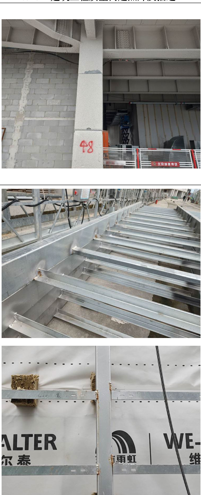  

隐患问题：钢结构防火涂料局部缺陷。  
风险分析：影响钢结构防火性能。  
整改措施：局部重新涂刷。  
规范要求：钢结构工程施工质量验收标准》GB 50205-2020 ：13.4.6 防火涂料不应有误涂、漏涂，涂层应闭合，无脱层、空鼓、明显凹陷、粉化松散和浮浆、乳突等缺陷。  

隐患问题：幕墙钢龙骨焊缝返锈。  

风险分析：影响幕墙结构耐久性。  

整改措施：打磨除锈后重新涂刷防锈漆。  

规范要求：《建筑装饰装修工程质量验收标准》GB50210-2018：11.3.1 金属幕墙工程主控项目应包括下列项目：1 金属幕墙工程所用材料和配件质量；2 金属幕墙的造型、立面分格、颜色、光泽、花纹和图案；3 金属幕墙主体结构上的埋件；4 金属幕墙连接安装质量；5 金属幕墙的防火、保温、防潮材料的设置；6 金属框架和连接件的防腐处理；7 金属幕墙防雷；8 变形缝、墙角的连接节点；9 金属幕墙防水效果。  

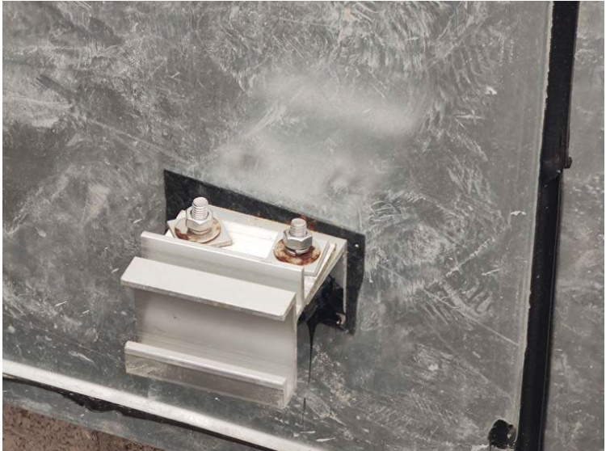  

隐患问题：酒店石材挂件不锈钢垫片生锈。风险分析：影响石材挂装质量安全。  
整改措施：更换生锈垫片。  
规范要求：/  

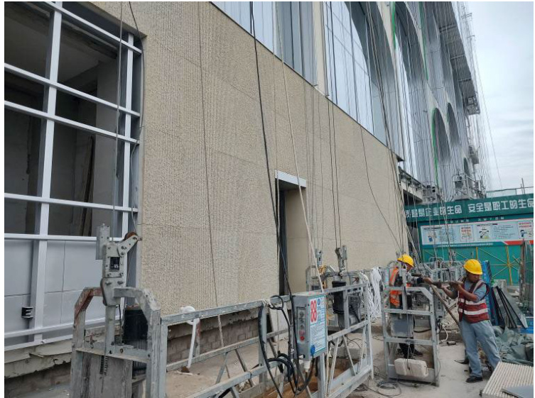  

隐患问题：酒店石材幕墙色差较为严重。  

风险分析：影响幕墙观感质量。  

整改措施：更换色差较大的石材，批量施工前石材应进行排版，减轻色差。  

规范要求：金属与石材幕墙工程技术规范》JGJ 133-2001：6.3.1 加工石板应符合下列规定 3 石板外表面的色泽应符合设计要求，花纹图案应按样板检查。石板四周围不得有明显的色差  

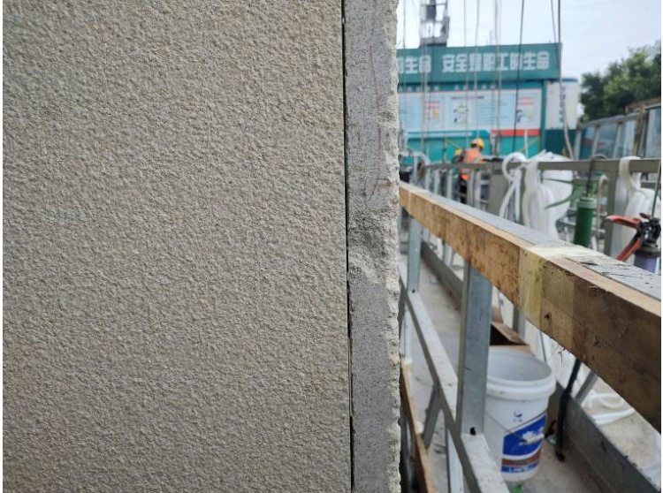  

风险分析：影响铝板幕墙安全性。  

整改措施：补焊后重新做防锈处理。  

隐患问题：酒店石材幕墙边部破损。  

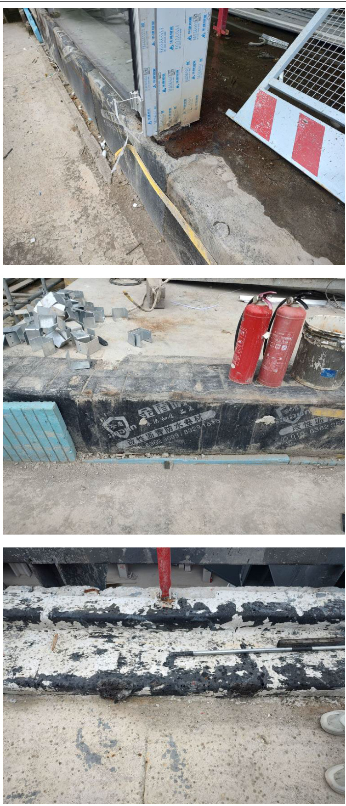  

隐患问题：地下室顶板反坎，屋面反坎外墙防水起鼓、破损。  

风险分析：渗漏隐患。  

整改措施：重新修复防水。  

规范要求：《地下防水工程质量验收规范》GB50208-2011：4.3.8 热熔法铺贴卷材应符合下列规定：  

1 火焰加热器加热卷材应均匀，不得加热不足或烧穿卷材； 2 卷材表面热熔后应立即滚铺，排除卷材下面的空气，并粘贴牢固；3 铺贴卷材应平整、顺直，搭接尺寸准确，不得扭曲、皱折；4 卷材接缝部位应溢出热熔的改性沥青胶料，并粘贴牢固，封闭严密。  

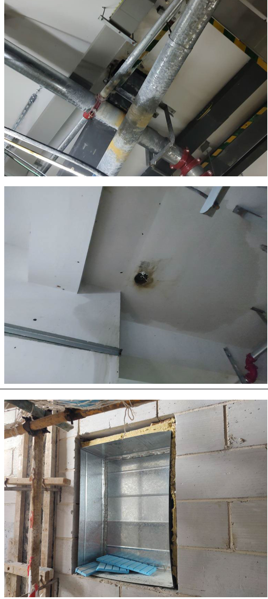  

隐患问题：地下室穿楼板桥架、管道孔无套管，有漏水情况。  
风险分析：渗漏隐患。  
整改措施：增加套管，采取防水措施。  
规范要求：/隐患问题：二次结构洞口处未设置过梁。  
风险分析：结构安全隐患。  
整改措施：增加过梁。  
规范要求：《砌体结构工程施工质量验收规范》GB50203-20113.0.11 设计要求的洞口、沟槽、管道应于砌筑时正确留出或预 埋，未经设计同意，不得打凿墙体和在墙体上开凿水平沟槽。宽 度超过 $3 0 0 \mathrm { m m }$ 的洞口上部，应设置钢筋混凝土过梁。不应在截 面长边小于$5 0 0 \mathrm { m m }$ 的承重墙体、独立柱内埋设管线。隐患问题：地下室混凝土地面找平层局部破坏、碎裂。风险分析：影响地面后续施工。  
整改措施：剔除破损找平层重新浇筑。  
规范要求：《建筑地面工程施工质量验收规范》GB50209-2010：4.9.10 找平层与其下一层结合应牢固，不应有空鼓。检验方法：用小锤轻击检查。检查数量：按本规范第 3.0.21 条规定的检验批检查。  
4.9.11 找平层表面应密实，不应有起砂、蜂窝和裂缝等缺陷。检验方法：观察检查。隐患问题：二次结构不同材质钢丝网搭接长度不足或未设钢丝网。  
风险分析：影响二次结构抗震性能，导致面层开裂。整改措施：按图纸要求和规范要求挂网。  
规范要求：《建筑装饰装修工程质量验收标准》GB50210-2018：4.2.3 抹灰工程应分层进行。当抹灰总厚度大于或等于 $3 5 \mathrm { m m }$ 时，应采取加强措施。不同材料基体交接处表面的抹灰，应采取防止开裂的加强措施，当采用加强网时，加强网与各基体的搭接宽度不应小于 $1 0 0 \mathrm { m m }$ 。  

<html><body><table><tr><td>6<0x1590)</td><td>隐患问题：二次结构顶部使用长度小于整砖长度1/3 的 砌块砖。 风险分析：二次结构安全隐患。 整改措施：更换砌块砖。 规范要求：/ 隐患问题：材料堆场处岩棉泡水失效。 风险分析：影响岩棉保温性能。 整改措施：泡水岩棉报废处理。 规范要求：/</td></tr></table></body></html>  

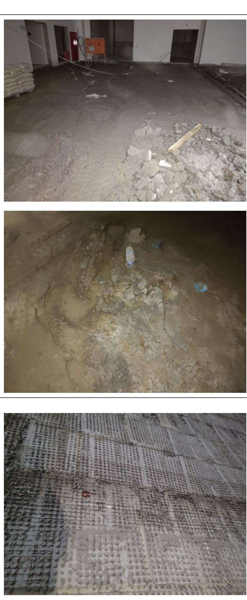  

<html><body><table><tr><td></td><td>隐患问题：个别部位二次结构钢丝网生锈。 风险分析：影响面层施工质量，导致返锈。</td></tr><tr><td></td><td>整改措施：更换钢丝网。 规范要求：/。</td></tr><tr><td></td><td>隐患问题：地下室墙面抹灰装修有返锈情况。 风险分析：影响观感质量和结构耐久性。 整改措施：打磨除锈做好防腐，重新施工涂料基层和面 层。 规范要求：《建筑装饰装修工程质量验收标准》GB 50210-2018：12.2.3水性涂料涂饰工程应涂饰均匀、粘 结牢固，不得漏涂、透底、开裂、起皮和掉粉。</td></tr></table></body></html>  

<html><body><table><tr><td></td><td>隐患问题：地下室顶板个别部位涂料起鼓开裂。 风险分析：导致涂料面层脱落。 整改措施：剔除面层，重新涂刷涂料。 规范要求：《建筑装饰装修工程质量验收标准》GB 50210-2018：12.2.3水性涂料涂饰工程应涂饰均匀、粘 结牢固，不得漏涂、透底、开裂、起皮和掉粉。</td></tr><tr><td></td><td rowspan="3">隐患问题：个别部位石材挂件转接件固定螺栓外露长度 不足。 风险分析：导致石材脱落。 整改措施：更换加长螺杆。 规范要求：螺栓外露长度不小于三个丝扣。</td></tr><tr><td>161</td></tr><tr><td></td></tr></table></body></html>  

# 3.2 安装工程质量查验报告  

3.2.1 安装工程质量问题清单  

<html><body><table><tr><td>查验人员</td><td>**</td><td>查验部位</td><td>**</td></tr><tr><td>现场情况</td><td colspan="3">现场处于装饰装修施工阶段</td></tr><tr><td>问题序号</td><td colspan="3">检查问题描述（部位、范围、内容)</td></tr><tr><td>1</td><td colspan="3">商场2层走廊电气线槽缺少固定支架。</td></tr><tr><td>2</td><td colspan="3">商场2层7轴 JDG电管连接处没涂复合脂。</td></tr><tr><td>3</td><td colspan="3">酒店西侧外景照明电源线金属软管保护不到位。</td></tr><tr><td>4</td><td colspan="3">商场2 层走廊 JDG 电管连接不牢固。</td></tr><tr><td>5</td><td colspan="3">酒店3层南侧室外泛光照明线槽与金属软管连接未使用专用接头。</td></tr><tr><td>6</td><td colspan="3">酒店9层厨房线槽连接处跨接线没安装。</td></tr><tr><td>7</td><td colspan="3">酒店6层客房电气线盒与面板间距过大。</td></tr><tr><td>8</td><td colspan="3">商场2层消防配管防火涂料脱落。</td></tr><tr><td>9</td><td colspan="3">商场2层7轴线槽连接板设置在穿墙处。</td></tr><tr><td>10</td><td colspan="3">酒店5层接线盒标高不一致。</td></tr><tr><td>11</td><td colspan="3">消防主管道阀门应设置固定支吊架</td></tr><tr><td>12</td><td colspan="3">铸铁管道柔性接口一侧应加装固定支吊架</td></tr><tr><td>13</td><td colspan="3">新风管道穿墙未加装套管</td></tr><tr><td>14</td><td colspan="3">排烟风管托盘选材错误</td></tr><tr><td>15</td><td colspan="3">消防管道甩口未做临时封堵</td></tr><tr><td></td><td colspan="3">排烟风管未加独立支吊架</td></tr><tr><td>16</td><td colspan="3"></td></tr><tr><td>17</td><td colspan="3">铸铁立管应做固定支架</td></tr><tr><td>18</td><td colspan="3">风管管口未做临时封堵</td></tr><tr><td>19</td><td colspan="3">消防管道柔性接口处一侧应加装固定支吊架</td></tr><tr><td>20</td><td colspan="3">空调水管吊架横担端头未做防腐</td></tr></table></body></html>  

# 3.2.2 安装工程质量问题照片及描述  

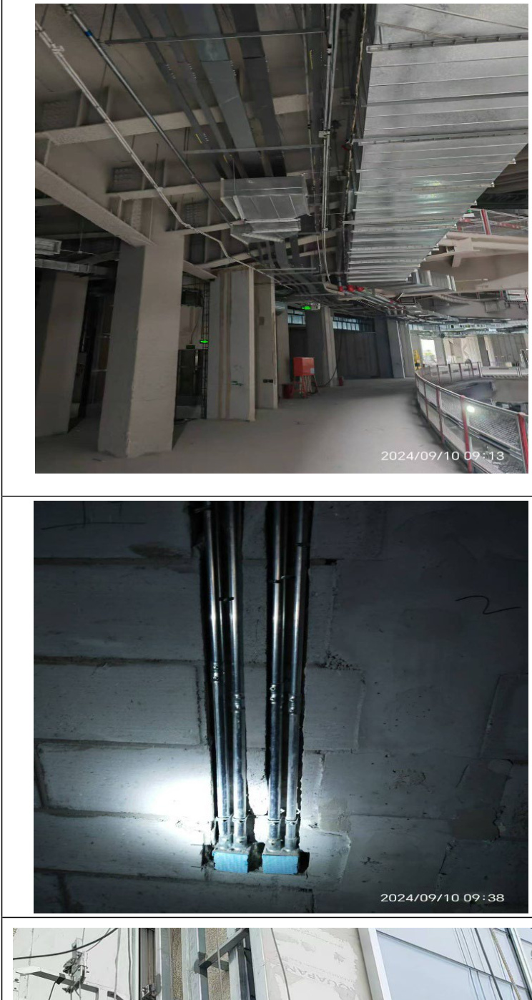  

  

隐患问题：线槽未设置固定支架。  

风险分析：线槽摆动的风险整改措施：按规范要求增加固定支吊架。  

规范要求：《GB50303-2015 建筑电气工程施工质量验收规范》11.2.3 条第8 款采用金属吊架固定时，圆钢直径不得小于 8mm,并应有防晃支架，在分支处或端部$0 . 3 \mathrm { { m } \widetilde { \ } 0 . 5 \mathrm { { m } } }$ 处应有固定支架。  

隐患问题：JDG 电线导管连接处没有涂复合脂。  
风险分析：存在配管不密封的风险。  
整改措施：按规范要求进行整改。  

规范要求：《T/CECS 120-2021 套接紧定式钢导管电线管路施工及验收规程》5.0.6 条套接紧定式钢导管管路连接处，管材插入连接件时，插入部分的管端应保持清洁，且应采取防止外力冲击的有效措施。管路连接处宜涂以电力复合酯等有效的封堵措施。  

隐患问题：电源线保护不到位。  

风险分析：存在导线绝缘破损的风险。  

整改措施：应按规范要求整改。  

规范要求：《GB50303-2015 建筑电气工程施工质量验收规范》14.2.1 除塑料护套线外，绝缘导线应采取导管或槽盒保护，不可外露明敷。  

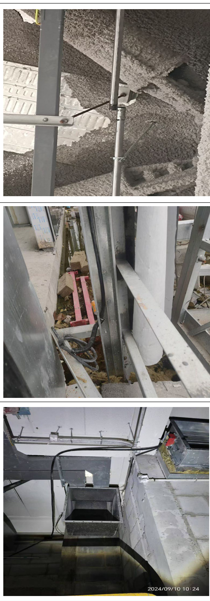  

隐患问题：电气配管连接不牢。  

风险分析：导线易损坏隐患整改措施：按规范要求连接牢固。  

规范要求：《T/CECS 120-2021 套接紧定式钢导管电线管路施工及验收规程》5.0.4 套接紧定式钢导管管路紧定连接后，连接处不应有松动、脱落、缝隙过大等缺陷；  

隐患问题：酒店3 层南侧泛光照明配管未使用专用器具。风险分析：电气配管脱落风险。  
整改措施：按规范要求设置。  
规范要求：《GB50303-2015 建筑电气工程施工质量验收规范》12.2.8 条可弯曲金属导管或柔性导管与刚性导管或电气设备、器具间的连接应医用专用接头。  

隐患问题：酒店 9 层厨房线槽转角处缺少跨接线。  

风险分析：存在用电安全隐患。  

整改措施：按规范要求连接跨接导线。  

规范要求：《GB50303-2015 建筑电气工程施工质量验收规范》11.1.1 第2 款非镀锌梯架、托盘和槽盒本体之间连接板的两端应跨接保护联结导体，保护联结导体的截面积应符合设计要求。  

<html><body><table><tr><td></td><td>隐患问题：接线盒与面板间距过大。 风险分析：存在电气火灾的风险。 整改措施：按规范要求增设隔热措施。 规范要求：《GB50303-2015建筑电气工程施工质量验收 规范》20.2.1暗装的插座盒或开关盒应与饰面平 齐.....</td></tr><tr><td></td><td>隐患问题：消防导线防火涂料脱落。 风险分析：存在安全隐患 整改措施：按规范要求整改。 规范要求：《GB50016-2014（2018版）建筑设计防火规 范》10.1.10 条明敷时（包括敷设在吊顶内），应穿金 属导管或采用封闭式金属槽盒保护，金属导管或封闭式 金属槽盒应采取防火保护措施。</td></tr><tr><td></td><td>隐患问题：线槽连接处设置在穿墙处。 风险分析：存在封堵隐患 整改措施：按规范要求整改。 规范要求：《22D701-3 电缆桥架安装》图集4.2.10 电 缆桥架不得在穿过楼板或墙体等处进行连接。</td></tr></table></body></html>  

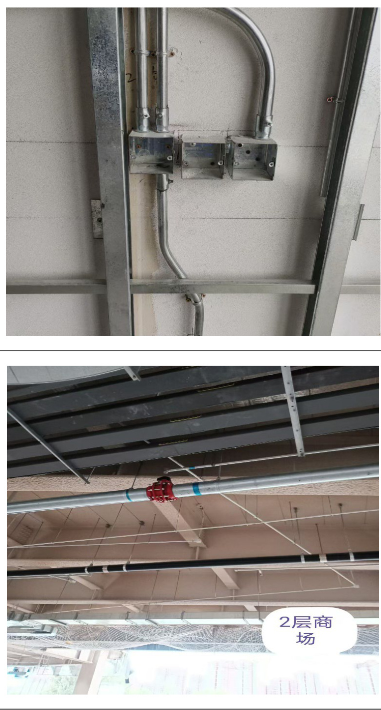  

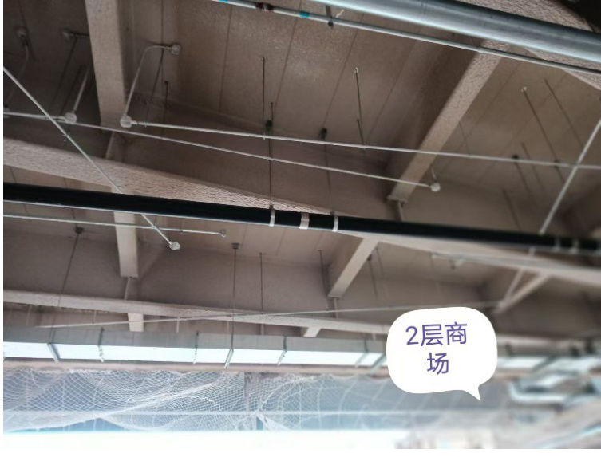  

隐患问题：接线盒安装标高不一致。  

风险分析：影响观感质量整改措施：按规范要求整改。  

规范要求：《GB50303-2015 建筑电气工程施工质量验收规范》20.2.2 条第1 款插座安装高度应符合设计要求，同一室内相同规格并列安装的插座高度宜一致。  

隐患问题： 消防主管道阀门应设置固定支吊架  

风险分析： 易漏水整改措施：更换成固定支吊架规范要求；自动喷水灭火系统施工及验收规范《GB50261-2017》5.1.15 阀门等组件应加承重支架。  

隐患问题：铸铁管道柔性接口一侧应加装固定支吊架风险分析：管道不稳定，容易漏水整改措施：一侧改成固定支吊架规范要求；建筑给水排水及采暖工程施工质量验收规范《GB50242-2002》5.2.8 金属排水管道上的吊钩或卡箍应固定在承重结构上。固定件间距:横管不大于 2m .  

隐患问题： 新风管道穿墙未加装套管风险分析： 影响封堵及后期维修整改措施：增加套管  

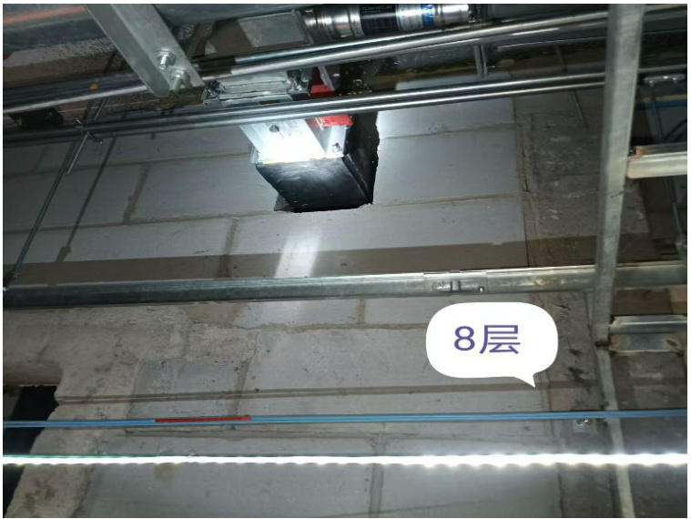  

图纸要求：通风与空调工程施工质量验收规范《GB50243-2016》6.2.2 当风管穿过需要封闭的防火、防爆的墙体或楼板时，必须设置厚度不小于 1.6mm 的钢制防护套管;风管与防护套管之间应采用不燃柔性材料封堵严密。  

隐患问题：排烟风管横担选材错误风险分析： 承载力不够  
整改措施： 更换托盘  
图集要求：图集号 11BS6（P271）  

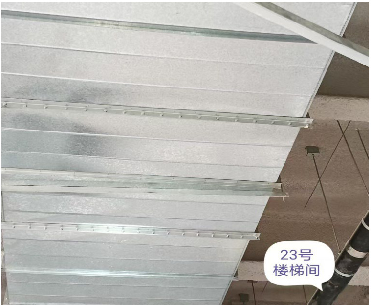  

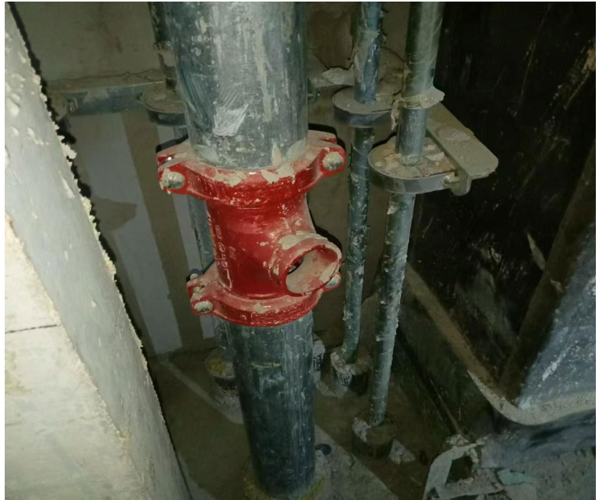  

隐患问题： 消防管道甩口未做临时封堵风险分析： 容易进杂物，管道易堵塞整改措施：进行封堵  

规范要求；自动喷水灭火系统施工及验收规范《GB50261-2017》4.1.1 消防水泵、消防水箱、消防水池、消防气压给水设备、消防水泵接合器等供水设施及其附属管道的安装,应清除其内部污垢和杂物。安装中断时,其敞口处应封闭。  

<html><body><table><tr><td>9层酒 店</td><td>隐患问题：排烟风管未加独立支吊架 风险分析：不稳固 整改措施：增加支吊架 规范要求；通风与空调工程施工质量验收规范 《GB50243-2016》6.3.8.2 直径或长边尺寸大于或等于 630mm的防火阀，应设独立支、吊架 隐患问题：铸铁立管应做固定支架</td></tr><tr><td>2层</td><td>风险分析：管道整体易变形 整改措施：更换成固定支架 规范要求；建筑给水排水及采暖工程施工质量验收规范 《GB50242-2002》5.2.8 金属排水管道上的吊钩或卡箍 应固定在承重结构上。固定件间距:横管不大于2m.立 管不大于3m。楼层高度小于或等于4m，立管可安装1 个固定件。 隐患问题：风管管口未做临时封堵</td></tr><tr><td>2层</td><td>风险分析：易进杂物尘土 整改措施：进行封堵 规范要求；通风与空调工程施工质量验收规范 《GB50243-2016》6.3.2风管系统的安装应符合下列规 定:1风管应保持清洁,管内不应有杂物和积尘。</td></tr></table></body></html>  

<html><body><table><tr><td></td><td>隐患问题： 架 风险分析：管道易变形，接口易漏水。 整改措施：一侧改成固定支吊架 规范要求；自动喷水灭火系统施工及验收规范 《GB50261-2017》5.1.15 管道支架、吊架、防晃支架的</td></tr><tr><td>2层</td><td>隐患问题：空调水管吊架横担端头未做防腐 风险分析：易锈蚀 整改措施：做防腐 图纸要求；/</td></tr><tr><td>8层 45.5 2/ 442#2</td><td></td></tr></table></body></html>  

  

风险分析：压力不稳定时导致接口松动漏水。  

整改措施：增加固定支架。  

隐患问题：消火栓管道柔性接口处采用一固一掉支架。  

规范要求：《消防给水及消火栓系统技术规范》GB50974-2014：第 12.3.21 架空管道每段管道设置的防晃支架不少于 1 处；当管道改变方向时，应增设防晃支架。  

  

隐患问题：新风管道分支处未设固定支架。  
风险分析：风管晃动。  
整改措施：增加固定支架。  
规范要求：《通风与空调工程施工质量验收规范》GB50243-2016：6.3.1 悬吊的水平主、干风管直线长度大于20 米是，应设置防晃支架。  

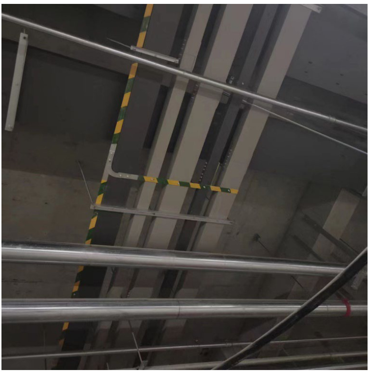  

隐患问题：桥架接地桥架喷塑涂层未清理，虚接。  

风险分析：接触不良，漏电时起不到接地作用。  

整改措施：清理涂层。  

规范要求：《建筑电气工程施工质量验收规范》GB-50303-2015：11.1.1 桥架、托盘和槽盒，起始端、中间段不超 30 米，均应可靠接地。  

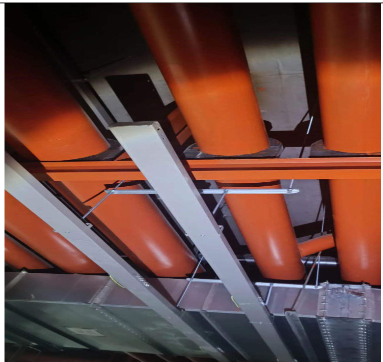  

隐患问题：桥架末端未做接地、末端缺少固定支架风险分析：接地线未贯通，存在安全隐患整改措施：增加接地线，加设固定支架  

规范要求：《建筑电气工程施工质量验收规范》GB-50303-2015：11.1.1 桥架、托盘和槽盒，起始端、中间段不超 30 米，均应可靠接地。11.2.3 在桥架分支处或端部$0 . 3 { \sim } 0 . 5$ 米处应有固定支架。  

# 3.2 现场安全文明查验报告  

3.3.1 安全文明施工问题清单  

<html><body><table><tr><td>5.5.1</td><td></td><td>何题消车</td><td></td></tr><tr><td>查验人员</td><td>***</td><td>查验部位</td><td>*现场</td></tr><tr><td>现场情况</td><td colspan="3">现场处于主体结构施工、建筑装饰装修、钢结构焊接、幕墙施工。</td></tr><tr><td>问题序号</td><td colspan="3">检查问题描述(部位、范围、内容)</td></tr><tr><td>1</td><td colspan="3">商场外侧 40#吊篮1处安全锁合格标识牌缺失。</td></tr><tr><td>2</td><td colspan="3">商场外侧1台吊篮安全钢丝绳重锤距离地面高度不符合规范要求。</td></tr><tr><td>3</td><td colspan="3">酒店外侧连廊1处外架悬臂高度大于4米。</td></tr><tr><td>4</td><td colspan="3">商场外幕墙焊接作业1台电焊机二次线接线柱绝缘防护罩安装不到位、造成金属线头裸漏；二次 线电缆绝缘层开裂、破损严重。</td></tr><tr><td>5</td><td colspan="3">商场外1处电缆违规拖地、浸水敷设。</td></tr><tr><td>6</td><td colspan="3">酒店地下室楼梯处1根电缆挂设较低、影响人员通行。</td></tr><tr><td>7</td><td colspan="3">商场楼内一处库房灭火器喷射管断裂。</td></tr><tr><td>8</td><td colspan="3">商场首层焊接、切割动火作业现场未见看火人，作业人员未随身携带《动火作业审批手续》。</td></tr><tr><td>9</td><td colspan="3">酒店内1处焊接动火作业现场未配置消防器材。</td></tr><tr><td>10</td><td colspan="3">集中充电柜前发现1台电动运输车手制动装置失效。</td></tr><tr><td>11</td><td colspan="3">酒店内1台升降平台车升顶后无人操作、1台限位开关外壳损坏。</td></tr><tr><td>12</td><td colspan="3">商场外一台开关箱箱门破损。</td></tr><tr><td>13</td><td colspan="3">酒店内1台开关箱箱门跨接线断裂。</td></tr><tr><td></td><td colspan="3">商场屋面作业1台手持切割锯锯片无防护罩。</td></tr><tr><td>14 15</td><td colspan="3">商场屋面防水动火作业个别丙烷气瓶无防倾覆措施，喷火枪距离气瓶距离小于10米。</td></tr></table></body></html>  

# 3.3.2 安全文明施工问题照片及描述  

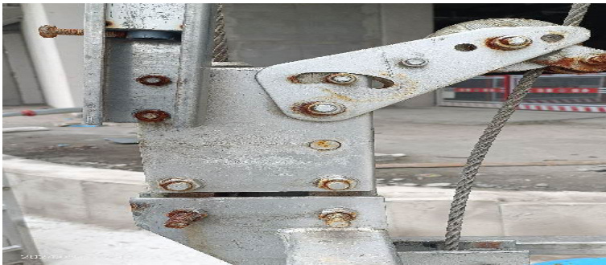  

隐患问题 1：商场外侧 40#吊篮 1 处安全锁合格标识牌缺失。  
风险分析：机械事故隐患。  
整改措施：暂停本台吊篮使用，产权单位检测安全锁合格后贴标识牌。  
规范要求：《建筑施工安全检查标准》JGJ59-2011 第3.10.3-2 条安全装置规定：防坠安全锁不应超出标定期限。隐患问题 6：酒店地下室楼梯处 1 根电缆挂设较低、影响人员通行。  
风险分析：用电事故风险、人员疏散风险。  
整改措施：按规范要求架设电缆。  

<html><body><table><tr><td></td></tr><tr><td>隐患问题2：商场外侧1台吊篮安全钢丝绳重锤距离地 面高度不符合规范要求。 整改措施：重锤底部至地面高度（100-200）mm为宜， 规范要求： 1．《高处作业吊篮安装、拆卸、使用技术规范》 （JB/T11699-2013）第5.2.12条安全钢丝绳的下端应 安装重锤，以使钢丝绳绷直、重锤底部至地面高度（100- 200）mm为宜，工作钢丝绳安装重锤按使用说明书规定 执行。 2．《建筑施工安全检查标准》JGJ59-2011第3.10.3.3 条悬挂机构：5）严禁使用破损的配重块或其他替代 物。 隐患问题3：酒店外侧连廊1处外架悬臂高度大于4米。 风险分析：架体失稳风险。 整改措施：规范要求：《施工脚手架通用规范》GB55023- 2022 第4.4.6条规定：2)连墙点的水平间距不得超过</td></tr><tr><td>3 跨，竖向间距不得超过3步，连墙点之上架体的悬 臂高度不应超过2步；3）在架体的转角处、开口型作 业脚手架端部应增设连墙件，连墙件竖向间距不应大 于建筑物层高，且不应大于 4m。</td></tr></table></body></html>  

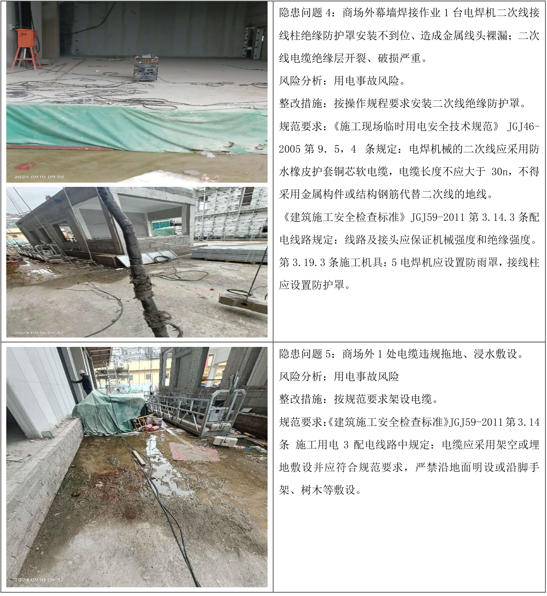  

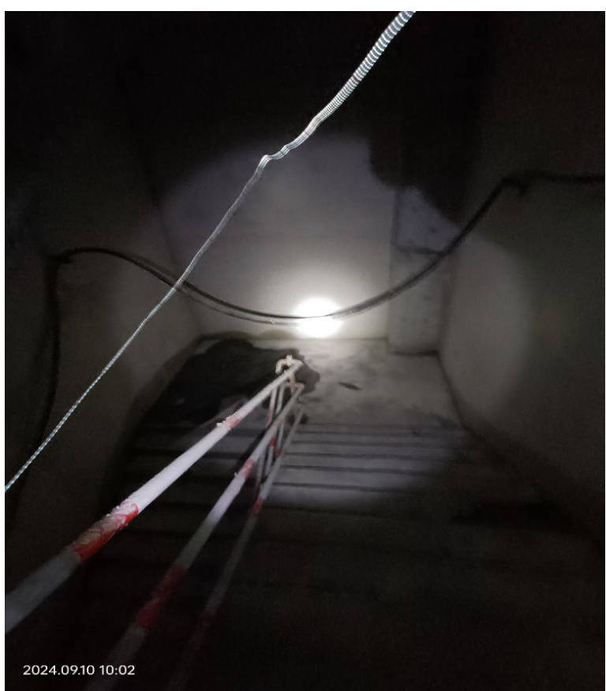  

规范要求：  

1. 《建筑施工安全检查标准》JGJ59-2011 第 3.14 条施工用电 3 配电线路中规定：电缆应采用架空或埋地敷设并应符合规范要求，严禁沿地面明设或沿脚手架、树木等敷设。  
2.《建设工程施工现场消防安全技术规范》GB50720-2011 第 6.4.3 条规定：施工现场尤其是在建工程作业场所，人员相对较多、安全疏散条件差、逃生难度大、保持安全疏散通道、安全出口的畅通及疏散指示的正确极为重要。  

# 3.4 管理行为查验报告  

# 3.4.1 管理行为问题清单  

<html><body><table><tr><td>查验人员</td><td>陈晓晨 张海旺</td><td>查验部位</td><td>监理资料、施工资料。</td></tr><tr><td>现场情况</td><td colspan="3">施工现场资料随工程进展准备中。</td></tr><tr><td>问题序号</td><td colspan="3">检查问题描述（部位、范围、内容)</td></tr><tr><td>1</td><td colspan="3">江河幕墙材料进场监理未签字。</td></tr><tr><td>2</td><td colspan="3">商业部分幕墙监理实施细则缺少安耐板的相关检查内容。</td></tr><tr><td>3</td><td colspan="3">酒店幕墙隐蔽验收资料未附验收照片。</td></tr><tr><td>4</td><td colspan="3">商业部分幕墙专项施工因合同未签订监理单位未审批完成。</td></tr></table></body></html>  

# 四、附件  

附件 1：飞检签到表  

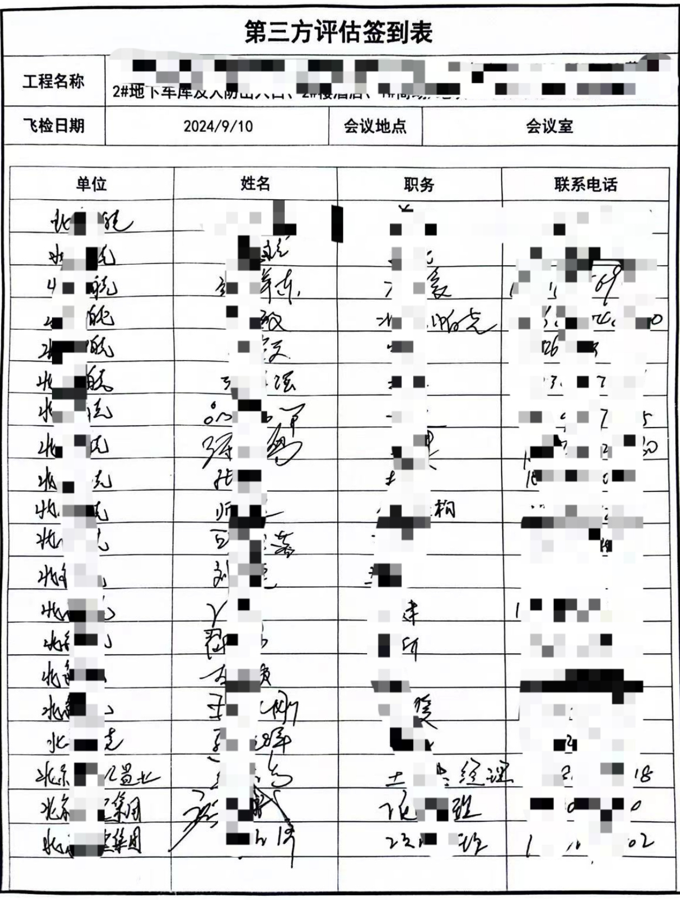  

  
附件 2：飞检部位确认单  

能用地项目飞检部位确认单  

<html><body><table><tr><td>检查模块</td><td colspan="4">实测实量</td><td colspan="5">建筑工程质量风险</td></tr><tr><td>分项指标</td><td>主体结构</td><td>二次结构</td><td colspan="2">装饰装修工程（含 抹灰)</td><td colspan="4">建筑与结构安全防渗漏功能</td><td colspan="2">装饰装修质量</td></tr><tr><td>检查部位</td><td>/</td><td>/</td><td colspan="2">1</td><td colspan="4"></td><td colspan="2">外</td></tr><tr><td>检查模块</td><td colspan="9">水暖通、机电质量风险</td></tr><tr><td>分项指标</td><td>主体结</td><td>砌筑阶段预</td><td>电段</td><td>通风空程</td><td>给排水</td><td>强电</td><td>电梯工程气工</td><td></td><td>消防工程其他</td><td></td></tr><tr><td></td><td colspan="8">给排水：商场、酒店、屋面</td><td rowspan="2"></td><td rowspan="2"></td></tr><tr><td>检查部位</td><td colspan="8">电气：商场、酒店、屋面</td></tr><tr><td>检查模块</td><td colspan="8">现场安全文明</td><td colspan="2"></td></tr><tr><td>分项指标</td><td>临电</td><td>消防</td><td>安全防护</td><td>模架</td><td></td><td>施械</td><td>基坑安全</td><td>绿色文明施工</td><td colspan="2">特种作</td></tr><tr><td>检查部位</td><td colspan="8">商场5层6层9层及地下室、酒店7层6层5层、地下室及现场周边</td></tr><tr><td>检查模块</td><td colspan="8">管理行为</td></tr><tr><td>分项指标</td><td colspan="2">施工安全管理</td><td colspan="2">理安全</td><td colspan="2">监理质量管理</td><td colspan="2">进度管理</td><td colspan="2">信息管理</td></tr><tr><td>检查内容</td><td colspan="2">施工安全资料</td><td colspan="2">监理安全施工质 资料</td><td colspan="2">量资料 监理质量资料</td><td colspan="2">进度资料（总进度 、月进度、周进 度等报审情况）</td><td colspan="2">以监理信息资料 为主</td></tr><tr><td>建设单位 管理单位 （签字）</td><td colspan="4">监理单位 （签字）</td><td colspan="4"></td><td colspan="2">施工（总包）单位 （签字）</td></tr></table></body></html>  

  
附件 3：飞检评估确认单  

<html><body><table><tr><td>检查模块</td><td colspan="4">实测实量</td><td colspan="4">建筑工程质量风险</td><td colspan="2"></td></tr><tr><td>分项指标</td><td>主体结构</td><td>次结构</td><td colspan="2">装饰装修工程（含 抹灰）</td><td colspan="2">建筑与结构安全</td><td colspan="2">防渗漏功能</td><td colspan="2">装饰装修质量</td></tr><tr><td>指标得分</td><td></td><td>/</td><td colspan="2">/</td><td colspan="2">96.43</td><td colspan="2">91.67</td><td colspan="2">90.2</td></tr><tr><td>模块得分 /权重</td><td colspan="4"></td><td colspan="6">92.77</td></tr><tr><td>检查模块</td><td colspan="8">水暖通、机电工程质量风险</td></tr><tr><td>分项指标</td><td>主体结构</td><td>筑阶理段</td><td></td><td>通程红水</td><td></td><td></td><td>强电梯工程气工</td><td></td><td>消防工程 其他</td><td></td></tr><tr><td>指标得分</td><td>96.78</td><td>100</td><td>95.45</td><td>96.3</td><td>100 97.55</td><td>94.29</td><td>/</td><td>/</td><td>/</td><td>100</td></tr><tr><td>模块分</td><td colspan="10"></td></tr><tr><td>检查模块</td><td colspan="10">现场安全文明</td></tr><tr><td>分项指标</td><td>临电</td><td>消防</td><td>安全防护</td><td>模架</td><td></td><td>施工 机械</td><td>基坑安全</td><td>绿色文明施工</td><td>特种作</td><td>业人员</td></tr><tr><td>指标得分</td><td>91.67</td><td>83.33</td><td>100</td><td>97.70</td><td></td><td>96.97</td><td></td><td>93.33</td><td></td><td>100</td></tr><tr><td>模块得分 /权重</td><td colspan="10">94.71</td></tr><tr><td>检查模块</td><td colspan="9">管理行为</td><td></td></tr><tr><td>分项指标</td><td colspan="2">施工安全管理</td><td>监理安全 管理</td><td>施工质 量管理</td><td colspan="2">监理质量管理</td><td colspan="2">进度管理</td><td>信息管理</td></tr><tr><td>指标得分</td><td colspan="2">97.22</td><td>100</td><td>84.62</td><td colspan="2">86.00</td><td colspan="2">100</td><td>95.00</td></tr><tr><td>模块得分</td><td colspan="10">93,81</td></tr><tr><td>/权重 评估总分</td><td colspan="10">95.24</td></tr><tr><td>建设单位 管理单位 （签字）</td><td colspan="7">监理单位 （签字）</td><td colspan="2">施工（总包）单位</td></tr></table></body></html>  